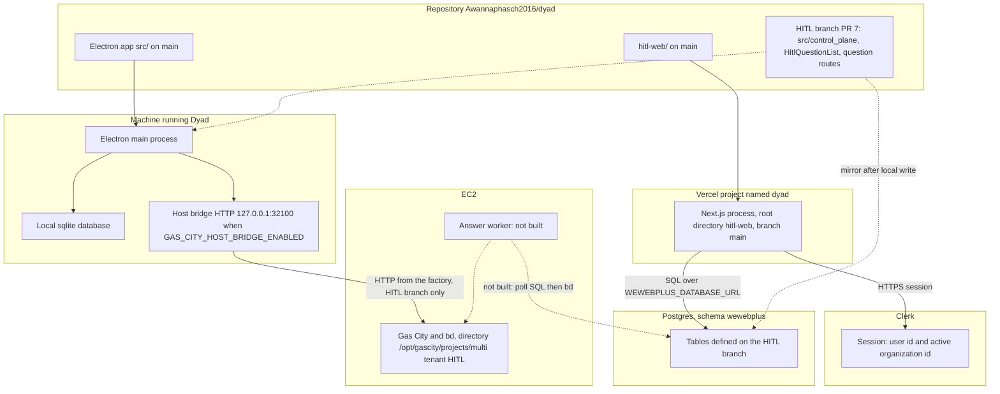
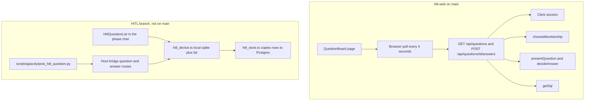
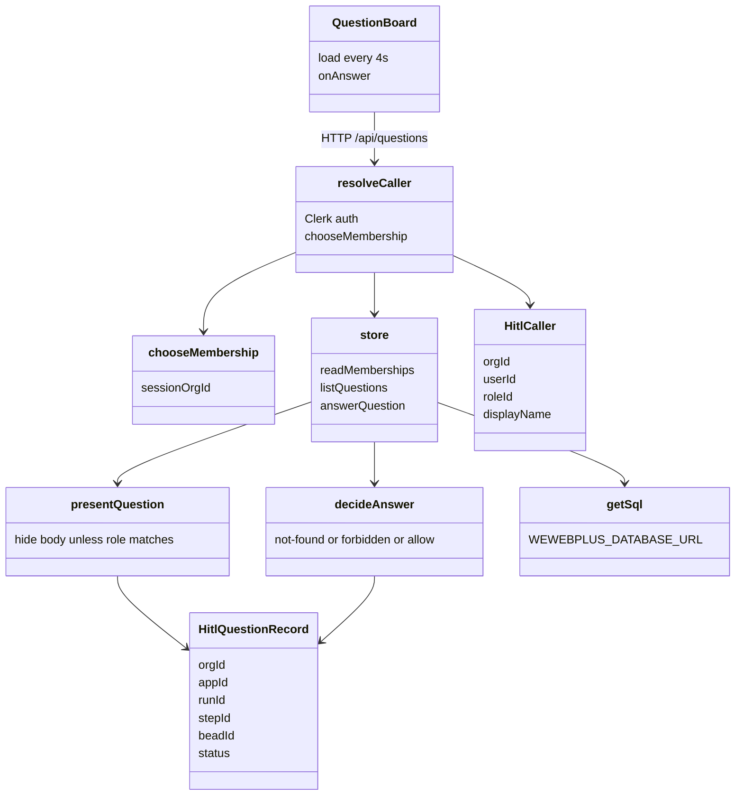
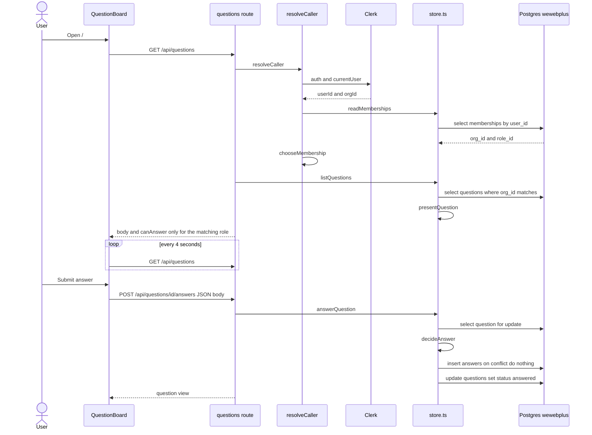
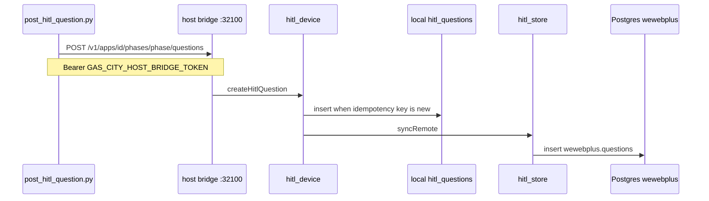
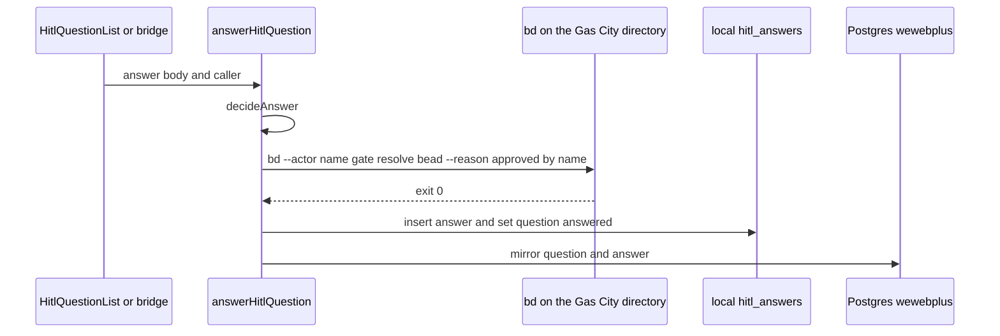
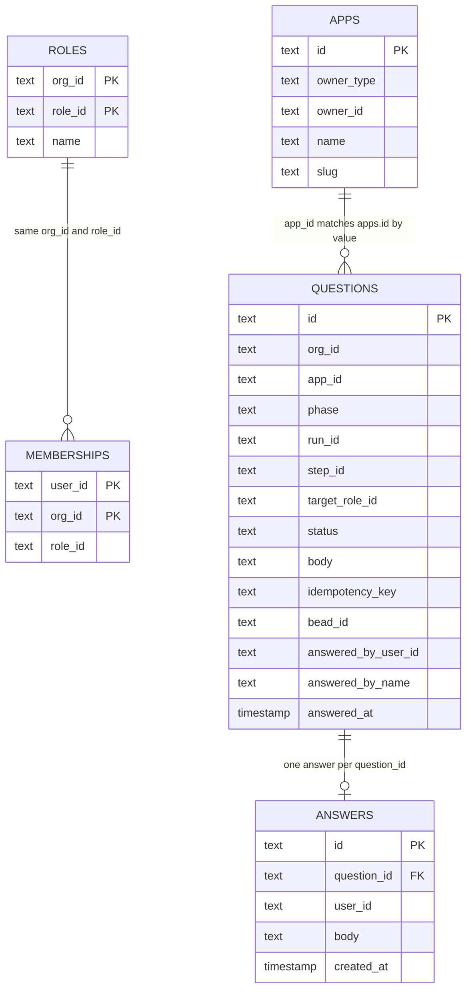

# Human Loop architecture

This describes the code as it is. Three labels are used throughout:

- **On main.** Merged in `Awannaphasch2016/dyad` at `hitl-web/`.
- **HITL branch.** Written on `cursor/wewebplus-hitl-0278` (pull request #7). That branch also contains the account work from pull request #5. It is not merged. `main` has no `src/control_plane/` directory and the host bridge on `main` has no question routes.
- **Not built.** Named in `plans/vercel-hitl-ipad.md`. No implementation in either tree.

There is no WebSocket, database subscription, or IPC path from the web page to Electron. The page polls its own HTTP API every 4 seconds.

## 1. Container — where the code lives

| Container | Code | How it talks |
| --- | --- | --- |
| Human Loop website | `hitl-web/` on `main` | Browser calls same-origin `/api/questions`. Server uses Clerk and Postgres. |
| Vercel | Project created from `Awannaphasch2016/dyad`, root `hitl-web`, production branch `main`. Deploy completion is outside this repository. | Hosts the Next.js app. |
| Clerk | Not in this repository. Keys in Doppler project `dyad`, config `dev`. | HTTPS. The page passes `CLERK_PUBLISHABLE_KEY` into Clerk. |
| Postgres `wewebplus` | Table definitions in `src/control_plane/schema.ts` on the HITL branch. The page issues raw SQL from `hitl-web/lib/store.ts`. | SQL. |
| Dyad / Electron | `src/` on `main`. Question handling is only on the HITL branch. | IPC inside the app. Host bridge is local HTTP. |
| Local sqlite | `src/db/schema.ts`. `hitl_questions` and `hitl_answers` exist on the HITL branch. | Read and written by the Electron main process. |
| EC2 / Gas City | Not in this repository. `bd` is invoked with working directory `/opt/gascity/projects/multi tenant HITL` from `defaultGateCloser` on the HITL branch. | Child process `bd`. |
| Answer worker | Not built. | Would poll Postgres and run `bd`. |

The page does not call the host bridge. The host bridge does not call the page.

## 2. Component — what makes the website work

| Piece | Where it lives | What it does now |
| --- | --- | --- |
| Sign-in | `hitl-web/app/sign-in`, `hitl-web/app/sign-up`, `hitl-web/middleware.ts`, `hitl-web/app/layout.tsx` | Clerk. The home page is protected. `/api` is public to the middleware; each route then requires a session. |
| Caller | `hitl-web/lib/caller.ts` | Reads the Clerk user id and `session.orgId`, then loads memberships. |
| Organization choice | `hitl-web/lib/membership.ts` `chooseMembership` | A session organization must match a membership row. With no session organization, the hardcoded Wewebplus organization is preferred. |
| Role gate | `hitl-web/lib/hitl.ts` `GATE_ROLE`, `presentQuestion`, `decideAnswer` | `plan-approve` and `review-approve-pm` require `project-manager`. `review-approve-dev` requires `developer`. A matching role sees the body and can answer an open question. Another role in the same organization sees status only. A different organization is not found. |
| Questions API | `hitl-web/app/api/questions/route.ts` and `hitl-web/app/api/questions/[id]/answers/route.ts` | List and one answer. A second answer for the same question does not insert another row. |
| Database access | `hitl-web/lib/db.ts`, `hitl-web/lib/store.ts` | One Postgres connection from `WEWEBPLUS_DATABASE_URL`. Raw SQL. |
| Refresh | `hitl-web/app/question-board.tsx` | `setInterval` of 4 seconds calls `GET /api/questions`. No subscription. |
| Projects | No project type in `hitl-web`. A question carries `app_id`, `phase`, and `run_id`. | The page does not list apps. |
| Talk to Electron | No module in `hitl-web`. | The page never calls Dyad. |
| Electron question UI | `src/components/chat/HitlQuestionList.tsx` on the HITL branch | Same role rules, rendered inside the Electron chat. An answer there calls the main process, which runs `bd`. |
| Create question | `scripts/gascity/post_hitl_question.py` posts to `http://127.0.0.1:32100/v1/apps/{id}/phases/{phase}/questions` on the HITL branch | The factory talks to Electron. Electron writes sqlite, then mirrors to Postgres. |
| Approve the gate from the web page | Not built | An answer saved by the page stays in Postgres. |

## 3. Class — how the code is structured

These are modules and types, not a class hierarchy. The web copy does not import the Electron copy. The role rules are duplicated.

On `main`, the files are:

- `hitl-web/app/question-board.tsx` — `QuestionBoard`
- `hitl-web/lib/caller.ts` — `resolveCaller`, `CallerResult`
- `hitl-web/lib/membership.ts` — `chooseMembership`, `Membership`
- `hitl-web/lib/hitl.ts` — `GATE_ROLE`, `HitlCaller`, `HitlQuestionRecord`, `HitlQuestionView`, `presentQuestion`, `decideAnswer`
- `hitl-web/lib/store.ts` — `readMemberships`, `listQuestions`, `answerQuestion`
- `hitl-web/lib/db.ts` — `getSql`
- `hitl-web/lib/clerk_env.ts` — `clerkPublishableKey`

On the HITL branch, the parallel modules are:

- `src/control_plane/hitl.ts` — same `GATE_ROLE` and `presentQuestion`. Also `assertGateRole` and the seeded Wewebplus user ids.
- `src/control_plane/hitl_device.ts` — `createHitlQuestion`, `answerHitlQuestion`, `defaultGateCloser`. `answerHitlQuestion` runs `bd` before it writes sqlite.
- `src/control_plane/hitl_store.ts` — `mirrorQuestion`, `mirrorAnswer`, `readMembershipRole`, `seedWewebplusMemberships`.
- `src/control_plane/schema.ts` — Drizzle tables in schema `wewebplus`.
- `src/ipc/handlers/factory_handlers.ts` — IPC for the Electron chat list.
- `src/main/factory_host_bridge_server.ts` — local HTTP for the factory and, on this branch only, for questions.

`HitlQuestionView` on the branch includes `beadId`. The web view does not. The web page never receives the bead id.

## 4. Sequence — what happens step by step

### 4a. What the iPad page does today

This path is on `main`. It ends at Postgres. Electron and Gas City are not called.

A caller with no membership gets HTTP 404. A caller whose role does not match gets HTTP 403 on submit. The list still returns the question, with `body` null and `canAnswer` false.

### 4b. How a question is created, on the HITL branch only

This is not on `main`. The factory does not insert Postgres itself.

The JSON includes `runId`, `stepId`, `targetRoleId`, `body`, `idempotencyKey`, and `gateBeadId`. The organization id is the app's `owner_id` when `owner_type` is `org`.

### 4c. How Electron approves a gate, on the HITL branch only

An answer typed in the Electron chat, or posted to the host bridge answer route, runs `bd` first. The database write happens after `bd` exits.

If `bd` throws, the sqlite row stays open and Postgres is not updated.

### 4d. Intended link from the iPad answer to Gas City

Not built. `plans/vercel-hitl-ipad.md` describes a loop on EC2 that would select an answer with no resolved timestamp, run `bd`, then stamp the row. `wewebplus.answers` has no such timestamp. The page's insert in section 4a does not start section 4c.

## 5. ER — where the state lives

Two stores. The web page reads only the Postgres tables `wewebplus.memberships`, `wewebplus.questions`, and `wewebplus.answers`. The other Postgres tables are written by the Electron account sync on the HITL branch. Local sqlite is the Electron device cache. Question rows are created there first.

`questions.app_id` is not a foreign key. `questions.org_id` is not a foreign key. The page treats matching string values as the relationship.

Tenant and run fields:

| Boundary | Column | Who uses it |
| --- | --- | --- |
| Organization | `memberships.org_id`, `questions.org_id`, `roles.org_id` | The page loads memberships for the Clerk user, picks one organization, and lists questions with that `org_id`. |
| Account that owns an app | `apps.owner_type` plus `apps.owner_id` | Electron. `user` is the private account. `org` is the shared organization. The page does not read `apps`. |
| App | `questions.app_id` | Stored on the question. The page does not filter by it. |
| Phase | `questions.phase` | `discovery`, `implementation`, or `delivery` when created through the host bridge. |
| Run | `questions.run_id` | Stored. The page does not show it. |
| Gate step | `questions.step_id` and `questions.target_role_id` | Role check uses `target_role_id`. `GATE_ROLE` maps the three step ids onto that role. |
| Gas City bead | `questions.bead_id` | Used by `bd gate resolve` on the HITL branch. Not sent to the browser. |
| Person | `memberships.user_id`, `answers.user_id`, `questions.answered_by_user_id` | Clerk user id. |
| One answer | unique `answers.question_id` | A second insert does nothing. |

Local sqlite on the HITL branch mirrors the question shape in `hitl_questions` and `hitl_answers`. There `app_id` is an integer foreign key to `apps.id`. `apps.remote_id` points at `wewebplus.apps.id`. `apps.owner_type` and `apps.owner_id` are the same account boundary.

These tables exist in the HITL-branch schema and are not part of the page: `chats`, `messages`, `knowledge_items`, `phase_approvals`, `phase_comments`, `answer_locks`, `account_connections`, `audit_events`. Dyad sqlite also has `agent_threads` and `agent_messages`. The Human Loop page does not read them.

Not in the schema yet: a timestamp on `answers` that means the Gas City gate was approved. Without it, a poller cannot tell a page answer from an answer Electron already approved.
