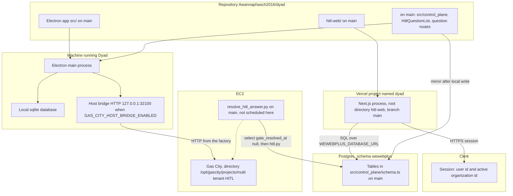
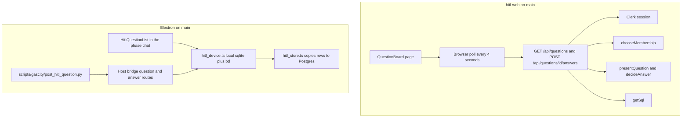
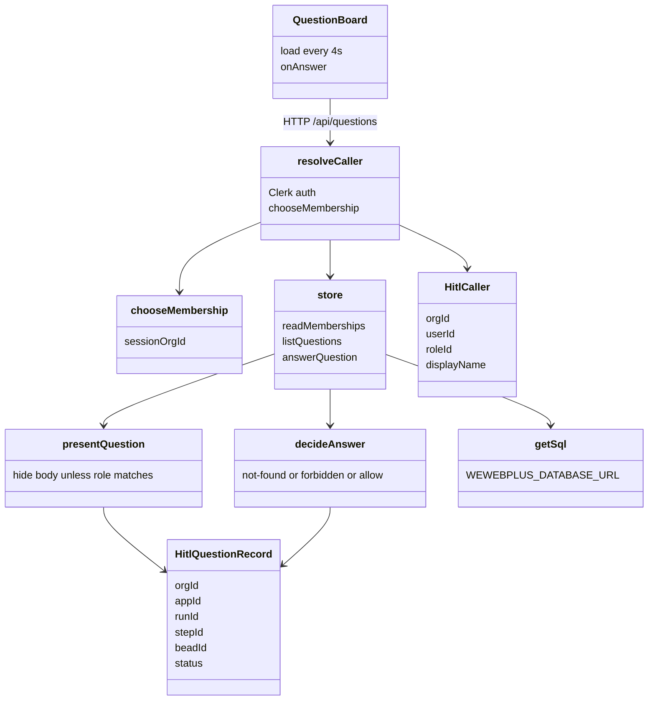
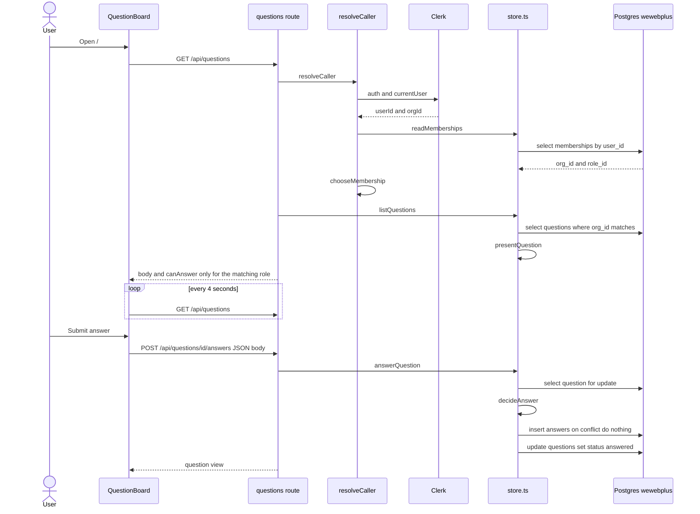
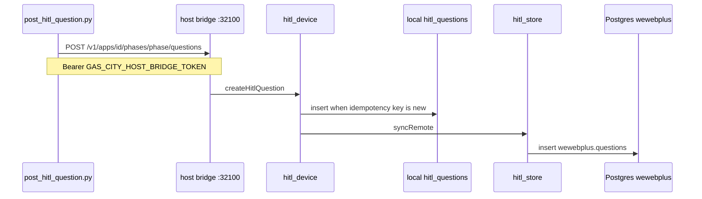
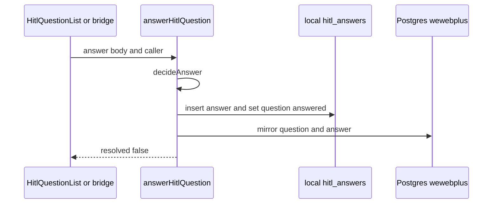
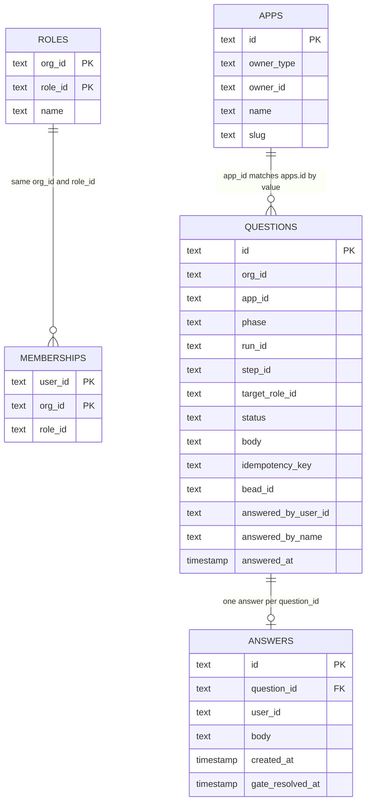

# Human Loop architecture

Checked against `main` commit `e8b66417` on 2026-10-05.

This note lives in `docs/` in this git repository. That commit is the currency mark. The note is late when a later commit on `main` changes a path this file names: `hitl-web/`, `src/control_plane/`, `src/components/chat/HitlQuestionList.tsx`, `src/main/factory_host_bridge_server.ts`, `scripts/gascity/post_hitl_question.py`, or `scripts/gascity/resolve_hitl_answer.py`. A GitHub wiki edit time is not that mark, because the wiki is not the commit that contains the code. Neon is the `wewebplus` application database (`WEWEBPLUS_DATABASE_URL`, tables in `src/control_plane/schema.ts`). A row there is not this note, and it is not tied to a git commit.

Pull request #7 (`cursor/wewebplus-hitl-0278`) merged on 2026-10-04. The control plane, the Electron question list, the host-bridge question routes, and `scripts/gascity/post_hitl_question.py` are on `main`. The sentences below describe that tree.

Two labels are used throughout:

- **On main.** Present in `Awannaphasch2016/dyad` at `e8b66417`.
- **Not started by this repository.** `scripts/gascity/resolve_hitl_answer.py` is in the tree. No workflow here starts it on a timer. `plans/vercel-hitl-ipad.md` still describes an older poller that calls `bd`.

There is no WebSocket, database subscription, or IPC path from the web page to Electron. The page polls its own HTTP API every 4 seconds (`hitl-web/app/question-board.tsx`, `setInterval` of 4000 ms).

## 1. Container — where the code lives

| Container            | Code                                                                                                                                                                                                                                           | How it talks                                                                                |
| -------------------- | ---------------------------------------------------------------------------------------------------------------------------------------------------------------------------------------------------------------------------------------------- | ------------------------------------------------------------------------------------------- |
| Human Loop website   | `hitl-web/` on `main`                                                                                                                                                                                                                          | Browser calls same-origin `/api/questions`. Server uses Clerk and Postgres.                 |
| Vercel               | Project created from `Awannaphasch2016/dyad`, root `hitl-web`, production branch `main`. Deploy completion is outside this repository.                                                                                                         | Hosts the Next.js app.                                                                      |
| Clerk                | Not in this repository. Keys in Doppler project `dyad`, config `dev`.                                                                                                                                                                          | HTTPS. The page passes `CLERK_PUBLISHABLE_KEY` into Clerk.                                  |
| Postgres `wewebplus` | Table definitions in `src/control_plane/schema.ts` on `main`. The page issues raw SQL from `hitl-web/lib/store.ts`.                                                                                                                            | SQL.                                                                                        |
| Dyad / Electron      | `src/` on `main`, including question handling.                                                                                                                                                                                                 | IPC inside the app. Host bridge is local HTTP.                                              |
| Local sqlite         | `src/db/schema.ts`. `hitl_questions` and `hitl_answers` are on `main`.                                                                                                                                                                         | Read and written by the Electron main process.                                              |
| EC2 / Gas City       | The rig is not in this repository. `scripts/gascity/resolve_hitl_answer.py` runs `hitl.py respond` and then `hitl.py release` with rig `multi tenant HITL`. `defaultGateCloser` is not in the tree. `answerHitlQuestion` does not invoke `bd`. | Child process `hitl.py`, when that script is run.                                           |
| Answer closer        | `scripts/gascity/resolve_hitl_answer.py` on `main`.                                                                                                                                                                                            | Selects answers with `gate_resolved_at` null. This repository does not start it on a timer. |

The page does not call the host bridge. The host bridge does not call the page.

## 2. Component — what makes the website work

| Piece                              | Where it lives                                                                                                  | What it does now                                                                                                                                                                                                                                                           |
| ---------------------------------- | --------------------------------------------------------------------------------------------------------------- | -------------------------------------------------------------------------------------------------------------------------------------------------------------------------------------------------------------------------------------------------------------------------- |
| Sign-in                            | `hitl-web/app/sign-in`, `hitl-web/app/sign-up`, `hitl-web/middleware.ts`, `hitl-web/app/layout.tsx`             | Clerk. The home page is protected. `/api` is public to the middleware; each route then requires a session.                                                                                                                                                                 |
| Caller                             | `hitl-web/lib/caller.ts`                                                                                        | Reads the Clerk user id and `session.orgId`, then loads memberships.                                                                                                                                                                                                       |
| Organization choice                | `hitl-web/lib/membership.ts` `chooseMembership`                                                                 | A session organization must match a membership row. With no session organization, the hardcoded Wewebplus organization is preferred.                                                                                                                                       |
| Role gate                          | `hitl-web/lib/hitl.ts` `GATE_ROLE`, `presentQuestion`, `decideAnswer`                                           | `plan-approve` and `review-approve-pm` require `project-manager`. `review-approve-dev` requires `developer`. A matching role sees the body and can answer an open question. Another role in the same organization sees status only. A different organization is not found. |
| Questions API                      | `hitl-web/app/api/questions/route.ts` and `hitl-web/app/api/questions/[id]/answers/route.ts`                    | List and one answer. A second answer for the same question does not insert another row.                                                                                                                                                                                    |
| Database access                    | `hitl-web/lib/db.ts`, `hitl-web/lib/store.ts`                                                                   | One Postgres connection from `WEWEBPLUS_DATABASE_URL`. Raw SQL.                                                                                                                                                                                                            |
| Refresh                            | `hitl-web/app/question-board.tsx`                                                                               | `setInterval` of 4 seconds calls `GET /api/questions`. No subscription.                                                                                                                                                                                                    |
| Projects                           | No project type in `hitl-web`. A question carries `app_id`, `phase`, and `run_id`.                              | The page does not list apps.                                                                                                                                                                                                                                               |
| Talk to Electron                   | No module in `hitl-web`.                                                                                        | The page never calls Dyad.                                                                                                                                                                                                                                                 |
| Electron question UI               | `src/components/chat/HitlQuestionList.tsx` on `main`                                                            | Same role rules, rendered inside the Electron chat. An answer there calls the main process. `answerHitlQuestion` writes sqlite, mirrors to Postgres, and returns `resolved: false`. It does not run `bd`.                                                                  |
| Create question                    | `scripts/gascity/post_hitl_question.py` posts to `http://127.0.0.1:32100/v1/apps/{id}/phases/{phase}/questions` | The factory talks to Electron. Electron writes sqlite, then mirrors to Postgres.                                                                                                                                                                                           |
| Approve the gate from the web page | Not built                                                                                                       | An answer saved by the page stays in Postgres.                                                                                                                                                                                                                             |

## 3. Class — how the code is structured

These are modules and types, not a class hierarchy. The web copy does not import the Electron copy. The role rules are duplicated.

On `main`, the files are:

- `hitl-web/app/question-board.tsx` — `QuestionBoard`
- `hitl-web/lib/caller.ts` — `resolveCaller`, `CallerResult`
- `hitl-web/lib/membership.ts` — `chooseMembership`, `Membership`
- `hitl-web/lib/hitl.ts` — `GATE_ROLE`, `HitlCaller`, `HitlQuestionRecord`, `HitlQuestionView`, `presentQuestion`, `decideAnswer`
- `hitl-web/lib/store.ts` — `readMemberships`, `listQuestions`, `answerQuestion`
- `hitl-web/lib/db.ts` — `getSql`
- `hitl-web/lib/clerk_env.ts` — `clerkPublishableKey`

On `main`, the Electron modules are:

- `src/control_plane/hitl.ts` — same `GATE_ROLE` and `presentQuestion`. Also `assertGateRole` and the seeded Wewebplus user ids.
- `src/control_plane/hitl_device.ts` — `createHitlQuestion`, `answerHitlQuestion`, `syncRemote`. There is no `defaultGateCloser`. `answerHitlQuestion` writes sqlite and then mirrors. It does not run `bd`.
- `src/control_plane/hitl_store.ts` — `mirrorQuestion`, `mirrorAnswer`, `readMembershipRole`, `seedWewebplusMemberships`.
- `src/control_plane/schema.ts` — Drizzle tables in schema `wewebplus`, including `answers.gate_resolved_at`.
- `src/ipc/handlers/factory_handlers.ts` — IPC for the Electron chat list.
- `src/main/factory_host_bridge_server.ts` — local HTTP for the factory and for questions.
- `scripts/gascity/resolve_hitl_answer.py` — closes a saved answer through `hitl.py`. Not called by `answerHitlQuestion`.

`HitlQuestionView` on the branch includes `beadId`. The web view does not. The web page never receives the bead id.

## 4. Sequence — what happens step by step

### 4a. What the iPad page does today

This path is on `main`. It ends at Postgres. Electron and Gas City are not called.

A caller with no membership gets HTTP 404. A caller whose role does not match gets HTTP 403 on submit. The list still returns the question, with `body` null and `canAnswer` false.

### 4b. How a question is created

This path is on `main`. The factory does not insert Postgres itself.

The JSON includes `runId`, `stepId`, `targetRoleId`, `body`, `idempotencyKey`, and `gateBeadId`. The organization id is the app's `owner_id` when `owner_type` is `org`.

### 4c. How Electron records an answer

An answer typed in the Electron chat, or posted to the host bridge answer route, writes sqlite and then mirrors to Postgres. It does not close the Gas City gate. `answerHitlQuestion` returns `resolved: false`.

A mirror failure is swallowed. The sqlite row is already answered.

### 4d. How a saved answer closes the Gas City gate

`scripts/gascity/resolve_hitl_answer.py` selects `wewebplus.answers` joined to `wewebplus.questions` where `gate_resolved_at` is null, `run_id` and `step_id` are set, and `answered_by_name` is set. For each row it runs `hitl.py respond` and then `hitl.py release`. It stamps `gate_resolved_at` only after both exit 0. The web insert in section 4a does not call this script. `answerHitlQuestion` does not call it either. No workflow in this repository starts it on a timer.

`plans/vercel-hitl-ipad.md` still describes a poller that would call `bd` and then stamp a timestamp the plan says is missing. The column exists on `main`. The script calls `hitl.py`, not `bd`.

## 5. ER — where the state lives

Two stores. The web page reads only the Postgres tables `wewebplus.memberships`, `wewebplus.questions`, and `wewebplus.answers`. The other Postgres tables are written by the Electron account sync on `main`. Local sqlite is the Electron device cache. Question rows are created there first.

`questions.app_id` is not a foreign key. `questions.org_id` is not a foreign key. The page treats matching string values as the relationship.

Tenant and run fields:

| Boundary                 | Column                                                                    | Who uses it                                                                                                                                          |
| ------------------------ | ------------------------------------------------------------------------- | ---------------------------------------------------------------------------------------------------------------------------------------------------- |
| Organization             | `memberships.org_id`, `questions.org_id`, `roles.org_id`                  | The page loads memberships for the Clerk user, picks one organization, and lists questions with that `org_id`.                                       |
| Account that owns an app | `apps.owner_type` plus `apps.owner_id`                                    | Electron. `user` is the private account. `org` is the shared organization. The page does not read `apps`.                                            |
| App                      | `questions.app_id`                                                        | Stored on the question. The page does not filter by it.                                                                                              |
| Phase                    | `questions.phase`                                                         | `discovery`, `implementation`, or `delivery` when created through the host bridge.                                                                   |
| Run                      | `questions.run_id`                                                        | Stored. The page does not show it.                                                                                                                   |
| Gate step                | `questions.step_id` and `questions.target_role_id`                        | Role check uses `target_role_id`. `GATE_ROLE` maps the three step ids onto that role.                                                                |
| Gas City bead            | `questions.bead_id`                                                       | Stored on the question. The web view does not include it. `resolve_hitl_answer.py` closes the gate with `run_id`, `step_id`, and `answered_by_name`. |
| Person                   | `memberships.user_id`, `answers.user_id`, `questions.answered_by_user_id` | Clerk user id.                                                                                                                                       |
| One answer               | unique `answers.question_id`                                              | A second insert does nothing.                                                                                                                        |

Local sqlite on `main` mirrors the question shape in `hitl_questions` and `hitl_answers`. There `app_id` is an integer foreign key to `apps.id`. `apps.remote_id` points at `wewebplus.apps.id`. `apps.owner_type` and `apps.owner_id` are the same account boundary.

These tables exist in the control-plane schema on `main` and are not part of the page: `chats`, `messages`, `knowledge_items`, `phase_approvals`, `phase_comments`, `answer_locks`, `account_connections`, `audit_events`. Dyad sqlite also has `agent_threads` and `agent_messages`. The Human Loop page does not read them.

`answers.gate_resolved_at` is the timestamp that means the Gas City gate was closed. The page insert and the Electron mirror leave it null. `resolve_hitl_answer.py` stamps it after `hitl.py` succeeds, so a later run can tell a new answer from one already closed.
