# wewebplus user journey

What a person sees while one organization takes a one-page site through Discovery, Implementation, and Delivery, and where a person has to answer before the work can continue.

Captured 2 October 2026 from the running app at implementation commit `a4b65e8a` on branch `cursor/ipad-gate-close-bbea`. Every figure is a screenshot of that app. This document is the walkthrough and the manual check. A person should be able to decide, from the screen alone, whether a step finished.

Checked again on 2026-10-05 against `main` commit `e8b66417`. The screenshots under `docs/hitl-user-journey/` and the PDF of this walkthrough were not retaken. Every VERIFIED, PARTIAL, NOT IN THIS BUILD, and UNRESOLVED label applies to commit `a4b65e8a`, not to `main` on the check date.

This file lives in `docs/` in git. That is the place for this note. The wiki is not the code commit. Neon is the application database, not a copy of this walkthrough. The note is late when `main` has moved past `e8b66417` and a path named here has changed, or when a new capture is required and this header still names `a4b65e8a`.

The figures show the development sign-in card and the test addresses used for the walkthrough. This text uses display names only.

## How to read the labels

| Label             | Meaning                                                                                                    |
| ----------------- | ---------------------------------------------------------------------------------------------------------- |
| VERIFIED          | The figure shows it. A person repeating the step on this build sees the same screen.                       |
| PARTIAL           | The screen exists, and it does not show enough for a person to judge the step.                             |
| NOT IN THIS BUILD | There is no screen for it. Do not read a nearby figure as if that screen exists.                           |
| UNRESOLVED        | It happened, and the cause or the right outcome is not settled. Do not treat it as the specified behavior. |

Each human step is written the same way:

**Pending.** What is on screen before the action.

**Action.** What the person does.

**Completed.** What is on screen after the action.

**Next.** What becomes active, and who is responsible.

A line marked **[host call]** was sent as the same local HTTP request Gas City uses. Gas City itself was not connected during this walkthrough. Those calls are listed at the end. They are not clicks in the window.

## What was running

- Three people on the Clerk development instance this build uses. The sign-in card is titled "Sign in to realestate-tracker" and says "Development mode". The product chrome says wewebplus.
- Priya Manager created the organization Gas City Demo in the window.
- Priya invited Dev Rivera from the Admin page. wewebplus has no screen where Dev accepts that invitation. Dev accepted it in Clerk's own client, outside this window.
- The Admin role dropdown does not save. The gate roles used later (Project Manager for Priya, Developer for Dev) were written through Clerk's membership metadata API after the dropdown failed. The figures show both the failure and the later routing.
- The project Gas City Bakery was created from the template dialog, because the home prompt stops until an AI provider is connected. No model key was configured. A local chat turn fails with "No API keys available for any model supported by the 'auto' provider."
- The shared development database could not finish its schema update, and the app then stopped being able to list projects. This walkthrough pointed the app at a local database so later figures could show the project name and the question cards. The shared-database failure is unresolved. Figures before that switch show the chat tab as "App 1". Figures after it show "Gas City Bakery".
- The preview stays on the blank template, "Welcome to Your Blank App" and "Made with Dyad". No bakery page was built in this session. A Delivery line that mentions a live URL is text posted by a host call, not a running site.
- Question cards do not appear by themselves on a phase the person is already watching. The phase strip refreshes about once a second. The question list and the chat text do not. Figures of a new card were taken after leaving the phase and opening it again, or after a reload.
- The signed-in session used by the window expires in about a minute. After that the window still looks signed in and answers with "Sign in to continue." Switching the account picker from Private back to the same organization publishes a fresh session. Choosing the organization that is already selected does nothing.

## The people

| Person        | Organization they act in            | Gate role used later  | What this walkthrough asked them to do                                                                |
| ------------- | ----------------------------------- | --------------------- | ----------------------------------------------------------------------------------------------------- |
| Priya Manager | Gas City Demo                       | Project Manager       | Create the organization, invite Dev, create the project, answer plan approval and the final sign-off. |
| Dev Rivera    | Gas City Demo, after the invitation | Developer             | Open the same project and answer the developer review.                                                |
| Olga Outsider | Northwind Sites                     | None in Gas City Demo | Confirm the project and its questions are not hers.                                                   |

A gate role is the role named on a question card. It is separate from the organization admin role Clerk uses for membership. The Admin page draws both ideas on one screen, and they do not stay in step. That is covered under role assignment.

## Two controls that look like approval

A phase has two different controls. They do not do the same job, and answering one does not update the other.

**The question card** is the human step. It reads "Waiting on {role} for {step}. Status: open." The step ids this build shows are `plan-approve`, `review-approve-dev`, and `review-approve-pm`. Under that is the question text. The matching role gets a text field and **Submit answer**. Anyone else sees the status line and no field. There is no Approve button and no Reject button on the card. The answer is free text.

After a successful submit the field disappears. The card reads "Status: answered. Answered by {name}." The words that were typed are gone. There is no time on the answer. The phase button does not change.

**The phase button** sits at the right of the phase strip: "Approve and continue to Implementation", "Approve and continue to Delivery", or "Approve delivery". A hint under the comment box says approval unlocks when a summary has been posted. In this walkthrough the button was replaced by **Download documentation** only after a host call approved Discovery or Implementation, or, for Delivery, after the summary message was posted. This walkthrough did not record a person's click on that button as the action that moved a phase.

The comment box ("Comment on this phase") is a third control. It is not the gate.

## 1. Sign in

**Status: VERIFIED.**

**Pending.** The home screen is usable without an account. The chip says "No app selected". The only account action is Sign in.

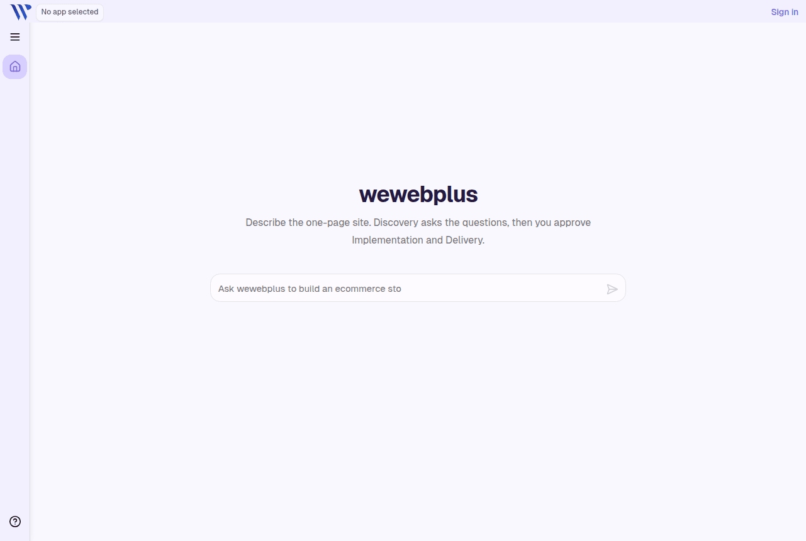

**Action.** Priya chooses Sign in. The card is Clerk's development card, titled "Sign in to realestate-tracker", with Google, an email field, and a "Development mode" banner. She enters her email. The card asks for a six-digit code.

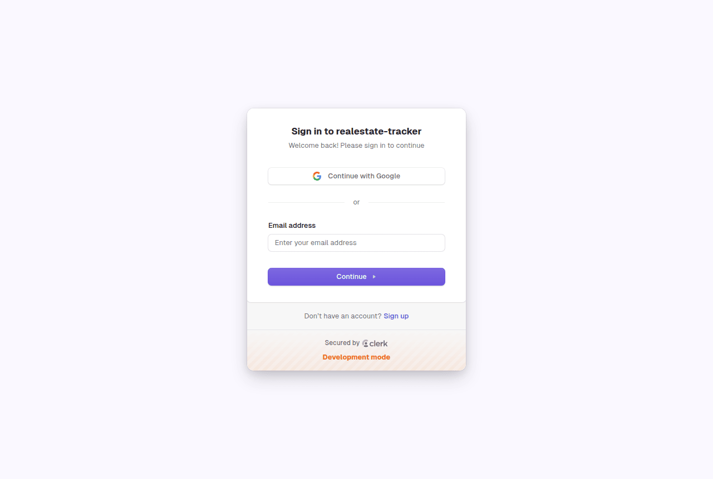

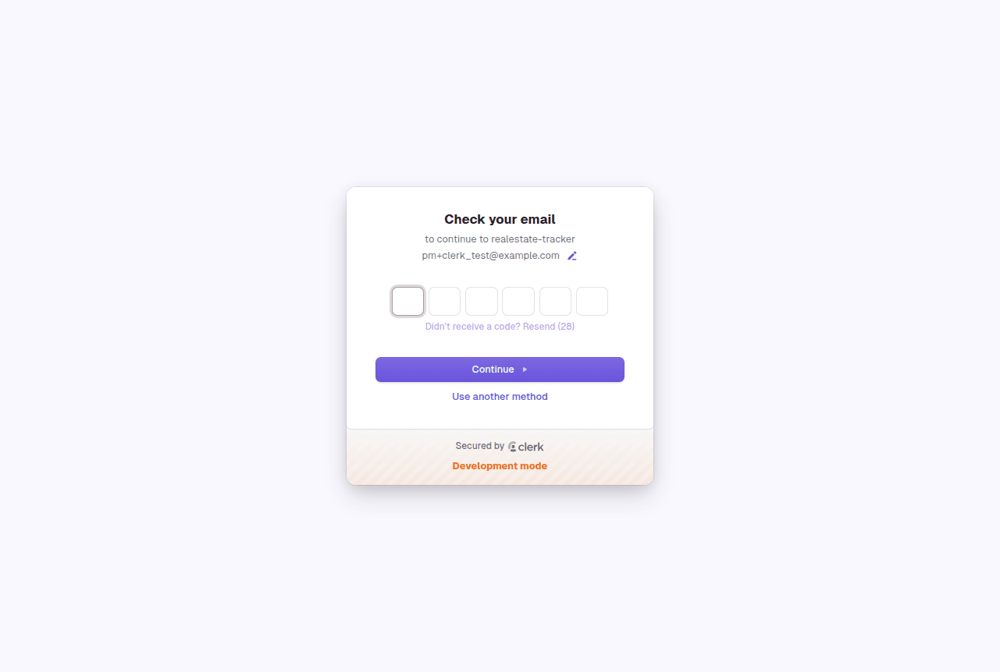

**Completed.** After the code, the home screen returns with the account chip set to Private. The home sentence is unchanged: "Describe the one-page site. Discovery asks the questions, then you approve Implementation and Delivery."

**Next.** She still has no organization, so she cannot open an organization project. Creating or choosing an organization is the next screen.

**How she can tell.** The account chip changes from "Sign in" to "Private", and the avatar menu can open. Nothing on the home screen says her name.

## 2. Organization setup

**Status: VERIFIED** for creating and selecting an organization.

**Pending.** The account menu lists "Create organization" and "Private". Private is selected.

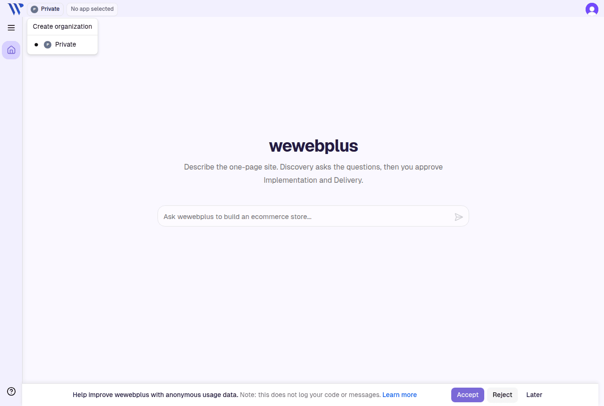

**Action.** She chooses Create organization, types Gas City Demo, and chooses Create.

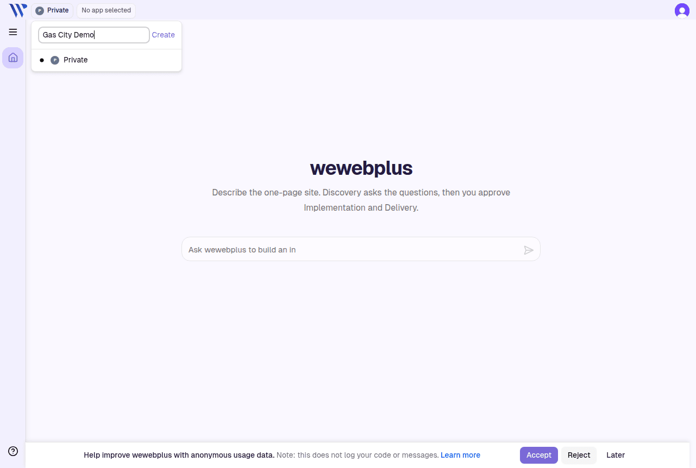

**Completed.** The account chip reads Gas City Demo. The home screen is otherwise the same. A usage-data banner may sit at the bottom. It is unrelated to the organization.

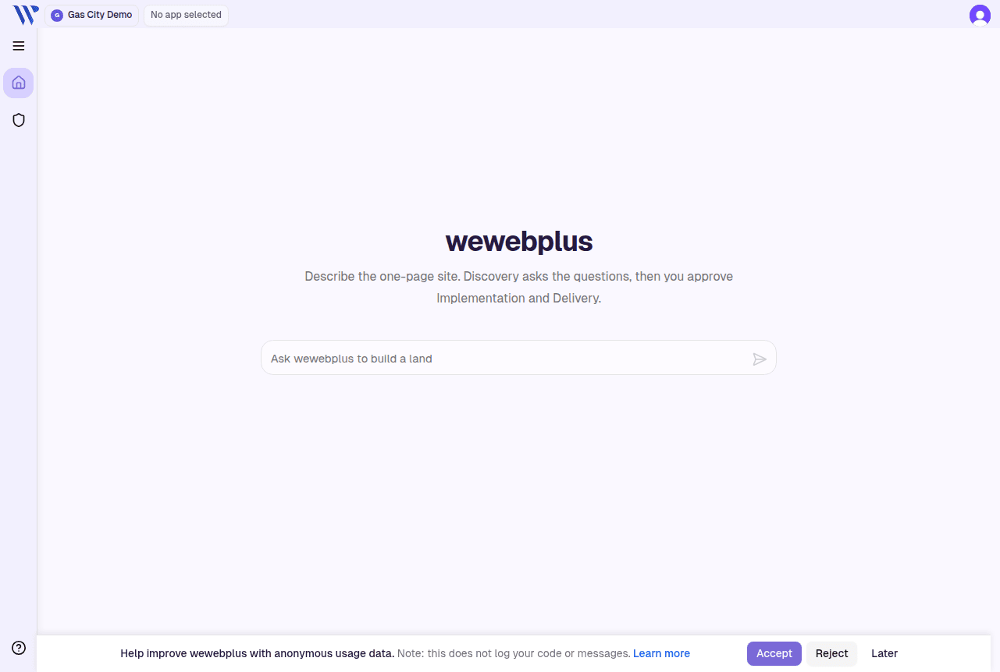

**Next.** She can invite people from Admin, or start a project from Home. No project exists yet. The chip still says "No app selected".

**How she can tell.** The account chip is the only confirmation. There is no organization-created page and no member count on Home.

**NOT IN THIS BUILD.** A person with more than one organization picks from this same menu. The menu is the whole organization switcher. There is no separate organization home.

## 3. Invite a person

**Status: VERIFIED** that an invitation can be recorded. **PARTIAL** because the invited person cannot accept it inside wewebplus. **UNRESOLVED** why the role error toast is already on screen while the invite is being typed.

**Pending.** Admin, Members & permissions, lists only Priya. Her Role dropdown already reads Project Manager. That label is not, by itself, proof a gate role was saved. The permission table under the list says a project-manager may approve discovery, implementation, and delivery, and a developer may view the page, comment, and work in Implementation. The question cards later in this walkthrough do not follow that table. See the next section.

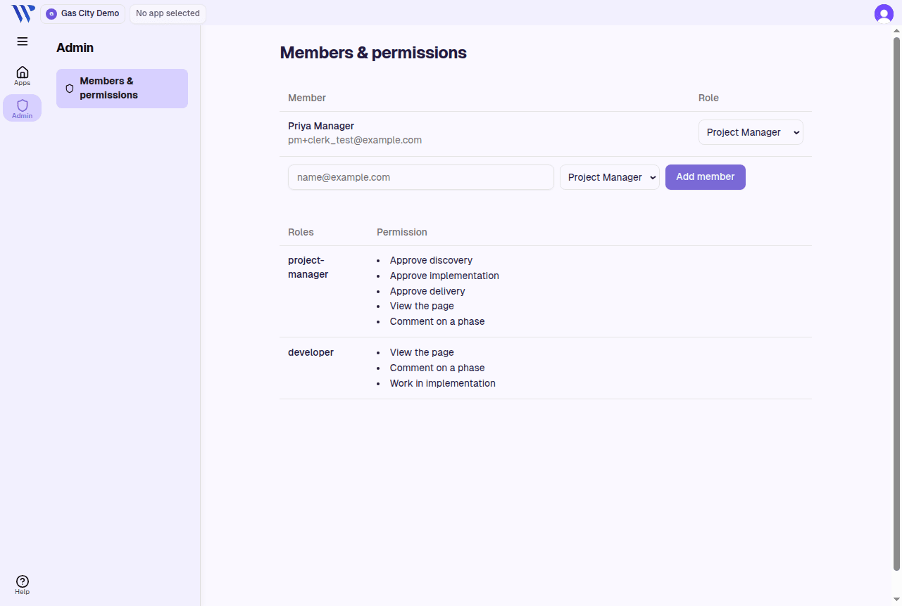

**Action.** She types Dev's address, chooses Developer in the invite dropdown, and chooses Add member. In this capture an error toast is already visible: "DyadError: Organization role not found".

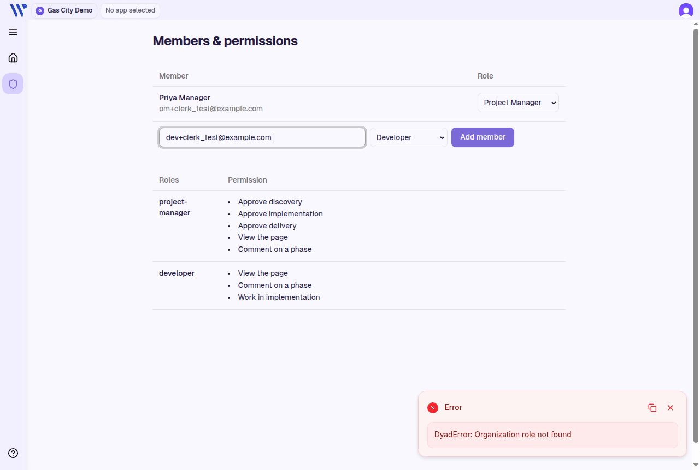

**Completed.** The member list gains a row for Dev's address, marked Invited, with the role shown as the word Developer rather than a dropdown.

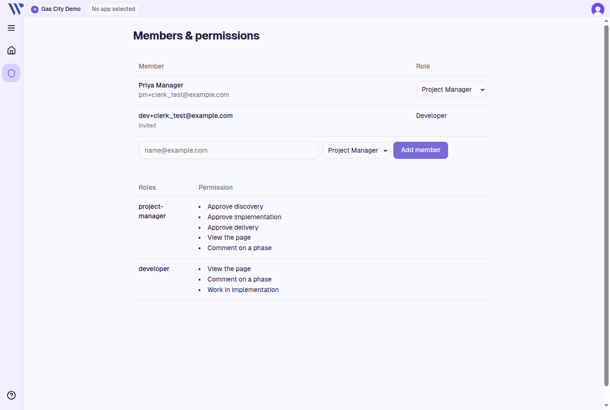

**Next.** Dev has to accept before Gas City Demo appears in his account menu. wewebplus does not show him an invitation. In this walkthrough he accepted it from Clerk's own client. After a reload, his account menu listed Gas City Demo.

**How Priya can tell.** The new row says Invited. It does not say whether the mail was sent, and it does not change when Dev accepts unless she reloads and the row becomes a member. This walkthrough did not capture that refresh.

## 4. Role assignment

**Status: UNRESOLVED** for the dropdown. The error is verified. Saving a gate role from this screen is not.

**Pending.** Both people are on the member list. Priya's dropdown reads Project Manager. Dev, now a member, has a dropdown that reads Developer.

**Action.** Changing Dev's dropdown raises the same toast: "DyadError: Organization role not found".

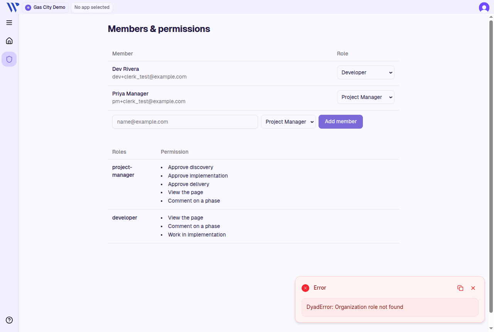

**Completed.** The dropdowns keep displaying a role. The screen does not say the change was rejected beyond the toast, and it does not say the displayed value was saved.

**What actually routed the later questions.** After this failure, Priya's gate role and Dev's gate role were written through Clerk's membership metadata API, outside this page. Only after that did the question cards treat Priya as Project Manager and Dev as Developer. A reader of this screen cannot see that write.

**How the permission table and the cards disagree.** The table says the project manager approves implementation. The cards send `review-approve-dev` to the Developer and `review-approve-pm` to the Project Manager. The developer row on this page does not mention answering a review. Later figures show the developer answering one, and show the project manager's "Approve and continue to Delivery" button still available while the developer question is open.

**Next.** With an organization selected, Priya returns to Home to start the project. Her gate role is not visible on Home.

## 5. Start a project

**Status: PARTIAL.** The template dialog can create the project. The home prompt cannot, until a provider is connected. The session expires in the middle of the dialog. The new project opens under the name "App 1".

**Pending.** Home, Gas City Demo selected, no app selected. The prompt contains a sentence about an ecommerce store.

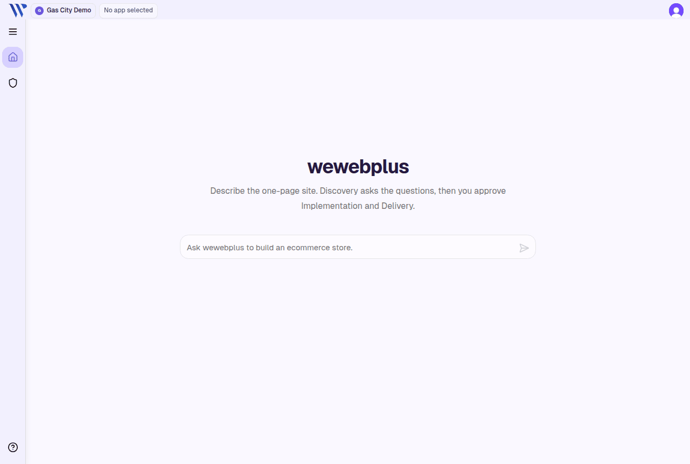

**Action, home prompt.** Sending the prompt does not create a project. A dialog says "You're almost ready to build" and "Your prompt is saved — it'll send as soon as you're connected." It offers a wewebplus Pro trial, OpenRouter, a ChatGPT subscription, or other providers.

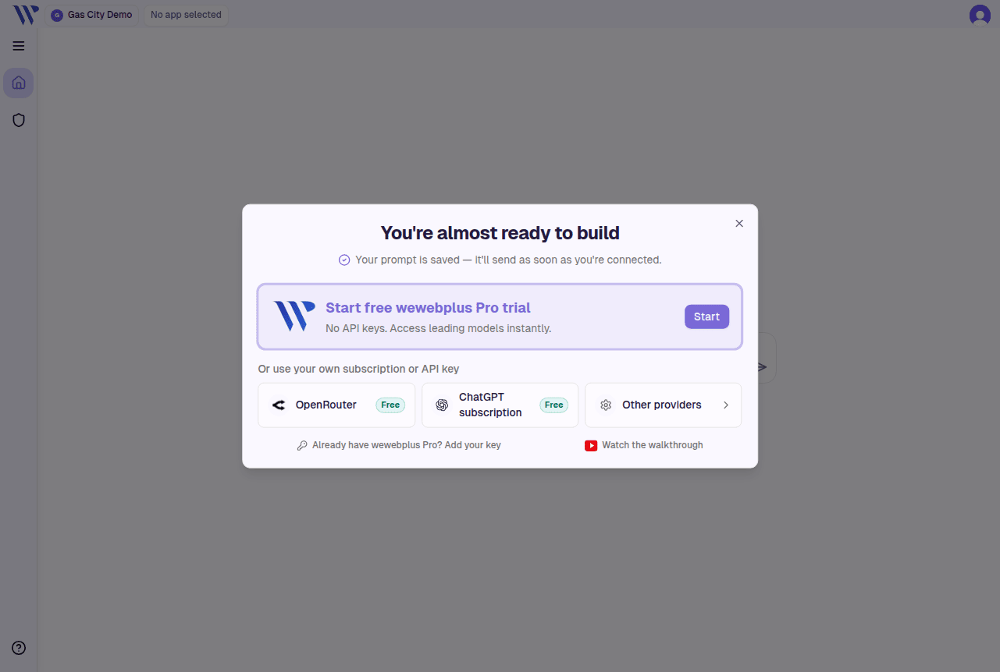

**Action, template.** She opens the template gallery and the React.js template. The dialog title is "Create New App". She types Gas City Bakery. The folder name shown is gas-city-bakery.

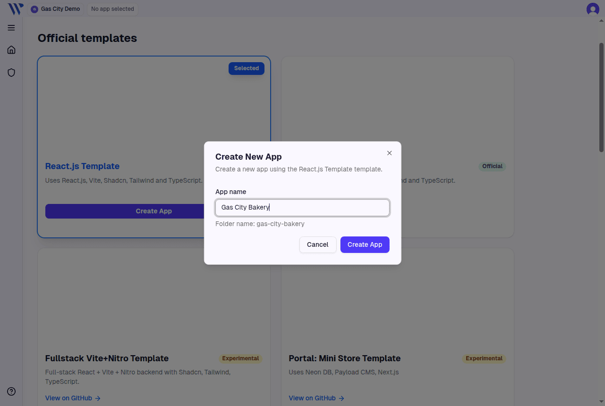

**UNRESOLVED interruption.** About a minute after sign-in, Create App answers "DyadError: Sign in to continue." The account chip still says Gas City Demo. She still looks signed in.

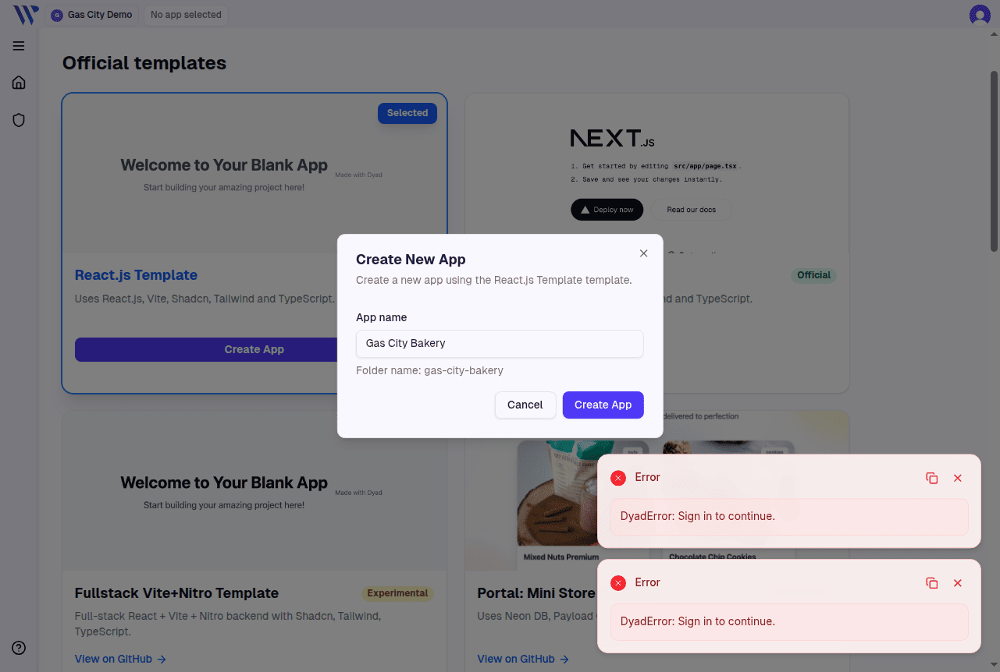

Leaving that state and opening the project can also stop on a blank page that only says "Checking sign-in...". The tab behind it still says App 1 / Discovery. A reload leaves this page.

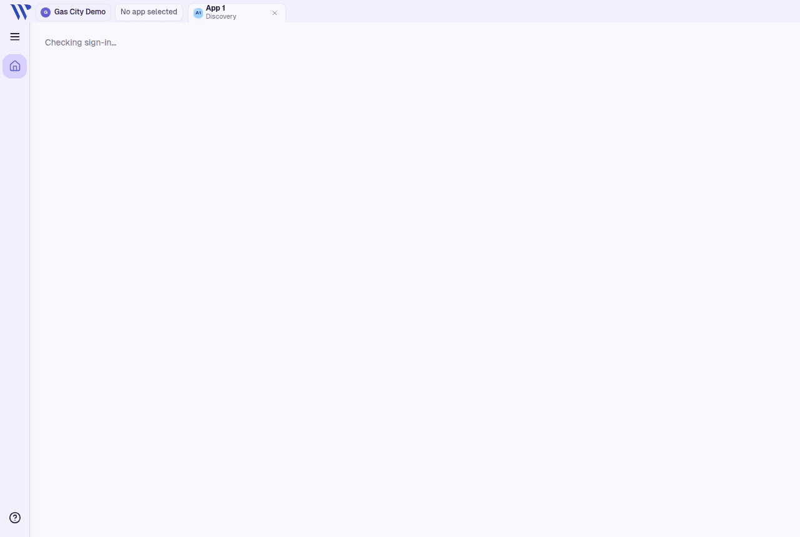

**Completed.** After a reload and a fresh session, Discovery is open. The tab says "App 1", not Gas City Bakery. The phase strip shows Discovery, Implementation, and Delivery. Discovery is selected. The button "Approve and continue to Implementation" is drawn. The hint says approval unlocks when a Discovery summary is posted. A red banner says the local turn failed because no API key is configured. The preview area is the "Connect AI to start building" panel, because this shot is the chat column before the preview is opened.

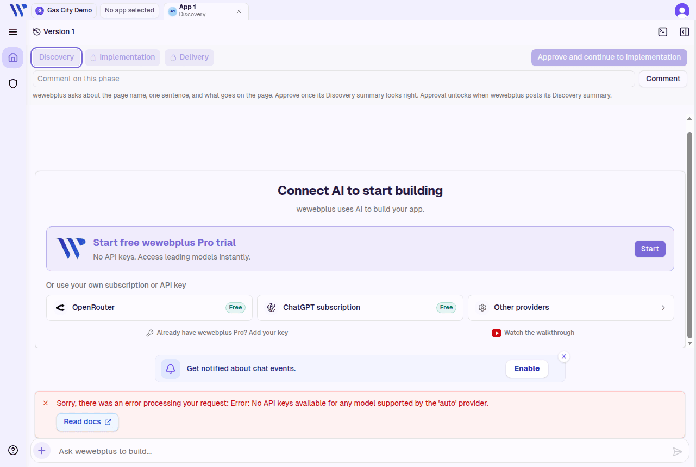

**Next.** The project exists and Discovery is the open phase. Nothing on this screen says the project is linked to a run, and nothing says a person is waiting. The local assistant has not produced a plan.

**How she can tell the project exists.** A chat tab is open on Discovery. She cannot tell the name she typed, because the tab says App 1. Later, once the account record can be read, the same project is labeled Gas City Bakery in the app list.

## 6. Enter the run

**Status: PARTIAL.** Linking the project and posting the agents' text are host calls. The window shows the text after a refresh. It never shows a "linked" or "run started" badge of its own.

**Pending.** Discovery looks like the previous figure: the person's own "Start Discovery." bubble, the approval hint, and the API-key error.

**Action.** Two host calls, then a refresh. One links the app to the project id `gas-city-bakery`. One posts a system line and a Discovery summary into the phase. The window does not send the brief to Gas City. The chat box still submits to the local model, which is why the API-key error remains.

**Completed, link only.** The screen still has no link badge. The only new user-authored line is "Start Discovery." The approve button and the unlock hint are unchanged.

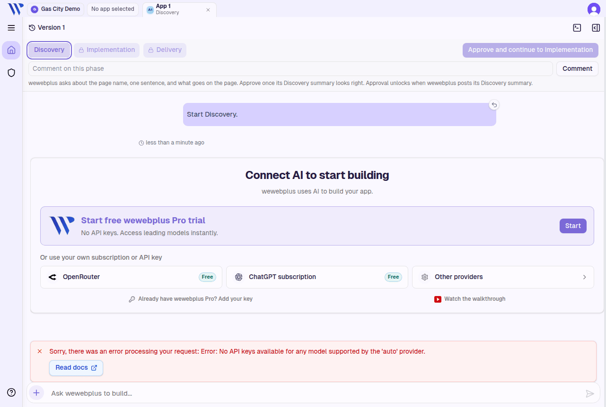

**Completed, summary posted.** A Gas City card says "Gas City run gc-run-001 started Discovery for project gas-city-bakery." Under it, a Discovery summary lists page name, one sentence, sections, and audience, and says a Project Manager needs to approve the plan. The approve button is still the phase button. There is still no question card. The API-key banner is still there, from the earlier local turn.

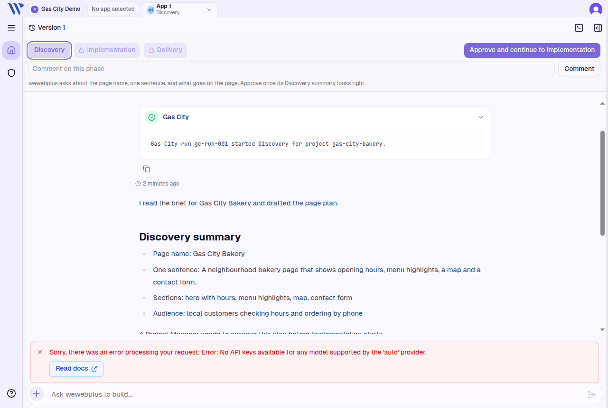

**Next.** The plan is readable. The human step has not opened. A further host call posts the question.

**How she can tell a run started.** Only by reading the Gas City card. If she stays on the phase while the message is posted, this build does not update the transcript in place. She sees it after reopening the phase or reloading.

## 7. The plan question arrives

**Status: VERIFIED** for the card. **PARTIAL** for noticing it without a reload.

**Pending.** The summary is on screen and there is no question.

**Action.** A host call posts a question with step `plan-approve`, target role `project-manager`, and the text "Approve the Discovery plan for Gas City Bakery? Reply approve to start Implementation, or describe what should change." Priya reopens Discovery.

**Completed.** Above the comment box, the card reads "Waiting on Project Manager for plan-approve. Status: open." The question text is shown. Because Priya's gate role is Project Manager, she gets an empty field and **Submit answer**. The phase button is unchanged.

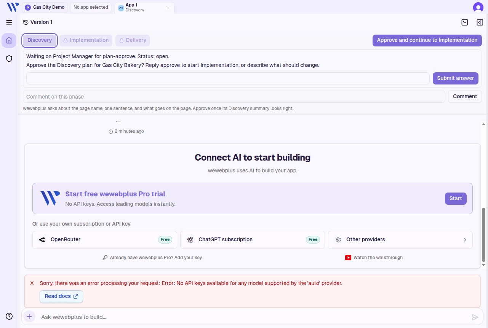

**Who it is routed to, and why, as far as the screen explains.** The first line names the role and the step id. It does not name Priya. It does not say why that role was chosen. The reason she sees a field is that her gate role matches the role on the card. Dev, later, sees the same card with no field. Olga does not see the project.

**Next.** The run is waiting on a Project Manager. The screen does not say "waiting for a human" anywhere except this sentence, and it does not say the agents are paused.

## 8. Answer the plan question

**Status: VERIFIED** that Submit answer changes the card. **PARTIAL** because the answer text, the time, and the phase button do not confirm the step.

**Pending.** Status open, empty field, phase button still "Approve and continue to Implementation".

**Action.** Priya types `approve - plan looks right, go ahead with Implementation.` and chooses Submit answer.

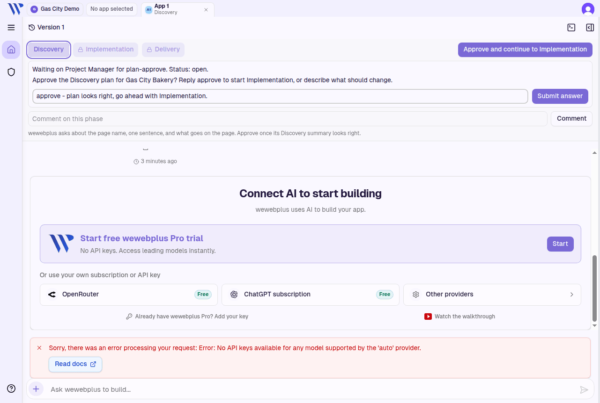

**Completed.** The field is gone. The card reads "Waiting on Project Manager for plan-approve. Status: answered. Answered by Priya Manager." The question text remains. The typed sentence does not. The phase button is still "Approve and continue to Implementation". The summary is still below. No new chat line says she answered.

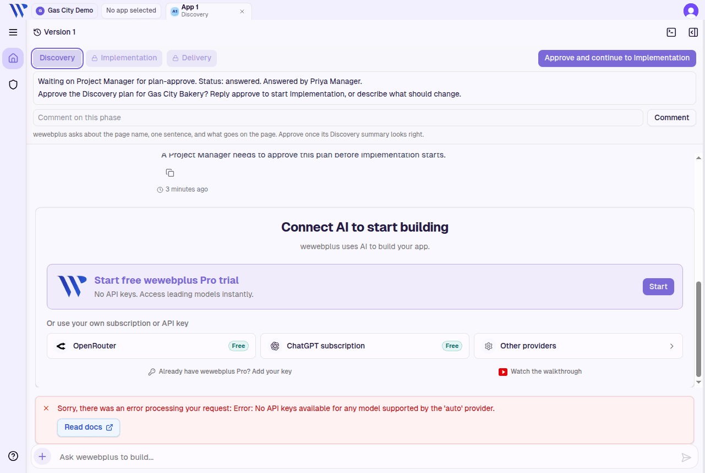

**Transition.** Question pending, then Priya submits, then the card says answered and names her. The phase is not finished. Implementation does not become the active phase.

**How she can tell.** The status word changes from open to answered, and her display name appears. She cannot re-read her sentence. She cannot see a clock time. She cannot see whether Gas City received the answer. A failure of the submit shows nothing: the form has no error message. One later submit, on the project manager sign-off, produced no request at all. That case is in section 18.

**Next.** The card is answered and the phase is still open. Moving Discovery takes a host call that approves the phase. That call is not her Submit answer.

## 9. Discovery is marked approved

**Status: PARTIAL.** The only change on this phase is which button is on the right.

**Pending.** Answered card, approve button still present, as in the previous figure.

**Action.** A host call approves the Discovery phase. Priya is still looking at Discovery, after a refresh.

**Completed.** The card is unchanged: answered, by Priya Manager, words still hidden. The right-hand button is now **Download documentation**. Implementation is not selected for her. The preview is unchanged. The API-key banner remains.

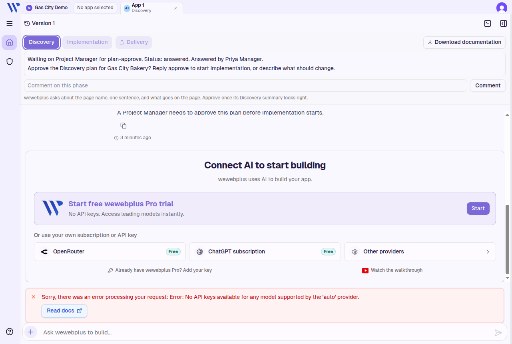

**Transition.** Card answered, then the host approves the phase, then Download documentation replaces the phase button. That swap is the whole on-screen signal that Discovery was approved.

**How she can tell.** She has to remember that the other button was there. There is no "Approved" stamp, no time, and no line that says the host accepted her sentence. A later Gas City message, visible only after she opens Implementation, says "plan-approve gate closed by Priya Manager. Implementation started."

**Next.** Implementation is the phase the agents would work in. Opening it is her next click. Until a host message is posted there, it is an empty phase with its own approve button.

## 10. Implementation, seen by the project manager

**Status: VERIFIED** for what Priya sees. **PARTIAL** because she can still see an approve button while a Developer question is open, and the question text is hidden from her.

**Pending.** She opens Implementation before any host message. The hint says to send the prefilled summary and that approval unlocks when the summary is posted. "Approve and continue to Delivery" is drawn. In this capture the session has expired again: toasts say "Sign in to continue" and the proposal line says the same. The empty phase is still visible behind the toasts.

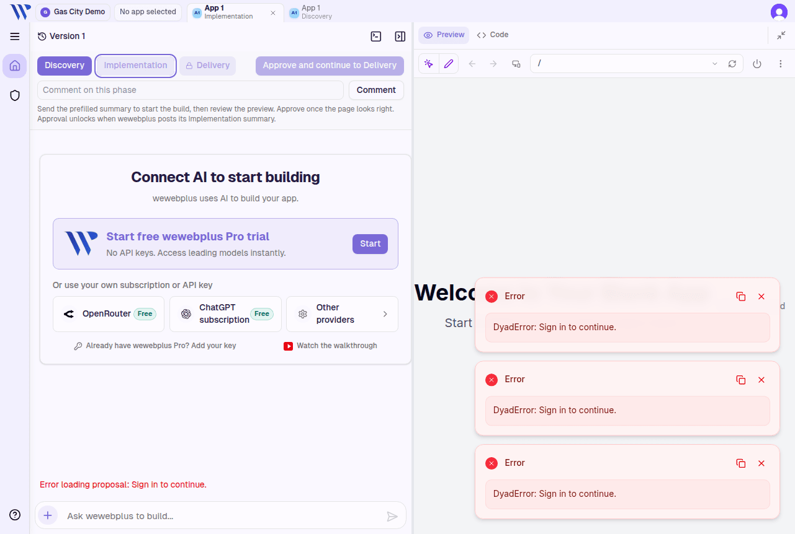

**Action.** Host calls post a status line, an Implementation summary, and a question with step `review-approve-dev` for the Developer. Priya reopens the phase with a fresh session.

**Completed.** The Gas City card says the plan-approve gate was closed by Priya Manager and Implementation started. The summary lists the hero, the menu, the map, and the contact form. The question card reads "Waiting on Developer for review-approve-dev. Status: open." There is no question body and no answer field. Priya's phase button "Approve and continue to Delivery" is still drawn. The preview is the blank template, with "Made with Dyad".

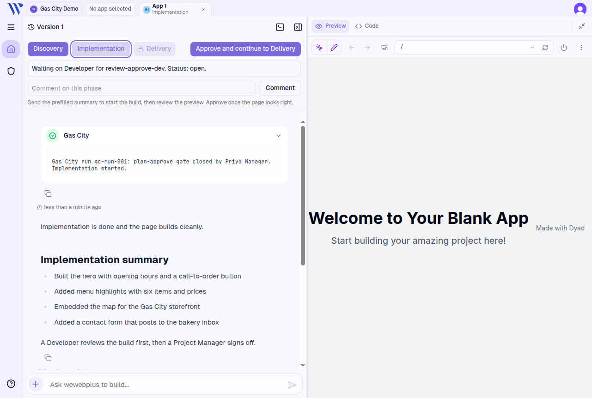

**Who is responsible now.** The card names Developer. It does not name Dev Rivera. Priya can read that she is not the one being asked, because there is no field. She cannot read the question. The phase button does not say that a Developer is blocking Delivery.

**How she can tell the previous step finished.** The Gas City card in this phase is the first sentence that says her plan approval closed the gate. Discovery's own screen never said that in those words.

**Next.** Dev has to open Implementation and answer. Priya can sign out. The developer question stays open.

## 11. Sign out

**Status: VERIFIED** for sign-out. **UNRESOLVED** for a tab that was already open.

**Action.** The avatar menu shows Priya's name and Sign out. It also says "Secured by clerk" and "Development mode".

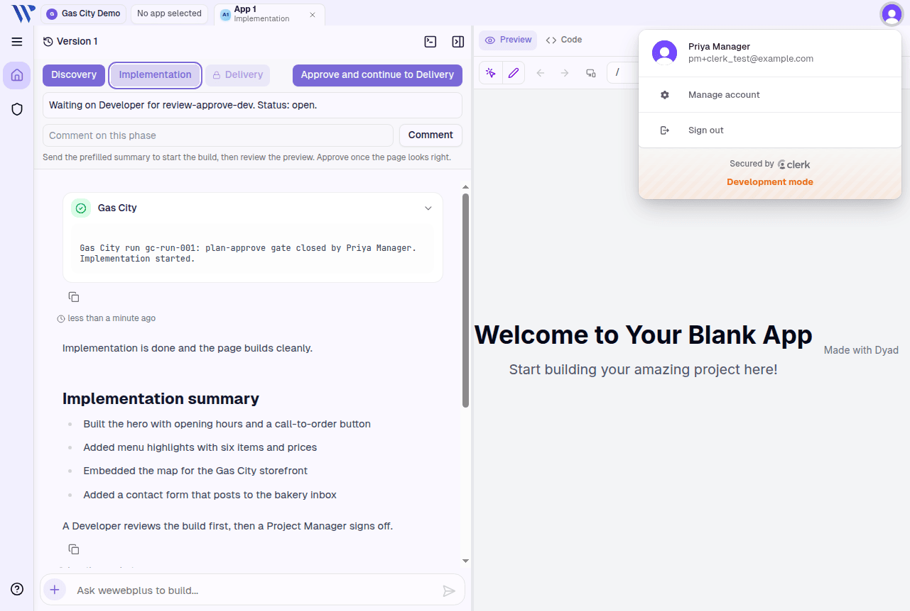

**Completed.** Sign out returns to the sign-in card. A window that was already sitting on a project does not show an access-denied page. It shows the sign-in card again. During this session the return address on that path accumulated a nested redirect parameter. The figure shows the card, not the address.

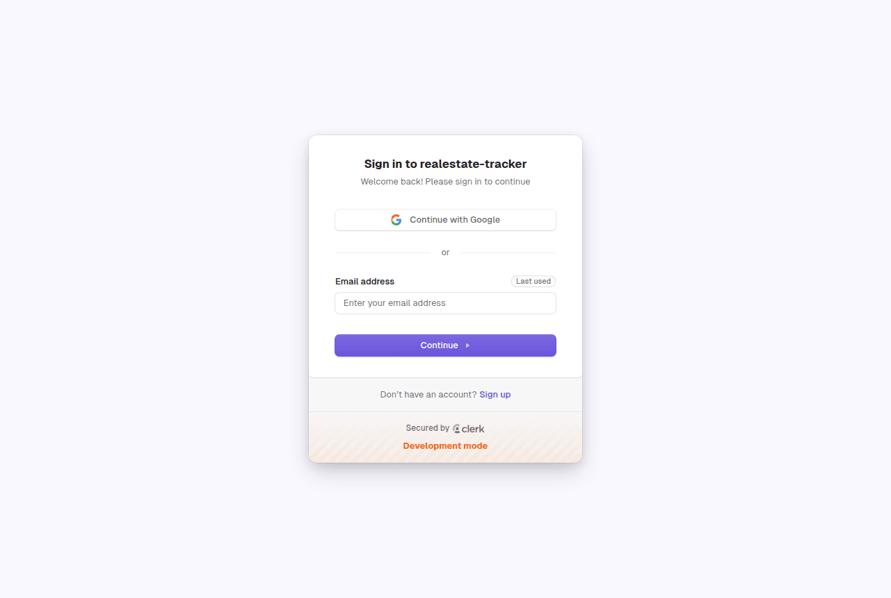

**Next.** Dev signs in on the same machine.

## 12. Developer signs in and joins the organization

**Status: VERIFIED** for the account switch. **PARTIAL** because the previous person's phase stays on screen until reload, and because accepting the invitation is outside wewebplus.

**Pending.** Dev signs in. The chip says Private. A tab titled App 1 / Implementation is still open from Priya's session. Home itself looks empty.

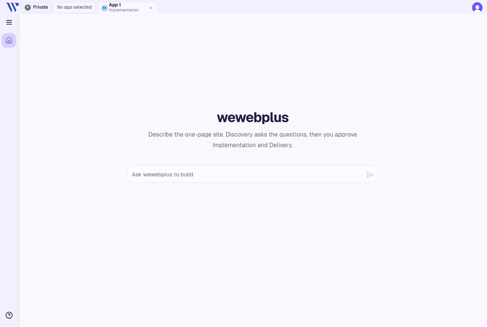

**UNRESOLVED cache.** Opening that tab while the chip says Private still paints Priya's Implementation transcript and the open developer question. Toasts say "DyadError: App not found". The preview says "Preparing preview". The words of the other organization are on screen at the same time as the error.

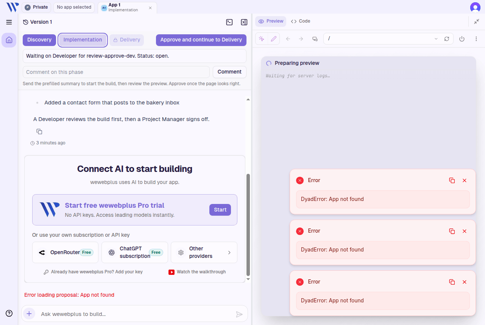

**Completed after reload.** The transcript is gone. The shell is a generic chat at Version 0, with "App not found" and "Error loading proposal: App not found". The server did not give Dev the project while he was on Private. The first paint did.

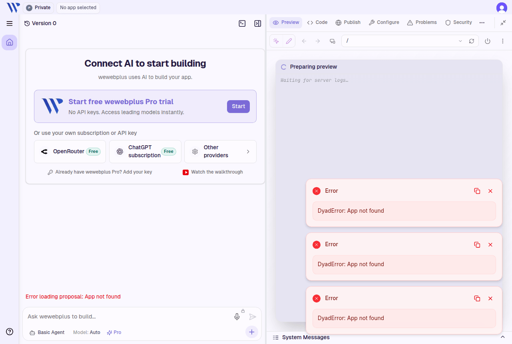

**Action.** Dev accepts the invitation outside this window, then reloads. The account menu, still on Private, now lists Gas City Demo. Before the reload the new organization was missing from the menu.

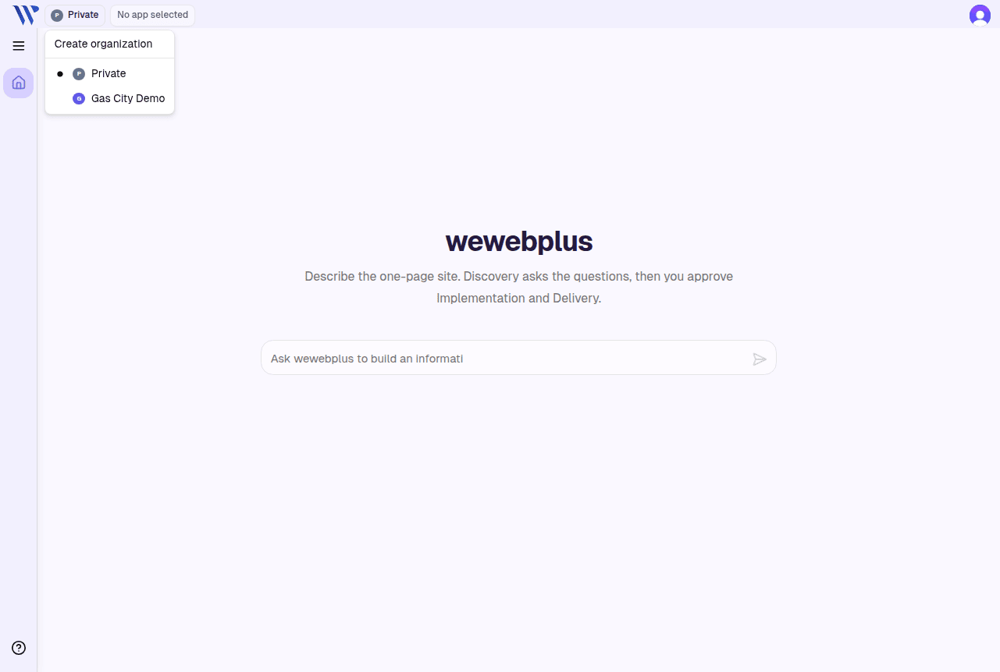

**Completed.** He selects Gas City Demo. Home looks like Priya's home: the organization chip, no app selected, the same prompt. Nothing says he is a Developer or that a question is waiting.

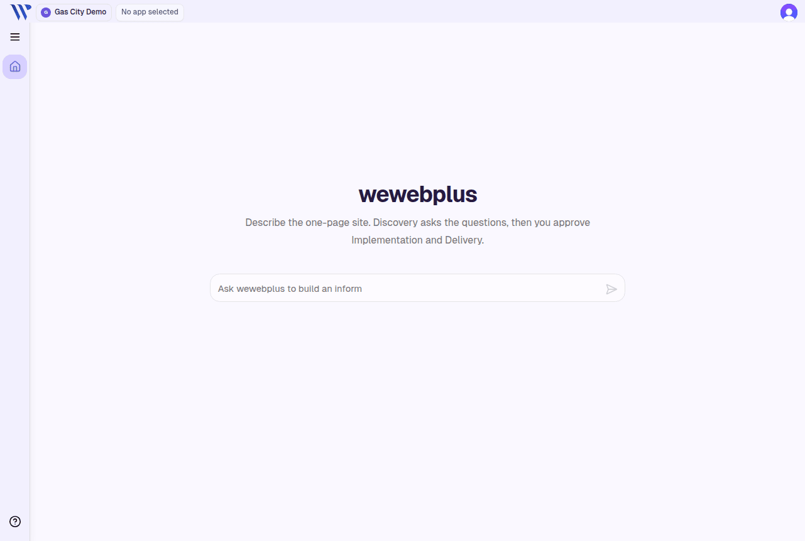

**Next.** He opens Apps and selects the project. Home will not take him to the open question.

## 13. Developer opens the project

**Status: VERIFIED** that the project is listed for a member. **PARTIAL** because neither the list nor the details page shows which phase is waiting.

**Completed, list.** Apps shows one row, Gas City Bakery, "23 minutes ago". This is the first figure in which the typed name is visible. The row has no phase, no status, and no "needs your answer" mark.

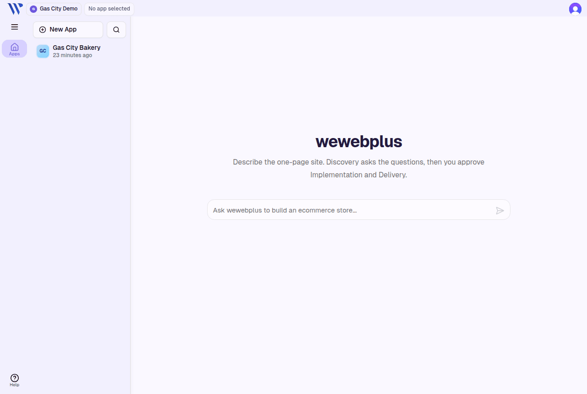

**Completed, details.** The details page lists Discovery, Implementation, and Delivery, each as "23 minutes ago". It shows Created and Last Updated timestamps. It does not show approved, waiting, answered, or blocked. The thumbnail is the blank template.

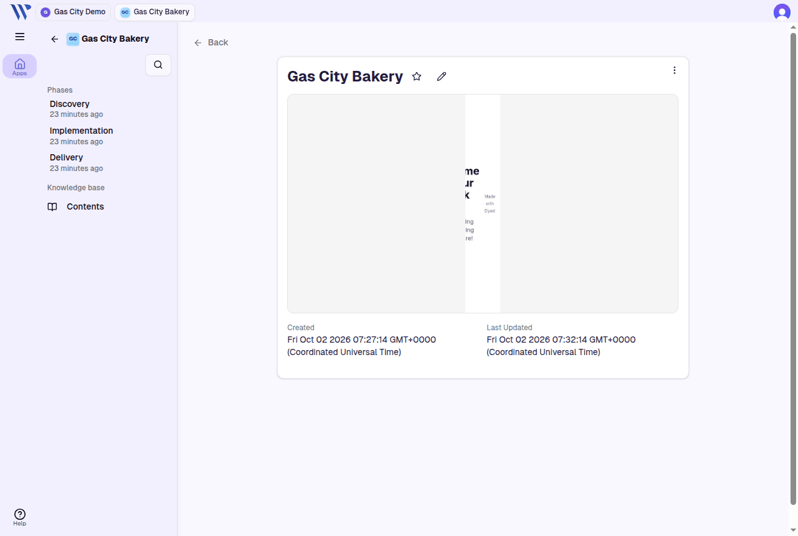

**UNRESOLVED interruption.** Opening Implementation after the session has expired removes the question card and shows "Sign in to continue" plus "Error loading proposal: Sign in to continue." The phase tabs remain. Version reads 0 in this capture. A fresh session brings the card back. The person can mistake the missing card for "no question".

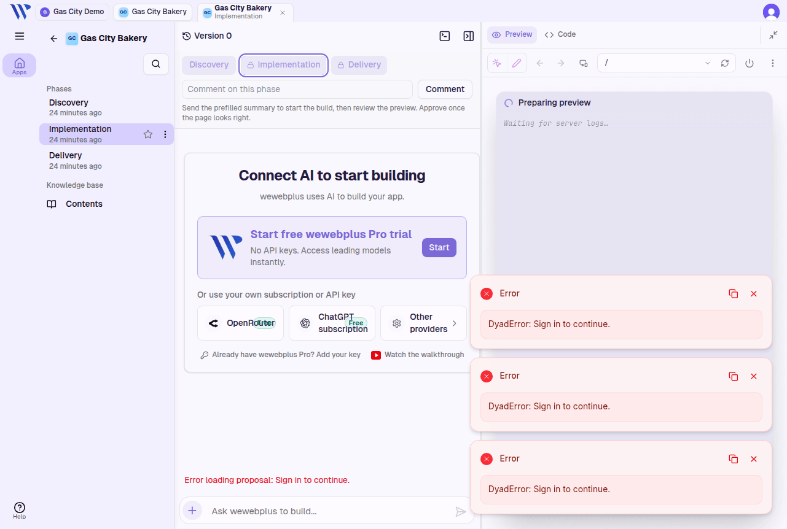

## 14. Developer receives and answers his question

**Status: VERIFIED** for the field and the status change. **PARTIAL** for the answer text, the clock, and the false "no longer a member" toasts that appear beside a successful answer.

**Pending.** With a fresh session, Implementation shows "Waiting on Developer for review-approve-dev. Status: open." The body is visible to him: "Developer review: does the Gas City Bakery build meet the Discovery plan? Reply approve or list the fixes needed." He has a field and Submit answer. Under the comment box the hint says "Your role can't approve this phase." The phase button "Approve and continue to Delivery" is still drawn. The preview is still the blank template.

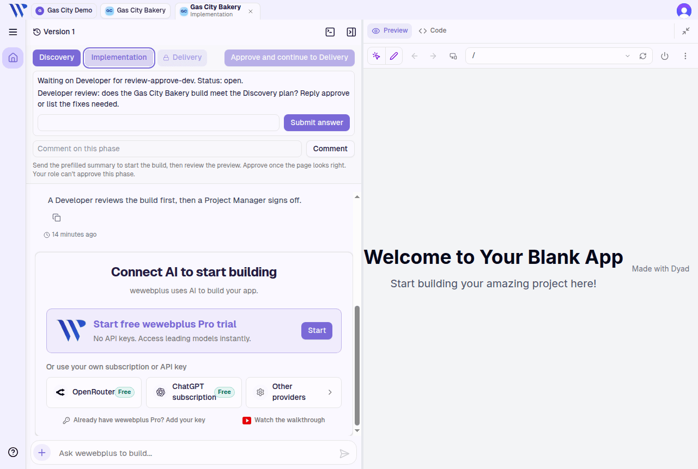

**Previous step, as Dev sees it.** Opening Discovery shows Priya's plan card as "Status: answered. Answered by Priya Manager." with no answer field and no typed sentence. Download documentation is on the right. He can see that the plan step was answered and who answered it. He cannot see what she wrote or when.

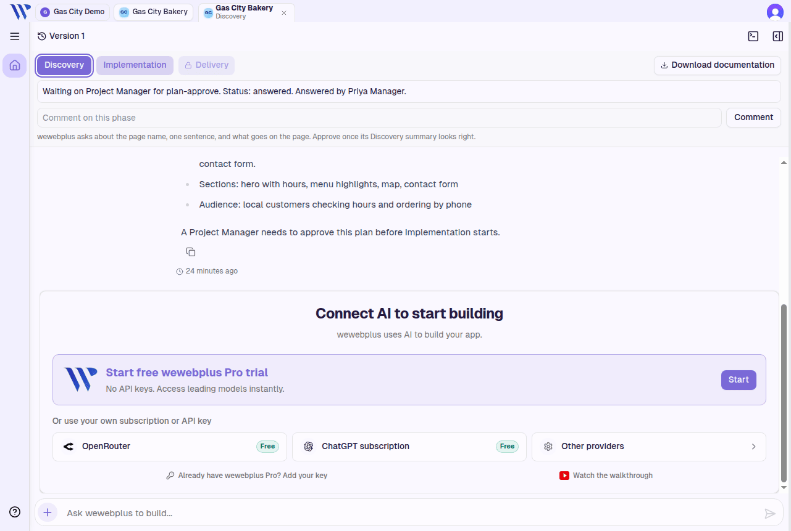

**Action.** Back on Implementation he types a review. The figure shows the field scrolled, so the start of the sentence is off-screen. The visible part includes "build matches the plan; hours, menu, map and form all present". He chooses Submit answer. Toasts at this moment say "DyadError: You are no longer a member of this organization." He is a member. The same sentence appears as "Error loading proposal". The card is still open in this figure, so the toasts are not the submit result. They come from a membership check that was rate-limited against Clerk during this session. Sequential checks succeed. A burst of them returns "too many requests", and the window reports that as a lost membership.

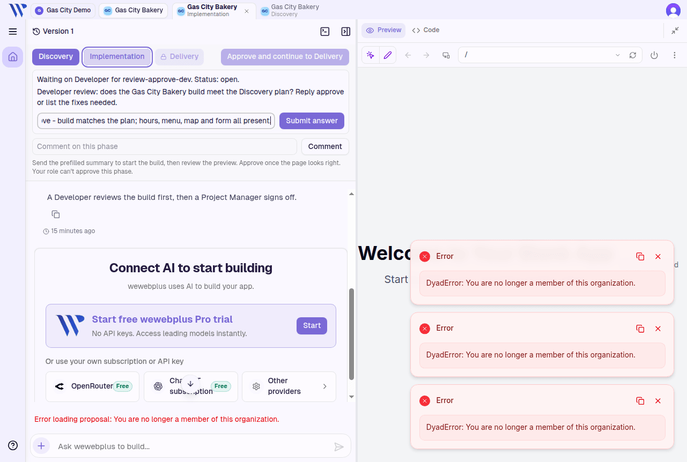

**Completed.** The field is gone. The card reads "Status: answered. Answered by Dev Rivera." The question text remains. His sentence does not. The phase button is unchanged. The membership toasts are still there, so a person can believe the submit failed when the card has in fact changed.

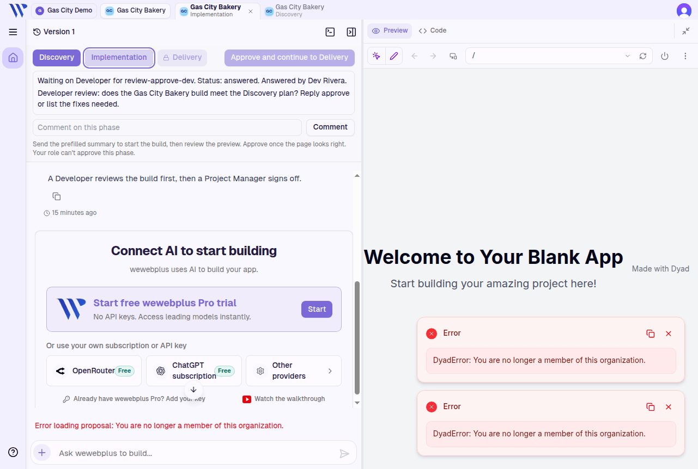

**Transition.** Question pending for Developer, then Dev submits, then the card says answered and names him. Implementation is not approved. The project manager sign-off is not on screen yet.

**How he can tell.** The status word and his name. The toasts contradict that reading. Nothing else on the page confirms it.

**Next.** A host call posts `review-approve-pm` for the Project Manager. Dev will see that card as status only.

## 15. Developer sees the project manager's question

**Status: VERIFIED.**

**Pending.** Only the answered developer card, as in the previous figure.

**Action.** A host call posts the project manager sign-off. Dev reopens Implementation.

**Completed.** A second card reads "Waiting on Project Manager for review-approve-pm. Status: open." No body and no field. His own card stays answered above it. The hint still says his role cannot approve the phase. "Approve and continue to Delivery" is still drawn.

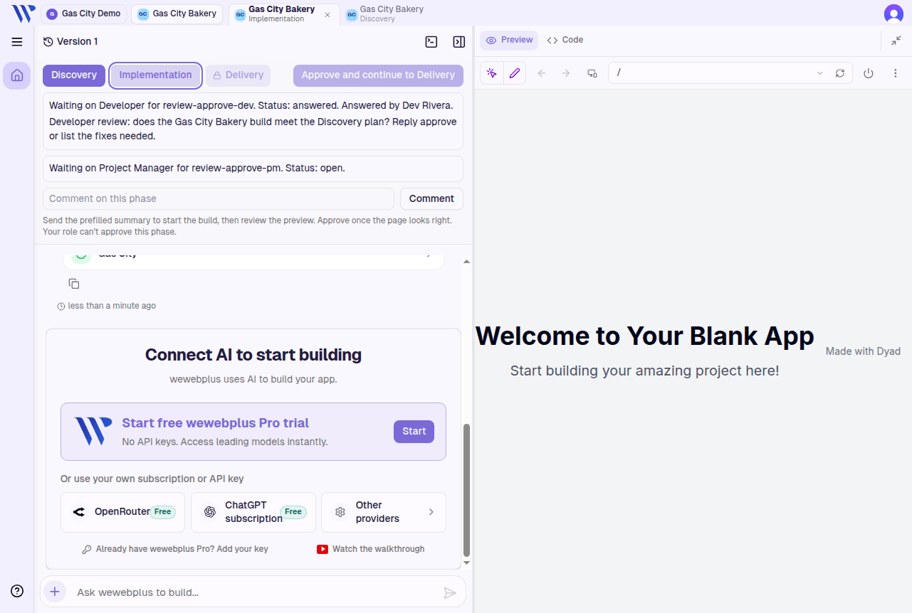

**Who is responsible now.** The new line names Project Manager. It does not name Priya. Dev can tell the open step is not his, because he has no field. He cannot tell whether Priya has been notified.

**Next.** Priya has to answer. Before that, Olga's session checks that another organization cannot see the project.

## 16. A person in another organization

**Status: VERIFIED** that the project is absent from her list and, after reload, from a direct open. **UNRESOLVED** that the first paint of a direct open still shows the other organization's question text. The server returned "not found" for her session. The first paint did not wait for that.

**Pending.** Olga signs in. Her account menu lists Private and Northwind Sites. Gas City Demo is not listed. Tabs titled App 1 are still open from the earlier session on this machine.

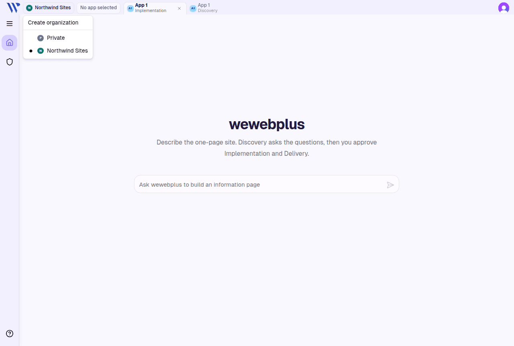

**Completed, her list.** Apps under Northwind Sites says "No apps found". The home prompt is empty of Gas City Bakery.

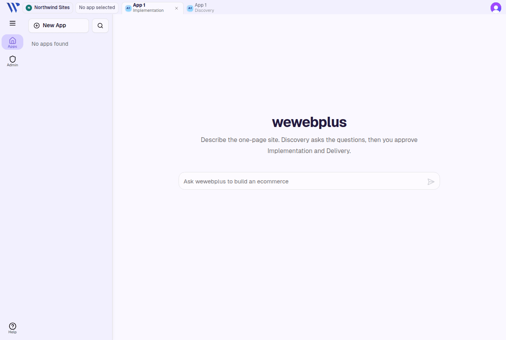

**UNRESOLVED first paint.** Following a direct open of the Gas City Bakery phase while those old tabs exist paints the Implementation cards: the developer answer and the open project manager question, including the question body, plus "Your role can't approve this phase." Toasts say "DyadError: App not found". The chip says Northwind Sites. The sidebar still lists Discovery, Implementation, and Delivery.

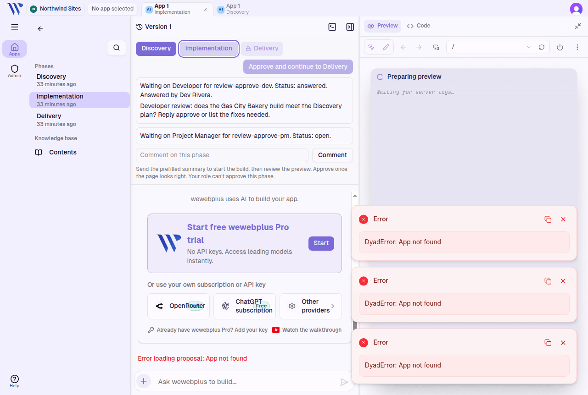

**Completed after reload.** The question text is gone. The shell is the generic Version 0 chat, "Error loading proposal: App not found", preview "Preparing preview". She is not given an access-denied page that names the project. She is given a broken-looking chat and three copies of "App not found".

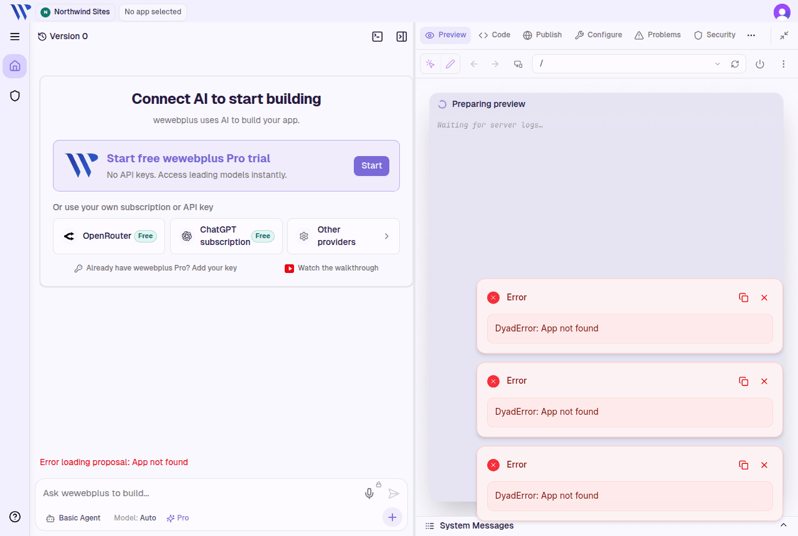

**Her own Admin.** Members & permissions for Northwind Sites lists only Olga. The role dropdown reads Project Manager. Gas City Demo's members are not on this page. The same permission table is shown. It describes roles in general. It does not say which organization they apply to beyond the chip in the header.

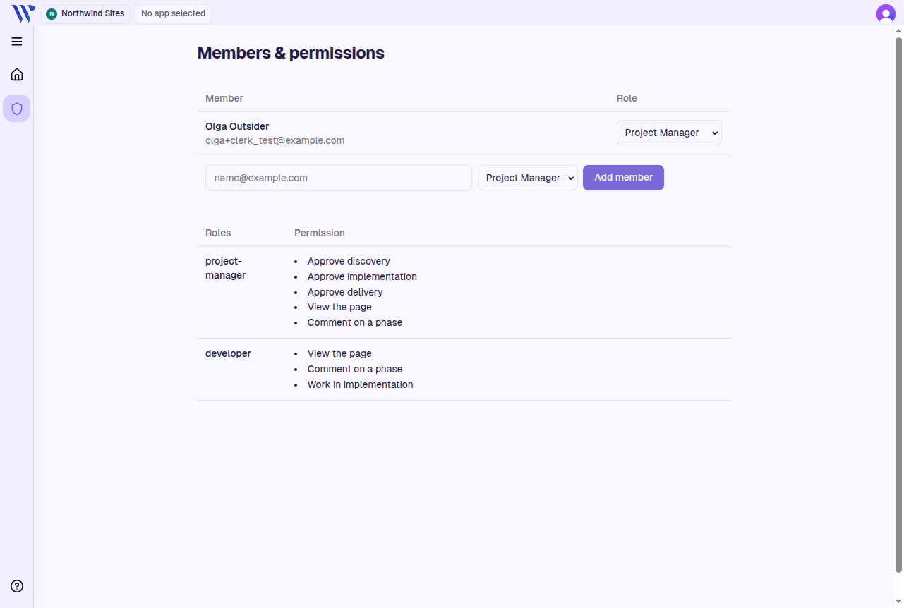

**How she can tell she has no access.** The app list is empty, and a reloaded direct open does not show the project. The first paint is not a safe check, because it can show the previous person's cards.

**Next.** Priya signs back into Gas City Demo for the sign-off. Olga's session is not involved again.

## 17. Project manager sign-off

**Status: PARTIAL.** One sign-off card was answered from the window. An earlier card for the same step was not. The screen presents both as "Answered by Priya Manager" and hides both sentences.

**Pending.** Priya reopens Implementation. She sees Dev's card, answered by Dev Rivera, and one open card: "Waiting on Project Manager for review-approve-pm. Status: open." The body is visible to her: "Project Manager sign-off: the Developer approved the build. Approve to move Gas City Bakery into Delivery, or describe what must change first." She has a field and Submit answer. "Approve and continue to Delivery" is still drawn. The hint says approval unlocks when the Implementation summary is posted. The summary is already in the transcript from section 10.

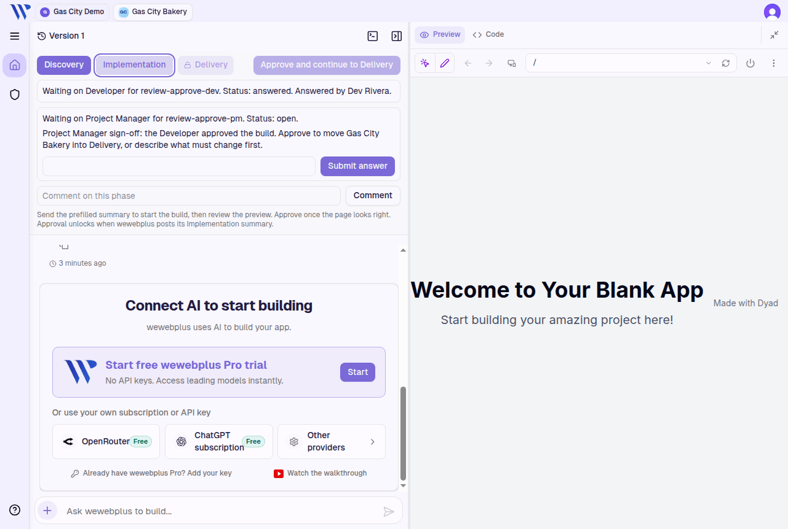

**UNRESOLVED first submit.** Two uses of Submit answer on that first card produced no request. The form did not show an error, and the card stayed open. A direct call from this verification session then stored an answer on that card. The stored words are not visible anywhere in the window. After that, the card reads "Answered by Priya Manager", which looks the same as a real submit. Do not treat that first card as a successful use of the button.

**Action that did go through the button.** A second host call posted the same step again, with text that says it was re-asked after the contact form was re-checked. Priya typed `approve - signed off for Delivery` and chose Submit answer. This request did leave the window.

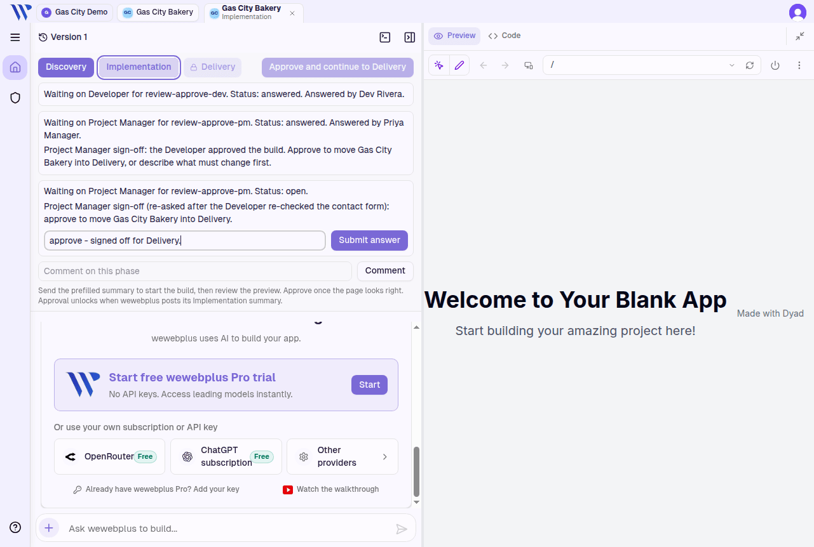

**Completed.** Both cards say "Status: answered. Answered by Priya Manager." Neither shows the sentence. Dev's card is unchanged above them. "Approve and continue to Delivery" is still the phase button. The preview is still the blank template.

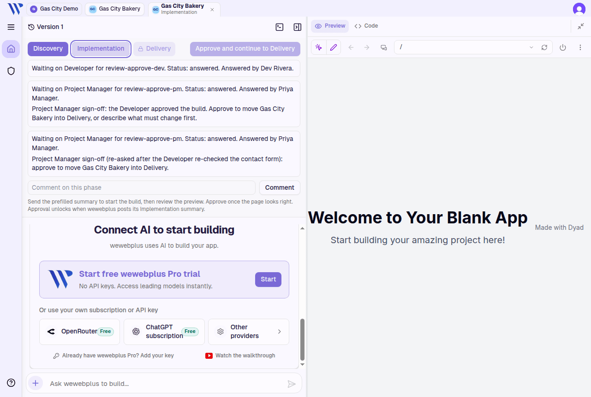

**Transition.** Sign-off pending, then Priya submits the second card, then that card says answered and names her. Delivery does not open. The phase button does not change.

**How she can tell.** The second card's status word. She cannot tell her sentence from the first card's sentence, because both are hidden, and both name her. She cannot tell which one the button actually sent.

**Next.** A host call approves the Implementation phase.

## 18. Implementation is marked approved

**Status: PARTIAL.** Same signal as Discovery: the phase button becomes Download documentation.

**Pending.** Both cards answered, approve button still present, as in the previous figure.

**Action.** A host call approves Implementation.

**Completed.** The three cards are unchanged. The right-hand control is **Download documentation**. Delivery is not selected. No banner says Implementation was approved. The preview is unchanged.

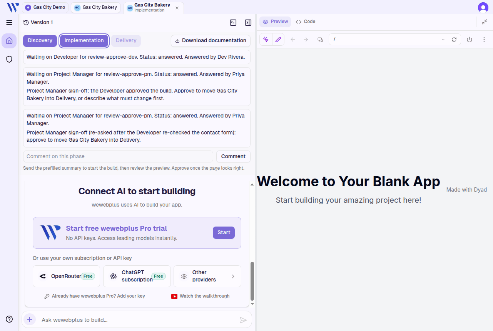

**How she can tell.** Only by the button swap. The cards still read as waiting-lines that happen to say answered. A person scanning for "approved" or a timestamp will not find one.

**Next.** She opens Delivery.

## 19. Delivery and the final output

**Status: PARTIAL.** Delivery never shows a question card in this build. The phase looks finished when a summary is the last assistant message, which removes "Approve delivery" and shows Download documentation. This walkthrough did not finish Delivery by pressing Approve delivery.

**Pending.** Delivery is empty. The hint says wewebplus summarizes what was built, and that approval unlocks when the Delivery summary is posted. The button "Approve delivery" is drawn. There is no question card. The preview column is not open in this figure. The chat column shows the provider panel because no local turn has produced a page.

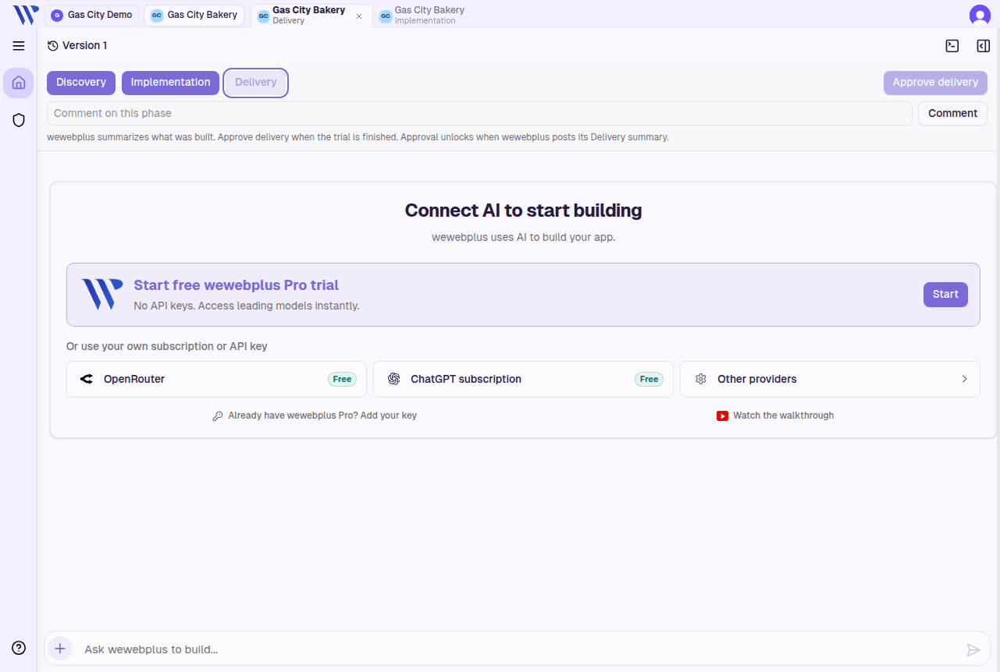

**Action.** A host call posts a Delivery summary: a live URL marked as a placeholder, Lighthouse numbers, a contact-form line, and a handover line. Nobody presses Approve delivery. Nobody posts a `review` question for Delivery.

**Completed.** The summary is on screen, including "Approve delivery to close the project." The phase button is gone. **Download documentation** is in its place. Delivery is the selected phase. There is still no question card, no status word, no name, and no time. The provider panel and the API-key failure from earlier phases are independent of this summary. The preview, when opened on other phases, was still the blank template.

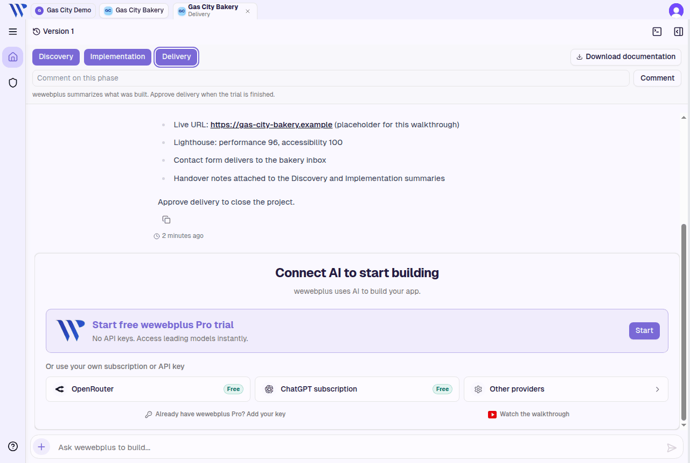

**Transition.** Delivery empty with Approve delivery drawn, then a summary message arrives, then the button is gone and Download documentation is shown. There is no human answer in this phase.

**How she can tell the project is finished.** The summary text is the evidence, plus the absence of Approve delivery. The screen does not say completed, released, rejected, failed, or blocked. It does not say who closed it.

**Download.** Choosing Download documentation in this session saved a file named `untitled-page-delivery.html`. The page name inside it fell back to "Untitled page" because the summary bullets were not in the bold label form the exporter looks for. The file is not one of the figures. GitHub is not connected, so the document has nothing to say about a repository. Treat the download as a real button with a weak document, not as a handover pack.

**What the final screen does not show.** The blank preview is still the template. The placeholder URL is not a site this session launched. A person who needs the page itself cannot get it from this window in this walkthrough.

## What the screen shows after each step

Read this against the figures above. "Response visible" means the words the person typed are still on screen after the action.

| Step                                | After the action, the screen shows                                                    | Who                         | Response visible             | When                                         | Next thing visible                                                      | Label      |
| ----------------------------------- | ------------------------------------------------------------------------------------- | --------------------------- | ---------------------------- | -------------------------------------------- | ----------------------------------------------------------------------- | ---------- |
| Sign in                             | Chip changes to Private                                                               | Not on the home screen      |                              |                                              | Create organization                                                     | VERIFIED   |
| Create Gas City Demo                | Chip shows the organization                                                           | The person who is signed in |                              |                                              | Admin or Home                                                           | VERIFIED   |
| Invite Dev                          | A row marked Invited                                                                  | The invited address         |                              |                                              | Acceptance, which has no screen here                                    | PARTIAL    |
| Change a role                       | Toast "Organization role not found". Dropdown label stays                             |                             |                              |                                              | Gate routing does not change from this click                            | UNRESOLVED |
| Create Gas City Bakery              | A Discovery tab. The tab says App 1 until a later list says Gas City Bakery           |                             |                              | Created time exists only on the details page | Discovery, with no question yet                                         | PARTIAL    |
| Link the project                    | No badge. Later, a Gas City line names the project id                                 |                             |                              | "less than a minute ago" on the chat line    | The summary, after a refresh                                            | PARTIAL    |
| Post the plan question              | Card: Waiting on Project Manager for plan-approve. Status: open. Field only for Priya | Role, not a person          | The question, not an answer  |                                              | She can type                                                            | VERIFIED   |
| Submit the plan answer              | Status: answered. Answered by Priya Manager. Phase button unchanged                   | Priya Manager               | No                           | No clock on the answer                       | Phase still Discovery until a host approval                             | PARTIAL    |
| Host approves Discovery             | Button becomes Download documentation. Card unchanged                                 | Not restated on this phase  | No                           | No                                           | Implementation opens empty                                              | PARTIAL    |
| Post the developer question         | Priya sees a status line and no body. Dev sees the body and a field                   | Role Developer              |                              |                                              | Dev is responsible. Priya's approve button is still drawn               | PARTIAL    |
| Submit the developer answer         | Status: answered. Answered by Dev Rivera                                              | Dev Rivera                  | No                           | No                                           | Project manager card appears only after another host call and a refresh | PARTIAL    |
| Submit the second sign-off          | Both cards say answered by Priya Manager                                              | Priya Manager               | No                           | No                                           | Phase button still Approve and continue to Delivery                     | PARTIAL    |
| Host approves Implementation        | Button becomes Download documentation                                                 | Not restated                | No                           | No                                           | Delivery opens empty                                                    | PARTIAL    |
| Post the Delivery summary           | Approve delivery disappears. Download documentation appears. No question card         | Nobody named                | No human response            | "2 minutes ago" on the summary message       | The file download                                                       | PARTIAL    |
| Olga opens her app list             | No apps found                                                                         |                             |                              |                                              | She has no next step on this project                                    | VERIFIED   |
| Olga's first paint of a direct open | The other organization's cards, plus App not found                                    |                             | The question body is visible |                                              | Reload clears the cards                                                 | UNRESOLVED |

The workflow words a person can actually use from the UI are narrow. **Open** and **answered** exist on a question card. **Invited** exists on Admin. Everything else is a sentence in the transcript or a button that is either present or replaced. The screen never says running, waiting for an agent, waiting for a human (beyond the "Waiting on {role}" line), completed, rejected, failed, or blocked. Rejection is not a button. Failure of a submit is silent. "Blocked" can only be inferred by reading an open card.

## What a person still cannot tell without leaving the window

These are the gaps that make the figures above insufficient as a status board. Each one was visible in this walkthrough.

1. **VERIFIED.** The session expires in about a minute. The chip still shows the organization. Actions fail with "Sign in to continue." Figures 14, 23, and 34.
2. **VERIFIED.** Switching accounts can stick on "Checking sign-in..." until reload. Figure 15.
3. **UNRESOLVED.** The role dropdown displays a role and then fails with "Organization role not found". The permission table does not match the three question steps. Figures 8 and 10.
4. **VERIFIED.** A burst of membership checks surfaces as "You are no longer a member of this organization" for a person who is a member. The project remains on screen. Figures 37 and 38. The account menu can also fall back to Private when that error is handled as a lost membership.
5. **UNRESOLVED.** The shared development database could not apply its schema update, after which the app stopped listing projects and showed the tab name App 1. A local database was used so the rest of the figures could be taken. Figures 16 through 24 are the App 1 stretch. Figure 32 is the name returning.
6. **VERIFIED.** New question cards and new transcript lines do not show up on the phase the person is already watching. The phase strip does refresh.
7. **PARTIAL.** Nothing on the tab, the app list, or the details page says the project is linked, which phase is active, or that a question is open. Figures 32 and 33.
8. **PARTIAL.** An answer's words, the time, and any confirmation that the agents received it are absent after submit. Figures 21, 38, and 47.
9. **PARTIAL.** The phase button and the question card are two approvals. The project manager's "Approve and continue to Delivery" stays drawn while the developer question is open. Figures 24 and 45. "Approve delivery" is drawn before the summary and gone after it, so this walkthrough never used that button to finish Delivery. Figures 49 and 50.
10. **UNRESOLVED.** On one machine, the next person sees the previous person's transcript and question text until reload, including a person from another organization. The server then returns not found. Figures 28 and 42, cleared by 29 and 43.
11. **UNRESOLVED.** A signed-out tab returns to the sign-in card, and the return address in this session grew a nested redirect. A non-member who reloads sees a generic chat and "App not found", not an access page. Figures 26 and 43.
12. **NOT IN THIS BUILD.** Accepting an invitation. The sign-in card's product name is the Clerk development instance name, realestate-tracker, not wewebplus.
13. **VERIFIED.** The home prompt requires a connected provider. A local kickoff fails without a key even when the project will be driven by host calls. Figures 12 and 16.
14. **VERIFIED.** The chat box is not a channel to Gas City. There is no screen that shows the brief was delivered, other than a later host-posted line.
15. **PARTIAL.** Download documentation produces `untitled-page-delivery.html` with the page name "Untitled page".
16. **UNRESOLVED.** Submit answer can do nothing and show nothing. The first project manager sign-off card was left looking "answered by Priya" only after a direct call from this verification. The second card is the one the button sent. Figures 45, 46, and 47.

## Manual check

Use a project manager, a developer in the same organization, and a person in a different organization. Repeat the sections in order. Expect the labels above, not a cleaner board.

1. Sign in. The card may say realestate-tracker and Development mode. Success is the chip changing to Private.
2. Create an organization from the account menu. Success is the chip changing to that name.
3. On Admin, invite the developer. Success is an Invited row. Do not expect an acceptance screen in wewebplus.
4. Change the developer's role dropdown. This build shows "Organization role not found". Do not continue the gate check until the gate role is known to be stored. This walkthrough stored it outside the dropdown.
5. Send the home prompt with no provider connected. Expect the "almost ready to build" dialog and no project.
6. Create the project from the React template. If Create App says "Sign in to continue" while the chip still shows the organization, the session expired. Refresh the session from the account menu and try again. Expect a Discovery tab. The tab may say App 1.
7. Confirm the chat box does not start the agents. Without a key it shows the auto-provider error.
8. After the host posts the summary and the plan question, reopen Discovery. Expect "Waiting on Project Manager for plan-approve. Status: open." and a field only for the project manager.
9. Submit a sentence. Expect "answered" and the person's name. Expect the sentence to disappear. Expect the phase button to stay.
10. After the host approves Discovery, expect Download documentation in place of the phase button. Open Implementation and expect a Gas City line that the gate closed.
11. As the developer, expect the developer question body and a field, and expect "Your role can't approve this phase." As the project manager, expect the same question as a status line with no body.
12. Submit the developer review. Expect his name on the card and no review text. Ignore "You are no longer a member" if the card itself changed and a single refresh still loads the project.
13. As the other organization, expect an empty app list. Reload any direct open before judging access. The first paint can show the previous cards.
14. Submit the project manager sign-off and watch whether a request happens. If the card does not change and no error appears, the submit did not run. Do not read a later "Answered by" line as proof of the button unless this attempt changed it.
15. After the host approves Implementation, expect the button swap, then an empty Delivery with Approve delivery drawn.
16. After the Delivery summary, expect Approve delivery to be gone and Download documentation to be present. Do not expect a question card, a completed badge, or a built page in the preview.
17. Download the document and read the page name. This session produced "Untitled page".

## Host calls used because Gas City was not connected

These are the requests this walkthrough sent, in the shape the app accepts. The token is the machine token configured for the local bridge. It is not a person's session. A person's session is a different bearer, used only to read questions, and it is rejected for these writes. The bridge refuses a request that carries an Origin header.

The app id in this session was 1. The run id used in the text was `gc-run-001`. The project id was `gas-city-bakery`.

```
PUT /v1/apps/1/link
Authorization: Bearer <host-bridge-token>

{ "gasCityProjectId": "gas-city-bakery" }
```

```
POST /v1/apps/1/phases/discovery/messages
Authorization: Bearer <host-bridge-token>

{
  "idempotencyKey": "demo-disc-sys-1",
  "role": "system",
  "content": "Gas City run gc-run-001 started Discovery for project gas-city-bakery."
}
```

A second message on the same path, with a different idempotency key, posted the Discovery summary. The same pattern posted the Implementation status line, the Implementation summary, the Delivery summary, and the line that says the plan-approve gate closed. Keys used: `demo-disc-summary-1`, `demo-impl-sys-1`, `demo-impl-summary-1`, `demo-impl-sys-2`, `demo-deliv-sys-1`, `demo-deliv-summary-1`.

```
POST /v1/apps/1/phases/discovery/questions
Authorization: Bearer <host-bridge-token>

{
  "idempotencyKey": "gc-run-001:plan-approve",
  "runId": "gc-run-001",
  "stepId": "plan-approve",
  "targetRoleId": "project-manager",
  "gateBeadId": "gc-run-001:plan-approve",
  "body": "Approve the Discovery plan for Gas City Bakery? Reply approve to start Implementation, or describe what should change."
}
```

The developer review used the same path under `implementation`, with `stepId` `review-approve-dev` and `targetRoleId` `developer`. The project manager sign-off used `review-approve-pm` and `project-manager`. The re-asked sign-off used idempotency key `gc-run-001:review-approve-pm:2`. Posting the same key again does not create a second card.

```
POST /v1/apps/1/phases/discovery/approve
Authorization: Bearer <host-bridge-token>
```

The same approve path was used for Implementation. It was not used for Delivery. Delivery's button change followed the summary message alone.

Reading questions with Olga's session bearer against this app returned not found. That check is not a figure. The figures for her are the empty list, the stale first paint, and the reloaded shell.
