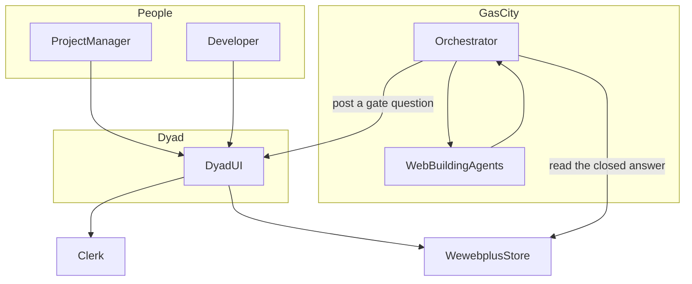
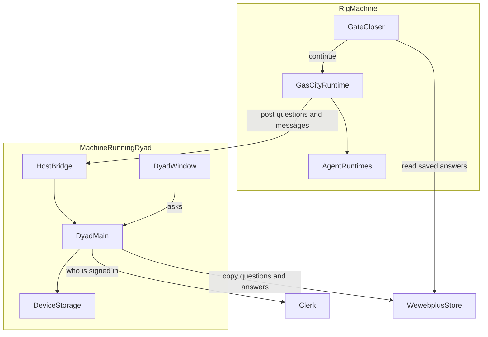
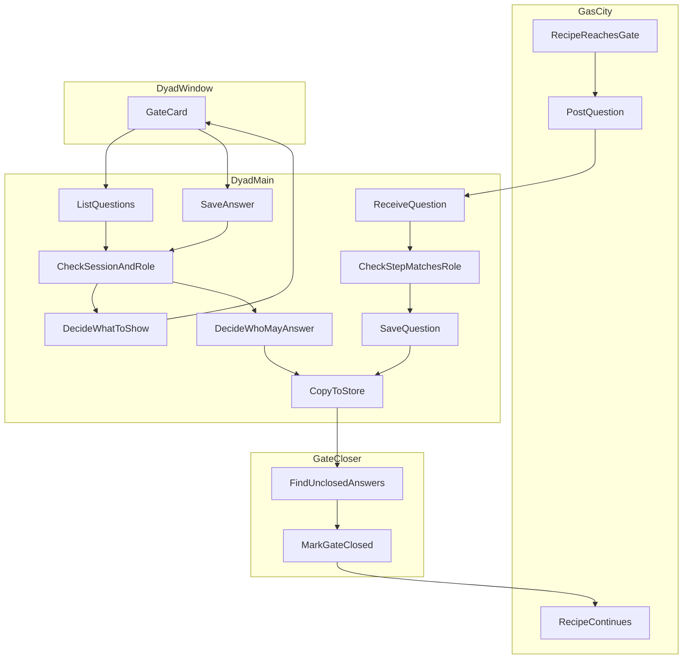
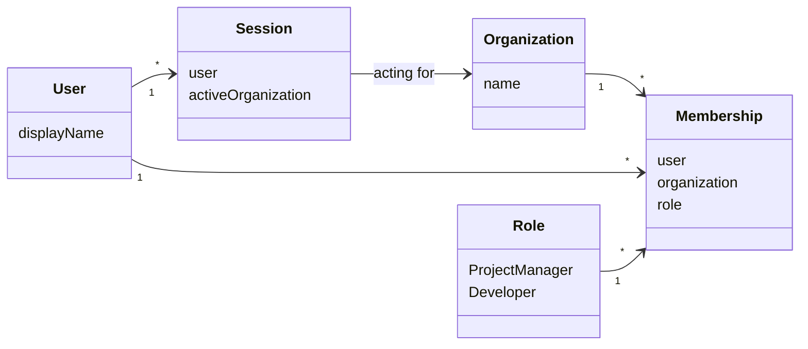
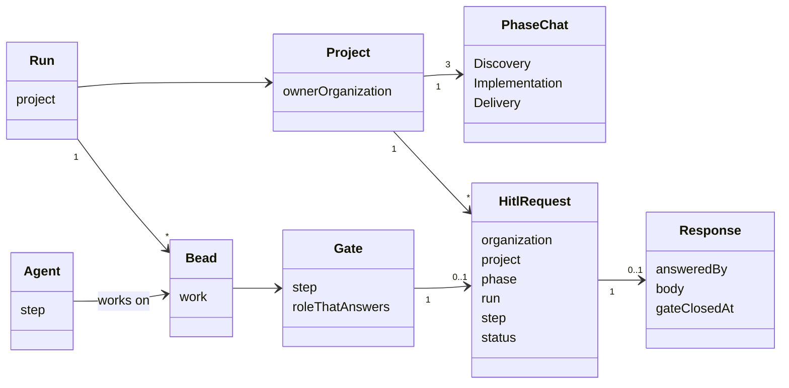
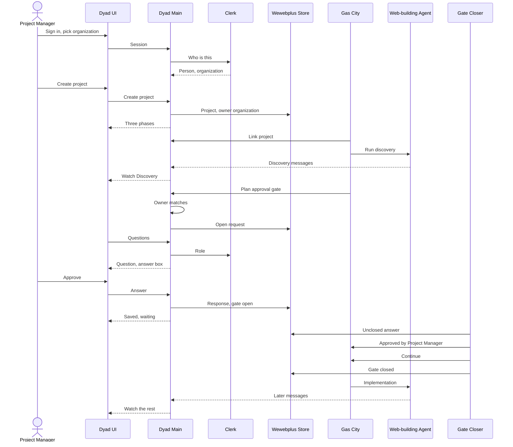

# Multi-tenant HITL architecture

Checked against `main` commit `e8b66417` on 2026-10-05.

This note lives in `docs/` in this git repository, next to `docs/hitl-architecture.md` and `docs/hitl-user-journey.md`. That commit is the currency mark. The note is late when a later commit on `main` changes a path these notes name. A GitHub wiki page has an edit time and no code commit. Neon stores `wewebplus` rows for the running app. It does not store this note, and a database row is not tied to the commit that was read.

The gate table below still matches `GATE_ROLE` in `src/control_plane/hitl.ts` and `hitl-web/lib/hitl.ts`: `plan-approve` and `review-approve-pm` are `project-manager`, and `review-approve-dev` is `developer`.

People also have a second page, `hitl-web/`. It lists questions and saves an answer in Postgres. That page does not replace the Dyad chat. Gas City still posts a question to the host bridge. Closing the gate after a saved answer is `scripts/gascity/resolve_hitl_answer.py`: `hitl.py respond`, then `hitl.py release`, then stamp `gate_resolved_at`. This repository does not start that script on a timer.

`docs/multi-tenant-hitl-architecture.pdf` is an earlier export of this essay. It was not regenerated for this check. Read this markdown file for the currency mark.

wewebplus builds a one-page website for a customer using a team of software agents. The agents work in three phases: Discovery, Implementation, and Delivery. At three points they stop and wait for a person to approve what they have done. Those stopping points are called gates.

This document explains how a person in one organization approves the gates for that organization's projects, and why nobody in another organization can see or act on them.

Two kinds of people approve gates:

- A **Project Manager** is responsible to the customer. They approve the plan at the start and the finished page at the end.
- A **Developer** is responsible for the code. They approve the technical review in the middle.

The same names are used in every figure. The figures go from the widest view to the most detailed one.

## Names used everywhere

| Name         | Meaning                                                                                                                                                    |
| ------------ | ---------------------------------------------------------------------------------------------------------------------------------------------------------- |
| Organization | A company or team that signs in together. Everything the team does belongs to its organization. A person working alone has no organization and no gates.   |
| User         | One signed-in person.                                                                                                                                      |
| Role         | What a person is allowed to approve: Project Manager or Developer.                                                                                         |
| Membership   | The record that says one person belongs to one organization with one role.                                                                                 |
| Session      | The proof that a person is signed in, and which organization they are acting for right now.                                                                |
| Project      | One website being built. It belongs to the organization that created it.                                                                                   |
| Phase        | One of the three chats in a project: Discovery, Implementation, or Delivery. The person watches the agents' work there.                                    |
| Formula      | The recipe the agents follow: the list of steps, including where they must stop and wait.                                                                  |
| Run          | One execution of the recipe for one project.                                                                                                               |
| Bead         | One unit of work inside a run. A gate is a bead that only a person can finish.                                                                             |
| Gate         | A step where the recipe waits for a person: plan approval, developer review, or project manager review.                                                    |
| HITL request | The question shown to the person when a gate opens. It records the organization, the project, the phase, the run, the step, and the role that must answer. |
| Response     | The one answer to that request. The recipe stays paused until the answer has been carried back to the agents.                                              |
| Agent        | A software worker that follows the recipe. Agents post what they produce into the phase chats so the person can watch.                                     |

The agents' work, the phase the person watches, and the gates line up like this:

| Agent work     | Phase the person watches | Gate                   | Who answers     |
| -------------- | ------------------------ | ---------------------- | --------------- |
| Discovery      | Discovery                | Plan approval          | Project Manager |
| Implementation | Implementation           | none                   |                 |
| Verification   | Implementation           | Developer review       | Developer       |
| Delivery       | Delivery                 | Project Manager review | Project Manager |

---

## 1. The big picture

### What this shows

Who is outside the system and the two products that cooperate. A person works in the Dyad chat. The separate `hitl-web/` page can show the same question and save an answer, and it does not replace that chat. Agents never talk to a person. Dyad and Gas City meet at a gate: Gas City opens the gate by sending a question to Dyad, and later learns the answer from the shared store.

### What each box does

- **Project Manager and Developer.** Sign in, open the project, read the phase chat, and answer the gate that names their role.
- **Dyad UI.** The place a person works on the project. The project list, the account, the three phase chats, and the gate card inside a chat are this screen. `hitl-web/` is a second page for the same question. It is not this screen.
- **Orchestrator.** The part of Gas City that runs the recipe, starts agents, opens a gate, and continues once the gate is closed.
- **Web-building agents.** Produce the discovery summary, the page, the verification report, and the delivery summary, and post them into the phase chats.
- **Clerk.** The sign-in service. It says who the person is and which organization they are acting for.
- **Wewebplus store.** The shared record of which organization owns each project, who has which role, every gate question, and every answer. Gas City reads this store; it never looks at a person's screen.

### How one organization's work stays separate

Every project is stamped with the organization that created it. Every gate question is stamped with the same organization. A person signed in for a different organization never sees the question. Inside the organization, the role on the question decides who sees the full text and who may answer.

---

## 2. The running parts

### What this shows

The programs that actually run and the line each one uses to talk to another. The Dyad UI box from the first figure is drawn here as its two halves: the window the person sees and the part that works behind it. Gas City runs on a separate machine called the rig. The only thing both machines share is the store.

### What each box does

- **Dyad window.** What the person sees and clicks. It cannot reach files, the store, or the rig on its own. It asks Dyad main for everything.
- **Dyad main.** Does the work behind the window: checks who is signed in, keeps the local copy of projects and questions, and runs the host bridge.
- **Device storage.** The local copy that the open window reads from, so the screen is fast and works while the store is unreachable.
- **Host bridge.** A small door that only Gas City on the same machine may use. Through it Gas City posts gate questions and chat messages. It is not reachable from the internet.
- **Gas City runtime.** Runs the recipe and the beads, and knows which gate is currently waiting.
- **Agent runtimes.** The agents while they are working. They write their output to the phase chats through the host bridge.
- **Gate closer.** A small program on the rig that looks for answers that have been saved but not yet carried back to the recipe, carries them back, and marks the gate closed.
- **Wewebplus store.** The shared database described in the first figure.
- **Clerk.** The sign-in service.

### How one organization's work stays separate

Separation is enforced in Dyad main, never in the window:

- A new project is stamped with the organization of the person creating it, before anything else happens.
- The host bridge accepts a gate question only for a project owned by an organization. A private project is refused.
- When the window asks for questions or sends an answer, Dyad main first turns the session into a person, an organization, and a role, and then requires the organization to be the project's owner. A mismatch looks like "no such project", not like a list of someone else's work.
- The gate closer does not decide which organization it serves. It carries back whatever answers are waiting, and the rig checks the answering person's name against its own member list before continuing.

---

## 3. One gate, step by step

### What this shows

The path of one gate: from the moment the recipe stops, to the person, and back to the recipe. Read it in four legs. Create: the recipe posts a question and Dyad saves it. Show: the window asks what to display and Dyad decides. Answer: the person answers and Dyad saves it. Resume: the closer carries the answer back and the recipe continues.

### What each box does

- **Recipe reaches gate.** The recipe arrives at a step marked as a gate and stops.
- **Post question.** Gas City sends the question to the host bridge: which project, which phase, which run and step, which role must answer, and the question text.
- **Receive question.** Dyad main finds the project and refuses it if the owner is not an organization. The organization on the question is copied from the project, never taken from the sender.
- **Check step matches role.** Plan approval and project manager review must be addressed to a Project Manager. Developer review must be addressed to a Developer. Anything else is refused.
- **Save question.** Writes the question to device storage on the Dyad machine. Posting the same question twice returns the first copy instead of creating a second one.
- **Copy to store.** Copies the question, and later the answer, into the shared store so the rig can see them.
- **Gate card.** The card inside a phase chat that says "Waiting on Project Manager" or "Waiting on Developer". The answer box appears only when this person may answer.
- **List questions and save answer.** The two requests the window can make about gates.
- **Check session and role.** Turns the signed-in session into a person and an organization, then finds this person's role in that organization from their membership. A session with no organization cannot use these requests.
- **Decide what to show.** Same organization and matching role: show the question and the answer box. Same organization, other role: show only the waiting status. Other organization: show nothing.
- **Decide who may answer.** Other organization: no such question. Wrong role: not allowed. Already answered: nothing changes. Otherwise the answer is saved and the question is marked answered. Dyad does not restart the recipe itself.
- **Find unclosed answers and mark gate closed.** The closer reads answers that are saved but not yet carried back, tells the recipe who approved and that it may continue, and only then marks the gate closed.

### How one organization's work stays separate

Four checks happen in this order:

1. The project belongs to an organization, and that organization is copied onto the question.
2. The person's session organization equals the project's organization. If not, the question does not exist for them.
3. The person's role equals the role on the question. If not, they see the waiting status but not the question text, and they cannot answer.
4. On the rig, the answering person's name must be in the rig's own member list. If it is not, the answer stays saved in Dyad but the recipe does not continue.

---

## 4. The records

The records come in two groups, who people are and what work is being done:

### Who people are

### What is being done

### What this shows

The records that are kept and how they relate. A line means "refers to", not "sends a message to". The numbers on a line say how many: one organization has many memberships; one project has exactly three phase chats; one gate has at most one request, and one request has at most one response.

The two groups connect at three points. A request names the organization and the role from the first group. A response names the user who gave it.

### What each box does

- **Organization, User, Session.** Kept by the sign-in service. A session always has a user; it has an organization only when the person is acting for a team.
- **Role and Membership.** Kept by wewebplus. One membership per person per organization. Being an administrator of the organization in the sign-in service is not a role here; it only lets someone invite others.
- **Project.** One website. Its owner is the organization of the person who created it.
- **Phase chat.** The three chats of a project: Discovery, Implementation, and Delivery.
- **Run, Bead, Agent.** Kept by Gas City. Dyad only remembers which run and which bead a request belongs to, so the answer can be carried back to the right place.
- **Gate.** A step in the recipe plus the role that must answer it.
- **HITL request.** The question. Its status is open or answered.
- **Response.** The answer. Its "gate closed at" time stays empty until the closer has carried the answer back. An answer with an empty "gate closed at" means "a person has approved, but the agents have not been told yet".

### How one organization's work stays separate

The project's owner and the request's organization are always the same organization. The session's active organization must match both before a card is shown. The membership's role must match the gate's role before the text or the answer box is shown. A request is addressed to a role in an organization, not to a named person: any member with that role may answer, and the first answer wins.

---

## 5. One project from start to finish

### What this shows

One project in time order, from the first sign-in through the plan approval gate and back to the agents. Read it top to bottom. The developer review and the final project manager review follow exactly the same shape, with the Developer or the Project Manager approving; they are not drawn again.

### What each box does

- **The Project Manager** only uses Dyad.
- **Dyad UI** shows the phases and the gate card and sends the person's actions to Dyad main.
- **Dyad main** stamps the owner, saves the request, checks the role, and saves the response.
- **Clerk** is asked who the person is at sign-in, and asked again for their role when a gate is shown. Dyad main never trusts a role sent by the window.
- **Wewebplus store** holds the project, the request, and the response for both machines to see.
- **Gas City** links the project, runs the agents, posts the gate, and continues only when the closer tells it to.
- **The agent** writes the work the person reads in the phase chat.
- **The gate closer** is the only part that turns a saved answer into a continuing recipe.

### How one organization's work stays separate

Creating the project uses the person's active organization, so the project cannot land in another team's account. The gate question inherits that owner. The list of questions drops the card unless the person's organization matches. The question text is hidden unless the role matches. Finally, the rig refuses to continue if the answering person's name is not in its member list, even though Dyad already saved the answer.

A Developer signed in for the same organization sees "Waiting on Project Manager" during the plan gate and has no answer box. A person in another organization does not see the project at all.
