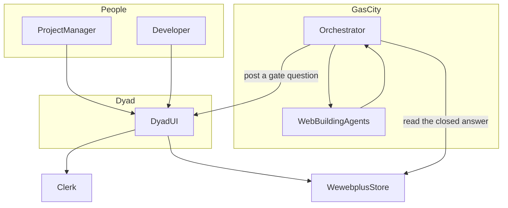
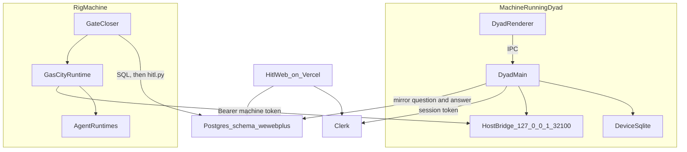
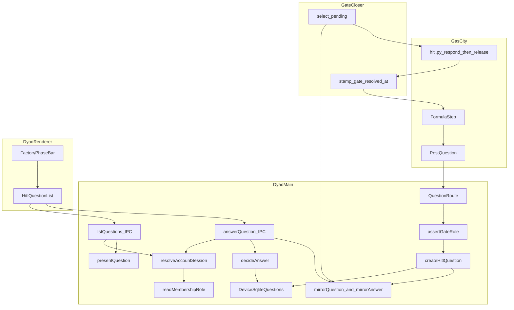
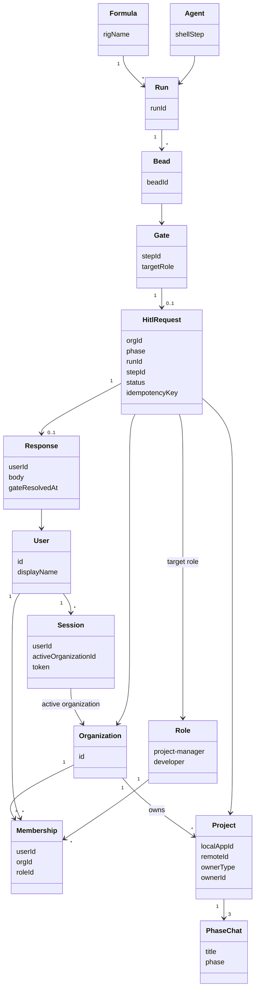
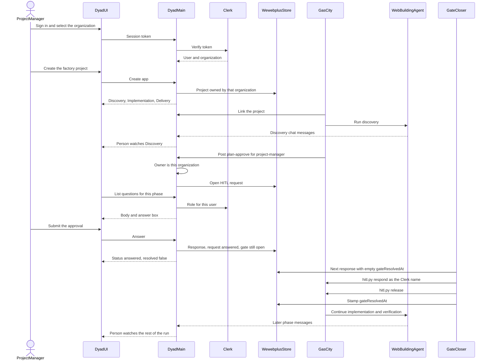

# Multi-tenant HITL architecture

One web-building run, seen at five depths. The same names are used in every diagram.

Dyad is the place a person works: they start a project, watch Discovery, Implementation, and Delivery, and answer a gate that names their role. Gas City is the orchestrator: it runs the formula, pauses on a human gate, and continues only after that gate is closed. Web-building agents do the discovery, implementation, verification, and delivery work inside that formula. The multi-tenant layer decides which organization owns the project and which role may see and answer each gate.

This is the target shape. The last section of each diagram says what already exists and what is still missing. A short ledger at the end collects those gaps.

## Names used everywhere

| Name | Meaning |
| --- | --- |
| Organization | A Clerk organization. Private use is a signed-in user with no active organization. HITL gates exist only for an organization-owned project. |
| User | A Clerk user. |
| Role | `project-manager` or `developer`. Clerk `org:admin` is only the flag that allows invitations. It is not a gate role. |
| Membership | One user, one organization, one role. Stored in `wewebplus.memberships`. |
| Session | The Clerk session token for the signed-in user and the active organization. |
| Project | A Dyad app. The organization that created it is `owner_type = org` and `owner_id = <clerk org id>`. |
| Phase | A Dyad chat titled Discovery, Implementation, or Delivery. |
| Formula | The Gas City workflow for one rig. The rig used here is `multi tenant HITL`. |
| Run | One execution of that formula. |
| Bead | A Gas City work item. A gate bead is the pause a human must resolve. |
| Gate | A formula step that waits for a person: `plan-approve`, `review-approve-dev`, or `review-approve-pm`. |
| HITL request | The question row created for that gate. It carries the organization, project, phase, run, step, target role, and bead id. |
| Response | The one answer for that request. The workflow stays paused until the response is closed on the rig. |
| Agent | A web-building agent run by Gas City. Dyad also has a local agent used when a person types in a chat. The factory run in this document is the Gas City agent, not the local one. |

Agent work lines up with Dyad phases and gates like this. Gas City chooses the phase when it posts a question. The Dyad code checks that the step matches the role. It does not check that the step matches the phase.

| Agent work | Dyad phase the person watches | Gate | Role |
| --- | --- | --- | --- |
| Discovery | Discovery | `plan-approve` | project-manager |
| Implementation | Implementation | none | — |
| Verification | Implementation, then the review shell | `review-approve-dev` | developer |
| Delivery | Delivery | `review-approve-pm` | project-manager |

## Where the facts come from

Three trees are easy to mix up. Each diagram says which one it is describing.

- **Main.** `Awannaphasch2016/dyad` at `a62ced89`. Contains `hitl-web/`, the separate approval page. It does not contain `src/control_plane/hitl.ts`.
- **Implementation branch.** `cursor/ipad-gate-close-bbea`. Contains the Electron gate UI, the host-bridge question routes, the `wewebplus` tables, and `scripts/gascity/resolve_hitl_answer.py`. Not merged.
- **Rig.** Gas City, `bd`, `hitl.py`, and `org.toml`. They are not in this repository. The worker calls `hitl.py respond` and then `hitl.py release`.

An older note on `cursor/hitl-architecture-bbea` (`docs/hitl-architecture.md`) describes an earlier cut: the Vercel page as the human UI, and Electron calling `bd` itself. That is not the target below. Electron saves the answer and does not close the gate. The rig closes the gate.

---

## 1. Context

What this shows: who is outside the system, and the two products that cooperate. People never talk to Gas City. Agents never talk to the person. Dyad and Gas City meet at a gate.

### Responsibilities

- **Project Manager and Developer.** Sign in, open the project, read the phase chat, and answer only the gate that names their role.
- **Dyad UI.** The only human interface. Sidebar, account, Discovery, Implementation, Delivery, and the in-chat gate card are this UI.
- **Orchestrator.** Runs the formula, starts agents, opens a gate, and resumes the run after the gate is closed.
- **Web-building agents.** Produce the discovery summary, the page, the verification, and the delivery summary. They post that work into the phase chats.
- **Clerk.** Says who the user is and which organization is active.
- **Wewebplus store.** The shared record of the project owner, the membership role, the question, and the answer. Gas City does not read the Dyad window. It reads this store.

### Tenant boundary

The boundary is the organization on the project. A question is created with that organization's id. A person whose session organization is different does not see the question. Inside the organization, the target role decides who sees the body and who may answer. Agents do not cross this boundary; they run inside the rig's project directory.

### How information moves

The person acts only in Dyad. Dyad asks Clerk who they are. Gas City pushes a question in when a gate opens, and later reads the answer from the store. Agent output comes back into Dyad as chat messages so the person can watch the run.

### Already there, and not yet

| Piece | State |
| --- | --- |
| Dyad Electron UI with three phase chats | Exists on the implementation branch, and the phase chats exist in the desktop app generally. |
| Clerk sign-in and active organization | Exists. |
| Gas City formula, agents, and beads | On the rig. Not in this repository. |
| Shared question and answer store | Schema and mirror exist on the implementation branch. |
| One Dyad UI as the only human surface | Not met. `hitl-web/` on main is a second page that lists questions and is not the Dyad UI. |
| Agents posting into the phase chats while a person watches | Host-bridge message route exists. A live rig run that does this for a new gate is not wired up in this repository. |

---

## 2. Container

What this shows: the processes that actually run, and the channel each one uses. The desktop window and the rig stay on machines they already occupy. Postgres is the only shared state.

### Responsibilities

- **Dyad renderer.** React UI. TanStack Router, the phase bar, the account switcher, and `HitlQuestionList`. It cannot touch files, git, or Postgres. It calls the main process.
- **Dyad main.** IPC handlers, the device sqlite database, the Clerk session check, and the host bridge.
- **Device sqlite.** The cache the open window reads. `hitl_questions.app_id` is the local integer app id.
- **Host bridge.** Loopback HTTP on port 32100. Gas City authenticates with `GAS_CITY_HOST_BRIDGE_TOKEN`. Browsers are rejected when they send an `Origin` header. The bridge binds to loopback and is not a public API.
- **Gas City runtime.** Formula, beads, and `hitl.py`. Working directory is the rig project. Default rig name used by the closer is `multi tenant HITL`.
- **Agent runtimes.** The shell steps Gas City runs (`plan`, `review`, `finish` are the shell steps the closer releases). They write chat messages through the host bridge when the app is linked.
- **Gate closer.** `scripts/gascity/resolve_hitl_answer.py`. Selects answers whose `gate_resolved_at` is empty, runs `hitl.py respond` then `hitl.py release`, and stamps the row only after both exit 0.
- **Postgres `wewebplus`.** Organizations' projects, memberships, questions, and answers. `questions.app_id` is the remote text id stored when the row is mirrored. It is not a foreign key.
- **Clerk.** Identity provider. Not part of either codebase.
- **HitlWeb on Vercel.** A Next.js page in `hitl-web/` that polls `GET /api/questions` every 4 seconds. It is deployed. It is not part of the target. It does not render Dyad.

### Tenant boundary

Enforced in Dyad main, not in the renderer:

- A new app is stamped with the active account before template and git work.
- The host bridge accepts a new question only when the app's `owner_type` is `org`. A private app returns 409.
- Listing or answering through IPC loads the session from the Clerk token, requires an organization session, and requires `session.account.id` to equal the app's `owner_id`. A mismatch is "not found", not a list of someone else's apps.
- The closer does not choose a tenant. It closes whatever answer is pending, and `hitl.py` checks the named person against the rig's `org.toml`.

### How information moves

Renderer to main is IPC. Main to the rig is not a call. Main writes Postgres. The rig's closer reads Postgres. The rig to main is the host bridge: create a question, post a phase message, link a project, read factory state. Clerk is consulted when a session token must be turned into a user, an organization, and a role.

### Already there, and not yet

| Container | State |
| --- | --- |
| Renderer, main, sqlite, IPC | Exist. |
| Host bridge question routes | Implementation branch only. Main's bridge has no question routes. |
| Postgres tables, including `answers.gate_resolved_at` | Implementation branch. A live database was altered to add the column. The migration file is on that branch. |
| Gate closer script | Written and unit-tested on the implementation branch. No process is running it. `HITL_PY` is required and is not set here. |
| Gas City and agent runtimes | On the rig, outside this repository. |
| HitlWeb | On main and on the Vercel project. Extra. The target does not send the person there. |
| Public URL that serves this same renderer | Not built. |

---

## 3. Component

What this shows: the path of one gate, from the formula pause to the human and back to the blocked step. This is the inside of Dyad main, the renderer card, the closer, and the rig command.

### Responsibilities

- **Formula step.** Reaches a gate and stops.
- **Post question.** `scripts/gascity/post_hitl_question.py` posts JSON to `/v1/apps/<local id>/phases/<phase>/questions` with the machine token. Body includes `runId`, `stepId`, `targetRoleId`, `body`, `idempotencyKey`, and `gateBeadId`.
- **Question route.** Resolves the app, refuses a non-organization owner, and calls `createHitlQuestion` with `orgId` set from `owner_id`.
- **assertGateRole.** `plan-approve` and `review-approve-pm` must target `project-manager`. `review-approve-dev` must target `developer`. Anything else is rejected.
- **createHitlQuestion.** Inserts the sqlite row. The same organization and idempotency key returns the existing row.
- **mirror.** Copies the question, and later the answer, into Postgres when `WEWEBPLUS_DATABASE_URL` is set. The answer mirror does not set `gate_resolved_at`.
- **resolveAccountSession.** Verifies the Clerk token. The organization id comes from the token's `o.id`. No organization means a private account, which cannot open these routes.
- **readMembershipRole.** Role is the `wewebplus.memberships` row when one exists, otherwise Clerk public metadata `role`. Unknown names, including older `admin` / `reviewer` / `dev` values, are not a gate role.
- **presentQuestion.** Same organization: return a card. Matching role and open status: include `body` and `canAnswer`. Other role in the same organization: status only, no body. Other organization: nothing.
- **decideAnswer.** Other organization is not found. Wrong role is forbidden. Already answered is a no-op. Allowed writes the answer and sets the question status to `answered`. Return value `resolved` is false. Dyad does not call `bd`.
- **FactoryPhaseBar and HitlQuestionList.** The card in the phase chat. Copy is "Waiting on {Project Manager or Developer} for {step}". Submit is shown only when `canAnswer` is true.
- **select pending / stamp.** The closer's SQL joins `wewebplus.answers` to `wewebplus.questions` and skips locked rows. Stamp runs only after `respond` and `release` both return 0.
- **hitl.py.** `respond --as <answered_by_name> --step <step> --run <run>` then `release --run <run>`. `--as` is the Clerk display name (first and last name, otherwise the username). The rig's `org.toml` must list that name with the route role. Direct `bd` without `release` leaves the shell paused.

### Tenant boundary

Four checks, in order:

1. The project owner is the organization. The bridge copies that id onto the question. It does not trust an organization id in the JSON body.
2. The session organization equals the project owner. IPC and the bridge's human routes both do this. Failure is 404.
3. The membership role equals `target_role_id`. Failure hides the body or returns 403.
4. On the rig, `answered_by_name` matches `org.toml`. That check is outside Dyad. A saved answer still does not resume the formula when the name is unknown there.

The bead id is stored and is not sent to the renderer card. The card's view from `presentQuestion` includes it on the implementation branch; the Electron list component does not render it. The web page never receives it.

### How information moves

Create path: formula, host bridge, sqlite, Postgres. Read path: renderer, IPC, session, `presentQuestion`, card. Answer path: card, IPC, `decideAnswer`, sqlite, Postgres. Resume path: closer, `hitl.py`, formula. The renderer never opens Postgres and never calls `hitl.py`.

### Already there, and not yet

| Component | State |
| --- | --- |
| `assertGateRole`, `presentQuestion`, `decideAnswer` | Implementation branch, and duplicated in `hitl-web/lib/hitl.ts` on main. |
| Question route, sqlite write, IPC list and answer | Implementation branch. |
| Electron card | Implementation branch. |
| Mirror into Postgres | Implementation branch. Failures are swallowed so the local write still stands. |
| Closer script | Implementation branch. Not running. |
| `hitl.py` and `org.toml` | On the rig. `org.toml` in git still lists alice, bob, carol, and dave, not the Clerk display names. |
| Membership rows | Seeded for one organization and two users on the implementation branch. There is no UI to assign a role per project. |
| Phase-to-step check | Not implemented. A `plan-approve` question can be posted at any of the three phases. |
| Second page `hitl-web` | Exists on main. It writes Postgres directly and does not go through Dyad main. An answer there is invisible to the Electron card until something else reads Postgres. The target path does not use it. |

---

## 4. Class

What this shows: the domain records and which system owns each one. Lines are relationships, not function calls. Types that exist only on the rig are marked in the notes under the diagram.

### Responsibilities

- **Organization, User, Session.** Clerk owns identity. Dyad stores the session token in the main process, keyed by the Electron window. A private session has a user and no organization.
- **Role and Membership.** Dyad's control-plane tables. One membership per user per organization. The role is not stored on the Clerk organization admin flag.
- **Project.** Local integer id in sqlite. Remote text id in `wewebplus.apps`. Owner is the account that created the app. HITL uses the remote owner only when the owner is an organization.
- **PhaseChat.** Three chats per factory project. Titles are the phase names. The preview belongs to Implementation.
- **Formula, Run, Bead, Agent.** Gas City. Dyad stores `runId` and `beadId` on the request so the closer can address the rig. Dyad does not store the formula graph.
- **Gate.** The step id plus the role from `GATE_ROLE`. Not a separate table.
- **HitlRequest.** `wewebplus.questions` and the sqlite `hitl_questions` row. Status is `open` or `answered`. Uniqueness is organization plus idempotency key.
- **Response.** `wewebplus.answers` and the sqlite answer row. One answer per question. `gateResolvedAt` stays empty until the closer finishes. That empty value is what "the human has answered but the workflow is still blocked" means.

### Tenant boundary

`Project.ownerId` and `HitlRequest.orgId` must be the same organization. `Session.activeOrganizationId` must match both before a card is shown. `Membership.roleId` must match `Gate.targetRole` before a body or a response is allowed. `Response.userId` is the person who answered. `Response` does not carry an organization id; the join to the request carries it.

There is no Assignment type. The request is assigned to a role in an organization, not to a named user. Any member with that role may answer. The first successful answer wins.

### How information moves

Creating a project writes the owner. Opening a gate writes the request with that owner. Answering writes the response and the request status. Closing the gate writes `gateResolvedAt` and, on the rig, resolves the bead. None of these records move the other way: the rig does not update Clerk, and Clerk does not store beads.

### Already there, and not yet

| Type | State |
| --- | --- |
| Organization, User, Session | Clerk, plus the session token map in Dyad main. |
| Role, Membership | Tables and a two-user seed. Not a general membership editor. |
| Project owner | Implementation branch. Private apps exist and are refused at the question route. |
| Phase chats | Exist in the Electron app. |
| HitlRequest and Response, including `gateResolvedAt` | Implementation branch schema and sqlite tables. |
| Formula, Run, Bead, Agent, Gate as rig objects | Not modeled in Dyad beyond `runId`, `stepId`, and `beadId` columns. |
| Per-project role, or an assignment to a specific user | Not built. Role is per organization. |
| `questions.app_id` foreign key to `apps.id` | Not built. The column is text and is not constrained. |

---

## 5. Sequence

What this shows: one project, from the first click through the plan gate and back. The developer gate and the final project-manager gate repeat the same pause. They are not drawn again.

After that pause, the same shape runs twice more. Verification stops on `review-approve-dev` for a Developer. Delivery stops on `review-approve-pm` for the Project Manager. Each one is a new request. The closer handles them one at a time.

### Responsibilities

- **The person** only uses Dyad.
- **Dyad main** stamps the owner, stores the request, checks the role, and stores the response.
- **Gas City** links the project, runs agents, posts the gate, and continues only after `release`.
- **The agent** writes the work the person reads in the phase chat.
- **The closer** is the only component that turns a stored response into a resumed formula.
- **Clerk** is asked again when the role is needed. The list call does not trust a role sent by the renderer.

### Tenant boundary

The create-app call uses the active organization, so the project cannot land in a different account. The post from Gas City inherits that owner. The list call drops the card unless the session organization matches. The body is omitted unless the role matches. `respond --as` fails on the rig when the display name is not a member of the rig's org file, even if Dyad already saved the response.

A Developer signed into the same organization, during the plan gate, sees "Waiting on Project Manager" and no answer box. A person in another organization does not see the project.

### How information moves

Down the diagram: intent, then session, then project, then agent output, then the gate, then the answer, then the closer, then more agent output. The only hop from the rig into the window is the host bridge. The only hop from the answer back to the rig is the closer reading Postgres.

### Already there, and not yet

| Step | State |
| --- | --- |
| Sign in, select organization, create an organization-owned project, show three phases | Implementation branch. |
| Gas City link and post chat messages | Host-bridge routes exist. A running formula that calls them for this rig is outside the repository. |
| Post the question, enforce owner and role, show the card, save the answer, leave `resolved` false | Implementation branch. |
| Closer runs `respond` then `release` and stamps the row | Script exists. Nothing is executing it. The three stored answers from the earlier run are still unstamped, and the rig names do not match those Clerk display names, so running the closer against them would fail `respond`. |
| Agent continues and the person watches Delivery | Depends on the closer and the rig. Not demonstrated end to end. |
| iPad opens this same Dyad UI | Not built. The Vercel page can show already-answered questions for the signed-in role. It is not this sequence. |

---

## Ledger

What the target needs that is not done:

1. Treat the Dyad UI as the only human surface. Stop using `hitl-web` for the walkthrough. The page can remain on main until it is removed. It is not on the path above.
2. Merge the implementation branch, or run the demo from it. Main does not have the question routes, the card, or the closer.
3. Run the closer on the rig, with `HITL_PY` pointing at `hitl.py` and `WEWEBPLUS_DATABASE_URL` pointing at the same database Dyad mirrors into. Do not start it until `org.toml` lists the Clerk display names and their roles.
4. Put those Clerk display names into the rig's `org.toml`. The worker passes `answered_by_name` through unchanged.
5. Have the formula post a new open question when the next run reaches `plan-approve`. Existing rows are already answered.
6. Keep the host bridge on loopback. Gas City on the same machine is the caller. Do not expose port 32100.

What is already enough to build on:

- Organization-owned projects, session checks, and role checks in Dyad main.
- The three gate steps and the two roles.
- Sqlite first, Postgres second, one answer per question, idempotent create.
- Electron saves the answer and does not close the gate.
- The closer's contract: `respond`, then `release`, then stamp.
