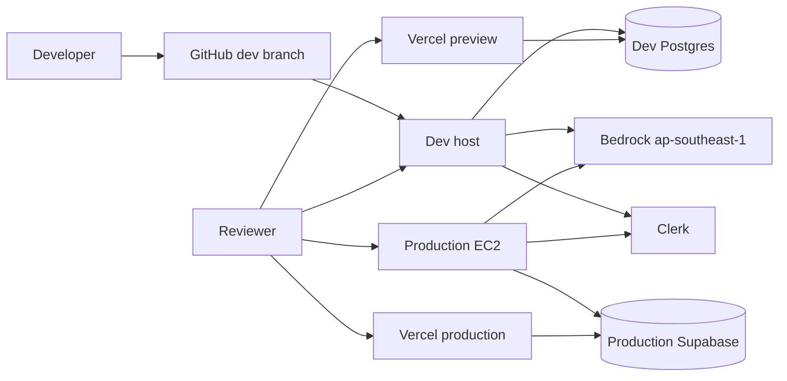
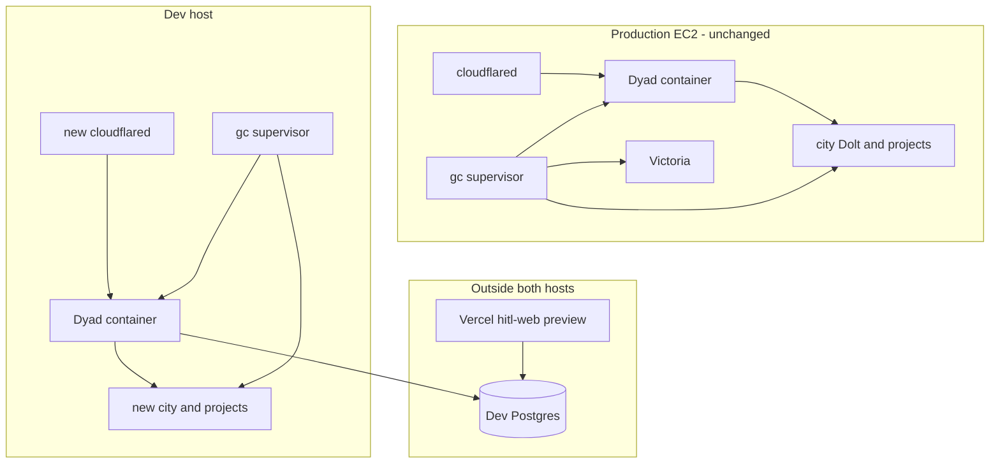
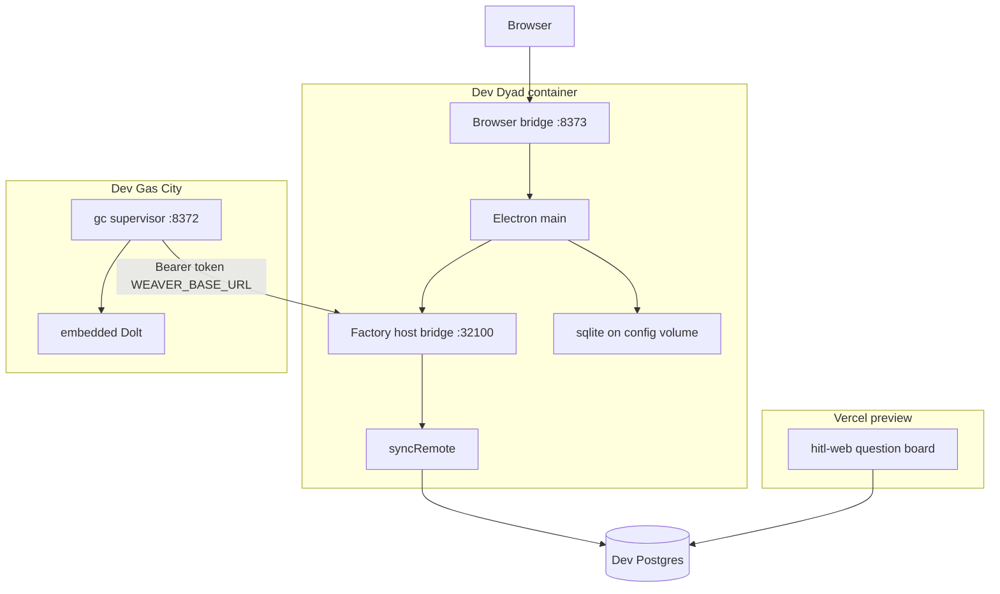
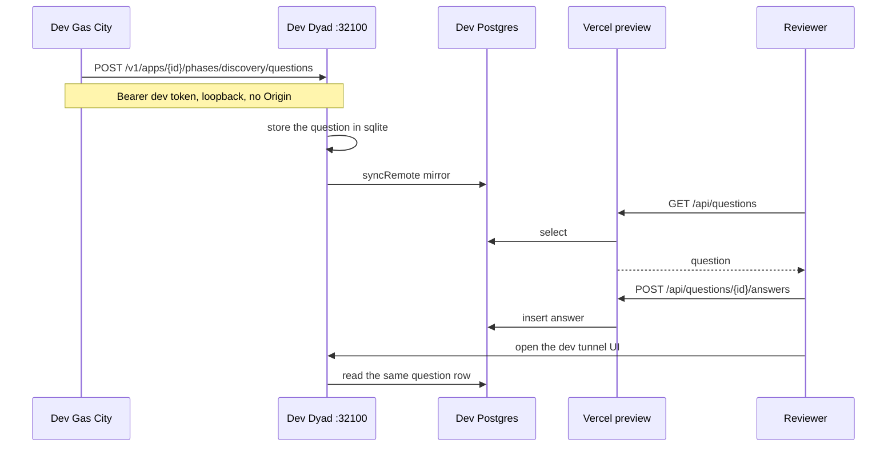
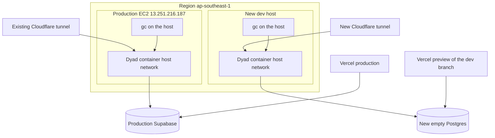

# Development environment outside production EC2

> Written 2026-10-03 from a read-only look at the live host and from PR #17 (`plans/preview-environments.md`, commit `6976bf8b`). No production process, file, image, or volume was changed.
>
> Revised the same day. The first proof is two containers on one Docker network, on a machine that is already not the production EC2. A second EC2 is not that proof.

## Revision: smallest proof

PR #17 does not create a second EC2. Phase 3 adds compose project `preview-14` on the production host. That keeps the disk limit: the host has 5.1G free, and the last image unpack failed there.

A second EC2 would move the disk use off production. It is more than the first proof needs. Docker bridge networking on any other machine that already has Docker is enough. A laptop is enough. Production is not logged into for the proof.

The two services are not independent yet, for one code reason. `startFactoryHostBridgeFromEnv` listens on `127.0.0.1` only. A second container has its own loopback, so it cannot open that port. The minimum code change is an env var for the bind address, default `127.0.0.1`, set to `0.0.0.0` inside the dev container. The port stays unpublished on the host. Production's default stays loopback, so this change does not by itself move production.

```text
docker network dev
  dyad          listens 0.0.0.0:32100 inside the container
  caller        GET/POST http://dyad:32100 with the dev bearer token
```

No host network. No published port 32100. No Vercel. No second database. No new EC2.

The running production process `/opt/gascity/gc supervisor run` does not call Dyad. Its environment has no `WEAVER_BASE_URL`. The `gc` binary does not contain that name or `/v1/apps/`. The name exists only in `/opt/gascity/bridge.env`, and nothing on the host reads that file. Port 32100 had no established clients at check time. So "point production Gas City at an external Dyad" is not a one-line switch until some client actually reads the URL.

The first caller is a small container that speaks the HTTP API Dyad already serves. Packaging `gc` into a container does not create that call. Wiring `gc` to the API is later work, still off the production host.

Vercel `hitl-web` is the question board. It is not the Dyad UI. The Dyad UI is the browser bridge in the Dyad container. Leave Vercel out of the first proof.

Do not edit production `bridge.env`, `weaver.env`, or `WEAVER_BASE_URL`. Do not aim production Gas City at the test Dyad. That mixes live factory state with a test backend, and today it would not move traffic anyway.

After the two containers pass, the later migration is:

1. Teach the real Gas City client to use `WEAVER_BASE_URL`, still in a dev container.
2. Run that client against the external Dyad until a factory question round-trips.
3. In a planned window, change the production client URL from `http://127.0.0.1:32100` to the external Dyad, with the old value saved for an immediate revert.
4. Stop the production Dyad container only after that client is confirmed. Gas City stays on the production EC2. This cutover does not rebuild the production image.

### What changes in the PR #17 plan

- Replace phase 3 (compose project on this EC2) and phase 5 (Kubernetes on this EC2) with the two-container proof above.
- Leave the registry, the Neon parent, and the preview controller until that proof is green.
- The call direction is the Gas City client to Dyad. There is no `GAS_CITY_HOST_BRIDGE_URL`.
- Dev does not mount `/opt/gascity/projects` and does not use the production city.
- Vercel stays a later HITL check, not the Dyad frontend.

The sections below are the earlier full-host proposal. They describe a durable dev host, which is optional after the proof, not the way to start.

## Earlier proposal: a full dev host

A durable second machine was the earlier recommendation. The revision above replaces it as the first step. Leave the current EC2 as production either way.

PR #17 does not deploy anything. It is one plan file. Its phase 3 still puts `preview-14` on this same EC2, on port 8383, and its phase 5 assumes a Kubernetes cluster on that host. Neither exists. The live host has 5.1G free of 29G, one host-networked Dyad container, and a Gas City process that has been running on the host since 2026-09-24. Building or adding a second stack there is how the last rollout filled the disk.

The development environment is a separate Linux host. It runs its own Dyad container and its own Gas City city. Vercel preview and a separate Postgres database sit outside both machines. Production is promoted later, on purpose, by the existing rollout, after the dev path has been exercised.

## What exists in production today

Checked on `13.251.216.187` (`ip-172-31-14-171`) without changing it.

| Piece                  | Where it actually runs                                                                                            | Bound address                                                                                |
| ---------------------- | ----------------------------------------------------------------------------------------------------------------- | -------------------------------------------------------------------------------------------- |
| Dyad / Wewebplus       | Docker container `weaver-plus-weaver-plus-1`, image `weaver-plus:gascity` (`8a85cc4a5d1d`), host network, healthy | `127.0.0.1:8373` browser bridge, `127.0.0.1:32100` factory host bridge, `0.0.0.0:6080` noVNC |
| Gas City               | Host process `/opt/gascity/gc supervisor run`, not a container                                                    | `127.0.0.1:8372`                                                                             |
| Gas City state         | `/opt/gascity/city` (embedded Dolt under `.beads/dolt` and `.beads/embeddeddolt`)                                 | local disk                                                                                   |
| App project files      | `/opt/gascity/projects`, bind-mounted into the Dyad container                                                     | shared directory                                                                             |
| Public UI              | `cloudflared` quick tunnel to `127.0.0.1:8373`                                                                    | Cloudflare TLS, loopback origin                                                              |
| Static factory page    | host `nginx`                                                                                                      | `0.0.0.0:8080` → `/opt/gascity/site`, and `:80` default site                                 |
| Metrics                | `factory-victoria-metrics`, `factory-victoria-logs`                                                               | `127.0.0.1:8428`, `127.0.0.1:9428`                                                           |
| Build helper           | `dagger-engine-v0.21.10`                                                                                          | Docker                                                                                       |
| Control-plane database | Supabase Postgres (`*.supabase.com:5432`, database `postgres`) via `WEWEBPLUS_DATABASE_URL`                       | SaaS                                                                                         |
| Checkout               | `/opt/gascity/weaver-plus` at `cursor/browser-dyad-ui-bbea` (`ad0138a5`)                                          | git                                                                                          |

Not running, even though files mention them:

- Kubernetes. `kubectl`, `k3s`, `kubeadm`, `microk8s`, and `helm` are absent. `k3s` and `kubelet` are inactive. The only Kubernetes hits under `/opt/gascity/gascity-source` are research notes.
- The compose project in `/opt/gascity/docker-compose.yml` (`gastownhall/gascity`, telegram bots, miniapp on port 7375). Those containers are not up. Production Gas City is the host `gc` binary.
- A listener on `127.0.0.1:8081`. `factory.env` names `BRIDGE_URL=http://127.0.0.1:8081` and `bridge.env` names `BRIDGE_PORT=8081`, but nothing is listening. The live Gas City → Dyad link is `WEAVER_BASE_URL=http://127.0.0.1:32100`.
- Neon. PR #17 chooses Neon. Production uses Supabase.
- A container registry. Rollout still builds on this host from the checkout.
- TLS on the box. nginx has `443` commented out. TLS for the UI is the Cloudflare tunnel.

Disk is 5.1G free. That is below the 8GiB gate in `plans/preview-token-rollout.md`. This plan does not free that space and does not rebuild the production image.

## What PR #17 already enables

PR #17 is a design note. It enables none of the running system.

It does record decisions worth keeping:

- Deploy an image digest, not a worktree.
- One environment has its own volumes for `~/.config` and projects.
- One environment has its own `WEWEBPLUS_DATABASE_URL`.
- Vercel `hitl-web` should receive that same database URL.
- Closing an environment deletes only that environment.
- Production promotion deploys an already-built digest. It does not rebuild.

It does not match the host, and it must not be implemented as written:

- Phase 3 creates compose project `preview-14` on this EC2. That shares the disk, the Docker daemon, and the host network with production.
- Phase 5 moves those projects into Kubernetes namespaces on "the EC2 cluster." There is no cluster.
- Gas City is shared. On this host that means one Dolt city and one `/opt/gascity/projects`.
- It tells Dyad to call `GAS_CITY_HOST_BRIDGE_URL`. No such variable exists. Dyad listens. Gas City calls `WEAVER_BASE_URL`.

## How the processes actually talk

```text
Browser  --TLS quick tunnel-->  Dyad :8373  /dyad-browser-ipc
Gas City --HTTP bearer------->  Dyad :32100 /v1/...     (127.0.0.1 only)
Dyad     --Postgres---------->  Supabase
Vercel hitl-web --Postgres--->  same Supabase
```

Dyad's factory server is `startFactoryHostBridgeFromEnv` in `src/main/factory_host_bridge_server.ts`. It listens on `127.0.0.1` and the port from `GAS_CITY_HOST_BRIDGE_PORT` (production: 32100). A machine caller sends `Authorization: Bearer <GAS_CITY_HOST_BRIDGE_TOKEN>`. Routes under `/v1/apps/:id/...` link a project, post messages, approve a phase, start a run, and create HITL questions. Browser `Origin` headers are rejected.

`docs/gascity-docker.md` says not to publish that port and not to bind it to `0.0.0.0`. Host networking is what lets the host `gc` process reach the container's loopback. A container on another machine cannot use `127.0.0.1:32100` on this box, and this box's Gas City cannot reach loopback inside a remote container.

Vercel does not call Dyad. `hitl-web/lib/db.ts` reads and writes `WEWEBPLUS_DATABASE_URL`. Dyad mirrors HITL rows to that same database from `syncRemote` in `src/control_plane/hitl_device.ts`. The database is the bus between Dyad and Vercel.

Bedrock is reached from the Dyad container with the AWS keys in its environment (`ap-southeast-1`). That is outbound HTTPS, not a local port.

## Where development containers can run

On a new Linux host with Docker, in the same region as Bedrock (`ap-southeast-1`). Give it its own disk of at least 40G, with at least 12G free before the first image build. Do not schedule it onto `13.251.216.187`.

Vercel stays the host for `hitl-web` only. It cannot run Electron or `gc`.

GitHub-hosted runners are not the development environment. They are short-lived and are not a place to keep a city or a tunnel.

Kubernetes does not help until a cluster exists somewhere that is not this production host. Gas City's `gc build-image` builds an agent image. It is not a cluster. Creating k3s on the production EC2 would change production, so it is out of scope.

The unused `gastownhall/gascity` compose file is not the live engine. Development should follow the process that is actually serving: host `gc supervisor` plus the Dyad container. Containerizing `gc` can come later, and only on the dev host, still inside the same network namespace as Dyad.

## Separate Gas City for development

Yes. Development needs its own city.

Production Gas City owns `/opt/gascity/city` (Dolt, beads, formulas, mail) and `/opt/gascity/projects`. Those are the queues and the working trees. A dev run that calls the production bridge, or that mounts those directories, writes production factory state.

The loopback bind makes sharing awkward in a second way. Pointing production `gc` at a remote Dyad would mean editing `WEAVER_BASE_URL` on the production host. This plan does not do that.

Dev Gas City is a second `gc supervisor` with a new city directory created by `gc init`. It is not a copy of production Dolt. It gets an empty projects directory. Its `WEAVER_BASE_URL` is `http://127.0.0.1:32100` on the dev host only.

## Secure communication

No VPN, API gateway, or service mesh is required for the first development environment. Gas City and Dyad share the dev host's loopback, the same way they do in production. Only the browser UI is reachable from outside, through a new tunnel.

| Hop                           | Transport                                                                         | Auth                                                                  | Exposed                                       |
| ----------------------------- | --------------------------------------------------------------------------------- | --------------------------------------------------------------------- | --------------------------------------------- |
| Person → dev Dyad UI          | HTTPS via a new Cloudflare tunnel to dev `127.0.0.1:8373`                         | Clerk session. Add this tunnel hostname to the Clerk allowed origins. | Public                                        |
| Person → Vercel preview       | Vercel HTTPS                                                                      | Clerk on `hitl-web`                                                   | Public, Vercel deployment protection can stay |
| Dev Gas City → dev Dyad       | HTTP to `127.0.0.1:32100` on the dev host                                         | `Bearer` dev `GAS_CITY_HOST_BRIDGE_TOKEN`. No `Origin` header.        | Loopback only                                 |
| Dev Dyad ↔ dev Postgres       | Postgres TLS (`sslmode` required, as `hitl-web` already does for non-local hosts) | database URI                                                          | SaaS                                          |
| Vercel preview ↔ dev Postgres | same URI, preview env only                                                        | database URI                                                          | SaaS                                          |
| Dev Dyad → Bedrock            | HTTPS `bedrock-runtime` in `ap-southeast-1`                                       | IAM keys. Shared account is acceptable.                               | AWS API                                       |
| Dev host → image build        | local `docker build`                                                              | none                                                                  | dev host only                                 |

Do not open 32100, 8372, 8373, 6080, 8428, or 9428 on a public security group. The dev host's inbound group is SSH from the operators, plus outbound HTTPS. The tunnel is outbound.

Service discovery is environment variables, not DNS:

- Dyad: `GAS_CITY_HOST_BRIDGE_ENABLED=true`, `GAS_CITY_HOST_BRIDGE_PORT=32100`, `GAS_CITY_HOST_BRIDGE_TOKEN`, `DYAD_BROWSER_BRIDGE=1`, `DYAD_BROWSER_BRIDGE_PORT=8373`, `WEAVER_PROJECTS_DIR` on a private dev directory, `WEWEBPLUS_DATABASE_URL`, `WEWEBPLUS_SECRETS_KEY`, Clerk keys, AWS keys.
- Gas City: `WEAVER_BASE_URL=http://127.0.0.1:32100`, `WEAVER_API_KEY` equal to that same bearer token, `GC_CITY_DIR` on the dev city, `FACTORY_PROJECTS_DIR` on the dev projects directory.
- Vercel preview for this git branch: `WEWEBPLUS_DATABASE_URL` set to the dev database only. Production Vercel env is not edited.

Secrets live in a Doppler config that is not `dyad`/`preview`. `dyad`/`preview` is what the production wrapper reads. Dev gets its own token file on the dev host. Values are not baked into the image and not committed.

Clerk can be the same instance. Identity is then shared, data is not, as long as the database differs. Add the dev origin. Do not reuse the production tunnel hostname.

`WEWEBPLUS_SECRETS_KEY` must be new, because the dev database starts empty. Reusing the production key is only useful if production ciphertext is copied, and this plan does not copy it.

## Isolation boundary

Safe to share:

- The git repository and `Dockerfile.gascity`.
- The Bedrock AWS account and `ap-southeast-1`, knowing dev prompts spend the same account's quota.
- The Clerk instance, as an identity provider, with a different allowed origin.
- The source shape of compose and the host-bridge routes.

Must be separate:

| Resource                                   | Production                                                               | Development                                                                                                                 |
| ------------------------------------------ | ------------------------------------------------------------------------ | --------------------------------------------------------------------------------------------------------------------------- |
| Machine                                    | current EC2                                                              | new host                                                                                                                    |
| Dyad container and image build             | `weaver-plus:gascity` on the production daemon                           | built and run on the dev daemon                                                                                             |
| `~/.config` / sqlite / Electron session    | volume `weaver-plus_weaver-plus-user-data`                               | new volume                                                                                                                  |
| Projects directory                         | `/opt/gascity/projects`                                                  | new directory                                                                                                               |
| Gas City city, Dolt, beads, mail, formulas | `/opt/gascity/city`                                                      | new city from `gc init`                                                                                                     |
| Factory queues                             | that city's beads                                                        | the new city's beads                                                                                                        |
| Host-bridge token                          | production token                                                         | new token                                                                                                                   |
| noVNC password                             | production password                                                      | new password, or noVNC left unused                                                                                          |
| Database                                   | production Supabase                                                      | new empty Postgres (second Supabase project, or Neon). Not a branch of the production database until a restore drill exists |
| Secrets key                                | production `WEWEBPLUS_SECRETS_KEY`                                       | new key                                                                                                                     |
| Browser URL                                | existing quick tunnel                                                    | a different tunnel                                                                                                          |
| Vercel env                                 | production env                                                           | preview env for the dev branch                                                                                              |
| Ports                                      | 32100, 8372, 8373, 6080 on the production host                           | the same numbers are fine on the other host                                                                                 |
| Telemetry                                  | Victoria on production loopback                                          | off, or a dev Victoria. Do not point `GC_OTEL_*` at production                                                              |
| Doppler                                    | `dyad`/`preview` and the token file on production                        | a different config and a token file on the dev host                                                                         |
| Rollout workflow                           | `.github/workflows/gascity-rollout.yml` on `cursor/browser-dyad-ui-bbea` | no workflow that SSHes to production                                                                                        |

Do not snapshot production Dolt or production `~/.config` into dev. That copies customer projects, sessions, and ciphertext.

## Diagrams

### 1. System context



The two hosts do not call each other. Bedrock and Clerk are the only shared remote services.

### 2. Container diagram



### 3. Component diagram



### 4. Sequence: one factory question, answered on Vercel



The browser tunnel is a second door into the same Dyad. It is not on the Gas City hop. Production Dyad, production `gc`, and production Supabase are not in this sequence.

### 5. Deployment diagram



Promotion, later and only when asked, is a git merge onto `cursor/browser-dyad-ui-bbea` and then the existing `gascity-rollout` workflow. It is not a copy of the dev containers onto the production host.

## What we need to build

1. A new Linux host with Docker, the `gc` binary, and cloudflared. Its own SSH key. It does not use `/tmp/dyad-ec2/gascity.pem` against production for deploys.
2. A Doppler config other than `dyad`/`preview`, holding the dev names listed above. A new host-bridge token, a new secrets key, a new database URI, Clerk keys, and the AWS keys.
3. An empty Postgres database. A second Supabase project matches production with no migration of the production URI. Neon is also fine for this empty database. Do not run PR #17 phase 2, which would retarget production `WEWEBPLUS_DATABASE_URL` at Neon.
4. `gc init` of a dev city and an empty projects directory on the dev host.
5. A compose file on the dev host, copied from `compose.gascity.yml`, project name `weaver-dev`. Host network is required until the factory server can bind something other than `127.0.0.1`. That bind stays loopback. The firewall is what keeps it private.
6. Build `Dockerfile.gascity` on the dev host from the dev SHA. Tag it `weaver-plus:dev`. Do not tag `weaver-plus:gascity` there in a way that gets pushed onto production, and do not build on production.
7. A new Cloudflare tunnel to dev `:8373`, and that hostname added in Clerk.
8. The Vercel preview environment for this branch pointed at the dev database URI. Leave the production Vercel environment on production Supabase.
9. A small dev rollout script that only SSHes to the dev host. It must not be `.github/workflows/gascity-rollout.yml` and must not trigger on `cursor/browser-dyad-ui-bbea`.

No change to production compose, the production checkout, `/opt/gascity/city`, `/opt/gascity/projects`, the production tunnel, nginx, or the Doppler token files on the production host.

## Implementation and verification

### Phase 0 — baseline, still read-only

Record production and stop if it has drifted:

- `weaver-plus:gascity` is `8a85cc4a5d1d`
- `weaver-plus-weaver-plus-1` is healthy
- `gc supervisor` is the host process on `127.0.0.1:8372`
- listeners are `32100`, `8373`, `6080`, `8080`, `80`
- `/` has about 5.1G free
- checkout `ad0138a5` on `cursor/browser-dyad-ui-bbea`

If any deploy step would SSH a write to this host, stop.

### Phase 1 — empty dev host

- New host boots, Docker works, disk has at least 12G free.
- `ss` on production is unchanged from phase 0.
- Production container start time is unchanged.

### Phase 2 — data stores

- Dev database accepts a connection and has no production org rows.
- Dev city directory exists and is not `/opt/gascity/city`.
- Production Supabase is not in the dev env file. Check by host suffix only.

### Phase 3 — processes

- On the dev host, Dyad is healthy, `127.0.0.1:8373` and `127.0.0.1:32100` listen, and a request to `:32100` without the bearer token returns 401.
- Dev `gc supervisor` listens on `127.0.0.1:8372`.
- `WEAVER_BASE_URL` on the dev host is `http://127.0.0.1:32100`.
- From a laptop, those ports on the dev public address do not connect.
- Production `ss` and image id are still the phase 0 values.

### Phase 4 — edges

- The new tunnel opens the Dyad sign-in page. The production tunnel still opens production.
- Clerk allows the new origin. Signing in on one host does not require editing production.
- Vercel preview for the branch returns the dev deployment. Its database host suffix matches the dev database, not `supabase.com` of production. If the new database is also Supabase, match the project host, not the suffix alone.
- Production Vercel env still names the production database.

### Phase 5 — end to end

On dev only:

1. Sign in on the dev tunnel and create an app. The app directory appears under the dev projects directory and not under `/opt/gascity/projects`.
2. Link it to the dev city. Production `apps` rows are untouched. Confirm by looking at the dev sqlite and the dev database, not by querying production.
3. Have dev Gas City create a HITL question through `:32100`.
4. Open the Vercel preview and see that question.
5. Answer it on Vercel. Read the answer back through the dev Dyad UI.
6. Confirm the production tunnel's existing apps do not list the new app.

### Phase 6 — promotion, not part of bringing dev up

Only after the five checks above, and only when someone asks:

- Merge or cherry-pick the verified SHA onto `cursor/browser-dyad-ui-bbea`.
- Production rollout stays blocked until `plans/preview-token-rollout.md` has the disk gate and the preview token file. This plan does not implement that gate.
- Promotion uses the existing workflow. It does not copy dev volumes, the dev city, or the dev database URI onto production.

## Standing rules

- Do not `docker compose down -v` on production.
- Do not delete `weaver-plus:gascity-before-once`.
- Do not write `/etc/doppler/*` on production.
- Do not point dev `WEAVER_BASE_URL`, `GC_OTEL_*`, or `WEWEBPLUS_DATABASE_URL` at production.
- Do not implement PR #17 phases 1–5 on this EC2. A later preview controller, if built, targets the dev host. Production keeps `gascity-rollout.yml`.
