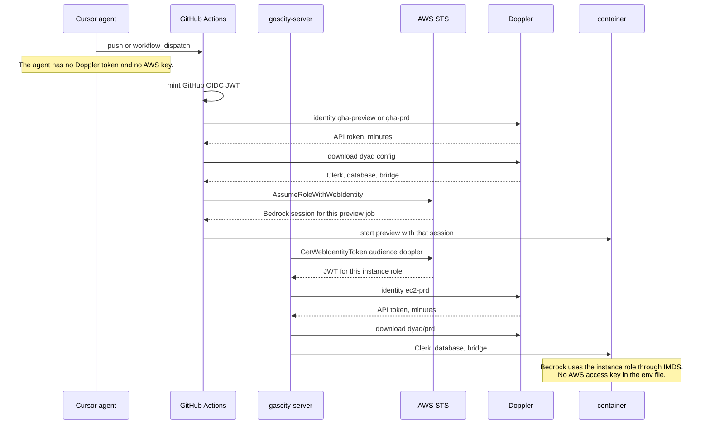

# Doppler as the only secret store, with no pasted service token

> Written 2026-10-04. This is a design. It does not change workflows, the host, or Doppler.
>
> Two problems stay separate. A workload proving who it is to Doppler is one. Doppler handing that workload a Clerk key, a database URL, or an AWS credential is the other.

## Summary

Today every automated path starts with a Doppler service token. GitHub Actions reads `DOPPLER_TOKEN` and `AWS_DOPPLER_TOKEN` from repository secrets. The EC2 host reads `/etc/doppler/dyad-preview.token` (project `dyad`, config `prd`) and `/etc/doppler/aws-dev.token` (project `aws`, config `dev`) inside `scripts/gascity/host-wrapper.sh`. When a token expires, a person creates another one and pastes it into GitHub, onto the host, or into an agent chat. The agent is then asked to install a secret it is not supposed to handle.

The target is one trust setup, then no stored Doppler token anywhere an agent or a workflow can see. GitHub Actions presents a GitHub OIDC token. The EC2 host presents an AWS STS web-identity token for its instance role. Doppler Service Account Identities check the issuer, audience, and subject and return a Doppler API token that expires in minutes. The identity id is a name, like a username. It is stored as a GitHub variable and a file on the host. It is not a secret.

Application secrets stay in Doppler. Preview and production stop carrying two copies of the same value. Config inheritance and cross-project references make one Doppler config the source. AWS credentials leave Doppler. The production container uses the EC2 instance role. A preview deploy uses GitHub OIDC to assume a Bedrock-only role and receives a session that ends with the job.

## What we run today

| Workload                                              | How it authenticates to Doppler                                                                         | What it then receives                                                                                     |
| ----------------------------------------------------- | ------------------------------------------------------------------------------------------------------- | --------------------------------------------------------------------------------------------------------- |
| Preview deploy, `.github/workflows/preview-image.yml` | GitHub secrets `DOPPLER_TOKEN` and `AWS_DOPPLER_TOKEN`                                                  | `dyad`/`preview` plus the three `AWS_*` names, merged in `deploy/preview/controller.mjs`                  |
| Production rollout                                    | SSH as `EC2_SSH_KEY`. The host uses the two token files. The workflow itself does not download Doppler. | `dyad`/`prd`, then `AWS_ACCESS_KEY_ID`, `AWS_SECRET_ACCESS_KEY`, and `AWS_REGION` copied from `aws`/`dev` |
| Cursor agent                                          | No Doppler login. A human pastes a `dp.st.` token when a download returns `Invalid Auth token`.         | Whatever that token's config contains, for as long as the token lives                                     |

A service token is scoped to one config, so production needs two tokens and a merge script. Expiring tokens shrink the window after a leak. They do not remove the moment a person has to create, copy, and install the next one. That moment is the outage we already hit: both host token files returned `Invalid Auth token`, and the rollout stopped before Compose.

## Comparison

| Approach                        | Removes a stored Doppler token                                                                                          | Lifetime                                                                                     | Fits this repo                                                                                                                     | Plan gate                                                                                                     |
| ------------------------------- | ----------------------------------------------------------------------------------------------------------------------- | -------------------------------------------------------------------------------------------- | ---------------------------------------------------------------------------------------------------------------------------------- | ------------------------------------------------------------------------------------------------------------- |
| Expiring service token          | No. Someone still places `dp.st.` in GitHub, on the host, or in chat.                                                   | Days to months, then a human replaces it.                                                    | This is the current design.                                                                                                        | Any plan                                                                                                      |
| Service Account Identity + OIDC | Yes. The workload brings its own JWT. Doppler returns an API token with `ttl_seconds`.                                  | Minutes. `doppler oidc logout` can revoke it sooner.                                         | GitHub Actions and the EC2 host.                                                                                                   | Team or Enterprise                                                                                            |
| Dynamic secrets                 | No, by themselves. The caller still needs a Doppler login. They mint a new IAM user per lease and delete it at the TTL. | Default 30 minutes. Override with `dynamic_secrets_ttl_sec`.                                 | A short job that cannot use AWS itself. A container that runs for hours will outlive the lease. The Bedrock SDK does not renew it. | Enterprise. Doppler's rotator account `299900769157` must be trusted, with the workplace slug as external id. |
| Rotated secrets                 | No. They rotate `ACCESS_KEY_ID` and `SECRET_ACCESS_KEY` on an existing IAM user and write the new pair into the config. | The interval we configure. The running process keeps the previous key until it is recreated. | A long-lived process that cannot use an instance role or STS. We have both.                                                        | Paid integration. Same Doppler AWS account trust as dynamic secrets.                                          |
| GitHub OIDC → AWS STS           | Does not speak to Doppler. The workflow assumes a role and gets a session token.                                        | The role's max session, usually one hour unless raised.                                      | Preview Bedrock, and SSM in place of `EC2_SSH_KEY`.                                                                                | AWS only                                                                                                      |
| EC2 instance role               | Does not speak to Doppler. IMDS gives the host credentials. No access key exists.                                       | AWS rotates the instance credentials. The process never stores them.                         | Production Bedrock on `gascity-server`.                                                                                            | AWS only                                                                                                      |
| Secrets Manager or Vault        | A second source of truth.                                                                                               | Depends on the system.                                                                       | Use only for a capability Doppler does not have. Nothing in the current set needs one.                                             | —                                                                                                             |

Dynamic and rotated secrets are layer 2. They assume layer 1 already succeeded. Buying them does not stop a human from pasting `DOPPLER_TOKEN`.

## Target architecture

### Layer 1 — workload to Doppler

Three service accounts. An identity signs in as its service account, and the token has that account's access. One account that can read both `prd` and `preview` would let a preview job read production. Split them.

| Identity      | Service account can read | Who may present the JWT                                                                                                                                                                                                                     |
| ------------- | ------------------------ | ------------------------------------------------------------------------------------------------------------------------------------------------------------------------------------------------------------------------------------------- |
| `gha-preview` | `dyad` / `preview` only  | GitHub OIDC for this repository. Subject pinned to the preview workflow and the `preview` environment. Exact `aud` and `sub`. No wildcard.                                                                                                  |
| `gha-prd`     | `dyad` / `prd` only      | GitHub OIDC for this repository. Subject pinned to `gascity-rollout.yml` on `cursor/browser-dyad-ui-bbea` or the `production` environment.                                                                                                  |
| `ec2-prd`     | `dyad` / `prd` only      | AWS IAM Outbound Identity Federation. Discovery URL is this account's issuer. Audience `doppler`. Subject is the instance role ARN. Custom claim `/https:~1~1sts.amazonaws.com~1/ec2_source_instance_arn` pins the one production instance. |

Doppler documents this EC2 flow in [AWS EC2 OIDC Authentication](https://docs.doppler.com/docs/aws-ec2-oidc). The host runs `aws sts get-web-identity-token` against regional STS in `ap-southeast-1`. The global STS endpoint does not serve `GetWebIdentityToken`. Duration is 300 seconds. `doppler oidc login --scope=.` exchanges it. `doppler oidc logout` runs in the same `EXIT` trap that already deletes `/run/gascity-rollout.env`. The identity id sits in `/etc/doppler/ec2-prd.identity`, mode 644. Losing that file reveals nothing.

GitHub stores the identity ids as repository or environment variables: `DOPPLER_IDENTITY_PREVIEW` and `DOPPLER_IDENTITY_PRD`. The preview workflow sets `permissions: id-token: write` and uses `dopplerhq/secrets-fetch-action` with `auth-method: oidc`, or `doppler oidc login`. `DOPPLER_TOKEN` and `AWS_DOPPLER_TOKEN` are deleted from GitHub after one green deploy. The host token files are deleted after one green rollout.

A Cursor agent never receives either identity's Doppler API token. It also never receives the JWT. GitHub mints the GitHub JWT inside the runner. AWS mints the EC2 JWT on the instance. The agent's useful action is to push or re-run a workflow. A failed login is a claim mismatch, which is a one-time dashboard change, not a new `dp.st.` value.

`EC2_SSH_KEY` is the remaining long-lived credential on the production path. After the production role exists, the rollout job assumes that role with GitHub OIDC and uses SSM Run Command. The runner then stops holding an SSH private key. Until SSM is in place, the rollout job may still fetch `EC2_SSH_KEY` from `dyad`/`prd` through the `gha-prd` identity. That keeps Doppler as the store for the key and still removes the pasted service token. SSM is the step that removes the key.

### Layer 2 — Doppler to the application

Doppler remains the store for values it cannot mint:

- `CLERK_SECRET_KEY`, `CLERK_PUBLISHABLE_KEY`
- `WEWEBPLUS_DATABASE_URL`, `WEWEBPLUS_SECRETS_KEY`
- `NOVNC_PASSWORD`, `GAS_CITY_HOST_BRIDGE_TOKEN`

These are static secrets. Doppler has no Clerk or Neon dynamic integration in this design. A person rotates them in Clerk or Neon, then updates the one Doppler config that owns the value. Workflows never carry a second copy.

DRY layout:

- Project `dyad`, config `shared`, holds the values that preview and production really share.
- `dyad`/`preview` and `dyad`/`prd` inherit `shared`. Each overrides `WEWEBPLUS_DATABASE_URL`. Preview's database is the Neon branch. Production's database stays the production URL.
- Project `aws` stops being a second login. During the move, `dyad` references `${aws.dev.AWS_ACCESS_KEY_ID}` and the matching secret and region, so the three names have one writer. After the instance role and the preview role exist, those references are deleted. `controller.mjs` no longer merges a second download. `host-wrapper.sh` no longer reads `aws-dev.token`.

AWS is the layer where Doppler should not keep a copy.

Production Bedrock uses the instance role. The role's permission is `bedrock:InvokeModel` and `bedrock:Converse` on `global.anthropic.claude-sonnet-4-5-20250929-v1:0` in `ap-southeast-1`, plus `sts:GetWebIdentityToken` for the Doppler login. Compose is `network_mode: host`, so the container can reach IMDS at `169.254.169.254`. `@ai-sdk/amazon-bedrock` does not walk the default AWS chain. `createAmazonBedrock` uses a bearer when `apiKey` is non-empty, and otherwise reads `accessKeyId` and `secretAccessKey` from options or from `AWS_ACCESS_KEY_ID` and `AWS_SECRET_ACCESS_KEY`. The client change is a `credentialProvider` that reads IMDS when those two variables are empty. No access key is written into `preview-*.env` or `/run/gascity-rollout.env`.

Preview Bedrock uses GitHub OIDC → `sts:AssumeRoleWithWebIdentity` into a role whose trust policy allows only the preview workflow. The session includes `AWS_SESSION_TOKEN`. The same SDK already forwards `sessionToken` from `AWS_SESSION_TOKEN` on the SigV4 path. The session length is the preview's lifetime, capped by the role max. When the session ends, Bedrock calls fail closed. The next deploy assumes a new session. That matches a preview that already dies with its Devbox session.

Dynamic secrets are the wrong tool for either of those. A leased IAM user is deleted at the TTL, the new user can take about ten seconds to exist, and the app would need a refresh loop it does not have. They also require the Enterprise plan and a standing trust to Doppler's AWS account. Rotated secrets keep a permanent IAM user and only change the key. The container keeps signing with the old key until the next recreate. The instance role and the preview role do not have that gap.

Vault and Secrets Manager are not added. They would become a second place a human updates.

### What an agent is allowed to see

The agent may read workflow logs that say `bedrock_iam=present` or `bedrock_iam=absent`, the identity id, and the Doppler project and config names. The agent may re-run a failed job. The agent does not get `doppler secrets download`, a service token, or the AWS session. GitHub already hides secret values from `gh secret list` for this integration. The workflows keep that property: the fetch step masks the download, and the remote script prints presence, not values.

## Migration

Each step is reversible until the token files are deleted. None of these steps is a production image rebuild.

1. Confirm the Doppler workplace is Team or Enterprise. Identities do not exist on the Developer plan. Dynamic secrets are not required, so Enterprise is not required.
2. Create the three service accounts and the three identities. Record the identity UUIDs as GitHub variables and as `/etc/doppler/ec2-prd.identity`. Do not create a service token.
3. Enable config inheritance. Move shared Clerk and bridge values to `dyad`/`shared` only after checking preview and production still resolve the same names. Keep the database URL as an override in each child.
4. Change `preview-image.yml` and `preview.yml` to OIDC. Leave the old GitHub secrets in place, unused, for one green deploy. Then delete `DOPPLER_TOKEN` and `AWS_DOPPLER_TOKEN`.
5. On the host, attach the instance role, enable outbound identity federation, and teach `host-wrapper.sh` to mint a JWT and run `doppler oidc login`. The token files stay on disk but unread for one green rollout. Then delete them.
6. Add the Bedrock `credentialProvider` and stop writing `AWS_ACCESS_KEY_ID` and `AWS_SECRET_ACCESS_KEY` into the container environment. Production uses IMDS. Preview assumes the Bedrock role for the job and passes the session, including `AWS_SESSION_TOKEN`.
7. Replace `EC2_SSH_KEY` with SSM once the production role can run the rollout command. Until then, the key remains a static secret in `dyad`/`prd`, fetched by `gha-prd`.
8. Revoke every remaining service token in the Doppler dashboard, including the ones already returning `Invalid Auth token`.

## Security tradeoffs

OIDC moves the trust decision onto claims. A loose `sub` such as `repo:Awannaphasch2016/dyad:*` would let any workflow in the repository read that config. Preview and production are different service accounts, and each subject is one workflow. Pull requests from other repositories do not match.

The identity UUID is public. Possession of it does nothing without a JWT signed by GitHub or by this AWS account. The AWS claim is further pinned to the production instance ARN, so another instance that assumed the same role still fails Doppler's check.

The EC2 JWT lasts five minutes. The Doppler API token lasts `ttl_seconds` on the identity. Set that to the length of a rollout download, on the order of ten minutes, not days. The host trap logs out.

Instance-role Bedrock is broader than a key stored in Doppler in one way: any process on the host that can reach IMDS can call Bedrock. Hop limit and a Bedrock-only policy are the bounds. A leaked access key can be used from anywhere. The instance credential cannot.

Preview sessions expire. A preview left up past the session stops calling the model. That is the intended failure. Extending the role's max session covers a workday. It does not create a permanent key.

GitHub Environment protection rules can still require a person before `gha-prd` runs. That is an approval gate. It is not a secret to copy. Preview stays unattended so an agent can finish a preview deploy alone.

The one-time human work is dashboard and IAM work: create identities, enable the AWS issuer, attach the role, set the claim to this instance. After that, replacing a token is not an operation the system has.

## Out of scope

- Implementing the workflow, host script, or Bedrock client changes in this pull request.
- Rebuilding the production image or opening a preview.
- Choosing Enterprise in order to turn on dynamic secrets.
- Putting a Doppler token in the Cursor environment so the agent can download secrets itself.
