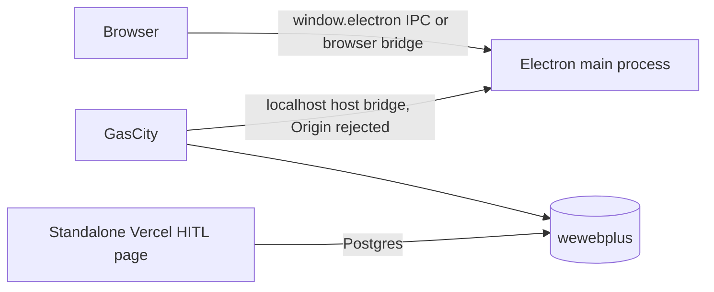
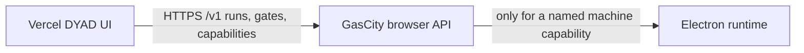
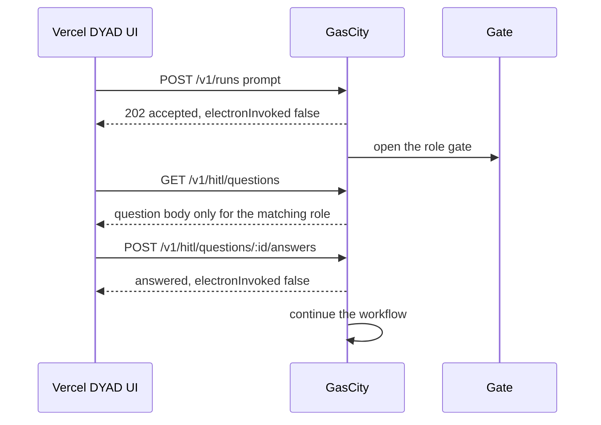
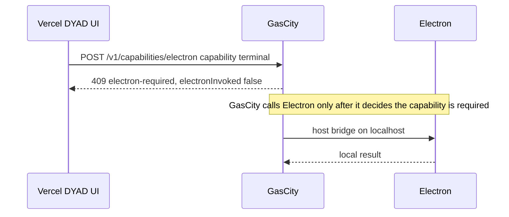

# DYAD frontend on Vercel, GasCity in the middle

> Written 2026-10-03. The browser UI no longer needs Electron between it and GasCity.

## Current state

The DYAD pages in `src/` call `window.electron`. The factory host bridge inside Electron rejects every request that carries an `Origin` header, so a Vercel page cannot call it. The standalone `hitl-web` page talked to Postgres directly and was a second frontend.

## Target state

Primary path:

Electron is a side path:

## Branch split

- `cursor/dyad-web-frontend-bbea` is this preview. It changes the Vercel app only. Root directory stays `hitl-web`, which is what the existing Vercel project builds, so this branch gets its own preview URL.
- `cursor/gascity-browser-api-bbea` is the GasCity HTTP listener. It allows listed browser origins, speaks the same `/v1` paths, and does not import Electron. It calls a host bridge only when one is configured.

Set `NEXT_PUBLIC_GAS_CITY_URL` to the GasCity origin when that listener is public. Until then the preview calls same-origin `/v1`, which uses the existing question store and never starts Electron.

## What left Electron

Clerk sign-in, the home composer, and HITL gates. Those now run in the browser and talk to GasCity.

## What stays in Electron

Terminal, local preview, filesystem, git, safe storage, native dialogs, and the other domains marked `electron` in `hitl-web/lib/boundary.ts`. They need the host machine. The web UI asks GasCity for them and stops. It does not open `window.electron`.
