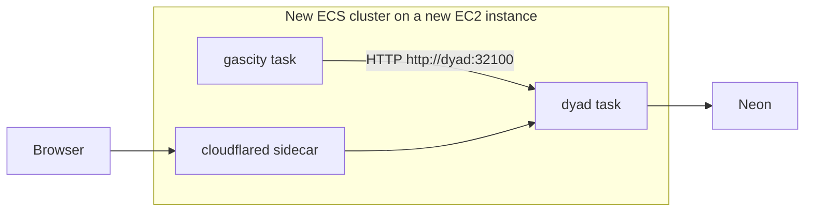

# Retire Vercel and cut production over to two ECS containers

> Generated by swarm planning session on 2026-10-06.
> Checked against `main` commit `ee860071`. This note is late when a later commit changes `compose.gascity.yml`, `scripts/gascity/rollout.sh`, `src/main/factory_host_bridge_server.ts`, `src/main.ts`, `hitl-web/app/api/questions/`, or `services/gascity-browser/server.mjs`.

## Summary

Production HITL does not use Vercel. Questions are written to Electron sqlite first and mirrored to Neon schema `wewebplus`. GasCity already calls Dyad over HTTP on the factory host bridge. This plan removes the unused Vercel site from that architecture, runs GasCity and Dyad as two containers on a new ECS-on-EC2 cluster, and keeps the current EC2 host as the only production writer until one cutover.

## Problem Statement

Operators keep a Vercel deployment that is off the live HITL path and can still write the Neon mirror through leftover `/api/questions` routes. The live path is one EC2 instance, `gascity-server`, whose container uses host networking so a `gc` process on the machine can call `127.0.0.1:32100`. That address is a deployment accident. It makes the EC2 machine part of the application contract, and it makes a second container impossible without sharing that machine’s loopback.

Reviewers should keep asking and answering gates in the Dyad window they already use. The move should not change that behavior, split one question across two writers, or turn the preview listener into the production API.

## Scope

### In Scope (MVP)

- Treat Vercel project `dyad` (root `hitl-web`) as removable from this architecture. Remove its ability to write production Neon. Leave Dyad’s user-app Vercel deploy (`src/ipc/handlers/vercel_handlers.ts`) in place.
- Package two application containers: Dyad, and a GasCity supervisor that calls `http://dyad:32100`.
- Run them on a new ECS cluster in `ap-southeast-1`, on a new EC2 capacity instance. Do not install the ECS agent on `gascity-server`. Do not use the existing `recommendation` cluster.
- Rehearse on a copy: own volume, own Neon branch, own hostname. `gascity-server` keeps serving production unchanged.
- Cut over once. Stop the EC2 writer, start the ECS writer with the production data and the production Neon URL, and hold the EC2 instance (stopped, not terminated) until one real production question and answer succeed.
- Keep the host-bridge HTTP contract. No gRPC.

### Out of Scope (Follow-up)

- Kubernetes / EKS.
- Fargate for the Dyad task.
- Replacing the host bridge with the preview listener on port 8787.
- Scheduling `scripts/gascity/resolve_hitl_answer.py`. An answer still returns `resolved: false`.
- A traffic-weighted canary that sends some live questions to ECS and some to EC2.
- Blue/green inside ECS. EC2 remains the rollback until the proof question passes.
- Changing HITL copy, role rules, or the Dyad window.
- `plans/offhost-image-pull.md`. This plan consumes a registry image; it does not replace that plan’s host-build rollback.

## User Stories

- As a reviewer, I want to answer a gate in the Dyad window I already use, so the hosting change does not give me a new site to learn.
- As a reviewer, I want the production hostname to keep showing the same questions, so a rehearsal cannot change live HITL.
- As an operator, I want ECS to prove a full question and answer on a copy before it touches production data.
- As an operator, I want one switch back to `gascity-server` if the proof question fails.
- As a Dyad user, I want deploying my own app to Vercel to keep working.

## UX Design

### User Flow

Before and after, a project manager uses the Dyad window: the desktop app, or the browser page served by the tunnel to port 8373 (the page carries `data-dyad-browser-bridge`). In the phase chat, `HitlQuestionList` shows who the gate is waiting on, the step, and the status. The matching role gets an answer field labeled `Answer {stepId}` and submits the form. The list refetches. The status becomes answered, including who answered. GasCity is still not released, because `answerHitlQuestion` returns `resolved: false` and this repo does not schedule the closer.

The Vercel pages (`/`, `/hitl`, `/runtime`, Clerk sign-in) are not part of this flow. People who bookmarked them lose that entry. The surviving entry is the Dyad window.

Operators never send reviewers to the canary hostname. They open it themselves, confirm the bridge marker, and run one gate there. Cutover moves the production hostname in one step. Rollback moves it back.

### Key States

- **Default**: The phase chat shows the gate sentence and, for the matching role, the answer field.
- **Loading**: The chat is visible while questions are still loading. The list is absent until the rows arrive.
- **Empty**: No questions renders nothing. There is no separate empty message today, and this plan does not add one.
- **Error**: A failed submit leaves the question open. The existing field can clear on failure because `pending` is hard-coded false. This plan does not change that.
- **Wrong role**: Status only. The body and the answer field stay hidden.
- **Cutover gap**: The production hostname can fail until the tunnel points at ECS. Typed text is not saved across that gap. Refresh after the hostname moves. During the gap, `gascity-server` is not also accepting new questions.

### Interaction Details

No new clicks. Submit stays a form button. An empty answer does not submit. The canary URL is an operator URL, not a second product.

### Accessibility

The answer input’s accessible name stays `Answer {stepId}`. Submit stays a real button. Status text is not a live region today, so “Answered by …” is not announced. This plan does not change that. The tunnel page is the full Dyad UI and is dense on a phone; that is the current page, not a new one.

## Technical Design

### Architecture

Application and deployment stay separate.

Application:

- Dyad owns the renderer, sqlite, the host bridge, and the browser bridge.
- GasCity owns workflow execution and calls the host bridge.
- Neon schema `wewebplus` is the mirror. Clerk is the session source.
- The contract is the existing HTTP JSON on the host bridge. Port 8787 is not this contract.

Deployment today:

- `gascity-server` (`m7i.xlarge`, `ap-southeast-1`) runs one container, `weaver-plus`, with `network_mode: host`.
- `gc` on the host calls `127.0.0.1:32100` because of that shared network namespace.
- `cloudflared` on the host publishes `127.0.0.1:8373`.
- Rollout builds `weaver-plus:gascity` on the instance disk and rolls back by retagging `weaver-plus:gascity-previous`.
- Vercel `hitl-web` calls `NEXT_PUBLIC_GAS_CITY_URL` from the browser. Production rollout never sets that URL. Leftover `/api/questions` routes write Neon directly. The pages on `main` do not call those routes.

Deployment target:

`cloudflared` is an edge sidecar in the Dyad task, not a third application service. It reaches the browser bridge on the task loopback. The host bridge listens on `0.0.0.0:32100` inside the task so the GasCity task can connect. The security group is what keeps 32100 private: only the GasCity task’s group, no public load balancer. Port 6080 and port 8373 are not published to the VPC.

The second container is the GasCity supervisor, the process that today runs as `gc` on the host. It is not `services/gascity-browser`. That listener returns 503 for `/v1/hitl/*` and its `/v1/runs` handler inserts a Neon row without calling Dyad. The preview image `ghcr.io/awannaphasch2016/gascity` only copies a `gc` binary onto a volume and sleeps. The production image has to run the supervisor and set `WEAVER_BASE_URL=http://dyad:32100`.

ECS Service Connect name `dyad` is the replacement for `127.0.0.1`. `continue.mjs` does not call that name.

Dyad `desiredCount` stays 1. Two tasks would be two sqlite writers.

This account’s IAM user can create the cluster, task definitions, services, ECR repositories, security groups, and EC2 instances. It cannot create EFS and cannot start SSM. Data disks are EBS volumes on the new ECS instance, matching today’s bind mounts. There is no SSM path onto `gascity-server` from this agent.

### Components Affected

- `compose.gascity.yml` — left as the EC2 production file until cutover. Not edited to add a second service in place.
- `scripts/gascity/rollout.sh` and `.github/workflows/gascity-rollout.yml` — keep deploying `gascity-server` until cutover. Disabled only after the proof question.
- `Dockerfile.gascity`, `docker/gascity-entrypoint.sh` — the Dyad image. Registry tag is added by the off-host image work. The ECS task sets `GAS_CITY_HOST_BRIDGE_HOST=0.0.0.0` and `DYAD_BROWSER_BRIDGE=1`. The EC2 compose file keeps the default bind of `127.0.0.1`.
- New GasCity supervisor image and ECS task definitions under `deploy/gascity/`. The supervisor calls the host bridge and does not import Electron.
- `hitl-web/app/api/questions/` — deleted so a leftover deployment cannot write Neon. The three pages can leave the repo in the same change. `src/ipc/handlers/vercel_handlers.ts` stays.
- `deploy/preview/vercel.mjs` — preview env writes for `hitl-web` stop once that project is gone. Preview hostnames `pr-<n>` and `gc-pr-<n>` are a different system and stay.

### Data Model Changes

No schema change.

- Dyad sqlite on one EBS volume: apps, `hitl_questions`, `hitl_answers`, factory runs. Source today is the Docker volume `weaver-plus_weaver-plus-user-data`.
- Project trees on a second EBS volume, mounted at `/home/weaver/dyad-apps`. Source today is `/opt/gascity/projects`.
- Neon `wewebplus` stays the mirror. The canary uses a child branch. Production URL is attached only at cutover.
- `sharedMemorySize` 1024 for Xvfb.

### API Changes

None. These stay exactly as they are:

- Origin header on the host bridge is 403.
- Machine bearer is `GAS_CITY_HOST_BRIDGE_TOKEN`.
- Unset `GAS_CITY_HOST_BRIDGE_HOST` stays `127.0.0.1` for the EC2 process.
- Routes stay `PUT /v1/apps/:id/link`, `GET …/phases`, `GET …/factory-state`, `POST …/phases/:phase/{messages,approve,runs}`, `GET /v1/runs/gas-city-run:{64 hex}`, and the phase question and answer routes.
- Health stays noVNC `/vnc.html` plus `GET /v1/apps/0/factory-state` returning 401, then the rollout’s socket check on 8373 and `verify_bridge.mjs`.

## Implementation Plan

### Phase 1: Disconnect Vercel from production state

- [ ] Delete `hitl-web/app/api/questions/` so those routes cannot insert answers.
- [ ] Remove `WEWEBPLUS_DATABASE_URL` from the Vercel project `dyad` before the project is deleted, so a stale deployment cannot keep writing Neon.
- [ ] Leave `vercel_handlers.ts` and its tests untouched.
- [ ] Do this before cutover. A stale Vercel client must not write the production mirror while sqlite has moved.

### Phase 2: Images

- [ ] Publish the Dyad image by digest to GHCR. Do not build it on `gascity-server` for the ECS path.
- [ ] Publish a GasCity supervisor image that stays running and calls `WEAVER_BASE_URL`. Refuse to reuse the preview image that only copies `gc` and sleeps.
- [ ] Keep `weaver-plus:gascity-previous` on `gascity-server` as the EC2 rollback image.

### Phase 3: ECS beside EC2

- [ ] Create a new cluster and a new ECS-optimized EC2 instance with two EBS data volumes. Do not join `gascity-server` to the cluster. Do not use cluster `recommendation`.
- [ ] Register the Dyad task: `desiredCount` 1, shared memory 1024, both volume mounts, browser bridge on, host bridge bound to `0.0.0.0` only in this task definition.
- [ ] Register the GasCity task on Service Connect name `dyad`, port 32100.
- [ ] Add a cloudflared sidecar to the Dyad task. Give the canary its own hostname. Do not move the production hostname.
- [ ] Security group: GasCity task to Dyad port 32100 only. No public listener on 32100, 6080, or 8373.
- [ ] Inject Doppler `dyad/prd` and `aws/dev` into the tasks at deploy. The canary override for `WEWEBPLUS_DATABASE_URL` is the Neon branch URL, not the production URL.
- [ ] Copy project files and a sqlite snapshot onto the canary volumes. Do not mount the live EC2 volumes.

### Phase 4: Prove the copy

- [ ] From the GasCity task, with no `Origin` header: missing token gets 401, a bearer token can post a question, a request with `Origin` gets 403.
- [ ] The question lands in the canary sqlite first and in the Neon branch second.
- [ ] An answer from the canary Dyad window updates that sqlite and that branch, and returns `resolved: false`.
- [ ] `verify_bridge.mjs` passes against the canary.
- [ ] `gascity-server` container `weaver-plus` is still the process serving the production hostname. No production Neon row was written by the canary.

### Phase 5: Cut over once

- [ ] Stop `gc` and `weaver-plus` on `gascity-server`. Leave the instance running and the previous image in place.
- [ ] Copy the live user-data volume and `/opt/gascity/projects` to the ECS volumes.
- [ ] Point the ECS tasks at the production Neon URL and move `https://anakwannaphaschaiyong.com` to the Dyad task. The canary hostname stays `https://pre.anakwannaphaschaiyong.com` and is never the apex.
- [ ] Run one real production question and one real answer on that hostname. A canary-branch question does not count.
- [ ] Until that pair succeeds, do not terminate the instance.

### Phase 6: Rollback or retire

- [ ] Rollback before any production write on ECS: point the hostname back at `gascity-server` and start the previous image. No volume sync.
- [ ] Rollback after ECS has written: stop the ECS tasks, copy the volumes back, then start the EC2 container. Starting EC2 without that copy loses the post-cutover answers.
- [ ] After the proof pair: stop using `gascity-rollout.yml` for `gascity-server`, delete Vercel project `dyad`, and only then terminate the instance.

## Testing Strategy

- [ ] Existing `src/main/factory_host_bridge_server.test.ts` still covers Origin 403, bearer auth, and the question routes.
- [ ] A task-definition test checks shared memory 1024, both mounts, `desiredCount` 1, bind `0.0.0.0` only on the ECS task, and no public port 32100.
- [ ] Canary smoke is the phase 4 list, run while `docker compose ps` on `gascity-server` still shows the current container healthy.
- [ ] Cutover smoke is `verify_bridge.mjs` plus the one production question and answer.
- [ ] `src/ipc/handlers/vercel_handlers.ts` tests still pass after `hitl-web` API routes are removed.

## Risks & Mitigations

| Risk | Likelihood | Impact | Mitigation |
| --- | --- | --- | --- |
| Two writers: ECS and EC2 both accept questions | Medium | High | Canary uses a Neon branch and its own volumes. EC2 `gc` and `weaver-plus` are stopped before ECS receives the production URL. |
| Canary is pointed at production Neon | Medium | High | The production URL is attached only in phase 5. Phase 4 checks that no production row appeared. |
| Port 32100 is reachable from the VPC | Medium | High | Security group source is the GasCity task only. Origin rejection stays, and it does not replace the security group. |
| The preview listener is used as GasCity | Medium | High | The supervisor image is a different artifact. Phase 4 requires a host-bridge 401, which port 8787 does not serve. |
| `hitl-web` writes Neon after sqlite has moved | Low | High | Delete `/api/questions` and remove the Vercel database URL before cutover. |
| Rollback after ECS writes drops answers | Medium | High | Copy the volumes back before starting EC2. Document which case applies before the switch. |
| EFS is unavailable to this IAM user | High | Low | Use EBS on the new instance. Do not block the cutover on EFS. |
| Bookmarked Vercel pages 404 | High | Low | Accepted. The Dyad window is the HITL UI. Say so before the project is deleted. |
| Cutover gap loses an in-progress answer | Medium | Medium | Stop EC2 first, move the hostname, then ask the proof question. Do not ask reviewers to type during the gap. |

## Credentials

Do not paste secret values into the plan, the pull request, or chat.

Already available to the implementation agent:

- AWS IAM user `anak` in `ap-southeast-1` can create an ECS cluster, register task definitions, create services, create ECR repositories, create security groups, and run EC2 instances.
- That user cannot create EFS and cannot start SSM sessions.
- `gascity-server` is the running production instance. Cluster `recommendation` exists, has no services, and is unrelated.
- No GasCity ECR repository exists yet.
- GitHub CLI is authenticated for this repo.

Decided on 2026-10-06:

- Production hostname is `https://anakwannaphaschaiyong.com`, with no `pr-` prefix. Canary hostname is `https://pre.anakwannaphaschaiyong.com`. The apex is not moved until phase 5.
- Neon project `Wewebplus-hitl` (`mute-credit-71067312`) still holds branch `prd` (`br-winter-salad-b3mkewwm`, endpoint `ep-royal-term-b3paoprp`) and canary branch `pre` (`br-quiet-frog-b3l8isvn`, endpoint `ep-muddy-sky-b31adt7z`). Both were created 2026-10-06 from parent `Dev` (`br-mute-shadow-b3jxqoho`, endpoint `ep-wild-paper-b3yf26si`). Those connection strings were not written into Doppler at creation. `dyad/preview` still points at `Dev`.
- Creating the new ECS cluster, EC2 capacity instance, and ECR repositories was approved and done on 2026-10-06. No Dyad or GasCity task is running there.

Still required before a canary task starts:

- A registry image for Dyad and a GasCity supervisor image that calls `http://dyad:32100`.
- The Neon `pre` connection string injected into the canary only. That endpoint is `ep-muddy-sky-b31adt7z` on `Wewebplus-hitl`. Do not send that string in chat. Do not inject `dyad/prd` into the canary. That config now points at Neon project `wewebplus-production`, not at `pre` or `prd`.
- Cloudflare hostname `pre.anakwannaphaschaiyong.com` pointed at the canary tunnel. The apex stays on `gascity-server`.

Not required for the canary:

- A new host-bridge token, a new Clerk application, or a new AWS account. Clerk allowed origins for the canary hostname can be updated with the Clerk secret already in Doppler `dyad/prd`.
- A Vercel token, until phase 1 removes the database URL and phase 6 deletes project `dyad`. That token already lives in Doppler `dyad/preview` as `VERCEL_TOKEN`.

## Open Questions

- Who submits the proof question on `https://anakwannaphaschaiyong.com`, and which artifacts count as success: sqlite row, Neon mirror row, and the answer visible in the Dyad window?

## Decision Log

- Vercel does not store HITL state. Neon and sqlite do. Removing project `dyad` does not drop questions. The leftover `/api/questions` routes are a second writer and go away first.
- The host bridge is already wired. `src/main.ts` starts it, and rollout sets `GAS_CITY_HOST_BRIDGE_ENABLED=true`. There is no missing wire-up that Vercel was covering.
- The preview listener on port 8787 is not a stand-in for `gc`. Engineering’s suggestion to make `services/gascity-browser` the second ECS service is rejected for that reason.
- ECS on EC2, new instance, EBS volumes. Fargate cannot carry the sqlite volume, the projects directory, the 1 GB shared-memory mount, and Xvfb together. EKS is deferred until the number of services makes ECS placement the more expensive operations. Product principle: backend-flexible. The HTTP contract is what keeps a later Kubernetes Service possible.
- No weighted routing. A portion of live HITL traffic would split sqlite and project files. The canary is a full parallel environment. Transparent over magical: production behavior stays on `gascity-server` until the switch.
- `gascity-server` is not modified to become the ECS host. The migration is the rehearsal. The instance stays stopped, not terminated, through the proof question.
- User-app Vercel deploy stays. Bridge, don’t replace: Clerk, Neon, Cloudflare, and Doppler stay the external services.
- EFS was not granted to the IAM user, so the plan does not depend on it.
- Production hostname is the zone apex `https://anakwannaphaschaiyong.com`. Preview names `pr-<n>` and `gc-pr-<n>` stay preview names. Canary uses `https://pre.anakwannaphaschaiyong.com`.
- Neon branch `prd` (`br-winter-salad-b3mkewwm`) and canary branch `pre` (`br-quiet-frog-b3l8isvn`) were created under `Wewebplus-hitl` on 2026-10-06 as children of `Dev`. `dyad/preview` still connects to `Dev`. The later `dyad/prd` URL does not use either child. It uses project `wewebplus-production`.
- Doppler production identity is `5a844bf1-8def-47f4-8ae1-9520f7bf109b` on the service account that has only `dyad/prd`. No service account API token. The preview identity `18edf96d-89e6-40f6-87aa-073c11a02e14` stays on `dyad/preview` and `aws/dev`. The production subject must be `repo:Awannaphasch2016@28061800/dyad@1384672033:ref:refs/heads/main`, because this workplace allows one environment per service account and a wildcard subject would let a pull request read `prd`.
- The production identity read `dyad/prd` from `main` on run 37466995678. Subject was `repo:Awannaphasch2016@28061800/dyad@1384672033:ref:refs/heads/main`. Required names were present. At that time `WEWEBPLUS_DATABASE_URL` used the Dev endpoint `ep-wild-paper-b3yf26si`.
- After the database URL change, run 37469201663 reported endpoint `ep-young-wave-b3cwe0rz-pooler` and `db_is_dev_branch=no`. Run 37472011865 mapped that host to Neon org `Karant` (`org-fancy-queen-06483586`), project `wewebplus-production` (`proud-salad-68182047`), branch `main` (`br-billowing-frost-b3i42bh6`), endpoint `ep-young-wave-b3cwe0rz`. It is not `Wewebplus-hitl` branch `prd` or canary branch `pre`. `gascity-server` reads Doppler only during rollout, so the running container still has the previous URL. Do not roll that host, and do not start a canary task on `dyad/prd`, until this database is the one production should use.
- Canary capacity created 2026-10-06 in `ap-southeast-1`: ECS cluster `wewebplus`, ECR `wewebplus-dyad` and `wewebplus-gascity`, instance `i-023d741ed3a1b3b25` (`wewebplus-ecs`, `m7i.xlarge`), security group `sg-0d19518d244fede2d` with no inbound rules. `gascity-server` was not changed. No task is running.

---

_Generated by dyad:swarm-to-plan_
