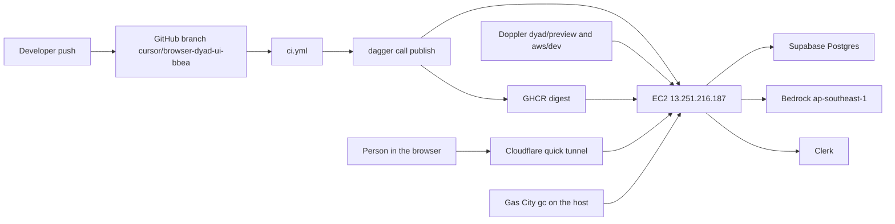
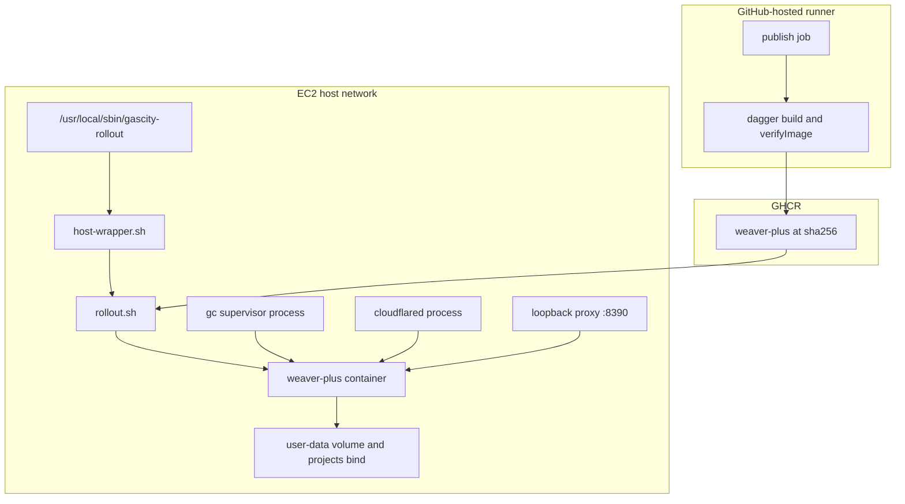
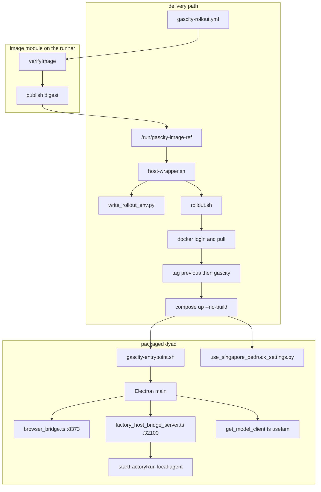
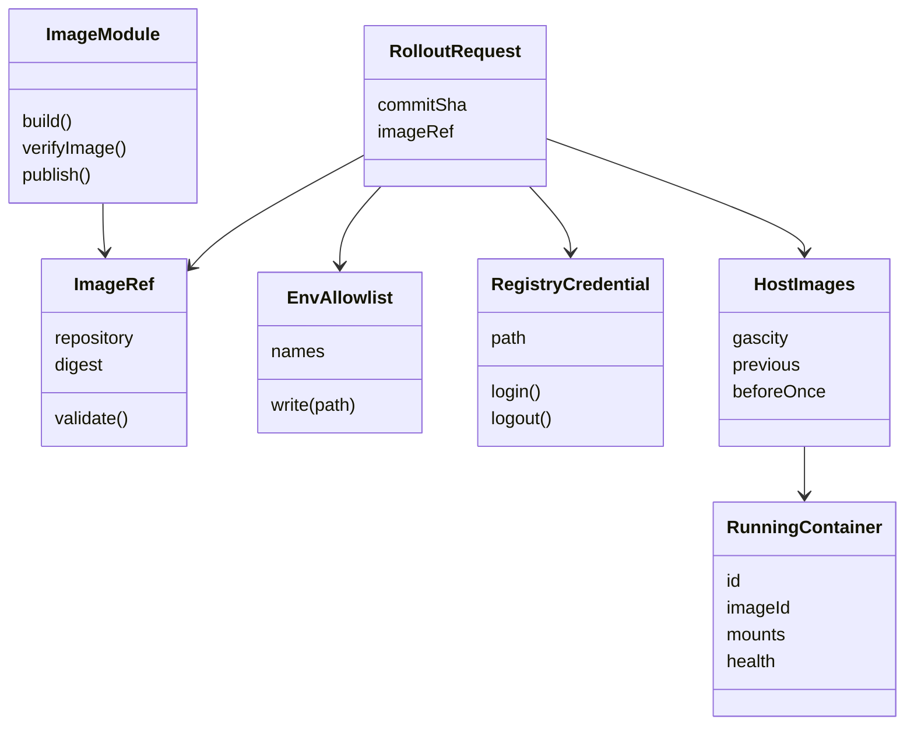
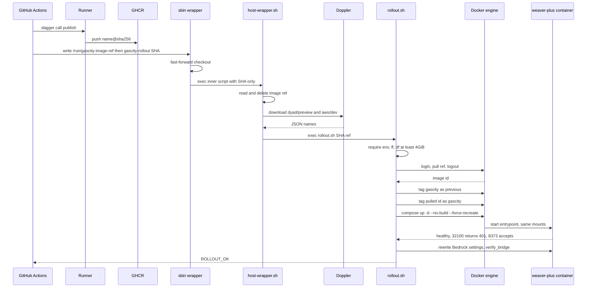
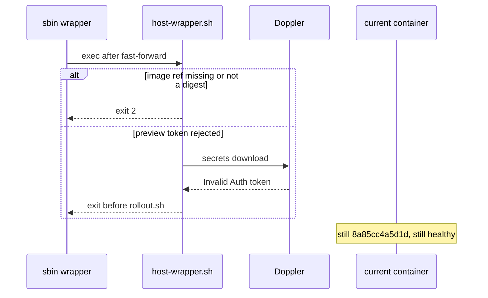
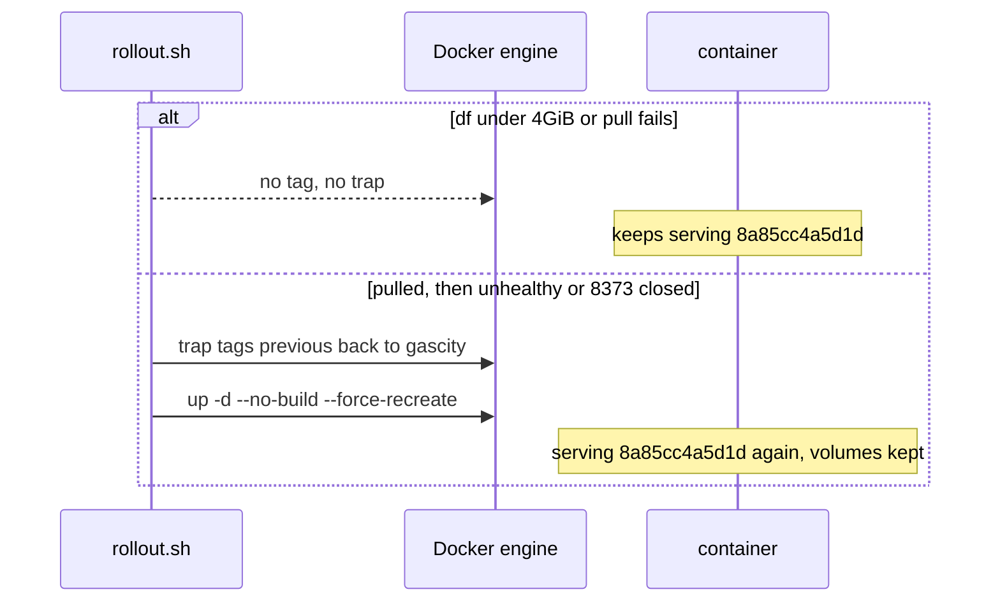
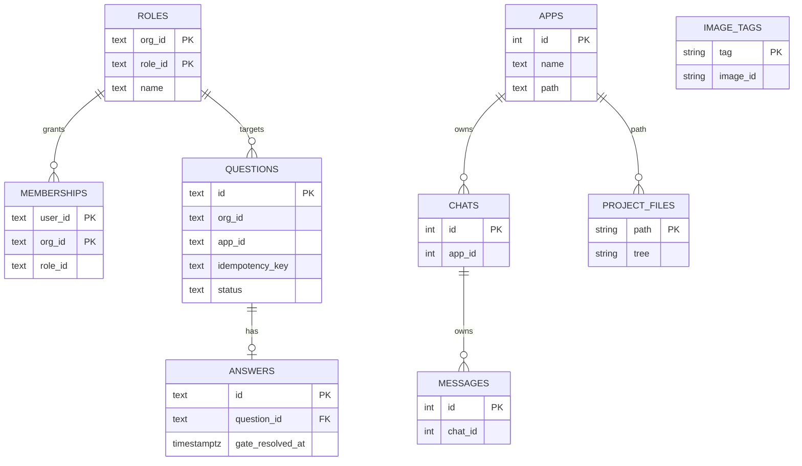

# Pull the Dyad image on EC2 instead of building it there

> Written 2026-10-03 from the repo at `ad0138a5` and a read-only SSH to `13.251.216.187` at 10:39 UTC. Nothing on the host was changed: no image build, no pull, no token write, no `compose` command, no prune.
>
> This replaces the on-host rebuild in [plans/preview-token-rollout.md](preview-token-rollout.md). It is the production promotion change that [plans/preview-environments.md](https://github.com/Awannaphasch2016/dyad/blob/cursor/preview-infra-plan-9e7a/plans/preview-environments.md) (PR 17) explicitly left for later, and it does not wait on the two-container proof in [plans/dev-environment-external.md](https://github.com/Awannaphasch2016/dyad/blob/cursor/dev-env-external-9e7a/plans/dev-environment-external.md) (PR 18). Approving this write-up does not authorize a build, a registry push, or an SSH write.
>
> **Locked 2026-10-03.** Dagger owns `build`, `verifyImage`, and `publish`. Production rollout stays bash on EC2 and leaves Dagger. `Gascity.rollout` is not extended and is not the agent entry point. No Doppler token, AWS key, or registry token is pasted into chat or committed. The publish job uses the Actions `GITHUB_TOKEN` with `packages: write`. The host read token is created later, installed only on the host, and is not part of writing this plan.

## 1. Implementation plan

### Current state

Production is one Ubuntu host, `ip-172-31-14-171` (`13.251.216.187`), 29G disk, **5.1G free (83%)** at 10:39 UTC. Kubernetes is not installed. No Docker config exists for root or `ubuntu`, so the engine is not logged into a registry. The only registry-looking image already present is `registry.dagger.io/engine:v0.21.10`, which is the Dagger engine, not a place this host pushes to.

| Piece              | Live fact                                                                                                                                                                                                     |
| ------------------ | ------------------------------------------------------------------------------------------------------------------------------------------------------------------------------------------------------------- |
| Checkout           | `/opt/gascity/weaver-plus`, branch `cursor/browser-dyad-ui-bbea`, `ad0138a5`, clean                                                                                                                           |
| Container          | `weaver-plus-weaver-plus-1` (`ea53ea847a7e`), image `weaver-plus:gascity` `sha256:8a85cc4a5d1d`, host network, healthy since 2026-10-02T22:35:20Z, restart `unless-stopped`, writable layer 2.89MB            |
| Previous tag       | `weaver-plus:gascity-previous` is the **same** id `8a85cc4a5d1d`                                                                                                                                              |
| Kept image         | `weaver-plus:gascity-before-once` is `0ed1ee86f43e` (2.88GB). 10 layers shared with the running image, 4 unique to `gascity`, 3 unique to `before-once`                                                       |
| Code in that image | `app.asar` contains **zero** occurrences of `useIam`. The Singapore client in `src/ipc/utils/get_model_client.ts` is on the checkout and is not what the process runs                                         |
| Runtime env names  | IAM keys and `AWS_REGION` are set. `AWS_BEARER_TOKEN_BEDROCK` is not in the container env. Secret values were not printed                                                                                     |
| Volumes            | `weaver-plus_weaver-plus-user-data` (44.63MB) → `/home/weaver/.config`. Bind `/opt/gascity/projects` (319MB) → `/home/weaver/dyad-apps`                                                                       |
| Factory API        | `dyad` listens `127.0.0.1:32100`. `startFactoryHostBridgeFromEnv` hardcodes that address                                                                                                                      |
| Browser UI         | `dyad` listens `127.0.0.1:8373`. `cloudflared tunnel --url http://127.0.0.1:8373` is the public path. A separate `node /tmp/dyad-bridge-proxy.mjs` listens `127.0.0.1:8390` and is not the tunnel target      |
| Gas City           | Host process `/opt/gascity/gc supervisor run`, pid 30127, up 8 days, `127.0.0.1:8372`. Not a container. City dir `/opt/gascity/city` is 1.9G                                                                  |
| Other containers   | `dagger-engine-v0.21.10`, `factory-victoria-metrics`, `factory-victoria-logs`. Victoria data volume is 1.983GB. An exited `weaver-tty-test` was not in `docker ps` at this read                               |
| Disk hogs          | containerd content 1.4G, overlay snapshots **8.2G** (largest snapshot **2.9G**, id 104, the build-stage cache). `docker system df` build cache 2.746GB, of which 543.9MB is reclaimable. Images total 4.652GB |

Delivery today, from the files that are both in git and on the host:

1. A push to `cursor/browser-dyad-ui-bbea` runs `.github/workflows/gascity-rollout.yml` after `ci.yml` succeeds for that SHA. The job SSHes and runs `sudo /usr/local/sbin/gascity-rollout <sha>`. GitHub has `EC2_SSH_KEY` only.
2. `/usr/local/sbin/gascity-rollout` is **not** the repo file. It is a 56-line outer shell. It fast-forwards the checkout, sets `GAS_CITY_WRAPPER_INNER=1`, and `exec`s `scripts/gascity/host-wrapper.sh` with **only the commit**. Extra SSH arguments are dropped.
3. The repo `host-wrapper.sh` (the inner path) downloads Doppler project `dyad` config `preview` with `/etc/doppler/dyad-preview.token`, then project `aws` config `dev` with `/etc/doppler/aws-dev.token`, merges the three AWS names, and `write_rollout_env.py` writes `/run/gascity-rollout.env`. The allowlist is the nine compose names plus the fixed bridge settings. `EC2_SSH_KEY` is dropped.
4. Dagger `deploy/gascity` `Gascity.rollout` does not build the image. It starts `debian:bookworm-slim` with the host Docker socket, `--privileged --pid=host --network=host -v /:/host`, and chroots to `scripts/gascity/rollout.sh`.
5. `rollout.sh` requires the env file, fast-forwards again, **tags `weaver-plus:gascity` as `weaver-plus:gascity-previous`**, installs an `ERR` trap, runs `docker image prune -f`, then `docker compose up --build -d`. On failure the trap tags previous back and runs `up -d --no-build --force-recreate`. There is no registry pull and no free-space check. The 8GiB gate exists only in the previous plan, not in the script.
6. `compose.gascity.yml` has both `build: Dockerfile.gascity` and `image: weaver-plus:gascity`, `network_mode: host`, and no published ports. `up --build` is what compiles on this disk.
7. `Dockerfile.gascity` is two stages. The build stage is `node:24-bookworm`, `npm ci`, `COPY . .`, `npm run package` (`electron-forge package`). That stage is the 2.9G snapshot and is **not** in the runtime image. The runtime stage copies `out/dyad-linux-x64` (**388MB**), `control-plane/drizzle` (81.9kB), and the entrypoint (16.4kB), on top of the apt layer (**536MB**), Node (**217MB**), and Yarn (**5.41MB**). `.dockerignore` already excludes `.env`, `.git`, `node_modules`, and `out`.

The preview token file is still 58 bytes, mode 600, root-owned. Doppler rejected it on run [37073686042](https://github.com/Awannaphasch2016/dyad/actions/runs/37073686042) before `rollout.sh`. The last build that did reach unpack, run [37053916207](https://github.com/Awannaphasch2016/dyad/actions/runs/37053916207), died with `no space left on device` while extracting packaged git, with about 5.6G free and the build cache still present. A wrapper failure before `rollout.sh` does not roll the container back, and does not need to: the healthy container stays.

PRs 15 and 16 do not add an image, a checkout, or a container on this host. Their persistent disk cost here is about zero. The 8GiB number was a proposed free-space floor for `compose up --build`. It is not their size.

The running container can answer Bedrock because it was recreated with IAM env and the saved model id was rewritten. The packaged client in `8a85cc4a5d1d` still sends a stored bearer when one exists. That is why a new image is still required, and why this plan exists.

### Target state

A new Dagger module builds `Dockerfile.gascity` with `dag.container().build`, checks the image, and publishes an immutable digest. GitHub Actions is the event and permission shell around `dagger call publish`. The EC2 host never receives a build context. `host-wrapper.sh` execs `rollout.sh` directly. That script pulls the digest, checks it, and only then retags and recreates the existing Compose project with `--no-build`. The same volumes, the same host network, the same Doppler env file, and the same `gc` process stay.

```text
agent or laptop: dagger call verify-image
push to cursor/browser-dyad-ui-bbea
  → ci.yml
  → publish job: dagger call publish
       build Dockerfile.gascity
       verifyImage
       ghcr.io/awannaphasch2016/weaver-plus@sha256:<64 hex>
  → rollout job writes /run/gascity-image-ref and SSHes
  → sbin wrapper fast-forwards and execs host-wrapper.sh
  → host-wrapper.sh reads the ref, downloads Doppler, execs rollout.sh
  → rollout.sh pulls the digest, then compose up -d --no-build
  → healthy container, new image id, previous tag still 8a85cc4a5d1d
```

`verifyImage` is the function an agent runs before a push. `publish` fails closed without a push credential. `rollout` is not a Dagger function. Calling today's `Gascity.rollout` deploys this host, so the new module does not take a Docker socket and does not know `/opt/gascity`.

There is no second host, no Neon branch, no Kubernetes namespace, and no change to `gc`. PR 17 keeps production on `gascity-rollout.yml` and says the registry is not pointed at production yet. This plan is that missing pointer, and only that. PR 18 says to leave the registry until a two-container proof is green. This plan does not start that proof. The registry is the production image store. The proof can use the same repository later.

### Architecture changes required

- The build context moves from `/opt/gascity/weaver-plus` on EC2 to the runner that executes the new Dagger module. `Dockerfile.gascity` stays the only build definition. The Python SDK does not reimplement `npm ci` or `npm run package`.
- The new module is separate from `deploy/gascity`. `Gascity.rollout` keeps its current signature and is removed from the pull path. It mounts `/` with `--privileged --pid=host --network=host` and sets `CACHEBUST` to the current time. The new `build` function does not copy `CACHEBUST`. Its `dagger.json` pins an engine version the same way `deploy/gascity/dagger.json` pins `v0.21.10`.
- `compose up --build` leaves the production path. The compose file keeps a `build:` block so a developer laptop can still build. The host script is no longer allowed to pass `--build`.
- `ci.yml` stays the lint and unit-test workflow. This module does not start Postgres, Dyad, or `gc`. `gc` is a host process, and the factory bridge listens on `127.0.0.1` only.
- A digest file is the contract across the installed sbin wrapper, because that wrapper forwards only the commit. The repo script, which git does update, reads the file.
- Rollback stays a local retag of `weaver-plus:gascity-previous`. The registry is not asked to serve the previous image during a failed health check. The previous image is already on disk.
- The 8GiB pre-build gate is not added. A pull floor of 4GiB free on `/` is added **before** `docker tag` and **before** the rollback trap. 4GiB is enough for a layer-sharing pull (about one new 388MB app layer) and for one fully new 2.88GB image beside the current one, given 5.1G free. It is not enough to mean "build here." Below 4GiB the script exits 2 and the container keeps serving.

### Components to add, modify, remove, or reuse

| Piece                                                    | Action                                 | Why                                                                                                                                                               |
| -------------------------------------------------------- | -------------------------------------- | ----------------------------------------------------------------------------------------------------------------------------------------------------------------- |
| `Dockerfile.gascity`                                     | Reuse                                  | Already the runtime image. No secret `ENV` and no `ARG` for keys                                                                                                  |
| `.dockerignore`                                          | Reuse                                  | Already keeps `.env` out of the build context                                                                                                                     |
| `docker/gascity-entrypoint.sh`                           | Reuse                                  | Runtime only. Reads `NOVNC_PASSWORD` from the container env and unsets it                                                                                         |
| `compose.gascity.yml`                                    | Modify the comment and the image field | `image: ${WEAVER_IMAGE:-weaver-plus:gascity}` so a pulled name can be selected. Keep `build:` for laptops. Production always passes `--no-build`                  |
| New Dagger module, sibling of `deploy/gascity`           | Add                                    | `build` uses `dag.container().build` on `Dockerfile.gascity`. `verifyImage` checks the image. `publish` pushes the digest. No socket, no host path, no `rollout`  |
| `.github/workflows/gascity-rollout.yml`                  | Modify                                 | Publish job runs `dagger call publish` with `packages: write` and no `EC2_SSH_KEY`. Rollout job has `EC2_SSH_KEY` and writes `/run/gascity-image-ref` before sbin |
| `scripts/gascity/host-wrapper.sh`                        | Modify                                 | Inner path reads and deletes the image-ref file before Doppler, then execs `rollout.sh`. It stops calling `dagger call rollout`. Refuses if the file is missing   |
| `deploy/gascity/src/gascity/main.py`                     | Leave                                  | Do not add `image_ref`. The privileged chroot leaves the production path                                                                                          |
| `scripts/gascity/rollout.sh`                             | Modify                                 | Replace `up --build` with pull, verify, then `up -d --no-build --force-recreate`. Free-space check before any tag                                                 |
| `scripts/gascity/rollout.test.sh`                        | Modify                                 | Assert order: space check, pull, digest check, then `docker tag`, then trap, then `--no-build`, and no `up --build`                                               |
| `scripts/gascity/write_rollout_env.py`                   | Reuse                                  | Registry credential must not join `ALLOW`                                                                                                                         |
| `use_singapore_bedrock_settings.py`, `verify_bridge.mjs` | Reuse                                  | Still run after healthy, inside the new container, against the same volume                                                                                        |
| `/usr/local/sbin/gascity-rollout`                        | Reuse as-is                            | It already execs the repo script after fast-forward. Do not depend on editing it. A later one-line `exec ... "$@"` is optional and not required                   |
| `/etc/gascity/ghcr-read.token`                           | Add on the host, not in git            | Read token for `docker login ghcr.io`. Mode 600, root. Removed from the process environment after login                                                           |
| `weaver-plus:gascity-before-once`                        | Keep                                   | Not a cache source                                                                                                                                                |
| Dagger engine container on EC2                           | Leave running, drop from the pull path | `dagger-engine-v0.21.10` stays installed. The pull no longer chroots through it. Do not delete it on the first pull                                               |
| PR 15 `services/gascity-browser` and PR 16 `hitl-web`    | Out of this change                     | They do not run in this container. Pulling a Dyad image does not connect Vercel `/v1/runs` to `startFactoryRun`                                                   |

Nothing in `src/` has to change for the pull itself. The image built from the current branch already contains the `useIam` client. That is the point of shipping a new digest.

### Integration with existing systems

The host wrapper, the env allowlist, the Compose project name `weaver-plus`, the volume names, the bind mount, host networking, the healthcheck, and the post-start settings rewrite all stay. The new step sits where `docker compose up --build` sits.

`gc` keeps calling `127.0.0.1:32100` through the shared network namespace. The browser tunnel keeps calling `127.0.0.1:8373`. Both ports come back when the recreated container is healthy. The recreate is the only gap, and it is the same gap the current script already takes.

Doppler stays the source of runtime secrets. The registry credential is a different file and a different login. A missing or rejected preview token still stops the script before `rollout.sh`, so a push made before the token is replaced still cannot build or pull.

PR 17's preview controller, if it is built later, can pull from the same GHCR repository. This plan does not create `preview-<pr>`, does not add `GAS_CITY_HOST_BRIDGE_HOST`, and does not move `gc`.

### Dependencies and external services

| Service                                     | Role in this change                                                    | Already used                                                                                                                                                                                        |
| ------------------------------------------- | ---------------------------------------------------------------------- | --------------------------------------------------------------------------------------------------------------------------------------------------------------------------------------------------- |
| GitHub Actions `ubuntu-latest`              | Thin launcher: wait for `ci.yml`, then `dagger call publish`, then SSH | CI already runs here. The publish job is new. Runner choice stays in YAML                                                                                                                           |
| GHCR `ghcr.io/awannaphasch2016/weaver-plus` | Stores the digest                                                      | No. Chosen because the git remote is this GitHub repo and the host has no registry login. The script accepts a full `name@sha256:` ref, so ECR can replace GHCR without another host-script rewrite |
| Docker Hub / Node image `node:24-bookworm`  | Base of both Dockerfile stages. Pulled on the **runner**, not on EC2   | The current image was built from Node 24.21.0                                                                                                                                                       |
| Doppler `dyad`/`preview` and `aws`/`dev`    | Runtime env file, unchanged                                            | Yes. Preview token is currently rejected                                                                                                                                                            |
| Supabase                                    | `WEWEBPLUS_DATABASE_URL` at container start                            | Yes. No schema change                                                                                                                                                                               |
| Amazon Bedrock `ap-southeast-1`             | Outbound from the container after recreate                             | Yes. The new image is what makes IAM win over a saved bearer                                                                                                                                        |
| Clerk                                       | Keys passed through at runtime                                         | Yes                                                                                                                                                                                                 |
| Cloudflare quick tunnel                     | Unchanged process on the host                                          | Yes                                                                                                                                                                                                 |
| Dagger image module                         | `build`, `verifyImage`, `publish` on the runner                        | The host module exists and only chroots `rollout.sh`. The image functions are new and do not call that chroot                                                                                       |

The runner must be able to pull `node:24-bookworm`. The EC2 host must be able to pull `ghcr.io`. It already has outbound HTTPS for Doppler, Bedrock, Supabase, and the Dagger registry. No inbound port is added. GHCR is not opened on the host firewall as a listener.

### Networking and communication

No new listener. No publish of 32100 or 8373. `network_mode: host` stays, because `gc` on the host reaches the container's loopback that way. `docs/gascity-docker.md` still forbids binding the factory bridge on `0.0.0.0`.

| Hop                                      | After this change                                                   |
| ---------------------------------------- | ------------------------------------------------------------------- |
| Runner → GHCR                            | `docker push` of one digest, outbound HTTPS                         |
| EC2 → GHCR                               | `docker pull` of that digest, outbound HTTPS, during rollout only   |
| Browser → cloudflared → `127.0.0.1:8373` | Unchanged. WebSocket `/dyad-browser-ipc`                            |
| `gc` → `127.0.0.1:32100`                 | Unchanged. Bearer `GAS_CITY_HOST_BRIDGE_TOKEN`. `Origin` still 403  |
| Container → Supabase, Bedrock, Clerk     | Unchanged outbound, from the same env names                         |
| `127.0.0.1:8390` proxy                   | Left running. It is not in Compose and not a rollout step           |
| GitHub Actions → EC2:22                  | Existing SSH. The command gains a write of `/run/gascity-image-ref` |

Image pull and container recreate are sequential. The old process serves until `compose up --force-recreate`. Pull does not stop it.

### Configuration, environment variables, and secrets

Runtime names do not change. `write_rollout_env.py` `ALLOW` stays:

`NOVNC_PASSWORD`, `GAS_CITY_HOST_BRIDGE_TOKEN`, `CLERK_PUBLISHABLE_KEY`, `CLERK_SECRET_KEY`, `WEWEBPLUS_DATABASE_URL`, `WEWEBPLUS_SECRETS_KEY`, `AWS_ACCESS_KEY_ID`, `AWS_SECRET_ACCESS_KEY`, `AWS_REGION`.

Fixed in the env file, as today: `DYAD_BROWSER_BRIDGE=1`, `DYAD_BROWSER_BRIDGE_PORT=8373`, `WEAVER_PROJECTS_DIR=/opt/gascity/projects`, `NOVNC_PORT=6080`, `GAS_CITY_HOST_BRIDGE_PORT=32100`.

New, and not a container variable:

| Name                              | Where                                                                           | Rule                                                                                                                                                        |
| --------------------------------- | ------------------------------------------------------------------------------- | ----------------------------------------------------------------------------------------------------------------------------------------------------------- |
| Image ref                         | `/run/gascity-image-ref`, written by the SSH step, deleted by `host-wrapper.sh` | Must match `^[a-z0-9./_-]+@sha256:[0-9a-f]{64}$`. A tag without `@sha256:` is refused, including `weaver-plus:gascity`                                      |
| Registry read token               | `/etc/gascity/ghcr-read.token`, mode 600, root                                  | Used only for `docker login ghcr.io`. Unset after login. Never passed to Dagger, never written to `/run/gascity-rollout.env`, never a compose interpolation |
| `GITHUB_TOKEN` on the publish job | GitHub Actions, `packages: write`                                               | The only publish credential. Created by Actions. Not pasted into chat. The rollout job does not receive it                                                  |

`dagger call publish` gets no `--build-arg` and no Doppler env. `.dockerignore` keeps `.env` out. `verifyImage` fails the publish when `Config.Env` contains `AWS_`, `CLERK_`, `WEWEBPLUS_`, `NOVNC_PASSWORD`, or `GAS_CITY_HOST_BRIDGE_TOKEN`. Those names appear only when Compose starts the container. An agent can run `dagger call verify-image` with no registry token and no Doppler token. `publish` fails closed when `packages: write` is absent.

The preview token and the aws token stay in `/etc/doppler/`. This plan does not print them and does not commit them. The replacement preview token that was probed earlier is not on the host.

### Data and state management

The pull does not migrate data. Recreate without `-v` remounts the same two stores:

- Electron sqlite, settings, and Chromium state in `weaver-plus_weaver-plus-user-data`.
- App working trees in `/opt/gascity/projects`.

`use_singapore_bedrock_settings.py` rewrites `user-settings.json` on that volume after health, the same as today's script: global model id, stored Bedrock `apiKey` removed. That rewrite is idempotent on a volume that already has the global id.

Postgres `wewebplus` and the Gas City Dolt city are not opened by the rollout script. Victoria's 1.983GB volume is not touched.

Docker tag state is the only new persistent record, and it is local to the engine:

| Tag                               | Before a successful pull | After             |
| --------------------------------- | ------------------------ | ----------------- |
| `weaver-plus:gascity`             | `8a85cc4a5d1d`           | the pulled digest |
| `weaver-plus:gascity-previous`    | `8a85cc4a5d1d`           | `8a85cc4a5d1d`    |
| `weaver-plus:gascity-before-once` | `0ed1ee86f43e`           | `0ed1ee86f43e`    |

A failed health check tags previous back onto `gascity` and recreates with `--no-build`. The pulled digest may remain as an untagged or side image. It must not be removed by `docker image prune -a`. The script does not prune.

Disk, peak versus permanent, from the measured layers:

|                 | On-host `up --build` (today's script)                                                                   | Pull of an image built from the same Dockerfile                                                                                                                   |
| --------------- | ------------------------------------------------------------------------------------------------------- | ----------------------------------------------------------------------------------------------------------------------------------------------------------------- |
| Peak extra      | `npm ci` plus Forge output. The leftover snapshot is 2.9G, and the unpack already failed near 5.6G free | The new blobs and their unpack. About the 388MB app layer when Node, Yarn, and apt layers match the image already on disk. Up to about 2.88GB if no layer matches |
| Permanent extra | The new app layer, plus the build cache unless something prunes it                                      | The new app layer. `gascity-previous` keeps the old 388MB app layer as well. `before-once` stays                                                                  |
| 8GiB gate       | The floor this plan retires                                                                             | Not used. 4GiB free is the pull floor. 5.1G free passes it today                                                                                                  |

Do not reclaim the 2.9G snapshot as part of the first pull. `docker builder prune` does not remove tagged images, but it is a separate operator action after a pull has succeeded, not a step the script takes while learning the new path.

### Deployment and runtime considerations

- Concurrency `gascity-rollout` with `cancel-in-progress: false` stays. A second push waits. Do not start a manual wrapper while that group holds the host.
- The publish job does not SSH. A failed `verifyImage` or `publish` does not touch EC2. `EC2_SSH_KEY` is absent from that job.
- The runner disk is ephemeral and is the place `npm ci` is allowed to fill. Do not point BuildKit or the Dagger engine at the EC2 socket.
- `debian:bookworm-slim` and `dagger-engine-v0.21.10` stay on the host. The pull path no longer uses the chroot, so neither image is a reason to keep calling Dagger on EC2. Do not prune them on the first pull.
- Healthcheck in the Dockerfile covers noVNC and a 401 from `127.0.0.1:32100` with no token. It does **not** cover 8373. `rollout.sh` still opens a socket to 8373 before it declares success. Losing the 8373 check would mark a container healthy while the tunnel target is down.
- `start_period` is 90s. The wait loop is 48 times 5s. Keep both.
- User `weaver` uid 10001 is created in the image. The volume is already owned for that uid. A new image that changes the uid would hide the settings. This plan does not change the uid.
- Host checkout must be clean or the wrapper exits 2. Do not edit files under `/opt/gascity/weaver-plus` on the host.
- A docs-only push to `cursor/browser-dyad-ui-bbea` still triggers the workflow. After this change, that push builds and pushes an image, then SSHes. Until the preview token is valid, SSH still dies at Doppler and the new digest is not pulled. That is the safe default.
- Wrapper failure before `rollout.sh` still does not recreate the container.

### Migration path

Today the host builds. The target host only pulls. The token file is invalid, which is what keeps an early push from building.

1. Land the script and workflow on a branch that is **not** `cursor/browser-dyad-ui-bbea`. Review them. Do not install the preview token. Do not install the GHCR token yet.
2. Merge or push those script changes onto `cursor/browser-dyad-ui-bbea` only when a rollout is intended. The installed sbin wrapper fast-forwards first. The new inner script then looks for `/run/gascity-image-ref`. The workflow writes that file. If the preview token is still the rejected file, Doppler fails before `rollout.sh`. The container stays `8a85cc4a5d1d`. A digest may already be in GHCR from the build job. That is not a host disk event.
3. Install `/etc/gascity/ghcr-read.token` and, only after step 2's checkout is the pull-only script, replace `/etc/doppler/dyad-preview.token`. Mode 600, root. Delete every other copy. Do not print either value.
4. `workflow_dispatch` the rollout for the SHA whose digest was pushed. The host pulls, retags, recreates.
5. Confirm the acceptance list below. Leave `gascity-before-once` and both volumes in place.
6. Only after that confirmation, an optional `docker builder prune` can drop the 2.9G snapshot. It is not required for the pull, and it is not part of the script.

There is no database migration and no volume migration. Rollback of a bad image is the existing trap, which recreates from `gascity-previous` without `--build` and without `-v`.

### Step-by-step implementation phases

**Phase 0. This document.** No host change. The live image id remains `8a85cc4a5d1d`.

**Phase 1. Publish a digest from Dagger.** New module and a publish job in `gascity-rollout.yml`:

- checkout the SHA
- `dagger call verify-image` checks uid 10001, the secret-name ban on `Config.Env`, and a throwaway container that returns 401 on the factory port with no token
- `dagger call publish` pushes `ghcr.io/awannaphasch2016/weaver-plus@sha256:<64 hex>` using `GITHUB_TOKEN`
- the same SHA a second time does not produce a second digest
- the job has `packages: write` and does not have `EC2_SSH_KEY`

The job does not SSH. Production does not pull yet. `on.push` is limited to `cursor/browser-dyad-ui-bbea`, so a PR branch does not roll production by itself. An agent runs `dagger call verify-image` before the push. That call does not publish and does not SSH.

**Phase 2. Make `rollout.sh` refuse to build.**

Order inside the script, after the existing env requirements and fast-forward:

1. Read the image ref argument. Reject anything that is not `repo@sha256:<64 hex>`.
2. `df` on `/`. Under 4GiB available, print the available bytes and exit 2.
3. `docker login` from `/etc/gascity/ghcr-read.token`, `docker pull <ref>`, `docker logout`. If login or pull fails, exit non-zero **before** `docker tag` and **before** `trap rollback`.
4. Resolve the pulled image id. It must differ from `8a85cc4a5d1d` on the first production pull, and `docker image inspect` RepoDigests must contain the requested digest.
5. Only then tag `weaver-plus:gascity` as `weaver-plus:gascity-previous`, install the trap, `docker tag` the pulled id onto `weaver-plus:gascity`, and `docker compose ... up -d --no-build --force-recreate`.
6. Keep the health wait, the 8373 socket check, the settings rewrite, and `verify_bridge.mjs`.

`rollout.test.sh` greps the script text for that order. It still does not call Docker or Doppler.

**Phase 3. Thread the ref through the wrapper, not through Dagger.** `host-wrapper.sh` inner path: require `/run/gascity-image-ref`, validate, delete the file, download Doppler, then exec `rollout.sh` with the commit and the ref. Remove the `dagger call rollout` line. Do not change `Gascity.rollout`. A missing file exits 2 before Doppler and before `rollout.sh`.

The rollout job writes the ref, then runs `sudo /usr/local/sbin/gascity-rollout <sha>`. The sbin script's single-argument forward is fine because the ref is in the file, not in argv.

**Phase 4. Credentials, then one pull.** Install the two host files in the order in the migration section. Dispatch one rollout. Do not `down -v`. Do not `docker image rm` the three named tags. Do not prune builders in this phase.

**Phase 5. Prove the running system.** The verification section below. A Discovery reply is the application check that the new client is the one serving. `gc` pid 30127 (or its successor, if the operator restarted it for an unrelated reason) must still be the host supervisor, not a new container.

Stop after phase 5. Do not start PR 17's preview host, PR 18's bridge network, or a second Compose project on this box.

### Risks, assumptions, and potential conflicts

| Risk                                                                         | What happens                                                                                  | Mitigation                                                                                                                               |
| ---------------------------------------------------------------------------- | --------------------------------------------------------------------------------------------- | ---------------------------------------------------------------------------------------------------------------------------------------- |
| The preview token is installed before the pull-only script is on the host    | The next push runs today's `up --build` and can fill the disk again                           | Token install is phase 4, after the checkout that refuses `--build`                                                                      |
| The sbin wrapper drops a new argv                                            | A digest passed only as `$2` never reaches `rollout.sh`, and the script would build or refuse | The ref travels in `/run/gascity-image-ref`. The repo script is what git updates                                                         |
| Pull of an image with no shared layers needs ~2.88GB                         | 5.1G free can hold it and can get tight if something else writes                              | 4GiB floor before any tag. Pull failure is before the trap, so the serving container is not recreated                                    |
| `up` without `--no-build` still builds, because compose has a `build:` block | A future edit puts the build back                                                             | The test fails if `up --build` appears. The recreate line includes `--no-build`                                                          |
| GHCR package is private and the host token cannot read it                    | Pull fails, container unchanged                                                               | Login is before the tag. The token is read-only and is not the Doppler token                                                             |
| Two rollouts overlap                                                         | Two recreates, or a tag race                                                                  | Existing concurrency group. Do not invoke the wrapper by hand during a run                                                               |
| The new image fails health or 8373                                           | Users lose the UI until rollback                                                              | Trap retags previous and recreates `--no-build`. Previous is `8a85cc4a5d1d` on the first pull                                            |
| A saved bearer returns if the settings rewrite is skipped                    | The old image sends it. The new image ignores it when IAM env is set                          | Both stay: the rewrite runs, and the image contains `useIam`                                                                             |
| This plan is read as implementing PR 15 and 16                               | Someone points Vercel at this host and Gates 503 or `/v1/runs` never starts the agent         | Those PRs are out of scope. This image does not add their routes. `startFactoryRun` is already inside the current image and is unchanged |
| PR 17 and 18 disagree about when a registry exists                           | Implementing both texts at once creates a preview stack on this disk                          | This plan only changes production promotion. It does not create a second Compose project here                                            |
| `docker builder prune` is run early and someone treats it as required        | Unrelated, but it can surprise a later on-host build                                          | Not in the script. Optional only after phase 5                                                                                           |
| Secret printed in the Actions log                                            | `docker login --password-stdin` can leak if echoed                                            | The workflow must not `echo` the token. The host file is mode 600. Logs print the digest and image id only                               |
| Floating tag `weaver-plus:latest` is what the host pulls                     | A later push moves the tag under a running rollout                                            | The host pulls `@sha256:` only                                                                                                           |
| An agent calls `Gascity.rollout` or a future `ci` function that includes it  | The privileged chroot recreates the production container                                      | The image module has no socket and no `rollout`. Agent entry is `verifyImage`                                                            |
| `CACHEBUST` is copied onto the new build function                            | Every agent run repeats `npm ci`                                                              | The new `build` function does not set `CACHEBUST`. The engine version is pinned                                                          |

Assumptions: the runner can build this Dockerfile (the same file already built on the host once); GHCR is reachable from the EC2 security group for outbound 443; the first digest is built from a commit that contains `c1826ec3`'s client; the volume owner stays uid 10001.

### Verification and acceptance criteria

A pull is accepted only when every line below is true on the host. A green `ci.yml` or a pushed digest is not acceptance.

- Container `weaver-plus-weaver-plus-1` is `healthy`.
- Its image id is not `sha256:8a85cc4a5d1d`, and `RepoDigests` contains the ref that was written to `/run/gascity-image-ref`.
- `weaver-plus:gascity-previous` is still `8a85cc4a5d1d`. `weaver-plus:gascity-before-once` is still `0ed1ee86f43e`.
- The recreate did not drop the mounts: the user-data volume is still the source for `/home/weaver/.config`, and `/opt/gascity/projects` is still the source for `/home/weaver/dyad-apps`.
- `df` free space fell by about the new layer (a few hundred MB if layers matched, not by 8GB). Snapshot 104 may still be 2.9G. That is expected.
- Inside the container, `grep -a -c useIam` on `app.asar` is at least 1. `AWS_REGION` is `ap-southeast-1`. Both IAM names are set. `AWS_BEARER_TOKEN_BEDROCK` is unset. Values are not printed.
- Saved settings still name `global.anthropic.claude-sonnet-4-5-20250929-v1:0` and have no `providerSettings.bedrock.apiKey`.
- `127.0.0.1:32100` still returns 401 with no token. `127.0.0.1:8373` still accepts a TCP connection. `gc` still listens on `127.0.0.1:8372`.
- One Discovery message on the existing app (`/chat?id=11&appId=4`) returns a model reply, and that turn's main log has no `AI_APICallError`.
- `rollout.test.sh` passes and does not contact EC2.

Until phase 4, the acceptance test is the opposite image check: the id is still `8a85cc4a5d1d` and `useIam` is still 0. That proves the plan document and the earlier pushes did not roll the container.

## 2. System context diagram

Who is outside the EC2 box, and which of them this change adds.



This is the production system, not a preview environment. `Build` is the new Dagger publish function on a GitHub runner, and `GHCR` is new. Every other box is already in the path: the workflow already SSHes, Doppler already feeds the env file, the tunnel already targets 8373, `gc` already calls 32100, and the container already calls Supabase, Bedrock, and Clerk.

`Build` must not be drawn inside EC2. That mis-drawing is the current failure. The EC2 Dagger engine is not this box. PR 17's preview host, Neon, and Vercel are not in this picture. Vercel `hitl-web` keeps reading Supabase on its own and is not a hop in the image pull.

## 3. Container diagram

Deployable units and where they run. "Container" here means a runtime unit, including host processes that are not Docker containers.



| Unit                       | Where              | Exists              | This change                                                   |
| -------------------------- | ------------------ | ------------------- | ------------------------------------------------------------- |
| publish job                | GitHub runner      | No                  | New. Runs `dagger call publish`. The only place `npm ci` runs |
| GHCR digest                | GitHub             | No                  | New                                                           |
| sbin wrapper               | EC2, not in git    | Yes, 56 lines       | Unchanged. Forwards the commit, then execs the repo script    |
| `host-wrapper.sh`          | Repo, run on EC2   | Yes                 | Reads the image-ref file, then execs `rollout.sh`             |
| Dagger engine              | EC2 container      | Yes                 | Stays installed. Leaves the pull path                         |
| `rollout.sh`               | Repo, run as root  | Yes                 | Pulls instead of `up --build`                                 |
| `weaver-plus`              | EC2, host network  | Yes, `8a85cc4a5d1d` | Same Compose project, new image id, same mounts               |
| `gc`, cloudflared, `:8390` | EC2 host processes | Yes                 | Not recreated                                                 |
| Victoria, nginx            | EC2                | Yes                 | Not in this flow                                              |

`gc` is outside Docker on purpose. Host networking is why its `127.0.0.1:32100` is the container's listen address. A bridge network would break that without the bind-address change PR 18 describes, and this plan does not make that change.

## 4. Component diagram

The pieces inside the rollout, and the pieces inside the Dyad process the image actually starts.



`Entry`, `Main`, `Bridge`, `API`, `Run`, and the settings rewrite already exist in the repo and, except `useIam`, already exist in the running image. `Model` exists in the checkout (`get_model_client.ts` sets `apiKey: ""` when both AWS keys are present) and is absent from `app.asar` today. `Verify`, `Publish`, `Ref`, and `Login` are new. `RS` and `HW` change. `Env` stays. `Gascity.rollout` is not in this path.

`Run` is `startFactoryRun` in `src/main/factory_host_service.ts`. It hashes `gas-city-run:` and dispatches `requestedChatMode: "local-agent"`. The pull does not alter that function. PR 16's `/v1/runs` returns `electronInvoked: false` and does not call it. Shipping this image does not close that gap.

## 5. Class diagram

The delivery types are a new image module plus the existing bash rollout. They are not Electron classes and not `src/version_preview/`. `Gascity.rollout` stays the host-only chroot and does not gain `imageRef`.



| Type                 | Maps to                                                    | Status                                            |
| -------------------- | ---------------------------------------------------------- | ------------------------------------------------- |
| `ImageModule`        | New Dagger module beside `deploy/gascity`                  | New. `build`, `verifyImage`, `publish`. No socket |
| `Gascity`            | `deploy/gascity/src/gascity/main.py` class `Gascity`       | Exists. Left unchanged. Off the pull path         |
| `EnvAllowlist`       | `ALLOW` and `FIXED` in `write_rollout_env.py`              | Exists. Unchanged                                 |
| `HostImages`         | The three `docker tag` names in `rollout.sh`               | Exists. `beforeOnce` is not retagged              |
| `RunningContainer`   | The `docker inspect` health and mount checks               | Exists                                            |
| `ImageRef`           | Digest file, checked in `host-wrapper.sh` and `rollout.sh` | New                                               |
| `RegistryCredential` | `/etc/gascity/ghcr-read.token`                             | New. Not an env-file field                        |
| `RolloutRequest`     | The pair the workflow writes: SHA plus ref file            | New as a pair. The SHA already exists             |

Ownership: GitHub Actions creates the digest and owns the push. The host owns the tags and the running container. Doppler owns secret values. The image owns neither.

## 6. Sequence diagrams

### Normal rollout



The container that is serving at the start of this sequence keeps serving through the pull. It is replaced at `compose up`.

### Doppler or missing-ref failure



This is the path every push takes until phase 4. It is the reason a plan-only commit on the live branch does not build, and the reason the token must not be installed early.

### Pull or health failure



The trap is installed only after the pull returns an id. A disk error during pull does not recreate. A disk error after the trap does recreate from previous, which is the image that was healthy.

## 7. ER diagram

Persistent records the pull must not rewrite, plus the tag record it does rewrite.



| Entity                                         | Store                                                                                                         | This change                                                                                                                                   |
| ---------------------------------------------- | ------------------------------------------------------------------------------------------------------------- | --------------------------------------------------------------------------------------------------------------------------------------------- |
| `ROLES`, `MEMBERSHIPS`, `QUESTIONS`, `ANSWERS` | Supabase schema `wewebplus`, created by `control-plane/drizzle/0001_hitl.sql` and `0002_gate_resolved_at.sql` | Untouched. No migration. `gate_resolved_at` stays the poller's column                                                                         |
| `APPS`, `CHATS`, `MESSAGES`                    | sqlite in the user-data volume, `src/db/schema.ts`                                                            | Untouched. Same volume remounted. App rows stay. hopping-quokka-buzz stays app 4                                                              |
| `PROJECT_FILES`                                | `/opt/gascity/projects` bind                                                                                  | Untouched. Not copied into the image                                                                                                          |
| Gas City Dolt                                  | `/opt/gascity/city`                                                                                           | Not in this diagram's database and not mounted into Dyad. Untouched                                                                           |
| `IMAGE_TAGS`                                   | Docker engine local tags, not SQL                                                                             | The only record the rollout writes. `gascity` moves to the new id. `previous` keeps the old id. `before-once` is not a row the script updates |

`apps.neonProjectId` and the Neon helpers under `src/neon_admin/` are per user-app databases. They are not the control-plane database and not a preview branch. This plan does not call them.

## End-to-end example

A developer pushes the commit that already contains the Singapore client (`c1826ec3` and the pull-only script) to `cursor/browser-dyad-ui-bbea`. `ci.yml` goes green.

The publish job on `ubuntu-latest` runs `dagger call publish`, which builds `Dockerfile.gascity` through `dag.container().build`. Inside the build stage the runner executes `npm ci` and `npm run package`. The runtime stage copies `out/dyad-linux-x64` (the layer that is 388MB on the current image), the drizzle SQL, and the entrypoint. `verifyImage` refuses the image when a secret name is in `Config.Env`. The function then pushes `ghcr.io/awannaphasch2016/weaver-plus@sha256:` plus 64 hex digits. Call that digest `NEW`. EC2 disk is still 5.1G free. The container is still `8a85cc4a5d1d`.

The rollout job writes `ghcr.io/awannaphasch2016/weaver-plus@sha256:NEW` to `/run/gascity-image-ref` and runs `/usr/local/sbin/gascity-rollout` with the commit. The sbin script sees a clean tree, fast-forwards `/opt/gascity/weaver-plus`, and execs the repo `host-wrapper.sh`. That script reads the ref, deletes the file, downloads the two Doppler configs, and writes `/run/gascity-rollout.env` with the nine allowlisted names. It does not put the GHCR token in that file, and it does not call Dagger.

`rollout.sh` checks the env names, fast-forwards again, and reads `df`. 5.1G is above 4GiB, so it logs into GHCR, pulls `NEW`, and logs out. The pull reuses the Node, Yarn, and apt layers already stored for `8a85cc4a5d1d` when the Dockerfile base has not moved, and it unpacks a new app layer of about 388MB. It then tags `8a85cc4a5d1d` as `weaver-plus:gascity-previous`, tags `NEW` as `weaver-plus:gascity`, and runs `docker compose up -d --no-build --force-recreate`.

The entrypoint starts Xvfb, noVNC, and `/app/out/dyad-linux-x64/dyad` as uid 10001. The same user-data volume comes back, so the sqlite apps and the saved global model id are still there. The same projects directory comes back. The factory bridge binds `127.0.0.1:32100` and the browser bridge binds `127.0.0.1:8373`. The healthcheck sees noVNC and a 401 from port 32100. The script then connects to 8373, rewrites settings (a no-op if the bearer key is already gone), and runs `verify_bridge.mjs`.

`gc` pid 30127 never stopped. Its next call to `127.0.0.1:32100` hits the new process in the same place. The tunnel's next request to `127.0.0.1:8373` hits the new browser bridge. A person opens the existing Discovery chat and sends a message. Main loads `get_model_client.ts` from the new asar, sees both AWS keys, sets `apiKey` to an empty string, and signs with SigV4 against `global.anthropic.claude-sonnet-4-5-20250929-v1:0` in `ap-southeast-1`. The reply is the acceptance check.

If that container had failed the 8373 check, the trap would tag `8a85cc4a5d1d` back to `weaver-plus:gascity` and recreate without building and without deleting the volume. Discovery would be on the old client again, and the log would not say `ROLLOUT_OK`.

## Verification plan

These checks are read-only until the step that says a rollout was dispatched. Run them from a shell that already has the host key. Do not `cat` `/etc/doppler/*` or `/run/gascity-rollout.env`. Do not `docker compose down`. Do not `docker image rm`. Do not `docker builder prune` while confirming the baseline.

### Before any implementation, confirm the baseline

On the host:

- `df -h /` shows about 5.1G free. A later pull is not acceptable as "the disk grew by 8GB."
- `git -C /opt/gascity/weaver-plus rev-parse HEAD` is `ad0138a5` or a later fast-forward, and `status --porcelain` is empty.
- `docker inspect` of `weaver-plus-weaver-plus-1` reports image `sha256:8a85cc4a5d1d`, health `healthy`, network `host`.
- `docker image inspect weaver-plus:gascity-before-once` reports `sha256:0ed1ee86f43e`.
- `docker exec` `grep -a -c useIam /app/out/dyad-linux-x64/resources/app.asar` prints `0`.
- `ss` shows `dyad` on `127.0.0.1:32100` and `127.0.0.1:8373`, and `gc` on `127.0.0.1:8372`.
- A curl with no token to `http://127.0.0.1:32100/v1/apps/0/factory-state` returns 401. That is the healthcheck's own request.
- Open the tunnel URL and the existing Discovery chat. It still answers. That is the regression baseline.

On a laptop, from this repo, `bash scripts/gascity/rollout.test.sh` passes. After phase 2 it must also fail the build if `up --build` is put back.

### After the workflow exists, before the host pulls

- The Actions log for the image job shows a digest and does not show a secret value.
- Re-running the job for the same SHA does not produce a second digest.
- On the host, the image id is still `8a85cc4a5d1d`. If it changed, the job SSHed into the old script and must be stopped.

### After one dispatched pull

Repeat the baseline commands. Accept only if:

- health is `healthy` and the image id changed
- `previous` is the old id and `before-once` is unchanged
- both mounts are the same sources
- `useIam` count is not 0
- 401, 8373, and `gc` on 8372 still hold
- Discovery on app 4 returns a reply and the main log for that turn has no `AI_APICallError`
- free space is still measured in gigabytes free, not in a full disk
- `docker inspect` mounts do not show an anonymous volume in place of `weaver-plus_weaver-plus-user-data`

Then reload the app list in the UI and confirm the existing apps are still listed. Create nothing. Do not delete calm-pangolin-hum, cozy-lynx-flip, or hopping-quokka-buzz. Do not submit a HITL answer on a Vercel preview.

### What a green unit test does not prove

`rollout.test.sh` does not pull, does not log into GHCR, and does not recreate the container. `npm test` does not start Electron on EC2. A Vercel preview of another PR does not exercise this image. The Discovery reply on the tunnel is the check that the new process is the one users hit.
