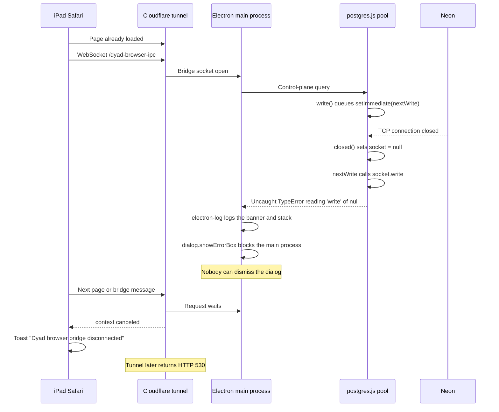

# Keep the preview bridge up when a database socket closes

> Generated by swarm planning session on 2026-10-05

## Summary

A preview factory run dies a few minutes in because a closed Neon connection throws inside `postgres` `nextWrite`, and the main-process error handler then opens a native dialog that nobody can dismiss. The Electron process stays up and stops answering, so the browser bridge socket closes and Safari reports the iPad as offline. The fix is to keep that dialog off the headless preview so the process keeps serving the page.

## Problem Statement

A person in Discovery or Implementation on the preview loses the run in the middle. The home screen stays painted. In-flight calls fail with `Dyad browser bridge disconnected`, sometimes twice. A reload hangs until Safari says the iPad is not connected to the internet. Later the tunnel returns HTTP 530.

The iPad still has a network. The origin accepted the connection and then never finished the response.

## Sequence

The throw is `postgres@3.4.9` `connection.js` `nextWrite`. `write()` schedules it with `setImmediate`. `closed()` clears that timer and then sets `socket = null`. The timer still runs and calls `socket.write`. The log line before the crash was the Postgres notice `schema "wewebplus" already exists, skipping`, which `NoticeResponse` prints when `onnotice` is unset. That notice does not throw. It is the previous line, not the cause.

`src/main.ts` registers `log.errorHandler.startCatching`. `onError` logs the banner and does not return `false`, so electron-log still logs the stack and then calls `dialog.showErrorBox`. That call blocks the main process until the box is closed. The preview has no one to close it. Docker `restart: unless-stopped` does not restart a process that is still running. The healthcheck fails. cloudflared logs `Incoming request ended abruptly: context canceled` for `/` and `/dyad-browser-ipc`.

The page script in `src/main/browser_bridge.ts` rejects every in-flight call with `Dyad browser bridge disconnected` when that socket closes, then retries after 500ms. That is why the toast appears more than once while the already loaded screen stays up.

## Scope

### In Scope (MVP)

- Headless preview and Gas City, both started with `DYAD_BROWSER_BRIDGE=1`, must not call `dialog.showErrorBox`.
- The same uncaught exception on the desktop app still opens the native dialog.
- The handler still logs the banner and the stack. `onError` must not return `false`.
- After this change, the observed `nextWrite` throw does not freeze the process, so the bridge socket stays open and the factory run can continue.

### Out of Scope (Follow-up)

- A new reconnect banner, Retry button, or rewrite of the toast copy. The socket should not close for this failure, so that chrome is not the fix.
- Upgrading or patching `postgres`. The null-socket guard is unmerged upstream (`porsager/postgres` pull request 1168). npm `postgres` is still 3.4.9.
- Changing `src/control_plane/db.ts`, the pool size, or `CREATE SCHEMA IF NOT EXISTS wewebplus`.
- Restarting the container when the process is wedged. A restart drops the in-memory run. The process has to keep serving.
- Changing the bridge client string or the 500ms retry.
- Persisting the composer draft across a real HTTP 530.

## User Stories

- As a person in Discovery or Implementation on the preview, I want the bridge to stay connected when a pooled database connection closes, so the phase I am in keeps going.
- As a desktop user, I want a real main-process crash to still open the native error dialog.
- As a preview operator, I want the stack in the log without a dialog that freezes the tunnel.

## UX Design

### User Flow

1. The person is on the preview, already in a phase, with the page loaded.
2. A pooled Neon connection closes and `nextWrite` throws.
3. The main process logs the error and keeps serving.
4. The bridge socket stays open. The phase, the composer draft, and the thread stay where they were.
5. A control-plane call that was on the closed connection fails as that call's own error. It does not take down the page.

### Key States

- **Default:** No connection chrome. The phase continues.
- **Loading:** Unchanged. This fix does not add a reconnecting state.
- **Empty:** Unchanged.
- **Error:** A genuine database failure on one call stays on that call. The whole page does not turn into the bridge-disconnected toast, and Safari is not left explaining a hung origin.

### Interaction Details

The toast `Dyad browser bridge disconnected` remains the message for a socket that actually closes. This fix stops this crash from closing it. A native dialog never appears in the preview, because the person cannot see or dismiss it.

### Accessibility

No new control. The existing toast is unchanged for real disconnects.

## Technical Design

### Architecture

The throw happens on a timer after the driver has already closed the socket. It is not a rejected query. Catching it inside the driver would mean a fork. The damage that reaches the person is the blocking dialog after the throw.

`showErrorBox` does not need a `BrowserWindow`. It is registered at the top of `src/main.ts`, before any window exists. A desktop crash at startup has zero windows and must still show the box. Gating on window count would hide that dialog and would also leave the preview dialog in place, because the preview healthcheck uses a virtual display. Gate on the env var the preview and Gas City already set.

### Components Affected

- `src/main/main_process_error_dialog.ts` — new. `showMainProcessErrorDialog(env)` is true unless `env.DYAD_BROWSER_BRIDGE === "1"`.
- `src/main/main_process_error_dialog.test.ts` — the three env cases.
- `src/main.ts` — pass `showDialog: showMainProcessErrorDialog()` into the existing `startCatching({ onError })`. Keep `onError` from returning `false`.

Unchanged: `src/main/browser_bridge.ts`, `src/control_plane/db.ts`, `compose.preview.yml`, the `postgres` dependency, and the deep-link `dialog.showErrorBox` calls.

### Data Model Changes

None.

### API Changes

None.

## Implementation Plan

### Phase 1: Stop the preview dialog from freezing the process

- [x] Add `showMainProcessErrorDialog`.
- [x] Use it as `showDialog` in `src/main.ts`.
- [x] Cover unset, `"0"`, and `"1"`.
- [x] Run `npm test -- src/main/main_process_error_dialog.test.ts`.

## Testing Strategy

- [x] Unit test the env gate. Do not import `src/main.ts` in that test.
- [ ] Do not add a Postgres, Neon, or Playwright test. The throw is inside the driver. The change is the dialog flag.
- [ ] Manual check on the next preview: a factory run stays on the bridge past the first few minutes. The container log may still contain the TypeError. It must not be followed by a hung origin or HTTP 530 from this crash.

## Risks & Mitigations

| Risk                                                                         | Likelihood | Impact | Mitigation                                                                                                                                                         |
| ---------------------------------------------------------------------------- | ---------- | ------ | ------------------------------------------------------------------------------------------------------------------------------------------------------------------ |
| Node treats the process as undefined after `uncaughtException`               | Medium     | Medium | The socket is already closed and the driver has already handled `closed()`. The event loop keeps running because the dialog no longer blocks. The bridge stays up. |
| The same TypeError logs on every later Neon close                            | Medium     | Low    | It no longer freezes the tunnel. A driver upgrade waits until the null guard is released.                                                                          |
| Gas City also sets `DYAD_BROWSER_BRIDGE=1`, so it loses the native crash box | Low        | Low    | Gas City is headless too. The banner and stack still go to the log.                                                                                                |
| A preview entrypoint forgets the env var                                     | Low        | High   | `compose.preview.yml` already sets it. The unit test locks the flag to that value.                                                                                 |
| One in-flight control-plane call was on the closed socket                    | Low        | Low    | That call fails on its own. It does not close the bridge.                                                                                                          |

## Open Questions

- None that block the change. A later pass can set `onnotice` on the control-plane client so the schema notice is not printed with `console.log`, and can pick up the postgres null-socket guard when it is released.

## Decision Log

- The bridge toast is a symptom. The socket closes because the main process is blocked in `dialog.showErrorBox` after `nextWrite` throws. Stopping the dialog is the fix that keeps the run going.
- Do not restart the container as the recovery path. The process is still alive, and a restart drops the in-memory factory run.
- Do not hide desktop crashes. `showDialog` stays on unless `DYAD_BROWSER_BRIDGE` is `"1"`.
- Do not gate on window count. A desktop crash before the first window must still show the box, and the preview can have a virtual display.
- Do not upgrade or patch `postgres` in this change. The published 3.x line is still 3.4.9, and the upstream null check is unmerged.
- Do not add a reconnect banner in this change. If the socket stays open, the toast does not fire. A new banner would be a separate product change for other disconnects.
- Gas City shares the gate because it is the same headless env var. The stack is still logged.

---

_Generated by dyad:swarm-to-plan_
