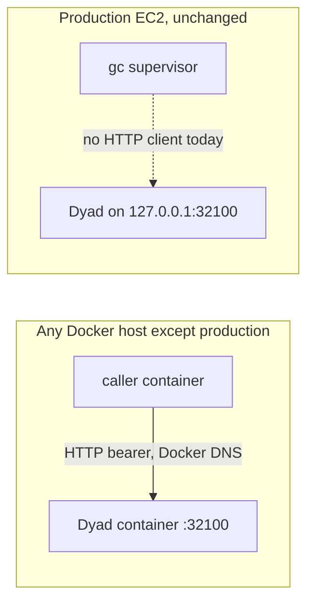
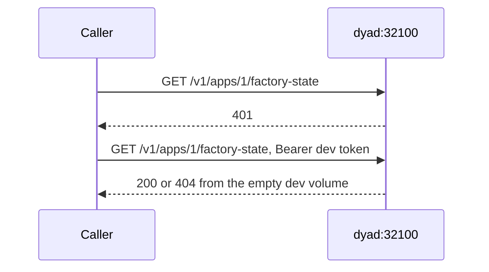

# Preview environments — implementation plan

> Updated 2026-10-03 after a read-only pass over the production EC2. Nothing on that host was changed. This plan is for review. Do not start the work until it is approved.
>
> This replaces the first draft of this file. That draft put preview stacks on the production EC2, shared one Gas City, called a variable `GAS_CITY_HOST_BRIDGE_URL` that does not exist, and ended in Kubernetes namespaces. The host matches none of those.

## Decision this plan asks you to approve

Prove Dyad and a Gas City client as two containers on a Docker bridge network, on a machine that is not the production EC2. Production stays the current container, the current `gc` process, the current Supabase database, and the current tunnel.

A second EC2, a registry, a Neon migration, a preview controller, and Kubernetes are later decisions. They are not how this implementation starts.

## Production, measured 2026-10-03 10:22 UTC

Host `13.251.216.187` (`ip-172-31-14-171`), Ubuntu 22.04.5, 4 CPUs, 15Gi RAM (13Gi available), load 0.08. One ext4 root, 29G, **5.1G free**, 83% used, inodes 13% used. Uptime 8 days. No cron.

| Path                          | Size | What it is                                                                  |
| ----------------------------- | ---- | --------------------------------------------------------------------------- |
| `/var/lib/containerd`         | 9.6G | Overlay snapshots for the images below                                      |
| `/var/lib/docker`             | 2.0G | Docker metadata, volumes, and the 2.7G build cache counted inside this tree |
| `/opt/gascity/city`           | 1.9G | Live Gas City city, including embedded Dolt                                 |
| `/opt/gascity/projects`       | 319M | 9 app directories, bind-mounted into Dyad                                   |
| `/opt/gascity/weaver-plus`    | 98M  | Git checkout `cursor/browser-dyad-ui-bbea` at `ad0138a5`, clean             |
| `/opt/gascity/gascity-source` | 82M  | Gas City source. It does not call Dyad's `/v1/apps` API                     |

Docker: overlayfs, 6 images, build cache 2.75G (544MB marked reclaimable without `-af`). No registry.

| Image                                                | ID             | Size                   | Role                                        |
| ---------------------------------------------------- | -------------- | ---------------------- | ------------------------------------------- |
| `weaver-plus:gascity`                                | `8a85cc4a5d1d` | 2.88G                  | Running Dyad. Same ID as `gascity-previous` |
| `weaver-plus:gascity-before-once`                    | `0ed1ee86f43e` | 2.88G                  | Keep. Not free space                        |
| `registry.dagger.io/engine:v0.21.10`                 | `2a7c054e0864` | 1.04G                  | Build helper, running                       |
| `debian:bookworm-slim`                               | `3783cc01769c` | 116M                   | Unused by the live app                      |
| Victoria Metrics `v1.106.1` / Victoria Logs `v1.0.0` | small          | Metrics, loopback only |

Running containers: `weaver-plus-weaver-plus-1` (healthy, started 2026-10-02T22:35:20Z), `dagger-engine-v0.21.10`, `factory-victoria-metrics` (`127.0.0.1:8428`), `factory-victoria-logs` (`127.0.0.1:9428`). One exited container, `weaver-tty-test`, from 8 days ago. Volumes: `weaver-plus_weaver-plus-user-data` 45MB, Victoria Metrics data 2.0G, Victoria Logs 14MB. Compose project name `weaver-plus`, host network. The container label's working directory is `/tmp` because Dagger launched Compose from there. The source checkout is still `/opt/gascity/weaver-plus`.

| Listen            | Process                                                                                | Reachable from                                           |
| ----------------- | -------------------------------------------------------------------------------------- | -------------------------------------------------------- |
| `127.0.0.1:32100` | Dyad factory bridge                                                                    | This host only. No clients connected                     |
| `127.0.0.1:8373`  | Dyad browser bridge                                                                    | This host, plus the Cloudflare quick tunnel              |
| `127.0.0.1:8372`  | `/opt/gascity/gc supervisor run` since 2026-09-24 23:46 UTC. `gc version` prints `dev` | This host only                                           |
| `127.0.0.1:8390`  | `node /tmp/dyad-bridge-proxy.mjs`                                                      | Rewrites HTML and proxies to `8373`. Not the factory API |
| `127.0.0.1:5900`  | x11vnc                                                                                 | This host only                                           |
| `0.0.0.0:6080`    | websockify / noVNC                                                                     | Any address the security group allows                    |
| `0.0.0.0:8080`    | nginx, root `/opt/gascity/site`                                                        | Same                                                     |
| `0.0.0.0:80`      | nginx default site                                                                     | Same                                                     |
| `0.0.0.0:22`      | sshd                                                                                   | Operators                                                |

No process listens on 443, 7375, or 8081. `bridge.env` still names `BRIDGE_URL=http://127.0.0.1:8081` and `WEAVER_BASE_URL=http://127.0.0.1:32100`. Nothing reads that file. The supervisor's environment does not include `WEAVER_BASE_URL`. The `gc` binary does not contain `WEAVER_BASE_URL` or `/v1/apps/`.

Kubernetes is absent: no `kubectl`, `kubelet` inactive, `k3s` inactive. The unused `/opt/gascity/docker-compose.yml` describes `gastownhall/gascity:latest` on port 7375, two telegram bots, and a miniapp. Those containers are not running, and that image is not on the host.

Control-plane database is Supabase Postgres (`*.supabase.com:5432`, database `postgres`) via `WEWEBPLUS_DATABASE_URL`. It is not Neon. Vercel `hitl-web` uses that same variable. It does not call Dyad over HTTP.

Rollout files present, unread for values: `/usr/local/sbin/gascity-rollout`, `/etc/doppler/dyad-preview.token`, `/etc/doppler/aws-dev.token`. `scripts/gascity/rollout.sh` fast-forwards the checkout and runs `docker compose up --build` on this host. The last unpack that reached this disk failed with no space left. Free space is still 5.1G. The 8GiB gate in `plans/preview-token-rollout.md` is not implemented. This plan does not prune, rebuild, or roll that host.

Dyad's factory server is `startFactoryHostBridgeFromEnv` in `src/main/factory_host_bridge_server.ts`. It listens on `127.0.0.1` and `GAS_CITY_HOST_BRIDGE_PORT` (production: 32100). Callers send `Authorization: Bearer <GAS_CITY_HOST_BRIDGE_TOKEN>`. An `Origin` header is rejected. Routes under `/v1/apps/:id/...` link a project, post messages, approve a phase, start a run, and create HITL questions.

The browser UI is the bridge on 8373, reached through `cloudflared tunnel --url http://127.0.0.1:8373`. Vercel is the HITL question board, not that UI.

## What the first draft got wrong

- Phase 3 (`preview-14` on port 8383) builds on the disk that already failed an unpack.
- Phase 5 assumes a Kubernetes cluster on this EC2.
- "Gas City is shared, and Dyad calls `GAS_CITY_HOST_BRIDGE_URL`" reverses the real API. Dyad listens. A client calls Dyad. The live `gc` supervisor is not that client.
- Neon is not the production database. Moving production onto a Neon parent would change production, which this implementation does not do.
- Host networking is why `gc` and Dyad can share `127.0.0.1`. Two containers on a bridge network cannot, until Dyad can bind an address other than loopback.

## Target of the first implementation

```text
a Docker host that is not 13.251.216.187
  network: bridge name "dyad-proof"
  container dyad
    bind GAS_CITY_HOST_BRIDGE_HOST=0.0.0.0 inside the container
    port 32100 unpublished on the host
    own empty volume for projects and for ~/.config
    own bearer token
  container caller
    WEAVER_BASE_URL=http://dyad:32100
    same bearer token
    one request without the token, one request with it
```

Production is not in this picture. The default bind stays `127.0.0.1`, so a production rollout of the same code keeps today's loopback behavior until someone sets the env var.





A 404 on an unknown app is a successful network proof. A 401 without the token is the auth proof. Neither call leaves the Docker network.

## Later shape, not this implementation

After the proof is approved a second time:

```text
Production EC2
  gc supervisor and /opt/gascity/city stay
External Dyad container
  the image built off-host
Vercel preview
  hitl-web, pointed at a new empty Postgres, not production Supabase
```

Cutting production over is a config change on a client that can read `WEAVER_BASE_URL`, then stopping the production Dyad container. That client does not exist yet. Changing `bridge.env` today would not move traffic. That cutover is a separate approval. It is not phase 1.

## Implementation

Each phase stops for review. Phase 1 is the only phase this approval covers. Later phases are listed so the sequence is visible.

### Phase 1 — two containers, off production

Code, in this repo:

- In `src/main/factory_host_bridge_server.ts`, read `GAS_CITY_HOST_BRIDGE_HOST`. Empty or unset means `127.0.0.1`. Reject values that are not an IP address or `0.0.0.0`. Pass that host to `server.listen`.
- Unit-test the host resolution. The existing server tests keep using `127.0.0.1`. Add one test that a server constructed with host `0.0.0.0` accepts a connection on `127.0.0.1` from the same machine. That is the stand-in for another container on the same Docker network.
- Add `compose.bridge-proof.yml`. Two services, network `dyad-proof`, no `network_mode: host`, no `ports:` entry for 32100. Dyad gets `GAS_CITY_HOST_BRIDGE_HOST=0.0.0.0`, `GAS_CITY_HOST_BRIDGE_ENABLED=true`, a generated token, and an empty projects volume. The caller image is `curlimages/curl` and its command is the two requests above. This file is not what `gascity-rollout` runs.
- Do not change `compose.gascity.yml` host networking, `scripts/gascity/rollout.sh`, or `.github/workflows/gascity-rollout.yml`.

Run, only after you approve, on a Docker engine whose root disk is not this EC2:

1. `docker compose -f compose.bridge-proof.yml up --build --abort-on-container-exit`
2. The caller exits 0.
3. `docker compose -f compose.bridge-proof.yml down -v` removes the proof volumes.
4. On production, read-only: image `8a85cc4a5d1d` still healthy, `gc` pid 30127 still the supervisor, listeners unchanged, `/` still about 5.1G free.

The proof host needs about 12G free before the build. `Dockerfile.gascity` produces a 2.88G image. This EC2 has 5.1G free, so it is the wrong place to build even a proof.

Done when the caller log shows 401 and then a non-401 response, and the production checks still match the table above.

### Phase 2 — empty database and the HITL board

Not started with phase 1.

- New empty Postgres. A second Supabase project matches production. Neon is allowed for this empty database. Production `WEWEBPLUS_DATABASE_URL` stays on the current Supabase host.
- New `WEWEBPLUS_SECRETS_KEY`. The dev database starts empty, so the production key is the wrong key.
- Point a Vercel preview of `hitl-web` at that URI. Leave the production Vercel env on production Supabase.
- Repeat one question create from the caller container and read it through the preview.

### Phase 3 — a real Gas City client

Not started with phase 1.

The live `gc` binary cannot be reconfigured onto the external Dyad, because it never opens `WEAVER_BASE_URL`. This phase adds that client in Gas City, or a small process beside `gc` that does the `/v1` calls, still against the proof Dyad. It uses a new city directory from `gc init`, not a copy of `/opt/gascity/city`.

### Phase 4 — production cutover

A separate approval, after phase 3 has round-tripped one question.

- Save the current client URL.
- Point the production client at the external Dyad.
- Confirm one production-originated call hits the external Dyad and that `/opt/gascity/projects` did not gain a new app from that call.
- Stop `weaver-plus-weaver-plus-1` only after that confirmation. Leave `gc`, `/opt/gascity/city`, nginx, and Victoria running.
- Revert by restoring the saved URL and starting the previous image. `weaver-plus:gascity-previous` is already `8a85cc4a5d1d`.

No `docker compose up --build` on production in any phase. No `down -v`. No deletion of `weaver-plus:gascity-before-once`. No write to `/etc/doppler`. No edit of `bridge.env` before phase 4.

## Isolation

| Resource                 | Phase 1 proof                         | Production                                                      |
| ------------------------ | ------------------------------------- | --------------------------------------------------------------- |
| Machine                  | some other Docker host                | this EC2                                                        |
| Dyad image build         | on that host                          | not rebuilt                                                     |
| Bind address             | `0.0.0.0` inside the proof container  | stays `127.0.0.1`                                               |
| Token                    | new, compose-local                    | existing token, unread and unchanged                            |
| Projects and `~/.config` | empty volumes, deleted with `down -v` | `/opt/gascity/projects` and `weaver-plus_weaver-plus-user-data` |
| Gas City city            | not used                              | `/opt/gascity/city`                                             |
| Database                 | none in phase 1                       | production Supabase                                             |
| Browser URL              | none in phase 1                       | existing quick tunnel                                           |
| Vercel                   | none in phase 1                       | production env                                                  |

Shared on purpose, and only if the proof container is given them later: the Bedrock account. Phase 1 does not need Bedrock, Clerk, or Supabase.

## Approval

Reply with approval of phase 1 to authorize the code change and one off-host Compose run. That approval does not authorize phases 2–4, a new EC2, a prune of this disk, or any write to `13.251.216.187`.
