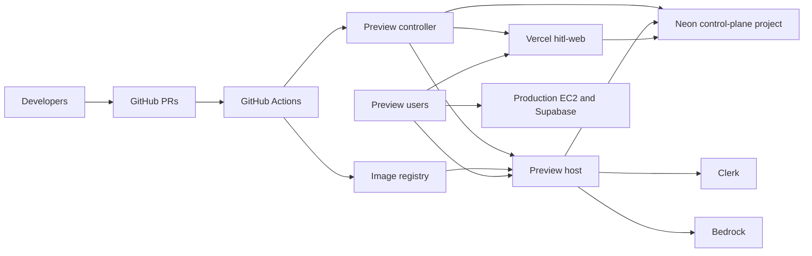
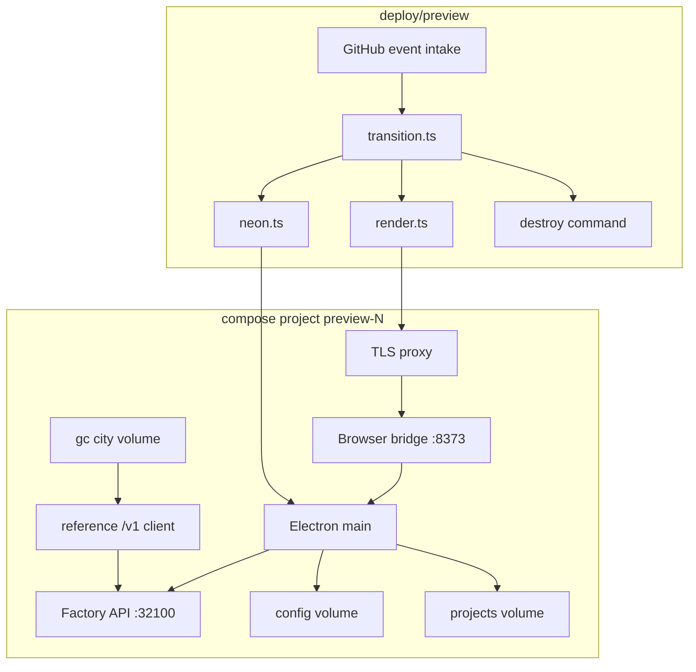
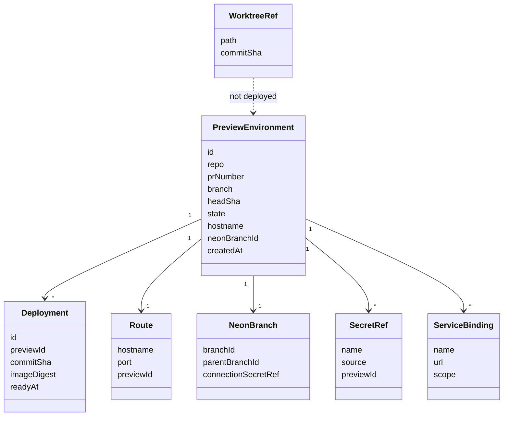
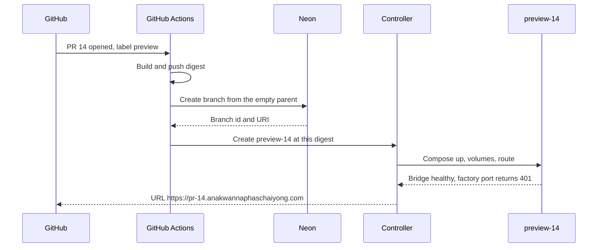
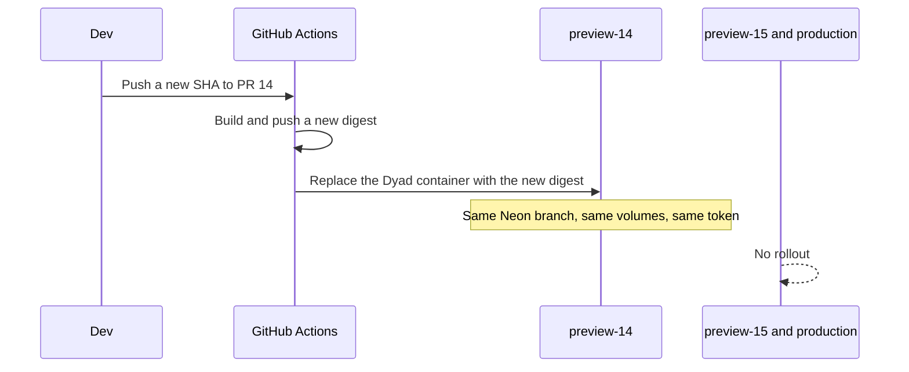
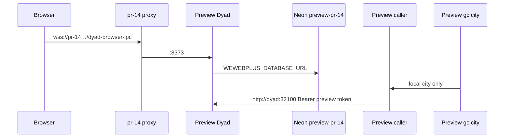
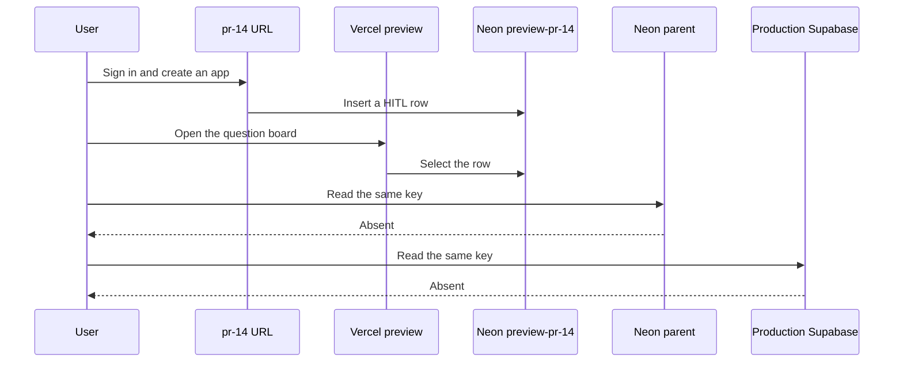
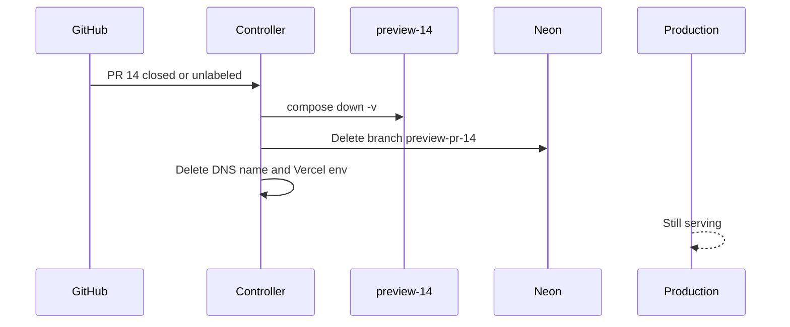
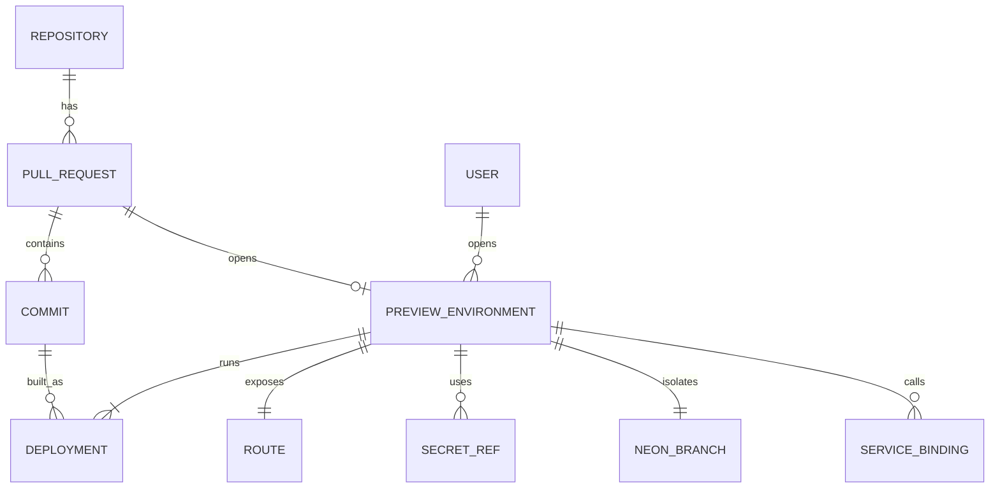

# Preview infrastructure

> Revision 2026-10-04, for review. Do not start the remaining work, and do not merge or close pull requests 17 through 24, until this revision is approved. The production EC2 was not changed. The sections below this revision are the 2026-10-03 record. Where they disagree with this revision, this revision wins.

A preview is one pull request. It runs its own Dyad container, its own Gas City city, and its own Neon branch. A git branch is the commit series. A Vercel Preview Deployment is the question-board page for that git branch. A worktree is where a developer edits. None of those three is the running environment by itself.

## Revision 2026-10-04

### What is already true

| Piece                     | Fact                                                                                                                                                                                                                                                                                                                                                                                                                                  |
| ------------------------- | ------------------------------------------------------------------------------------------------------------------------------------------------------------------------------------------------------------------------------------------------------------------------------------------------------------------------------------------------------------------------------------------------------------------------------------- |
| Preview machine           | Namespace Devbox `Wewebplus-ci`, shared with the workspace. `Wewebplus-preview` was private and has been deleted. GitHub Actions can exec the shared Devbox. A session stops at the plan maximum, and the public URL stops with it. Starting the Devbox again brings the files back.                                                                                                                                                  |
| Live proof                | Pull request 20. `https://pr-20.anakwannaphaschaiyong.com` serves the Dyad browser bridge from Compose project `preview-20`. Factory port 32100 is not published.                                                                                                                                                                                                                                                                     |
| Dyad image                | GitHub Actions publishes `ghcr.io/awannaphasch2016/dyad:sha-<commit>`. The production host does not pull it.                                                                                                                                                                                                                                                                                                                          |
| Neon                      | Child `preview-pr-20` of `Wewebplus-hitl` / `Dev`. The Devbox Dyad uses that child. The parent has no `wewebplus` tables. Production stays on Supabase.                                                                                                                                                                                                                                                                               |
| Vercel project            | One project, `dyad`, root directory `hitl-web`, production branch `main`. There is no second project named `wewebplus-hitl`. The token cannot create one.                                                                                                                                                                                                                                                                             |
| Vercel database for PR 20 | Git branch `cursor/preview-bridge-proof-9e7a` has `WEWEBPLUS_DATABASE_URL` on the Preview target only, env `s3oQUnCzA3xChhxQ`, host `ep-empty-sunset-b3pfwb1h-pooler.c-4.ap-southeast-1.aws.neon.tech`. That is Neon `preview-pr-20`. The Production environment was not written. Other git branches still share the unscoped Preview value. The code that does this is pull request 22 and is not on `main`.                         |
| Gas City image            | Built from fork `Awannaphasch2016/gascity` at `d47f1d3f3069dea8d46c0b2701faf035bd8a9179`, Dockerfiles `contrib/k8s/Dockerfile.base` and `Dockerfile.agent`. Published and pulled: `ghcr.io/awannaphasch2016/gascity@sha256:59e824d8393891dc849e11c838e791b89c59f748d6d8bae86ef2a21db838d916`. Tag `preview` points at that digest. It is not running in the preview Compose project yet. The city volume `pr-20-city` is still empty. |
| Application split         | Pull request 15 is a browser listener. `POST /v1/runs` returns 202 and stops. Question routes return 503. Pull request 16 is the Vercel UI. It calls that listener only when `NEXT_PUBLIC_GAS_CITY_URL` is set. Otherwise it calls its own `/v1` routes, which also stop after 202.                                                                                                                                                   |
| Controller                | `deploy/preview/*.mjs` on the proof branch. The pure transition is `transition.mjs`. A synchronize without the `preview` label does not destroy pull request 20.                                                                                                                                                                                                                                                                      |
| Workflow scope            | `preview.yml` runs for every pull request only after it is on `main`. Until then, only a branch that contains the file gets a preview.                                                                                                                                                                                                                                                                                                |

Phases 1 through 5 are done for pull request 20. Phase 6 is done for that one git branch. Phase 7 stays skipped. There is no non-production Kubernetes cluster.

### How a preview is connected

```mermaid
sequenceDiagram
  participant Git as Git branch of the pull request
  participant GH as GitHub Action
  participant Neon as Neon preview-pr-N
  participant Vercel as Vercel project dyad
  participant Page as Vercel Preview of that git branch
  participant Box as Devbox preview-N
  participant GC as ghcr.io/awannaphasch2016/gascity

  Git->>GH: Pull request N, label preview
  GH->>Neon: Create or reuse preview-pr-N
  GH->>Box: Dyad digest, WEWEBPLUS_DATABASE_URL = that child
  GH->>Vercel: Same URL, Preview target, this git branch only
  GH->>Box: Pull GC into the city volume
  Page->>Vercel: Read WEWEBPLUS_DATABASE_URL
  Page->>Neon: Questions and answers
  Box->>Neon: The same child
  GC->>Box: http://dyad:32100 on the preview network
```

`main` stays on the Production environment and on Supabase. Another git branch does not receive pull request N's variable.

### What to build next

Approval of this revision authorizes these five steps and no others. Each step stops when its check passes. None of them SSH to `13.251.216.187`, copy `/opt/gascity`, or change `gascity-rollout.yml`.

1. **Every labeled pull request gets its own Neon child on Vercel.** Land the assignment in pull request 22 onto the preview controller. `attach` writes `WEWEBPLUS_DATABASE_URL` for that git branch, target `preview`, then redeploys that branch. `destroy` deletes that variable and that Neon child. The Production environment is not written. Check: an answer on pull request 20's Vercel page is in `preview-pr-20`. An answer on a second labeled pull request is in its own child and is absent from `preview-pr-20` and from the production board.

2. **Run the published Gas City image in the preview.** Add a `gc` service to `compose.preview.yml` using `ghcr.io/awannaphasch2016/gascity@sha256:59e824d8393891dc849e11c838e791b89c59f748d6d8bae86ef2a21db838d916`. Mount volume `pr-<n>-city`. Do not mount `/opt/gascity`. Initialize a new city in that volume. Keep the reference caller until this `gc` itself calls `http://dyad:32100`. Check: `https://pr-20.anakwannaphaschaiyong.com` still serves Dyad, and the city volume is no longer empty.

3. **Point the pull request 16 page at that preview.** For that git branch only, set `NEXT_PUBLIC_GAS_CITY_URL` to the preview's Gas City origin. The page stops using its same-origin `/v1` stand-in. Until `gc` serves the browser routes, the pull request 15 listener is that origin, on the preview network, with the same Neon child. Check: a prompt from the Vercel page is logged by that preview listener and does not open Electron.

4. **Make a run continue.** The listener writes the gate into `preview-pr-<n>`, asks Dyad at `http://dyad:32100` to run the agent, and the page reads the result. An Electron-only capability still returns 409. Check: the new row is visible on that Vercel page and on `pr-<n>`, and absent from production Supabase and from every other preview.

5. **Put the workflow on `main`.** Merge `preview.yml` and the controller so a new labeled pull request gets a `pr-<n>` URL, a Neon child, and a Vercel variable without a one-off workflow. Production rollout stays where it is.

### What this approval does not include

- A change to the production EC2, its Supabase URL, its Gas City city, or `gascity-rollout.yml`.
- Closing pull request 20. Closing it destroys preview 20.
- Kubernetes.
- A second Vercel project.

### Pull requests 17 through 24

Writing this section does not merge or close anything. After this revision is approved, dispose of the set in the order below. The end state is pull requests 20, 22, 23, and 17 merged, pull request 24 merged into 17, pull requests 18 and 21 closed, and pull request 19 still open. Pull request 21's branch stays.

| Pull request | Action                                               | When                           | Why                                                                                                                                                                                                                                                                                                                                               |
| ------------ | ---------------------------------------------------- | ------------------------------ | ------------------------------------------------------------------------------------------------------------------------------------------------------------------------------------------------------------------------------------------------------------------------------------------------------------------------------------------------- |
| 22           | Merge into 20, then close                            | Step 1                         | Assigns `WEWEBPLUS_DATABASE_URL` for one git branch on Vercel project `dyad`. That code is not in pull request 20 yet.                                                                                                                                                                                                                            |
| 20           | Merge                                                | Step 5, after 22 is inside it  | Devbox Compose, Neon child, controller, and `preview.yml`. Other preview code lands here first. Closing it before that merge destroys preview 20.                                                                                                                                                                                                 |
| 23           | Merge                                                | Before step 2                  | The Gas City image is already in GHCR. This pull request is the rebuild workflow. Step 2 only consumes digest `sha256:59e824d8393891dc849e11c838e791b89c59f748d6d8bae86ef2a21db838d916`.                                                                                                                                                          |
| 24           | Merge into 17                                        | When this revision is approved | This file. It replaces the 2026-10-03 plan text.                                                                                                                                                                                                                                                                                                  |
| 17           | Merge after 24                                       | After 24 is inside it          | The plan document. Closing it before that merge drops this revision.                                                                                                                                                                                                                                                                              |
| 18           | Close                                                | When this revision is approved | The two-container proof already ran on `Wewebplus-ci` as pull request 20. `plans/dev-environment-external.md` is an older shape, including a proof that used production disk. Nothing in it remains to build.                                                                                                                                     |
| 21           | Close. Keep branch `cursor/preview-wake-tunnel-9e7a` | When this revision is approved | One-off wake of preview 20. Run [37179418133](https://github.com/Awannaphasch2016/dyad/actions/runs/37179418133) already returned HTTP 200. The workflow is hardcoded to `preview-20` and runs only from that branch (`workflow_dispatch` or a push). Do not merge it. Do not delete the branch: the next Devbox stop still uses that manual run. |
| 19           | Keep open                                            | Stays open                     | Production EC2 registry pull (`plans/offhost-image-pull.md`, `plans/preview-token-rollout.md`). This plan leaves `gascity-rollout.yml` and the production host alone.                                                                                                                                                                             |

Pull requests 15 and 16 are outside this set. Steps 3 and 4 use them. Leave both open in this cleanup.

## Decisions recorded 2026-10-03

These choices replace the open host and hostname questions below. Approving this revision still does not authorize phase 1.

| Choice                     | Decision                                                                                                                                                                                                                                                                                   |
| -------------------------- | ------------------------------------------------------------------------------------------------------------------------------------------------------------------------------------------------------------------------------------------------------------------------------------------ |
| Preview machine            | Namespace Devbox `Wewebplus-preview`, Linux, Docker Engine 29.3.0. It is not the production EC2. `docker version` on that Devbox printed a server.                                                                                                                                         |
| How long it stays up       | [Devbox lifecycle](https://namespace.so/docs/devbox/managing): Developer 4 hours, Team 5 hours, Business 24 hours. The limit applies while the Devbox is in use. When it stops, the preview URL stops. Files return when the Devbox starts again. A task marker does not pass the maximum. |
| Public name                | `https://pr-<n>.anakwannaphaschaiyong.com`. The zone is Active on Cloudflare. DNS records are created by the API token, not by hand. Namespace's own `namespaced.app` address is not the Clerk origin. A custom domain on Namespace is an enterprise feature.                              |
| Database parent            | Neon project `Wewebplus-hitl`, region `aws-ap-southeast-1`, default branch `Dev`. Child branches are `preview-pr-<n>`. Production stays on Supabase.                                                                                                                                       |
| Secrets                    | Doppler project `dyad`, config `preview`, inheriting `aws` / `dev`. The live EC2 token file stays on config `prd` and is not replaced with this preview token.                                                                                                                             |
| Automation credential      | `NAMESPACE_API_TOKEN` can activate, fetch, and list Devboxes. Phase 1 does not call it. The proof runs in the Devbox terminal, or on a GitHub-hosted runner.                                                                                                                               |
| Cloudflare names as stored | `CLOUDFLARE_API_TOKEN_`, `CLOUDFLARE_ZONE_ID_`, and `CLOUDFLARE_ACCOUNT_ID`. The first two names include a trailing underscore. Code reads those stored names.                                                                                                                             |
| Vercel                     | `VERCEL_TOKEN` can list a project named `dyad`. It does not list `hitl-web`. Phase 6 resolves that project before it writes a preview env.                                                                                                                                                 |
| Production checkout        | The measurement table below is from 10:22 UTC. The host checkout was later fast-forwarded to `328143c6` without an image rebuild. The running image is still `8a85cc4a5d1d`.                                                                                                               |

Compose project `preview-<pr>` is still the isolation name on that Docker engine. It is not a Kubernetes Namespace. Kubernetes remains phase 7 and stays off the production EC2.

## Current infrastructure

Production is one Ubuntu 22.04 host, `13.251.216.187`, 4 CPUs, 15Gi RAM, 29G disk, **5.1G free**. There is no Kubernetes (`kubectl` absent, `kubelet` and `k3s` inactive). There is no container registry.

| Piece           | Fact                                                                                                                                                                                                                                                      |
| --------------- | --------------------------------------------------------------------------------------------------------------------------------------------------------------------------------------------------------------------------------------------------------- |
| Dyad            | Container `weaver-plus-weaver-plus-1`, image `weaver-plus:gascity` `8a85cc4a5d1d` (2.88G), Compose project `weaver-plus`, **host network**, healthy since 2026-10-02T22:35:20Z                                                                            |
| Factory API     | `startFactoryHostBridgeFromEnv` listens on `127.0.0.1:32100`. Bearer token. `Origin` is rejected. No client was connected                                                                                                                                 |
| Dyad UI         | Browser bridge on `127.0.0.1:8373`, Cloudflare quick tunnel. This is not Vercel                                                                                                                                                                           |
| Gas City        | Host process `/opt/gascity/gc supervisor run` since 2026-09-24, listen `127.0.0.1:8372`, city `/opt/gascity/city` (1.9G, embedded Dolt). The process does not call Dyad. `WEAVER_BASE_URL` exists only in `/opt/gascity/bridge.env`, and nothing reads it |
| Projects        | `/opt/gascity/projects` (319M, 9 directories), bind-mounted into Dyad                                                                                                                                                                                     |
| Database        | Supabase Postgres via `WEWEBPLUS_DATABASE_URL`. Not Neon                                                                                                                                                                                                  |
| Vercel          | `hitl-web` reads and writes that same URL. It does not call Dyad                                                                                                                                                                                          |
| Also on the box | Dagger engine, Victoria on `127.0.0.1:8428` and `:9428`, nginx on `:80` and `:8080`, noVNC on `:6080`. No listener on 443, 7375, or 8081                                                                                                                  |
| Disk hogs       | `/var/lib/containerd` 9.6G, `/var/lib/docker` 2.0G, build cache 2.75G                                                                                                                                                                                     |
| Checkout        | `/opt/gascity/weaver-plus` at `ad0138a5` on `cursor/browser-dyad-ui-bbea`, clean                                                                                                                                                                          |
| Rollout         | `.github/workflows/gascity-rollout.yml` SSHes here and `compose up --build`. The 8GiB gate in `plans/preview-token-rollout.md` is not in the script                                                                                                       |

`src/neon_admin/` and `src/ipc/utils/neon_test_branch.ts` manage Neon branches for a **user's app database**. `apps.neonTestBranchId` (prefix `dyad-cleanup-only:v1:`) is that feature. Preview environments do not reuse it.

The unused file `/opt/gascity/docker-compose.yml` (`gastownhall/gascity:latest`, port 7375) is not the running engine.

## Target architecture

```text
git commit
  → GitHub Actions builds Dockerfile.gascity
  → registry weaver-plus@sha256:…
  → preview host (not the production EC2)
       compose project preview-<pr>
         dyad          factory API on the Docker network, UI behind TLS
         gc            new city directory, its own Dolt
         caller        HTTP client of http://dyad:32100 until gc itself speaks /v1
         volumes       config, projects, city
       route https://pr-<pr>.anakwannaphaschaiyong.com → that Dyad's browser bridge
  → Neon branch preview-pr-<pr>     this preview's WEWEBPLUS_DATABASE_URL
  → Vercel preview of hitl-web      same Neon URI
production EC2 stays on Supabase, host gc, and the existing tunnel
```

The Docker engine is the Namespace Devbox `Wewebplus-preview`. Compose project `preview-<pr>` is the per-PR isolation name on that engine. A Kubernetes Namespace is phase 7 only, on a cluster that is not the production host. That cluster does not exist today.

Previews do not build on the production disk. GitHub Actions has the disk for the image build. The preview host only pulls a digest.

## Infrastructure changes

- A container registry. GitHub Actions pushes `weaver-plus@sha256:…`. Production continues to build locally until a separate rollout change, which is not this plan.
- The preview host is the Namespace Devbox `Wewebplus-preview`. It already has Docker. It is not `13.251.216.187`. The first image pull still needs enough free space for the digest; phase 3 checks that on the Devbox before `compose pull`. The Devbox shuts down at the plan maximum in the decisions table, so a preview URL does not outlive that maximum.
- One Neon **project** for the control-plane schema (`wewebplus`). Its parent branch is empty apart from migrations. Each preview is a child branch. Production Supabase is not that parent.
- Compose project per preview, bridge network, no host network. Factory port 32100 is not published. The browser-bridge port is published only to the preview host's proxy.
- A controller: pure lifecycle types plus a GitHub Action. It does not read a worktree and it does not SSH to production.
- Doppler config other than the production `dyad`/`preview` token file. Shared names (Clerk, Bedrock) are copied per environment. The database URI and the host-bridge token are unique per preview.
- Code change already required by the network: `GAS_CITY_HOST_BRIDGE_HOST`, default `127.0.0.1`. Previews set `0.0.0.0` **inside** the container so another container on the same Docker network can connect. Production leaves the variable unset.
- A reference HTTP client for `/v1/apps/...`, because `gc` does not speak that API. Each preview runs that client on the same network. A later phase teaches Gas City itself to use `WEAVER_BASE_URL`.

## Branch, PR, and worktree isolation

| Kind         | What it isolates               | What it does not do                                    |
| ------------ | ------------------------------ | ------------------------------------------------------ |
| Worktree     | Files on a developer machine   | Deploy, run Dyad, hold a database                      |
| Branch       | The commit series              | Become an environment by itself                        |
| Pull request | The unit that owns one preview | Share volumes with another PR                          |
| Commit       | The image digest               | Change a running preview until the controller rolls it |

Opt-in is the GitHub label `preview` on an open pull request. Two worktrees on one laptop do not create two previews. Pushing both branches and labeling both PRs does.

Saving a file in a worktree does not change a running digest.

## Lifecycle

States: `provisioning` → `ready` → `updating` → `ready` → `destroying` → gone. `failed` is reachable from `provisioning` and `updating`. A failed update leaves the previous ready digest in place when one exists.

The transition function is pure and lives in `deploy/preview/transition.ts`. It is not an Electron distributed machine. Side effects (Neon, registry, Compose, DNS, Vercel env) live in `deploy/preview/controller.ts` and run only after the pure function returns a command.

- **Create.** PR opened or labeled `preview`. CI builds and pushes the digest if that SHA is not in the registry. Neon creates `preview-pr-<n>` from the empty parent. Controller writes the row, renders the Compose project, starts it, waits until the browser bridge answers and the factory port returns 401 without a token.
- **Update.** A new commit on the same PR builds a new digest and recreates only that Compose project. The Neon branch, volumes, hostname, and token stay. Control-plane migrations run on Dyad startup, against that branch only (`src/control_plane/db.ts`).
- **Test.** Open `https://pr-<n>.anakwannaphaschaiyong.com`. Sign in. Create an app. The files appear on that preview's projects volume. Insert a HITL row and read it on the matching Vercel preview. Confirm the row is absent on the Neon parent, on every other preview, and on production Supabase.
- **Destroy.** PR closed, merged, or unlabeled. `compose down -v` for that project only, delete the Neon branch, delete the DNS name, delete the Vercel preview env override. Production is not a target of this command.

## Deployment

GitHub Actions runs `docker build` from `Dockerfile.gascity` on the runner and pushes the digest. The controller on the preview host runs `docker compose pull` and `up -d` with `image: weaver-plus@sha256:…`. It does not use the checkout as the build context.

Production promotion stays `.github/workflows/gascity-rollout.yml`. This plan does not change that workflow and does not retag `weaver-plus:gascity`.

## Environment variables and secrets

The controller writes a per-preview env file on the preview host. Values are not image layers and not git. `SecretRef` stores a name and a source, never the value.

| Name                                                       | Scope                                   | Source                                                        |
| ---------------------------------------------------------- | --------------------------------------- | ------------------------------------------------------------- |
| `WEWEBPLUS_DATABASE_URL`                                   | one preview                             | Neon branch URI, resolved at start                            |
| `WEWEBPLUS_SECRETS_KEY`                                    | one preview                             | generated when the preview is created. Not the production key |
| `GAS_CITY_HOST_BRIDGE_TOKEN`                               | one preview                             | generated. Not the production token                           |
| `GAS_CITY_HOST_BRIDGE_HOST`                                | preview containers                      | `0.0.0.0`                                                     |
| `GAS_CITY_HOST_BRIDGE_PORT`                                | preview containers                      | `32100`, unpublished                                          |
| `GAS_CITY_HOST_BRIDGE_ENABLED`                             | preview Dyad                            | `true`                                                        |
| `DYAD_BROWSER_BRIDGE`                                      | preview Dyad                            | `1`                                                           |
| `DYAD_BROWSER_BRIDGE_PORT`                                 | preview Dyad                            | `8373` inside the container, mapped only to the proxy         |
| `WEAVER_PROJECTS_DIR`                                      | preview Dyad                            | the preview volume, not `/opt/gascity/projects`               |
| `WEAVER_BASE_URL`                                          | preview caller and, later, preview `gc` | `http://dyad:32100`                                           |
| `CLERK_PUBLISHABLE_KEY`, `CLERK_SECRET_KEY`                | shared identity provider                | Doppler. Each preview origin is added to the Clerk allow-list |
| `AWS_ACCESS_KEY_ID`, `AWS_SECRET_ACCESS_KEY`, `AWS_REGION` | shared Bedrock account                  | Doppler `aws`/`dev`, region `ap-southeast-1`                  |

Production `/etc/doppler/dyad-preview.token` and `/etc/doppler/aws-dev.token` stay where they are. The preview host has its own token file.

## External services

- **Neon.** New control-plane project. Create and delete branch through the Neon API, the same shape as `getNeonClient` in `src/neon_admin/neon_management_client.ts`. Connection URI the same shape as `getConnectionUri` in `src/neon_admin/neon_context.ts`. Do not call `src/ipc/utils/neon_test_branch.ts`.
- **Gas City.** One **new** city per preview (`gc init`), its own Dolt, on the preview network. Production `/opt/gascity/city` is not mounted and not copied. Until `gc` learns `WEAVER_BASE_URL`, the reference caller container is the process that hits Dyad.
- **Clerk.** One instance. Sessions are per origin, so two preview hostnames do not share a browser session. The controller adds and removes the preview origin.
- **Vercel `hitl-web`.** Already builds a preview per branch. The controller sets that preview's `WEWEBPLUS_DATABASE_URL` to the same Neon URI. Vercel does not run Electron, the browser bridge, or `gc`.
- **Bedrock.** Shared IAM. Previews do not get a second AWS account. Phase 1 of the proof does not need it.
- **Supabase.** Production only. Previews do not receive the production connection string.

## Networking and service discovery

Discovery is Docker DNS plus env vars. There is no VPN and no API gateway.

| Hop                           | Address                                                                | Published                                                 |
| ----------------------------- | ---------------------------------------------------------------------- | --------------------------------------------------------- |
| Browser → preview UI          | `https://pr-<n>.anakwannaphaschaiyong.com` → proxy → container `:8373` | yes, TLS at the proxy. WebSocket path `/dyad-browser-ipc` |
| Caller or preview `gc` → Dyad | `http://dyad:32100`                                                    | no                                                        |
| Dyad → Neon                   | the branch URI, TLS                                                    | outbound                                                  |
| Vercel → Neon                 | the same URI                                                           | outbound                                                  |
| Dyad → Bedrock                | `bedrock-runtime` in `ap-southeast-1`                                  | outbound                                                  |
| Preview → production EC2      | none                                                                   | —                                                         |

The proxy is a named Cloudflare tunnel on the Devbox. The API token creates the tunnel and the `pr-<n>` CNAME. It is not the production quick tunnel, and it is not nginx on the production box.

## Data and state isolation

| State                                | Preview                                               | Production                                 |
| ------------------------------------ | ----------------------------------------------------- | ------------------------------------------ |
| Postgres                             | Neon child branch. Writes allocate pages on the child | Supabase, untouched                        |
| Electron sqlite, Clerk session cache | volume `pr-<n>-config`                                | `weaver-plus_weaver-plus-user-data`        |
| App files                            | volume `pr-<n>-projects`, started empty               | `/opt/gascity/projects`                    |
| Gas City Dolt, beads, mail           | volume `pr-<n>-city` from `gc init`                   | `/opt/gascity/city`                        |
| Secrets key                          | new                                                   | existing                                   |
| Host-bridge token                    | new                                                   | existing                                   |
| Telemetry                            | off, or a preview Victoria                            | `127.0.0.1:8428` and `:9428` on production |

Do not snapshot production Dolt or production `~/.config` into a preview.

## CI/CD

New workflow `.github/workflows/preview.yml`. It is not `gascity-rollout.yml`.

Triggers: `pull_request` types `opened`, `synchronize`, `closed`, `labeled`, `unlabeled`. Concurrency group `preview-<pr number>`, `cancel-in-progress: false` so a destroy is not cancelled by a synchronize.

1. If the label `preview` is absent, or the PR is closed, run destroy and stop.
2. Build and push the image for `github.sha` when the digest is missing.
3. Invoke the controller: create or update `preview-<number>`.
4. The controller calls Neon, writes the env file, and applies the Compose project.
5. Post the preview URL as a commit status. The URL is the only secret-free output.

The workflow's SSH key, if it has one, is for the preview host only. It must not be `EC2_SSH_KEY` of the production host. A missing preview-host secret fails the job before any SSH.

GitOps (Argo CD, Flux) is not installed. The controller is the GitHub Action until a cluster exists. Adding Argo is part of the Kubernetes phase, not before.

## Migration from today

Today one checkout is fast-forwarded and `compose up --build` replaces `weaver-plus:gascity` on the host network, one volume, one Supabase URL. A second copy on that host cannot bind 32100 or 8373, and the disk cannot hold another 2.88G unpack.

Migration order:

1. Land the bind-address change. Production default stays loopback, so a later production rollout of this commit does not open 32100.
2. Teach CI to push a digest. Do not point production at the registry yet.
3. Stand up the preview host and one manual Compose project for a single PR.
4. Turn on the controller for the `preview` label.
5. Attach Neon and the Vercel preview env.
6. Leave production on Supabase and on `gascity-rollout.yml`.

No phase runs `docker compose` against the production project, prunes its images, or writes `/etc/doppler` there.

## Phases

### Phase 1 — bind address and a local proof

Files:

- `src/main/factory_host_bridge_server.ts`: `GAS_CITY_HOST_BRIDGE_HOST`, default `127.0.0.1`. Reject anything that is not an IP.
- A unit test for that default and for `0.0.0.0` accepting a local connection.
- `compose.bridge-proof.yml`: services `dyad` and `caller` on network `dyad-proof`. No `ports:` for 32100. Caller expects 401, then a non-401. This file is not used by `rollout.sh`.

Run the compose file on a Docker engine that is not the production host, then `down -v`. Re-read production: image `8a85cc4a5d1d` still healthy, `gc` still the supervisor, disk still about 5.1G free.

### Phase 2 — registry

GitHub Actions builds `Dockerfile.gascity` and pushes the digest. The production host does not pull it. Acceptance: the same SHA pushed twice does not rebuild.

### Phase 3 — one preview on the preview host

Compose project `preview-14` on Devbox `Wewebplus-preview`, from the digest of one open PR. Own volumes. `WEAVER_BASE_URL=http://dyad:32100`. A new `gc` city, not a copy. Hostname `pr-14.anakwannaphaschaiyong.com`. The URL lasts until the Devbox hits the maximum in the decisions table. Production listeners unchanged.

### Phase 4 — Neon branch

Create the control-plane Neon project and branch `preview-pr-14`. Dyad's existing migrator applies `control-plane/drizzle` to that branch on startup. A row written there is absent from production Supabase.

### Phase 5 — controller

`.github/workflows/preview.yml` and `deploy/preview/{state,transition,controller,render,neon}.ts`. Label on creates, synchronize updates, close destroys. A second PR gets `preview-15` and does not roll `preview-14`.

### Phase 6 — Vercel

The `hitl-web` preview for that branch receives the Neon URI. The question created in Dyad shows on that Vercel deployment and not on the production Vercel deployment.

### Phase 7 — Kubernetes, only if a non-production cluster exists

Render the same Compose services as Deployments in namespaces `preview-<pr>`. Production EC2 does not gain `kubelet`. Skip this phase if no cluster is provided.

## Verification and acceptance

- Two labeled PRs and production answer at the same time, on three different databases.
- A commit to PR 14 rolls only `preview-14`.
- A row inserted through PR 14 is absent from PR 15, from the Neon parent, and from production Supabase.
- An app created on PR 14 is a directory on `pr-14-projects` and not under `/opt/gascity/projects`.
- Closing PR 14 removes its Compose project, volumes, Neon branch, DNS name, and Vercel env. Production image id, `gc` pid, and tunnel still match the table at the top.
- A dirty worktree does not change any digest.
- From the public internet, port 32100 on the preview host does not accept a connection.
- The caller without a bearer token receives 401. With the preview token it does not.

## Diagrams

### 1. System context

Who is outside the preview, and which machine they talk to. Developers push git. Users open URLs. The controller is the only writer of preview Compose projects and Neon branches. Production EC2 is in the picture so it is obvious that previews do not call it.



Maps to implementation: `CI` is `.github/workflows/preview.yml`. `Ctrl` is `deploy/preview/controller.ts`. `Host` is the preview Docker engine, not `13.251.216.187`. `Prod` stays on `gascity-rollout.yml` and Supabase. There is no edge from `Host` to `Prod`.

### 2. Component diagram

What runs inside the controller and inside one preview Compose project.



Maps to implementation: `Life` is the pure function. `Render` writes a Compose file with the digest, the Neon URI, and `http://dyad:32100`. `API` is the server in `src/main/factory_host_bridge_server.ts`. `Bridge` is `src/main/browser_bridge.ts`. `GC` does not mount `/opt/gascity/city`. `Caller` exists because today's `gc` binary has no `/v1` client.

### 3. Class diagram

Records the controller keeps. These types are new. They are not `src/version_preview/` and not `apps.neonTestBranchId`.



`state` is `provisioning`, `ready`, `updating`, `destroying`, or `failed`. `Deployment` is append-only. The current digest is the latest row whose `readyAt` is set. `ServiceBinding.scope` is `preview` for Gas City and `shared` for Bedrock and Clerk. `WorktreeRef` is documentation that a local path is not a foreign key the controller stores.

Maps to implementation: `deploy/preview/state.ts` holds these types. `transition.ts` is the only place `state` changes. `SecretRef.source` is `doppler` or `neon`. The value stays in the env file on the preview host.

### 4. Sequences

#### Create



Maps to implementation: the workflow posts the commit status. Compose project name is `preview-14`. The digest is `weaver-plus@sha256:…`. Neon parent is the new control-plane project, not Supabase.

#### Update after a new commit



Maps to implementation: concurrency group `preview-14`. `gascity-rollout.yml` does not run for this branch.

#### UI to backend and external services



Maps to implementation: the browser never opens 32100. The caller is on the Docker network. Production `gc` is not in this sequence. Vercel is the next sequence, because it uses the database rather than this socket.

#### Access and test



Maps to implementation: both Dyad (`src/control_plane/hitl_device.ts` `syncRemote`) and `hitl-web/lib/db.ts` use `WEWEBPLUS_DATABASE_URL`. The test checks three databases, not one.

#### Destroy



Maps to implementation: destroy is keyed by PR number. It does not select the production Compose project `weaver-plus`.

### 5. ER diagram



`PULL_REQUEST` is the GitHub number. `PREVIEW_ENVIRONMENT` exists only while the label is on and the PR is open. `DEPLOYMENT` rows remain after destroy so the digest history is auditable. `SECRET_REF` stores the Doppler name or the Neon branch id. `SERVICE_BINDING` for Bedrock and Clerk is shared. The Gas City binding is per preview. There is no row whose host is `13.251.216.187`.

A worktree is not an entity. If two developers have the same commit checked out in two worktrees, they still share one `COMMIT`, and they get two previews only when they open two pull requests.

## Two developers

Ada's worktree is `~/src/dyad-ada` on branch `cursor/formula-graph-canvas-9e7a`, PR 14, labeled `preview`. Bao's worktree is `~/src/dyad-bao` on another branch, PR 15, labeled `preview`. Neither worktree is on the production host. Neither is copied into a container.

- CI stores `weaver-plus@sha256:<ada>` and `weaver-plus@sha256:<bao>`.
- The preview host runs Compose projects `preview-14` and `preview-15`. Each has its own Dyad, its own `gc` city, its own caller, and its own volumes.
- Neon has `preview-pr-14` and `preview-pr-15`, both migrated from the empty parent, not from Supabase.
- Ada opens `https://pr-14.anakwannaphaschaiyong.com`. Bao opens `https://pr-15.anakwannaphaschaiyong.com`. Production stays on its quick tunnel and on Supabase.
- Ada's caller posts a HITL question to `http://dyad:32100` inside `preview-14` only. Bao's Vercel preview does not list it. Production Vercel does not list it.
- Ada creates an app. The directory is on volume `pr-14-projects`. `/opt/gascity/projects` does not gain that directory.
- Ada pushes again. Only `preview-14` pulls the new digest. Bao's URL still serves Bao's digest. Ada's uncommitted worktree files are in neither container.
- Ada merges and the PR closes. `preview-14`, its volumes, its Neon branch, and its hostname are deleted. Bao's preview and production keep running.

## What the 2026-10-03 approval did not include

The 2026-10-04 revision above replaces this paragraph. Phases 1 through 5 have since landed for pull request 20, and phase 6 has landed for that one git branch. The remaining authorization is the five steps in that revision. Production image `weaver-plus:gascity` stays on the EC2. No `compose down -v` on project `weaver-plus`. No SSH write to `13.251.216.187`.
