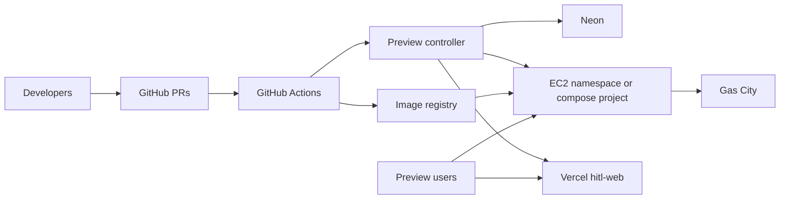
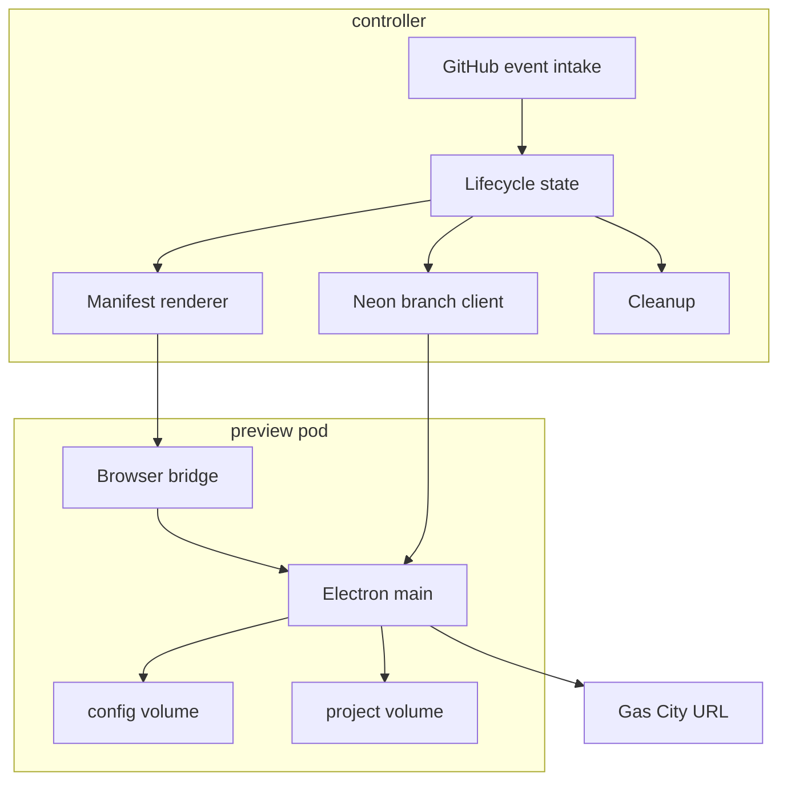
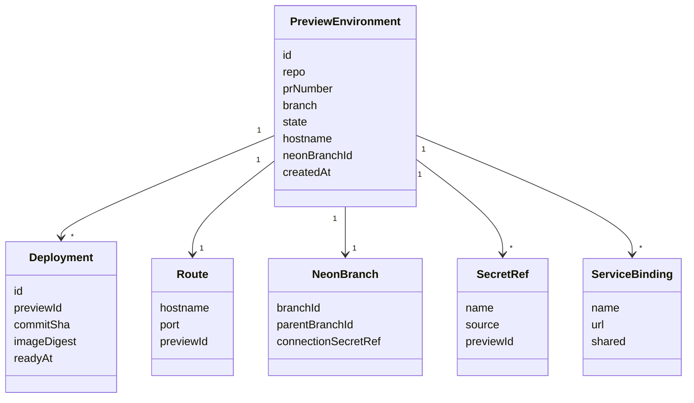
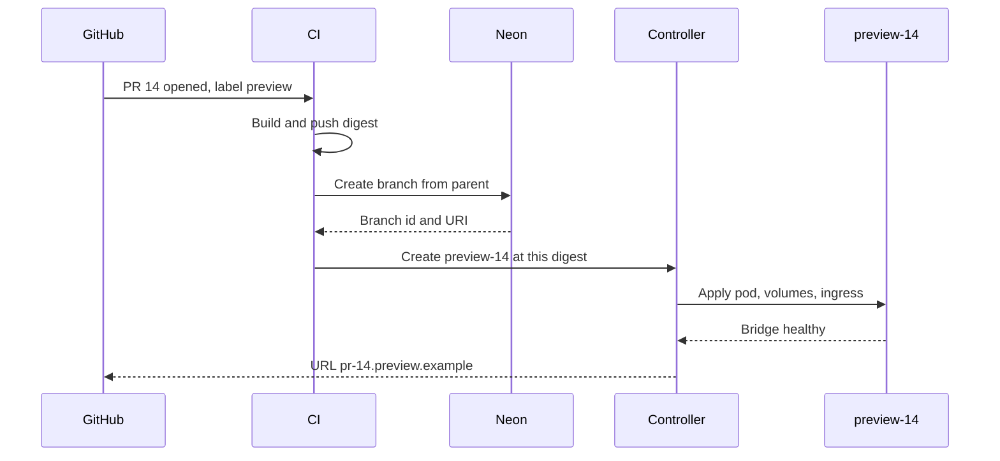
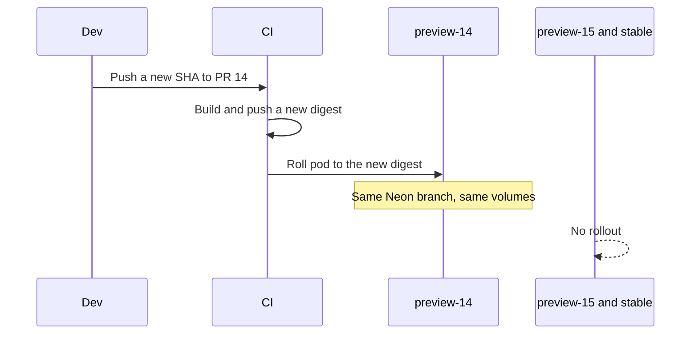
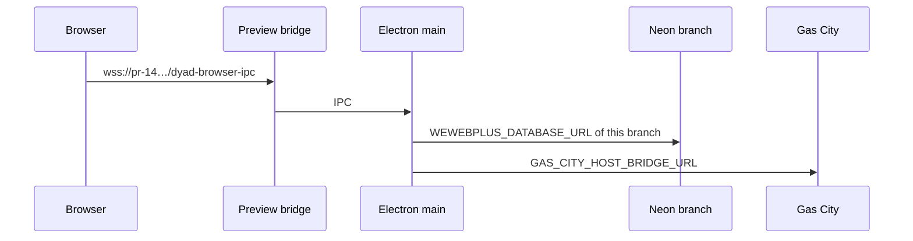
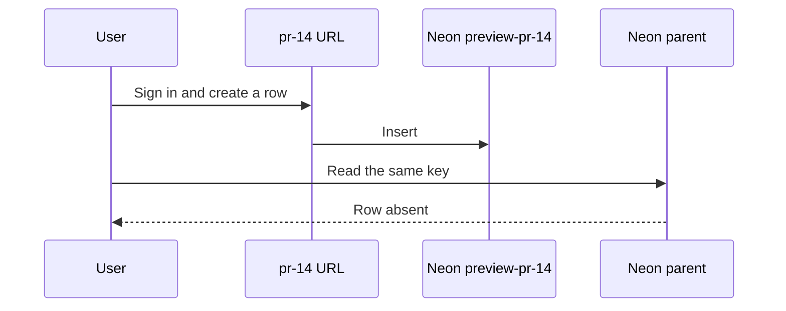
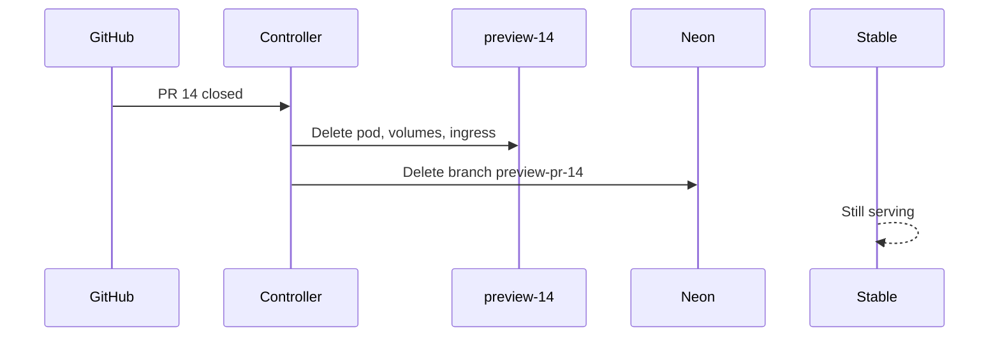
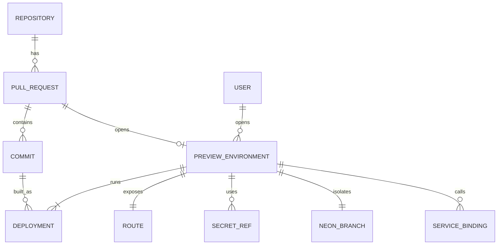

# Preview environments

> Written 2026-10-03. Database isolation is Neon. This is not `plans/preview-token-rollout.md` (one image rebuild) and not `src/version_preview/` (in-app version checkout).

## Summary

A preview is a deployment of one image digest into its own environment. The developer’s worktree is not that environment. A push updates only the preview for that pull request. `main` and every other preview stay where they are.

Neon branches the Wewebplus Postgres database (`WEWEBPLUS_DATABASE_URL`). Gas City stays one service. Each preview gets its own project directory and its own Neon connection string.

## Target architecture

```text
commit SHA
  → CI image weaver-plus@sha256:…
  → namespace preview-<pr>
       Dyad pod (browser bridge)
       volume for ~/.config
       volume for projects
       Ingress https://pr-<pr>.preview.example
  → Neon branch preview-pr-<pr>   (this preview’s WEWEBPLUS_DATABASE_URL)
  → Gas City (shared) at GAS_CITY_HOST_BRIDGE_URL
stable namespace keeps the main digest, the Neon parent branch, and the stable URL
```

Vercel keeps building `hitl-web`. A preview deployment of that app receives the same Neon branch URL as the matching Dyad preview. Vercel does not run the Electron canvas.

## Infrastructure changes

- A container registry. The host stops building from `/opt/gascity/weaver-plus` for previews.
- One Neon project for the control-plane database. Parent branch is production. Each preview is a child branch.
- Drop host networking for preview pods. Each preview has its own bridge port behind an Ingress. Stable can stay on 8373 until the cutover.
- A preview controller record (table below). GitHub Actions creates and deletes it. The controller does not read a developer worktree.
- Doppler `dyad`/`preview` remains the secret source. The database URL is overwritten per preview by the Neon branch URI. Other names are copied, not shared through one process environment.
- Gas City is reached by URL, not by `127.0.0.1` inside the host network namespace.

## Isolation

| Thing                       | Stable                  | Preview PR 14           | Preview PR 15           |
| --------------------------- | ----------------------- | ----------------------- | ----------------------- |
| Git                         | `main`                  | that PR’s SHA           | that PR’s SHA           |
| Worktree                    | none used to deploy     | none used to deploy     | none used to deploy     |
| Image                       | digest A                | digest B                | digest C                |
| Namespace / compose project | `stable`                | `preview-14`            | `preview-15`            |
| URL                         | stable host             | `pr-14.…`               | `pr-15.…`               |
| Postgres                    | Neon parent             | branch `preview-pr-14`  | branch `preview-pr-15`  |
| Dyad sqlite + settings      | volume `stable-config`  | volume `pr-14-config`   | volume `pr-15-config`   |
| App project files           | `/opt/gascity/projects` | volume `pr-14-projects` | volume `pr-15-projects` |
| Gas City engine             | shared                  | shared                  | shared                  |

A worktree may exist on a laptop or on the host for editing. Deploy never uses it as the build context.

## Lifecycle

States: `provisioning` → `ready` → `updating` → `ready` → `destroying` → gone. `failed` can be entered from `provisioning` or `updating`. Failed leaves the previous ready digest in place when one exists.

- **Create.** Pull request opened or labeled `preview`. CI builds and pushes the digest. Neon creates a branch from the parent. Controller writes the row, applies the namespace, waits until the bridge is healthy.
- **Update.** A new commit on that same pull request builds a new digest and rolls only `preview-<pr>`. The Neon branch is kept. Migrations run against that branch. Other previews and stable are not rolled.
- **Test.** Open the preview URL. Sign-in redirect for that host works. Create a row in the preview database and confirm it is absent on the parent and on the other preview.
- **Destroy.** Pull request closed or unlabeled. Delete the namespace and volumes, delete the Neon branch, delete the DNS name. Stable is untouched.

Pin rule: the running digest changes only when this lifecycle runs. Saving a file in a worktree does not.

## Deployment

CI builds `Dockerfile.gascity` once per SHA and pushes `weaver-plus:<sha>`. The controller sets the pod image to that name. It does not run `docker compose up --build` from a checkout.

Stable is promoted by deploying the already-built digest of `main`. It is not rebuilt at promote time.

## Environment and secrets

Doppler `dyad`/`preview` supplies Clerk, the host-bridge token, noVNC, and `WEWEBPLUS_SECRETS_KEY`. The controller writes a per-preview env file:

- `WEWEBPLUS_DATABASE_URL` = Neon branch URI for this preview only
- `DYAD_BROWSER_BRIDGE=1`
- `DYAD_BROWSER_BRIDGE_PORT` = this preview’s port
- `GAS_CITY_HOST_BRIDGE_URL` = the shared Gas City base URL
- `WEAVER_PROJECTS_DIR` = this preview’s volume
- Clerk redirect allow-list includes `https://pr-<pr>.preview.example`

Secret values are not image layers and not git. The database URI is a secret reference stored as a Neon branch id, resolved at start.

## External services

- **Neon.** One branch per preview. Parent stays production. Existing `src/neon_admin/` is the API shape for user-app databases. The preview controller uses the same API for the control-plane project. It does not reuse `apps.neonTestBranchId`.
- **Gas City.** One engine. Previews call it over `GAS_CITY_HOST_BRIDGE_URL`. They do not mount `/opt/gascity/projects`.
- **Clerk.** One instance. Each preview origin is an allowed redirect. Sessions are not shared across hosts.
- **Vercel `hitl-web`.** Already previews per branch. Pass the matching Neon URI as that preview’s `WEWEBPLUS_DATABASE_URL`. The formula canvas stays on the Dyad pod.
- **Bedrock.** Shared IAM from Doppler `aws`/`dev`. Previews do not get a second AWS account.

## Networking

Preview pods use a bridge network, not the host network. Ingress routes `pr-<n>.preview.example` to that pod’s browser-bridge port. WebSocket `/dyad-browser-ipc` stays on that pod. Gas City is a Service or a stable host URL. Previews do not bind 8373 or 6080.

## Data and state

- Postgres: Neon copy-on-write branch. Writes allocate pages on the child. The parent is unchanged.
- Electron `~/.config`: a new volume per preview. Clerk and sqlite from stable are not in it.
- Generated app files: a new volume per preview, seeded empty or from a snapshot taken at create time. Not a live bind of the stable project directory.
- Gas City Dolt history: not branched by this plan. A preview that must change formula history gets a copy of the project files on its own volume and talks to the shared engine.

## CI/CD

GitHub Actions on `pull_request` (`opened`, `synchronize`, `closed`, `unlabeled`):

1. Build and push the image for `github.sha`.
2. Call the preview controller: create, update, or destroy `preview-<number>`.
3. The controller calls the Neon API, then applies the manifest with the digest.

The current `gascity-rollout.yml` remains the stable path until phase 2 replaces its `up --build` with a digest pull. It does not deploy previews.

## Migration from today

Today one checkout is fast-forwarded and `compose up --build` replaces `weaver-plus:gascity`. Host networking, one volume, and one database URL make a second copy impossible. Disk is about 5G free. `plans/preview-token-rollout.md` has to land first so a build can finish. This plan does not replace that token or that disk gate.

## Phases

1. **Registry.** Push the stable image by digest. Stable still one container. No second environment yet.
2. **Neon parent.** Move `WEWEBPLUS_DATABASE_URL` to a Neon branch named `main`. Stable uses only that URI.
3. **One manual preview.** Compose project `preview-14`, image digest of PR 14, new volumes, port 8383, Neon branch `preview-pr-14`. Stable stays on 8373.
4. **Controller.** The GitHub Action above. Label `preview` opts in. Close deletes the namespace, volumes, and Neon branch.
5. **Cluster.** Move the same manifests into Kubernetes namespaces `stable`, `preview-14`, `preview-15` on the EC2 cluster. Gas City stays outside those namespaces.
6. **HITL.** Vercel preview env for that branch receives the same Neon URI.

## Acceptance

- Two previews and stable answer on three hostnames at the same time.
- A commit pushed to PR 14 rolls only `preview-14`.
- A row inserted through PR 14 is absent on PR 15 and on the Neon parent.
- Deleting PR 14 removes its pod, volumes, Neon branch, and URL. Stable is still healthy.
- A dirty worktree on the host does not change any running digest.

## System context

Who talks to whom. Developers push git. Users open URLs. The preview controller is the only writer of preview namespaces and Neon branches.



This is the deploy path. The worktree is off to the side, used only by the developer. The controller never builds from it.

## Component diagram

What runs inside the controller and the preview pod.



`GitHub event intake` maps `opened` / `synchronize` / `closed` onto the lifecycle. `Manifest renderer` fills the digest, host, port, and Neon URI. `Cleanup` deletes the namespace, volumes, and Neon branch. The pod’s main process is the existing Dyad binary.

## Class diagram

Records the controller keeps. These are the types to add. They are not the in-app `version_preview` classes.



`state` is `provisioning`, `ready`, `updating`, `destroying`, or `failed`. `Deployment` is append-only. The environment’s current digest is the latest ready row. `ServiceBinding.shared` is true for Gas City and Bedrock.

## Sequences

### Create



### Update after a new commit



### UI to backend



### Access and test



### Destroy



## ER diagram



`PULL_REQUEST` is the GitHub number. `PREVIEW_ENVIRONMENT` exists only while the label is on and the PR is open. `DEPLOYMENT` rows remain after destroy so the digest history is auditable. `SECRET_REF` stores the Doppler name or the Neon branch id, never the secret value. `SERVICE_BINDING` rows for Gas City are shared across environments. `NEON_BRANCH.parent` is the stable branch.

## Two developers

Ada pushes PR 14. Bao pushes PR 15. Both are labeled `preview`.

- CI stores `weaver-plus:<ada-sha>` and `weaver-plus:<bao-sha>`.
- Neon has `preview-pr-14` and `preview-pr-15`, both copied from the parent at create time.
- Ada opens `https://pr-14.preview.example`. Bao opens `https://pr-15.preview.example`. Stable stays on its own host.
- Ada inserts a row. It is on `preview-pr-14` only.
- Ada pushes again. Only `preview-14` rolls. Bao’s URL still serves Bao’s digest.
- Ada’s uncommitted worktree is not in either pod.
- Ada merges and the PR closes. `preview-14`, its volumes, and its Neon branch are deleted. Bao and stable keep running.
