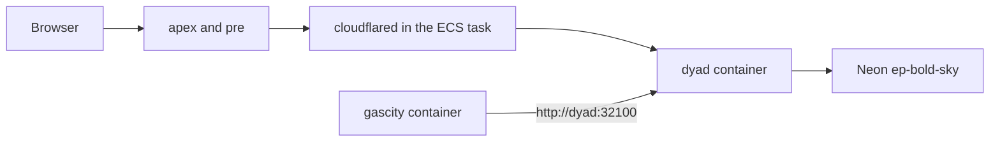

# Promote pre and retire gascity-server

> Written 2026-10-08 after Discovery → Implementation → Delivery worked on `https://pre.anakwannaphaschaiyong.com`.
> The earlier cutover note `plans/ecs-two-container-cutover.md` describes a cluster that had no task yet. This plan starts from the task that is already serving pre.

## Summary

Production becomes the two containers that are already running on `wewebplus-ecs`. The apex name starts opening that same task. The promotion is complete only when two Wewebplus users have shown that a human-in-the-loop question belongs to one of them. `gascity-server` is stopped only after that proof, the apex, and the preview still work while that instance is out of the path. The instance is terminated only after it has stayed stopped through one more successful session.

## What is already true

- `https://pre.anakwannaphaschaiyong.com` is served by ECS service `wewebplus-canary` on cluster `wewebplus`, task family `wewebplus-canary`, capacity instance `i-023d741ed3a1b3b25` (`wewebplus-ecs`). The running image at the time of this plan is `canary-bf0965717843` on task definition `wewebplus-canary:13`.
- That task has three containers on host networking: `dyad`, `gascity`, and `cloudflared`. `gascity` calls `http://dyad:32100`, and `dyad` is mapped to `127.0.0.1` inside the task. `desiredCount` is 1. Shared memory is 1024.
- Security group `sg-0d19518d244fede2d` has no inbound rules. Ports 32100, 6080, and 8373 are not public.
- Sqlite and project files live on Docker volumes `canary-user-data` and `canary-projects` on `wewebplus-ecs`. They are not the EC2 disk.
- Doppler `dyad/canary` points at Neon host `ep-bold-sky-b3ucveke-pooler`. Doppler `dyad/prd` points at `ep-young-wave-b3cwe0rz-pooler`. The canary GitHub identity cannot read `dyad/prd`.
- `gascity-server` (`i-0817f3778a5c9e1e2`, `13.251.216.187`) is still running. Its security group publishes 22, 80, 443, 8080, and 7375. Port 80 answers the stock nginx welcome page. The apex name `anakwannaphaschaiyong.com` has no address record and does not resolve. `www` reaches Cloudflare and the canary bridge answers 404, because that host is not the Dyad page.
- The canary tunnel ingress is `pre.anakwannaphaschaiyong.com` and `*.anakwannaphaschaiyong.com` to `http://127.0.0.1:8373`, then a 404 rule. The tunnel writer refuses to change the apex.

## Decision

Keep the pre database and the pre volumes. Do not copy the EC2 disk over them, and do not point this task at `dyad/prd`. The environment that just completed Discovery → Delivery is the one being promoted. `ep-young-wave` and the EC2 volume stay unused by this task. Switching either one is a different plan and would replace the apps now on pre.

After promotion there is still one Dyad process. Host networking cannot run a second task beside it. `pre` and the apex are two names for that process. A separate pre environment later needs a second capacity host.

## Scope

### In scope

- Let the apex hostname serve the existing Dyad task.
- Keep the preview iframe working when the parent page is the apex.
- Add the apex origin to Clerk.
- Prove multi-tenant human-in-the-loop with the two existing Wewebplus accounts before the apex is treated as production and before EC2 is stopped.
- Prove GasCity, networking, sqlite, Neon, and deploys do not use `gascity-server`.
- Stop that instance, then terminate it only after the stopped host is shown to be unused.
- Disable the workflow that can roll `gascity-server` again.

### Out of scope

- A third user, a second organization, or assignment rules beyond one question for one of these two accounts.
- A second ECS cluster, Fargate, EKS, or EFS.
- Importing EC2 sqlite or `/opt/gascity/projects` onto the canary volumes.
- Rewriting `WEWEBPLUS_DATABASE_URL` in Doppler `dyad/canary` or `dyad/prd`.
- Opening ports 32100, 6080, or 8373.
- User-app Vercel deploys in `src/ipc/handlers/vercel_handlers.ts`.

## User flow

1. The operator opens `https://pre.anakwannaphaschaiyong.com` and confirms the current app still previews. This is the rollback target until the apex works.
2. A deploy of the apex-host change goes out through the existing canary workflow. Pre keeps working. The apex still has no DNS record.
3. Clerk accepts the apex origin. The tunnel gains an apex ingress rule. DNS for the apex is created in one step.
4. On pre, in two browser sessions, the Project Manager and the Developer each see only their own question. The other account cannot read or answer it, including by calling the API directly.
5. The operator opens `https://anakwannaphaschaiyong.com` and repeats that two-session check on the apex. The preview still accepts a click.
6. `gascity-server` is still running during that check. Its nginx page is not the Dyad page.
7. The operator stops `gascity-server`. Pre, the apex, and one cross-account refusal are checked again. GasCity's call is still `http://dyad:32100` on the ECS task.
8. The instance stays stopped. Terminate is a separate later action, after a snapshot of its root volume.

No new screen is added. Visitors of the apex see the same Dyad window pre already shows.

## Technical design

`gascity-server` is not in that path.

### Code before any DNS write

The bridge currently rejects every `*.anakwannaphaschaiyong.com` host except `pre` and `p<port>`. Pointing the apex at the tunnel before this change would serve 404.

- `src/preview_iframe/public_preview_url.ts` — treat the exact apex host as a Dyad page host, same as `pre`. Leave `www` and every other name rejected.
- `worker/proxy_server.js` and `src/main/browser_bridge.ts` — the preview frame-ancestors list gains `https://anakwannaphaschaiyong.com` beside the existing pre origin. A parent other than those two, localhost, and `file:` stays refused.
- `deploy/preview/clerk-origins.mjs` — allow the apex origin to be added without dropping `pre` or the `pr-<n>` origins.
- `deploy/canary/tunnel.mjs` — add a separate writer for the apex ingress and the apex DNS record. `assertCanaryHostname` stays refused for the apex, so a normal canary deploy cannot move it. The promotion writer is a manual run and names only `anakwannaphaschaiyong.com`.
- `.github/workflows/gascity-rollout.yml` — remove the push trigger and `workflow_dispatch` after the stop succeeds, so a later button press cannot start `weaver-plus` again.

The iframe address for a preview port is already `https://p<port>.anakwannaphaschaiyong.com/`. That host stays. Only the allowed parent page changes.

### Two-user human-in-the-loop gate

One account walking Discovery → Implementation → Delivery does not prove this. The product proof is two people in one organization.

- Organization: Wewebplus, `org_3JuOz4PCITqmueMeKYhcFUXAEIH`.
- Project Manager: `user_3Jo9AXjywP5QJtRbqTWJTn5sdxN`.
- Developer: `user_3K58joknYZ90Fts4yQC6yq4Enay`.

Both already belong to that organization. A question is assigned to one of those roles. The matching account can read the body and submit the answer. The other account, in a separate browser session, does not receive the body and cannot submit the answer. A direct API request authenticated as the other account gets the same refusal.

`presentQuestion` and `decideAnswer` in `src/control_plane/hitl_rules.ts` already hide the body and return `forbidden` when the caller's role does not match. The unit tests use stand-in user ids. The promotion adds a test that uses these two user ids on the list and answer handlers, so a role mix-up between the real accounts fails in CI. The live check uses the two accounts the operator already has, one session each, on pre and again on the apex.

EC2 is not stopped until both the automated test and the two live sessions have passed.

### Data

No schema change. The task keeps the secrets it has. Neon stays `ep-bold-sky-b3ucveke-pooler`. Volumes stay `canary-user-data` and `canary-projects`.

Before the apex DNS write, remove `WEWEBPLUS_DATABASE_URL` from Vercel project `dyad` if it is still set. The HITL route files under `hitl-web/app/api/questions/` are already gone. A leftover Vercel deployment must not write this Neon project after the apex is the public name.

### Deploy

The image still ships through `.github/workflows/canary-verify.yml` on `cursor/ecs-hitl-cutover-bbea`. `deploy/canary/register.sh` still refuses `gascity-server`, the production database host, and a public bridge. The apex DNS write is not a step in that script.

## Implementation order

### 1. Allow the apex page, without publishing it

- [ ] Accept host `anakwannaphaschaiyong.com` in the bridge and reject `www`.
- [ ] Allow that origin in frame-ancestors when the bridge names it. Reject any other origin.
- [ ] Cover both with the existing bridge and proxy tests.
- [ ] Deploy through canary-verify. Confirm the running image tag matches the commit. Confirm pre still returns HTTP 200 with `data-dyad-browser-bridge`.

### 2. Close the second writer

- [ ] Confirm `hitl-web/app/api/questions/` is absent.
- [ ] Remove `WEWEBPLUS_DATABASE_URL` from Vercel project `dyad`.
- [ ] Leave `vercel_handlers.ts` in place.

### 3. Publish the apex

- [ ] Add `https://anakwannaphaschaiyong.com` to the Clerk allowed origins. Leave the pre origin in place.
- [ ] Add the apex ingress rule to tunnel `wewebplus-canary`, ahead of the 404 rule, service `http://127.0.0.1:8373`.
- [ ] Create the apex DNS record to that tunnel. Do not create a record for `www`.
- [ ] Confirm `https://anakwannaphaschaiyong.com` returns the Dyad page and `https://pre.anakwannaphaschaiyong.com` still does.

### 4. Prove two-user human-in-the-loop on pre

- [ ] Add a handler test with the Project Manager and Developer user ids above. A Project Manager question returns its body only to the Project Manager. The Developer session receives no body. The Developer's answer call is refused. The reverse holds for a Developer question.
- [ ] On `https://pre.anakwannaphaschaiyong.com`, sign in as each account in its own browser session.
- [ ] Create one question assigned to the Project Manager and one assigned to the Developer.
- [ ] Each account answers only its own question. The other account cannot read that body or submit that answer, including with a direct API request from that session.
- [ ] Leave `gascity-server` running. This gate is about the two accounts, not the old host.

### 5. Prove the promoted path

- [ ] Sign in on the apex and open the app that already previews on pre.
- [ ] The Implementation preview renders that page and accepts a click.
- [ ] Repeat the two-session question check on `https://anakwannaphaschaiyong.com` with the same two accounts.
- [ ] The supervisor is the `gascity` container with `WEAVER_BASE_URL=http://dyad:32100`. Nothing in the task listens on 8787.
- [ ] From outside the VPC, connections to ports 32100, 6080, and 8373 on `wewebplus-ecs` fail.
- [ ] `gascity-server` is still running, and its port 80 page is still the nginx welcome page.

### 6. Show that EC2 is unused, then stop it

- [ ] Record that the apex DNS target is the canary tunnel, the ECS service runs on `i-023d741ed3a1b3b25`, and no task definition or tunnel ingress names `i-0817f3778a5c9e1e2`.
- [ ] Snapshot the EC2 root volume `vol-020a3f0726876b135`.
- [ ] Stop `i-0817f3778a5c9e1e2`. Do not terminate it.
- [ ] Repeat the apex page check, the preview click, and one cross-account refusal with the two Wewebplus sessions. All three succeed while the instance is stopped.
- [ ] Disable `.github/workflows/gascity-rollout.yml`.

### 7. Terminate later

- [ ] After one more successful apex session on a later day, terminate `i-0817f3778a5c9e1e2`.
- [ ] Keep the volume snapshot until that session has been accepted.

## Rollback

- Before the DNS write: do nothing to DNS. Pre keeps serving the task.
- After the DNS write, before any new production-only data matters: delete the apex DNS record. Pre is unchanged. The EC2 instance is still running.
- After EC2 is stopped: start `i-0817f3778a5c9e1e2` again. Do not point the apex back at it unless the ECS task is down. The apex path is the tunnel, and the EC2 nginx page is not the Dyad app.
- Do not start EC2 and the ECS task as two writers of `ep-bold-sky`. The EC2 container, if it still has a database URL, must stay stopped while the ECS task is the writer.

## Risks

| Risk | Mitigation |
| --- | --- |
| Apex DNS is created before the bridge allows that host | The code deploy in phase 1 is confirmed on pre before phase 3. |
| A canary push moves the apex by accident | The existing tunnel writer still throws on the apex. Promotion uses a separate manual writer. |
| Preview works on pre and is blank on the apex | Frame-ancestors must name the apex origin before the DNS write. |
| EC2 and ECS both write Neon | EC2 is not given `dyad/canary`. It is stopped only after the apex path is shown to avoid it. |
| Stopping EC2 deletes the only copy of an old app | Snapshot `vol-020a3f0726876b135` first. This plan does not copy that disk onto the working volumes. |
| Vercel still writes Neon | Remove `WEWEBPLUS_DATABASE_URL` from project `dyad` before the DNS write. |
| Two tasks fight for host ports and sqlite | `desiredCount` stays 1. |
| Promotion is accepted with one signed-in user | EC2 stays up until both Wewebplus accounts have passed the question check on the apex. |

## Verification list

1. Pre still opens the Dyad page after the apex-host code is deployed.
2. On pre, the Project Manager and the Developer each answer only their own question. The other account cannot read or answer it, including through a direct API request.
3. The automated test covers those two user ids on the list and answer handlers.
4. The apex opens the same page, and the Implementation preview can be clicked.
5. The same two-account question check passes on the apex.
6. GasCity in the running task calls `http://dyad:32100`.
7. Ports 32100, 6080, and 8373 on the ECS host do not accept from the public internet.
8. With `gascity-server` stopped, steps 4 and 5 still succeed.
9. The EC2 instance is stopped, not terminated, until a later session repeats step 4.
