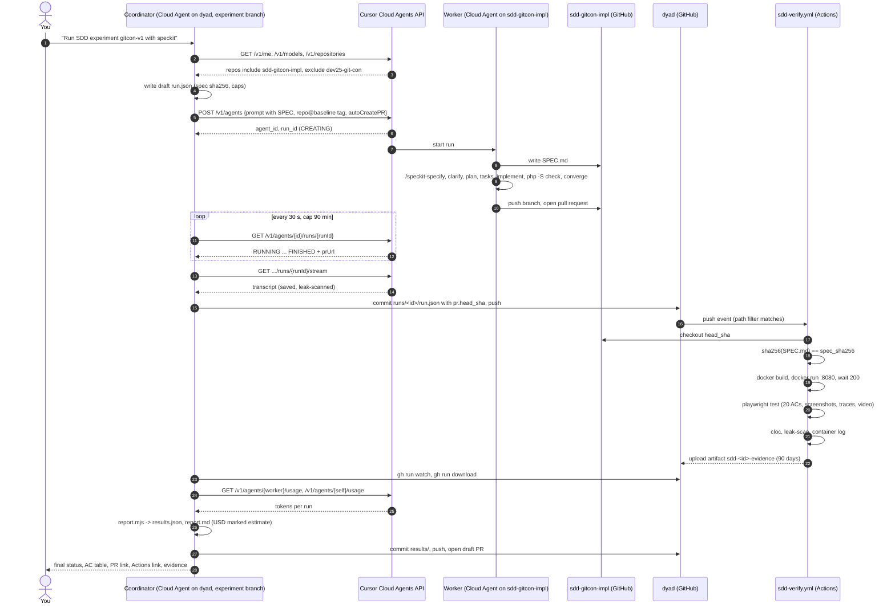

# Spec-driven development experiment 1: GitHub Spec Kit on GIT Conference

Written before implementation. Run 1 has since been executed; its result is in "Run 1 outcome". Section H is the unstarted follow-up. Every "verified" statement names the command or URL it came from and the date, 2026-10-09, unless a later date is given. Every "assumed" statement is marked.

Question the first run answers: can a Cursor Cloud Agent coordinate a second agent that uses GitHub Spec Kit to implement a website slice from a fixed specification, and then verify the result against acceptance criteria written before implementation, with no person walking through the UI?

## A. Current state

### A.1 What Dyad already has

| Capability                                   | Where                                                                                                | Reusable for this experiment                                                                                                       |
| -------------------------------------------- | ---------------------------------------------------------------------------------------------------- | ---------------------------------------------------------------------------------------------------------------------------------- |
| Branch-push operational workflows            | `.github/workflows/preview-image.yml`, `preview-exec.yml`, `preview-wake.yml`, `preview-formula.yml` | Pattern only. `on: push: branches: [<branch>]` with path filters is how this repo runs a workflow that is not on `main`.           |
| Pull request preview from a label            | `.github/workflows/preview.yml`, `deploy/preview/controller.mjs`, `scripts/gascity/preview-up.sh`    | Not directly. It deploys the Dyad image to Devbox `Wewebplus-ci`. The Namespace login and `devbox exec` steps are reusable text.   |
| Temporary public URL without credentials     | `scripts/gascity/preview-up.sh` lines 146 to 170, `cloudflared tunnel --url`                         | Yes, as the optional human-visible preview. No Cloudflare secret needed for a quick tunnel.                                        |
| Playwright on GitHub runners                 | `.github/workflows/ci.yml` jobs `build-e2e-artifacts`, `e2e-tests`, `merge-reports`                  | Pattern only. Those jobs test the Electron app on macOS and Windows. The verifier here needs Chromium against an HTTP server.      |
| Benchmark scoring with fixed Playwright CUJs | `benchmarks/app-builder/` (`s-score.sh`, `cuj-tests/`, `judge/`, `report.mjs`, `pricing/`)           | Shape only. Fixed journeys plus pinned pricing plus `results/*.json` is the model for this harness. The scripts are Dyad-specific. |
| Factory, HITL gates, GasCity                 | `src/lib/factoryPhase.ts`, `src/control_plane/hitl.ts`, `Dockerfile.gascity`                         | Not used in run 1. No gate is needed when the run has no human step.                                                               |
| Cloud Agent artifacts directory              | `/opt/cursor/artifacts` in this VM, symlink to `/cursor/stores/self/artifacts`                       | Yes. Files the coordinator writes there are listed by `GET /v1/agents/{id}/artifacts`.                                             |
| Cursor Cloud Agents API client               | none                                                                                                 | Nothing in the tree calls `api.cursor.com` (grep on 2026-10-09). A 150-line script is needed.                                      |
| Spec Kit                                     | none                                                                                                 | No `.specify/` or `speckit` in the tree.                                                                                           |

### A.2 Facts about the runtime, verified in this VM on 2026-10-09

- This Cloud Agent VM has `node`, `python3`, `gh`, 4 CPUs, 15 GiB RAM, 240 GiB free disk. It does not have `docker`, `php`, `uv`, or `cursor-agent`. So the coordinator cannot build or run the PHP site itself. Verification runs in GitHub Actions.
- `gh auth status`: logged in as the GitHub App installation `cursor`. `gh api repos/Awannaphasch2016/dyad` works. `gh api user`, `gh secret list`, and `gh api repos/Wewebplus/dev25-git-con` return 403 or 404. The token is scoped to this repository.
- `Awannaphasch2016/dyad` is public, default branch `main`.
- `workflow_dispatch` only works for workflow files that exist on the default branch. The experiment workflow will live on an experiment branch, so it triggers on `push` with a path filter, as `preview-exec.yml` does.

### A.3 Cursor Cloud Agents API, from https://cursor.com/docs/cloud-agent/api/endpoints on 2026-10-09

- `POST /v1/agents` creates an agent and its first run. Body: `prompt.text`, `model.id`, `repos[{url, startingRef}]`, `autoCreatePR`, `skipReviewerRequest`, `workOnCurrentBranch`, `env.type` of `cloud | pool | machine`, `mcpServers`, `customSubagents`, `envVars` (beta, silently ignored when not enabled), optional client `agentId`. Auth is Basic with the API key as the user name, or Bearer.
- `GET /v1/agents/{id}`, `GET /v1/agents/{id}/runs`, `GET /v1/agents/{id}/runs/{runId}` with statuses `CREATING, RUNNING, FINISHED, ERROR, CANCELLED, EXPIRED`; `POST /v1/agents/{id}/runs` for a follow-up; `POST .../runs/{runId}/cancel`; `GET .../runs/{runId}/stream` (SSE).
- `GET /v1/agents/{id}/usage` returns `inputTokens, outputTokens, cacheWriteTokens, cacheReadTokens, totalTokens` per run and in total. No currency. Cost in money is therefore an estimate from a pinned price table.
- `GET /v1/agents/{id}/artifacts` and `.../artifacts/download?path=artifacts/<file>` return a 15-minute presigned URL.
- `GET /v1/repositories` lists repositories accessible through the Cursor GitHub App installation of the key's owner. This is the isolation check: the ground truth repository must not appear.
- Webhooks: "coming soon" for v1. The coordinator polls.

So, to the question "can Cursor launch another worker agent programmatically": yes, through `POST /v1/agents` with a user or service-account API key available to the coordinator as a Runtime Secret. There is no built-in tool in a Cloud Agent for this; it is a `curl` or a node script. The alternative that needs no API key is the coordinator's own `Task` subagent, but that runs in the coordinator's repository and environment, which defeats workspace isolation and gives no per-agent usage record. The API is the right choice.

### A.4 Spec Kit, from `github/spec-kit` on 2026-10-09

- Latest release `v1.1.2`, 2026-10-07 (`gh api repos/github/spec-kit/releases/latest`).
- Install: `uv tool install specify-cli --from git+https://github.com/github/spec-kit.git@v1.1.2`. Init: `specify init --here --force --integration cursor-agent --non-interactive --script sh --ignore-agent-tools`. For Cursor this writes `.cursor/skills/speckit-<name>/SKILL.md` and `.specify/` (templates, scripts, `memory/constitution.md`). Commands are deprecated for Cursor; skills are the default (`src/specify_cli/integrations/cursor_agent/__init__.py`).
- The workflow steps are agent skills, not terminal commands: `/speckit-constitution`, `/speckit-specify`, `/speckit-clarify`, `/speckit-plan`, `/speckit-checklist`, `/speckit-tasks`, `/speckit-analyze`, `/speckit-implement`, `/speckit-converge`. Shorter path: specify, plan, tasks, implement, converge.
- Spec Kit has no independent verification agent. `/speckit-converge` compares the codebase against the spec, plan, and tasks that the same agent wrote and appends tasks. `/speckit-analyze` is a read-only consistency check across the artifacts. Neither runs the application or tests it from outside. Verification in this experiment is ours.
- Two headless concerns. `/speckit-clarify` asks the user questions. `/speckit-implement` "asks before proceeding if any checklist items are unchecked". In a Cloud Agent with no person, the worker prompt must say: resolve ambiguity from the spec's Assumptions section, do not wait for a reply, proceed past the checklist gate and record what was skipped.
- `specify workflow run speckit --input integration=cursor-agent` can drive the `cursor-agent` CLI headlessly with `-p --trust --approve-mcps --force` (opt-in, on `main`; issues #2628 and #2629 show it was IDE-only until recently). This is the fallback worker if Cloud Agent skills do not behave. It needs the CLI and a Cursor login inside a GitHub Actions job and approvals are switched off, so it must run in a throwaway container.
- Cloud Agents load project skills from `.cursor/skills/` in the repository (https://cursor.com/docs/skills, "Project skills in the repo are always available"). This is why the worker is a Cloud Agent on a repository where Spec Kit was initialised and committed.

### A.5 Missing infrastructure and permissions

| Item                                                             | Purpose                                                                           | Status                                                                                                                                                                                                                       |
| ---------------------------------------------------------------- | --------------------------------------------------------------------------------- | ---------------------------------------------------------------------------------------------------------------------------------------------------------------------------------------------------------------------------- |
| `CURSOR_API_KEY` as a Cloud Agent Runtime Secret                 | Coordinator creates, polls, cancels the worker, reads usage, lists repositories   | Missing. Add in Cursor Dashboard, Cloud Agents, Secrets, scoped to `Awannaphasch2016/dyad`. User or service-account key, not a team-admin key.                                                                               |
| Implementation repository                                        | Where the worker writes code, separate from Dyad and from the ground truth        | Created 2026-10-09: `Awannaphasch2016/sdd-gitcon-impl`, public. Tag `baseline/speckit-1.1.2` at `a41476e` (Spec Kit v1.1.2, commit `959e866`, cursor-agent skills installed).                                                                                                 |
| Cursor GitHub App installed on the implementation repository     | The worker can only be created on repositories returned by `GET /v1/repositories` | Missing. One-time action in GitHub, Settings, Applications, Cursor.                                                                                                                                                          |
| Read access to `Wewebplus/dev25-git-con` for one analyst session | Ground-truth inspection and `cloc`                                                | Resolved 2026-10-09 through the private fork `Awannaphasch2016/dev25-git-con` (upstream `main` present). Read from Actions with the existing `blog/dev` `GITHUB_TOKEN`; this agent's own token still gets 404. See B.1, B.3. |
| Read access to the Google Doc and Drive folder                   | Functional requirements                                                           | Resolved 2026-10-09 via service account `gitcon-reader@wewebplus.iam.gserviceaccount.com` (key `GOOGLE_DRIVE_SA_JSON` in Doppler `dyad/preview`). Result in B.1a: no GIT Conference functional spec exists there.            |
| Fine-grained PAT for the implementation repository (optional)    | Only if that repository is private, so `sdd-verify.yml` can check it out          | Not needed when the repository is public.                                                                                                                                                                                    |
| Docker in the worker's Cloud Agent environment (optional)        | Lets the worker test its own `Dockerfile` before finishing                        | Unknown. This VM has no Docker. The worker can self-test with `php -S` instead; the verifier builds the image.                                                                                                               |

Secrets referenced by existing workflows, by name only (`rg 'secrets\.' .github/workflows`): `GITHUB_TOKEN`, `DYAD_GITHUB_APP_PRIVATE_KEY`, `DOPPLER_TOKEN`, `CLAUDE_CODE_OAUTH_TOKEN`, `NEON_API_KEY`, `MAILGUN_API_KEY`, `EC2_SSH_KEY`, `CLOUDFLARE_ZONE_ID`, `CLOUDFLARE_API_TOKEN`, `CLOUDFLARE_ACCOUNT_ID`, `ANTHROPIC_API_KEY`, `AWS_PREVIEW_FORMULA_ROLE_ARN`, Apple and Azure signing secrets. Whether each is set cannot be confirmed from here (`gh secret list` is 403). None of them is required for run 1. The verifier uses only `GITHUB_TOKEN`.

## B. Ground-truth assessment

### B.1 What could and could not be inspected

Could, on 2026-10-09: the private fork `Awannaphasch2016/dev25-git-con` (the upstream repository still 404s for this agent's token and for anonymous `git ls-remote`). A GitHub Actions job checked it out read-only with the existing `blog/dev` `GITHUB_TOKEN` and wrote a sealed report (`scripts/gitcon/inspect.py`, workflow `sdd-setup.yml`, runs 37998878620 and 37999092621). Findings:

- `main` at `b13a9cb`, 3 commits, 2 authors, first commit 2026-04-29, last 2026-07-18, tag `v.1.2.0`, remotes `origin` and `upstream`.
- Layout: `index.php` front controller, `front/controller/script/<page>/` (one directory per page, including home, program, registration-fee, contact, registration, abstract-submission, member, auth, venue, exhibition, downloads, galleries, search, 404), `front/template/default/` (Smarty), `front/libs/` (Composer, `vendor-dir` is `front/libs/vendor`), `_html/` page templates, `weadmin/` CMS with one `mod_*` directory per admin module, `payment/` (Krungsri), `mail/`, `ckeditor/`, `fileman/`, `upload/`, `logs/`.
- `composer.json` requires ADOdb, Smarty 5, firebase/php-jwt, google/apiclient, PHPMailer, TCPDF, FPDF, mPDF. No schema dump is in the tree; the only `.sql` files belong to ADOdb.
- `index.php` selects its config by host. The `localhost` / `localhost:8080` branch sets the path to `/dev25-git-con`, which is exactly what the Google Doc says. The `wewebserver.com` branch uses `/git2025`. `.htaccess` rewrites to `/dev25-git-con/index.php`. The string `gitconference` occurs in the tree. The link between this repository and https://gitconference.git.or.th is verified.
- Credential material is hardcoded in `index.php` and `front/libs/config.php` (reCAPTCHA, JWT). The inspection masked those lines before they entered the sealed report, and they are not reproduced here.

Could, after the folder was shared with the service account: the Google Doc and the whole Drive folder, every file exported or downloaded and read by a GitHub Actions job (`scripts/doppler/google_check.py` on branch `cursor/doppler-google-check-be23`, runs 37979566018 and 37979944112, report sealed to a session key so no document text reached a public log). Findings are in B.1a.

Could: the public website https://gitconference.git.or.th, fetched page by page with `curl` on 2026-10-09. The repository confirms it is the deployed form of that site: the localhost path, the `wewebserver.com` host branch, the Smarty template directory and the page directories all match the live URLs.

### B.2 What the GIT Conference site does, verified by HTTP on 2026-10-09

Public, no login:

| Path                                                                                                                                            | Status | Observed content                                                                                                                                                                                                                              |
| ----------------------------------------------------------------------------------------------------------------------------------------------- | ------ | --------------------------------------------------------------------------------------------------------------------------------------------------------------------------------------------------------------------------------------------- |
| `/en/home`, `/th/home`                                                                                                                          | 200    | Event name, theme, dates "8th - 9th September 2025, Bangkok", about text, two registration fee tables (USD and Baht), full two-day programme as tables (keynotes, invited speakers, oral sessions, rooms, chairpersons). Thai version exists. |
| `/en/program`                                                                                                                                   | 200    | Content list with search field, sort Newest/Oldest, two items (excursion detail page and a PDF download), "Total 2 List", pagination.                                                                                                         |
| `/en/program/detail/25`                                                                                                                         | 200    | Detail page: title, date, view count, share links (Facebook, LINE, X, mail), print, Back button, "Attached Document" download link.                                                                                                           |
| `/en/registration-fee`                                                                                                                          | 200    | The two fee tables, publication date.                                                                                                                                                                                                         |
| `/en/venue`, `/en/exhibition`, `/en/destination`, `/en/events`, `/en/downloads`, `/en/photo-gallery`, `/en/video-gallery`, `/en/abstract-theme` | 200    | Same list-plus-detail content type as program. Events includes GIT 2021 and the e-proceeding download.                                                                                                                                        |
| `/en/search?search=gem`                                                                                                                         | 200    | Site search with Advanced Search by content group.                                                                                                                                                                                            |
| `/en/contact`                                                                                                                                   | 200    | Contact form: group select, subject, message, full name, email, address, phone country code, phone, hidden `g-recaptcha-response`.                                                                                                            |
| `/en/auth/signup`                                                                                                                               | 200    | Account form: name, middle name, surname, email, phone country code, phone, password, confirm password, reCAPTCHA. Client-side `needs-validation`.                                                                                            |
| `/en/auth/login`                                                                                                                                | 200    | Email, password, forgot password, reCAPTCHA, "Login with Google".                                                                                                                                                                             |
| `/en/registration`                                                                                                                              | 302    | Redirects to `/en/member/logout-middleware`: member-only.                                                                                                                                                                                     |
| `/en/abstract-submission`, `/en/speakers`, `/en/about`, `/en/sponsors`, `/en/news`                                                              | 302    | Closed or not present.                                                                                                                                                                                                                        |
| `/en/does-not-exist`                                                                                                                            | 302    | A page titled "404" that redirects to `/en/`.                                                                                                                                                                                                 |

Stack hints: `nginx/1.18.0 (Ubuntu)`, `PHPSESSID` cookie, assets under `/front/template/default/assets/`, jQuery UI, Google Tag Manager, Google reCAPTCHA, YouTube embeds, Google Maps. No framework signature such as Laravel cookies was observed. Inferred: a Wewebplus in-house PHP CMS with content groups, a member area, and an admin side that was not observed.

### B.3 Source size

Measured 2026-10-09 with `cloc` on `Awannaphasch2016/dev25-git-con` at `b13a9cb`, 37,865 files. Two passes, because the third-party code does not live in a directory named `vendor/` at the root (`composer.json` sets `vendor-dir` to `front/libs/vendor`, and more libraries are committed under `weadmin/lib`, `ckeditor/` and `fileman/`).

Pass 1, the exclusions named in the original brief (`vendor`, `node_modules`, `storage`, `cache`, `uploads`, `logs`, `dist`, `build`, minified assets, lockfiles, and the languages JSON, YAML, Markdown, Text, SVG, XML):

| Language   | Code lines |
| ---------- | ---------: |
| PHP        |    282,041 |
| JavaScript |     83,847 |
| CSS        |     50,256 |
| SCSS       |     21,583 |
| Smarty     |      8,910 |
| HTML       |      6,911 |
| SQL        |         32 |
| Total      |    454,779 |

Pass 2, also excluding directory names `lib`, `libs`, `ckeditor`, `fileman`, `fonts`, `webfonts`, `img`, `pdf`. This is the application source, the CMS itself:

| Language   | Files | Code lines |
| ---------- | ----: | ---------: |
| PHP        |   818 |    117,250 |
| JavaScript |   143 |     60,504 |
| CSS        |    29 |     48,121 |
| Smarty     |    65 |      8,910 |
| SCSS       |    38 |      6,771 |
| HTML       |    25 |      4,589 |
| Total      | 1,119 |    246,434 |

Code lines by top-level directory, pass 1: `weadmin` 359,161, `front` 112,323, `_html` 10,503, `ckeditor` 9,129, `fileman` 4,713, `mail` 2,388, `payment` 331. The PHP figure to quote as application source is **117,250**. The experiment slice is estimated at 400 to 900 lines, so the worker is rebuilding roughly half a percent of the application.

### B.4 Verified requirements versus inferred behaviour

Verified (observed in responses): the pages, fields, tables, texts, redirects and status codes in B.2; the fee figures (Student USD 150 / 200 / 400, General USD 200 / 300, Excursion USD 425; Thai 3,000 / 4,000 / 5,000 Baht, 4,000 / 5,000 / 7,000 Baht, 14,900 Baht); the two-day programme content; the institute address and contact numbers; English and Thai routing by path prefix.

Verified from the source, not exercised at runtime: an admin CMS exists (`weadmin/mod_*`, including contact, members, registration, abstracts, tickets, CMS content, banners); the contact, registration, member and abstract flows are real controllers; mail goes through PHPMailer; PDFs through mPDF/TCPDF/FPDF; payment through `payment/paykrungsri.php`; reCAPTCHA keys are hardcoded in `index.php`.

Inferred (not observed): server-side validation rules; what the contact form does after a successful submit; the database schema, which is not in the repository; the PDF download tokeniser behind `/en/download/?file=...`; whether the 302 pages were removed or are time-gated.

Enough information exists for a small reproducible slice because the slice below uses only verified content and makes the one unverified behaviour (form submission) explicit in the specification.

### B.1a What the Google Doc and the Drive folder actually contain, verified 2026-10-09

Which artifacts describe GIT Conference and which describe GIT Omni Channel:

| Artifact                                                                            | Describes        | Content                                                                                                                                                                                                                                                                                                                                                                                                    |
| ----------------------------------------------------------------------------------- | ---------------- | ---------------------------------------------------------------------------------------------------------------------------------------------------------------------------------------------------------------------------------------------------------------------------------------------------------------------------------------------------------------------------------------------------------- |
| Google Doc `10GhhSmsrvTDXINiKgu6yotpX6bC3wiP0okuUZm5rwA8` "Project: GIT Conference" | GIT Conference   | Six lines, 227 characters: title "GIT Conference (ISO Document)", repo URL, branch `main`, stack PHP, run at `localhost:8080/dev25-git-con`, debug view `?mode=debug`. No requirements, no pages, no acceptance criteria.                                                                                                                                                                                  |
| Folder `9 iso format example documents` (9 subfolders, 65 files)                    | GIT Omni Channel | ISO/IEC 29110 work products of project `GIT_Omni_Channel_67` by WeWebPlus: cost sheet, SOW, project plan, risk register, kick-off and progress minutes, change requests, correction register, SRS, verification and validation records, software design, prototype, RTM, test case template, test and UAT reports, operation guide, user manual, delivery documents, SLA. Zero files mention "Conference". |
| `OneDrive_1_19-07-2026.zip` (165 MB, 56 entries)                                    | GIT Omni Channel | The same nine subfolders exported from OneDrive; a duplicate of the folder above, not additional material.                                                                                                                                                                                                                                                                                                 |

Conclusion: the Drive holds no functional specification of GIT Conference. The folder name and the Doc title together read as "produce ISO 29110 documents for GIT Conference in the format of these Omni Channel examples", which is a documentation task on the existing code, not the input to a spec-driven build. The experiment therefore keeps the specification proposed in B.5, derived from the live site. What the Omni Channel examples do give the experiment is a house format for three artifacts, and the plan adopts it so the output is recognisable to the team:

- `SPEC.md` follows the SRS layout `16.WP-SR-RS-01`: section 4.1 page structure (header, body, footer, each as a numbered table of elements), section 4.2 numbered requirement rows with columns "requirement", "evidence", "reference". The "reference" column points to FR ids instead of TOR clauses.
- `acceptance/criteria.json` carries the Requirement Traceability Matrix columns from `19.WP-SE-Traceabilities-01`: requirement, function mapping, design item, code reference, test case id, test description. The verifier fills "code reference" and "test result" after the run.
- The verifier's report mirrors the test sheet `20.WP-SA-TC-01`: test case id, scenario, steps, expected result, actual result, status, date, issue. `results.json` is the machine-readable form; the Markdown summary is the human form.

Nothing from the Omni Channel documents enters the worker's prompt or the implementation repository; they describe a different product and would only add noise.

### B.5 Smallest useful implementation target, proposed for approval

"GIT 2025 public pages, English only, with one working form." Four pages plus shared chrome:

| ID    | Functional requirement                                                                                                                                                                                                         | Source                                        |
| ----- | ------------------------------------------------------------------------------------------------------------------------------------------------------------------------------------------------------------------------------ | --------------------------------------------- |
| FR-01 | Shared layout: header with event name, navigation to Home, Program, Registration Fee, Contact; footer with the institute name, address, phone numbers and email.                                                               | Verified on every page                        |
| FR-02 | Home page: event title "GIT 2025", theme "Responsible Gem & Jewelry Supply Chain", dates "8 - 9 September 2025", "Bangkok, Thailand", the three about paragraphs.                                                              | Verified `/en/home`                           |
| FR-03 | Program page: two day sections, "Monday 8 September 2025" and "Tuesday 9 September 2025", each a table of time, title, speaker, affiliation and room, rendered from the fixture `program.json`, not hardcoded in the template. | Verified content; fixture decision is ours    |
| FR-04 | Registration fee page: the two fee tables with the exact figures and the date-range column headers, rendered from `fees.json`.                                                                                                 | Verified `/en/registration-fee`               |
| FR-05 | Contact page: form with group (select from a fixed list), subject, message, full name, email, phone; server-side validation; required fields and email format; errors shown next to fields and the entered values preserved.   | Fields verified; validation behaviour is ours |
| FR-06 | Successful contact submission stores the message (SQLite file or JSON lines under `data/`), shows a confirmation page, and `GET /contact/submissions.json` returns the stored messages. No email, no CAPTCHA.                  | Ours; the live behaviour is unknown           |
| FR-07 | Unknown paths return HTTP 404 with the shared layout and a link to Home.                                                                                                                                                       | Live site redirects; 404 is the fixed choice  |
| FR-08 | Runs from one `Dockerfile` with `docker build -t site . && docker run -p 8080:80 site`, PHP 8.2 or newer, no external services, no network at runtime.                                                                         | Ours; the verification contract               |

Out of the first slice: accounts, login, Google login, reCAPTCHA, member registration, abstract submission, site search, Thai language, downloads with tokenised URLs, galleries, view counters, share buttons, the admin CMS.

Why this slice: every page is verifiable from public facts, one write path exists so the verifier can test validation and persistence, and no external key is needed by the worker or the verifier. Rough size, an estimate: 400 to 900 lines of PHP, HTML and CSS.

Decisions that need approval before the specification is frozen:

1. The slice above, or a different one.
2. English only.
3. Fixture content copied from the public site (fee tables and the programme) versus a fictional programme. Public facts make the oracle exact; fictional data makes leakage from the live site detectable. Recommendation: the real fee tables and the real Monday keynote block only; fictional entries for the rest of the programme so a copy of the live page would fail AC-07.
4. Implementation repository name and visibility. Recommendation: `Awannaphasch2016/sdd-gitcon-impl`, public, so the verifier needs no token.
5. Worker model and spend ceiling. Recommendation: one explicit model id from `GET /v1/models`, a 90-minute wall-clock cap and an estimated USD 25 ceiling per worker run; the coordinator cancels the run at the cap.
6. Accepting the live site as the oracle for expected values until the repository is available.

## C. Proposed architecture

### C.1 Roles

Coordinator: one Cursor Cloud Agent started by you on `Awannaphasch2016/dyad`, branch `cursor/sdd-experiment-harness-be23`. It owns the run record, starts and watches the worker, triggers verification by committing the run record, collects evidence, computes metrics, and writes the final report. It never edits application code and never reads the ground truth repository.

Worker: one Cursor Cloud Agent created by the coordinator through `POST /v1/agents` on `Awannaphasch2016/sdd-gitcon-impl` at the tag `baseline/speckit-1.1.2`, with `autoCreatePR: true`. It receives the specification text in its prompt, saves it as `SPEC.md`, runs the Spec Kit skills, and opens a pull request. It knows nothing about Dyad, the acceptance tests, or `dev25-git-con`.

Verifier: GitHub Actions job `sdd-verify.yml` in Dyad, on the experiment branch. It checks out the worker's commit, builds the Docker image, starts the container, runs the fixed Playwright suite against `http://127.0.0.1:8080`, counts lines, scans for leakage, and uploads evidence as workflow artifacts.

Ground truth: `Wewebplus/dev25-git-con` and the live site. Read by a person during spec preparation and never by any agent in the run.

### C.2 How Spec Kit is invoked

The baseline tag of the implementation repository already contains `.specify/` and `.cursor/skills/speckit-*/SKILL.md` from `specify init` with Spec Kit pinned at `v1.1.2`, plus `.specify/memory/constitution.md` written by us (PHP 8.2+, single Dockerfile, no external services, keep `SPEC.md` unchanged). The worker prompt is:

```text
You are implementing a website from the fixed specification below. Follow these steps in order and do not skip any.

1. Save the specification text between the SPEC markers verbatim to SPEC.md at the repository root. Do not edit it afterwards.
2. Run the skill /speckit-specify with the full content of SPEC.md as the feature description.
3. Run /speckit-clarify. You have no human to ask. Resolve every question using the Assumptions section of SPEC.md; when it does not cover a question, choose the simplest option and record the choice in specs/*/spec.md under "Clarifications".
4. Run /speckit-plan with: PHP 8.2 or newer, no framework or any Composer framework of your choice, vanilla CSS, data from the JSON fixtures in SPEC.md, one Dockerfile serving on port 80 with the official php image, no network access at runtime.
5. Run /speckit-tasks, then /speckit-implement. If the implement skill stops at the checklist gate, continue and list the unchecked items in NOTES.md.
6. Start the site with `php -S 127.0.0.1:8080 -t public` (or your document root) and request every page in SPEC.md with curl. Fix failures.
7. Run /speckit-converge. If it adds tasks, run /speckit-implement again. At most two converge rounds.
8. Commit everything, including specs/, SPEC.md and NOTES.md. Finish with a pull request.

Do not search the web for the original website or its source. Do not add analytics, CAPTCHA, email, or external services.

<<<SPEC
...requirements.md content...
SPEC>>>
```

The fixture JSON is embedded in `requirements.md` so the worker needs no second file and no URL.

### C.3 How the original source stays isolated from the worker

- The worker's only repository is `sdd-gitcon-impl`. Cloud Agent git credentials come from the Cursor GitHub App installation on that repository.
- Preflight check, automated: `GET /v1/repositories` with the coordinator's key must not list `Wewebplus/dev25-git-con`. Recorded in `run.json` as `isolation.ground_truth_listed: false`. If it is listed, the run aborts.
- The prompt never names Dyad, the acceptance tests, the live URL, or the ground truth repository.
- Post-run leak scan, automated: the verifier greps the worker's final tree and `specs/` for `dev25-git-con`, `gitconference.git.or.th`, `wewebserver`, `Awannaphasch2016/dyad`, `front/template/default`. The coordinator also scans the worker's run stream text for the same strings. Any hit is recorded as `isolation.leak_markers` and makes the run "contaminated" in the final status.
- Residual risk, stated: Dyad is public, so a worker that decided to search GitHub could find this plan and the acceptance tests. The prompt forbids web search for the original. The leak scan would catch a reference, not a silent read. Making the acceptance suite private is listed as an optional improvement.

### C.4 How the verifier is invoked

The coordinator commits `experiments/sdd/runs/<run-id>/run.json` containing the implementation repository, pull request number, head SHA, spec version and spec SHA-256, then pushes to the experiment branch. `sdd-verify.yml` triggers on `push` to that branch with the path filter `experiments/sdd/runs/**/run.json`. Results are not committed by the workflow; the coordinator downloads the artifact with `gh run download` and commits `results/` itself, which does not match the path filter and so does not retrigger.

### C.5 Where things live

| Thing                                          | Location                                                                                                                                             | Retention                                                         |
| ---------------------------------------------- | ---------------------------------------------------------------------------------------------------------------------------------------------------- | ----------------------------------------------------------------- |
| Fixed specification, worker-visible            | `experiments/sdd/specs/gitcon/v1/requirements.md` in Dyad; copied to `SPEC.md` by the worker                                                         | Git. Pinned by `spec_version: gitcon-v1` and the file's SHA-256   |
| Acceptance criteria and tests, verifier-only   | `experiments/sdd/specs/gitcon/v1/acceptance/criteria.md`, `acceptance/tests/*.spec.ts`                                                               | Git                                                               |
| Spec Kit artifacts                             | `specs/001-*/spec.md`, `plan.md`, `tasks.md` in the worker's pull request                                                                            | Git in the implementation repository; the branch is never deleted |
| Generated code                                 | Pull request branch in `sdd-gitcon-impl`                                                                                                             | Git                                                               |
| Run record and metrics                         | `experiments/sdd/runs/<run-id>/run.json`, `results/results.json`, `results/report.md`                                                                | Git                                                               |
| Screenshots, Playwright report, traces, videos | Workflow artifact `sdd-<run-id>-evidence`, 90-day retention; copies of `results.json` and `report.md` in `/opt/cursor/artifacts/` of the coordinator | Actions 90 days; Cursor artifacts for the agent's lifetime        |
| Worker transcript                              | Cursor, `GET .../runs/{runId}/stream` saved by the coordinator to `results/worker-stream.jsonl`                                                      | Git, redacted of nothing because the worker has no secrets        |
| Logs of the verifier                           | GitHub Actions run log, linked from `results.json.verifier.run_url`                                                                                  | Actions 90 days                                                   |

## D. Execution plan

Required steps are numbered. Optional improvements are in D.9.

### D.0 Human prerequisites, required, about four actions

1. Approve the slice and the six decisions in B.5. Reply in this thread.
2. Done 2026-10-09: `Awannaphasch2016/sdd-gitcon-impl` exists, public and empty.
3. Install the Cursor GitHub App on `sdd-gitcon-impl` only (GitHub, Settings, Applications, Cursor, Repository access). Do not grant that installation access to `Awannaphasch2016/dev25-git-con`; `preflight.mjs` aborts the run if the worker's key can see the ground truth.
4. Add `CURSOR_API_KEY` as a Runtime Secret for Cloud Agents on `Awannaphasch2016/dyad` (Cursor Dashboard, Cloud Agents, Secrets). Use a user or service-account key from Dashboard, API Keys.
5. Done 2026-10-09: the fork was read and counted, see B.3.

### D.1 Dyad harness branch, required

Branch `cursor/sdd-experiment-harness-be23` from `origin/main`. No existing file is modified. New files:

```text
experiments/sdd/
  README.md                         how to run one experiment; links to this plan
  pricing.json                      {"<model id>": {"input_per_m": x, "output_per_m": y, "cache_read_per_m": z, "cache_write_per_m": w, "source": "<url>", "pinned": "2026-10-09"}}
  schema/run.schema.json            JSON Schema for run.json
  schema/results.schema.json        JSON Schema for results.json
  specs/gitcon/v1/requirements.md   FR-01..FR-08, Assumptions, embedded fixtures
  specs/gitcon/v1/fixtures/program.json
  specs/gitcon/v1/fixtures/fees.json
  specs/gitcon/v1/acceptance/criteria.md          AC table, maps AC -> FR
  specs/gitcon/v1/acceptance/package.json         @playwright/test pinned
  specs/gitcon/v1/acceptance/playwright.config.ts baseURL from BASE_URL, trace on, video on, screenshot on
  specs/gitcon/v1/acceptance/tests/layout.spec.ts
  specs/gitcon/v1/acceptance/tests/home.spec.ts
  specs/gitcon/v1/acceptance/tests/program.spec.ts
  specs/gitcon/v1/acceptance/tests/fees.spec.ts
  specs/gitcon/v1/acceptance/tests/contact.spec.ts
  specs/gitcon/v1/acceptance/tests/not-found.spec.ts
  specs/gitcon/v1/acceptance/reporter.mjs         converts Playwright JSON to results.acceptance[]
  bin/preflight.mjs                 checks key, models, repositories, isolation, baseline tag
  bin/start-worker.mjs              POST /v1/agents; writes run.json
  bin/watch-worker.mjs              polls GET run every 30 s; saves stream; enforces wall-clock cap; cancels
  bin/collect-usage.mjs             GET usage; applies pricing.json; marks estimates
  bin/leak-scan.mjs                 marker grep over a tree and over the stream text
  bin/report.mjs                    merges run.json + results.json + usage into report.md and final results.json
  runs/.gitkeep
.github/workflows/sdd-verify.yml
```

All `bin/*.mjs` use only Node built-ins (`fetch`, `fs`, `child_process` for `gh` and `git`). No new npm dependency in Dyad's root `package.json`; the acceptance suite has its own `package.json`.

`run.json` shape:

```json
{
  "run_id": "2026-10-10-gitcon-v1-speckit-01",
  "approach": "speckit",
  "approach_version": "1.1.2",
  "spec_version": "gitcon-v1",
  "spec_sha256": "<sha256 of requirements.md>",
  "impl_repo": "Awannaphasch2016/sdd-gitcon-impl",
  "baseline_ref": "baseline/speckit-1.1.2",
  "worker": {
    "agent_id": "bc-...",
    "run_id": "run-...",
    "model": "<model id>",
    "created_at": "...",
    "finished_at": null,
    "status": "RUNNING"
  },
  "coordinator": { "agent_id": "bc-..." },
  "pr": { "number": null, "head_sha": null, "url": null },
  "isolation": { "ground_truth_listed": false, "leak_markers": [] },
  "interventions": [],
  "caps": { "wall_clock_minutes": 90, "estimated_usd": 25 }
}
```

`results.json` shape:

```json
{
  "run_id": "...",
  "final_status": "completed | partially_completed | blocked | contaminated",
  "spec_coverage": { "implemented": 7, "total": 8, "ratio": 0.875 },
  "acceptance": [
    {
      "id": "AC-01",
      "fr": ["FR-02"],
      "status": "passed",
      "expected": "...",
      "actual": "...",
      "evidence": ["screenshots/AC-01.png"]
    }
  ],
  "verification_pass_rate": { "passed": 17, "total": 20, "ratio": 0.85 },
  "ui_verification": { "pages_visited": 5, "failures": ["..."] },
  "build": {
    "docker_build": "ok",
    "container_healthy": true,
    "build_seconds": 41
  },
  "execution_time": {
    "worker_seconds": 0,
    "verifier_seconds": 0,
    "total_seconds": 0,
    "started_at": "...",
    "verified_at": "..."
  },
  "cost": {
    "worker_tokens": {
      "inputTokens": 0,
      "outputTokens": 0,
      "cacheReadTokens": 0,
      "cacheWriteTokens": 0,
      "totalTokens": 0
    },
    "worker_usd_estimate": 0,
    "coordinator_tokens": {},
    "coordinator_usd_estimate": 0,
    "actions_minutes": 0,
    "pricing_source": "experiments/sdd/pricing.json",
    "note": "USD figures are estimates from pinned list prices; tokens are measured"
  },
  "human_intervention": { "count": 0, "actions": [] },
  "source_lines": {
    "tool": "cloc 2.x",
    "php": 0,
    "html": 0,
    "css": 0,
    "js": 0,
    "excluded": ["vendor", ".specify", ".cursor", "specs", "*.lock", "*.min.*"]
  },
  "iterations": {
    "implement_rounds": 1,
    "converge_rounds": 1,
    "follow_up_runs": 0
  },
  "verifier": { "run_url": "...", "artifact": "sdd-<run-id>-evidence" }
}
```

`sdd-verify.yml`, the whole shape:

```yaml
name: SDD verify
on:
  push:
    branches: [cursor/sdd-experiment-harness-be23]
    paths: ["experiments/sdd/runs/**/run.json"]
permissions:
  contents: read
concurrency:
  group: sdd-verify-${{ github.sha }}
jobs:
  verify:
    runs-on: ubuntu-latest
    timeout-minutes: 40
    steps:
      - uses: actions/checkout@v5
      - id: run
        run: node experiments/sdd/bin/find-run.mjs "${{ github.sha }}" >> "$GITHUB_OUTPUT" # newest run.json in the push with pr.head_sha set
      - uses: actions/checkout@v5
        with:
          repository: ${{ steps.run.outputs.impl_repo }}
          ref: ${{ steps.run.outputs.head_sha }}
          path: impl
      - run: test "$(sha256sum impl/SPEC.md | cut -d' ' -f1)" = "${{ steps.run.outputs.spec_sha256 }}"
      - run: docker build -t sdd-site impl
      - run: docker run -d --name site -p 8080:80 sdd-site && for i in $(seq 1 30); do curl -fsS http://127.0.0.1:8080/ >/dev/null && break; sleep 2; done
      - uses: actions/setup-node@v4
        with: { node-version: 24 }
      - run: cd experiments/sdd/specs/gitcon/v1/acceptance && npm ci && npx playwright install --with-deps chromium
      - run: cd experiments/sdd/specs/gitcon/v1/acceptance && BASE_URL=http://127.0.0.1:8080 npx playwright test --reporter=json,html
        continue-on-error: true
      - run: sudo apt-get install -y cloc && cloc --vcs=git --exclude-dir=vendor,node_modules,.specify,.cursor,specs --not-match-f='(\.min\.(js|css)|composer\.lock|package-lock\.json)$' --json impl > evidence/cloc.json
      - run: node experiments/sdd/bin/leak-scan.mjs impl > evidence/leak-scan.json
      - run: docker logs site > evidence/container.log 2>&1
      - run: node experiments/sdd/specs/gitcon/v1/acceptance/reporter.mjs > evidence/results.partial.json
      - uses: actions/upload-artifact@v4
        with:
          name: sdd-${{ steps.run.outputs.run_id }}-evidence
          path: evidence
          retention-days: 90
```

Exact step names and the `find-run.mjs` helper are implementation details; the contract is the inputs read from `run.json` and the artifact name.

### D.2 Acceptance criteria file, required, written before any worker runs

`criteria.md` enumerates about twenty checks. Each row: id, FR, action, expected, how measured. Draft:

| AC    | FR    | Check                                                                                                                                                                                              |
| ----- | ----- | -------------------------------------------------------------------------------------------------------------------------------------------------------------------------------------------------- |
| AC-01 | FR-08 | `docker build` exits 0                                                                                                                                                                             |
| AC-02 | FR-08 | `GET /` returns 200 within 60 s of container start; no 5xx on any page in this table                                                                                                               |
| AC-03 | FR-01 | Header contains "GIT 2025"; nav has links whose text is Home, Program, Registration Fee, Contact                                                                                                   |
| AC-04 | FR-01 | Footer contains "The Gem and Jewelry Institute of Thailand" and "gitconference@git.or.th"                                                                                                          |
| AC-05 | FR-02 | Home shows "Responsible Gem & Jewelry Supply Chain", "8 - 9 September 2025" (whitespace-insensitive), "Bangkok"                                                                                    |
| AC-06 | FR-03 | Program has headings for Monday 8 September 2025 and Tuesday 9 September 2025                                                                                                                      |
| AC-07 | FR-03 | Every row in `program.json` appears with its time, title and speaker; fixture row count equals rendered row count                                                                                  |
| AC-08 | FR-04 | Fee page shows each cell of `fees.json`, including "USD 150", "USD 425", "14,900 Baht"                                                                                                             |
| AC-09 | FR-05 | Contact form has controls named or labelled group, subject, message, name, email, phone                                                                                                            |
| AC-10 | FR-05 | Submitting an empty form returns a page with at least four error messages and no confirmation                                                                                                      |
| AC-11 | FR-05 | Submitting `email=not-an-email` with other fields valid shows an email error and preserves the other values                                                                                        |
| AC-12 | FR-06 | A valid submission shows a confirmation; `GET /contact/submissions.json` then contains the subject just sent                                                                                       |
| AC-13 | FR-06 | A second valid submission makes the list length 2                                                                                                                                                  |
| AC-14 | FR-07 | `GET /no-such-page` returns 404 with the nav present and a link to `/`                                                                                                                             |
| AC-15 | FR-01 | At 375 px viewport the nav links are reachable (visible or behind one button) on Home                                                                                                              |
| AC-16 | all   | Screenshot of each of the five pages at 1280 px saved as evidence                                                                                                                                  |
| AC-17 | FR-08 | Container has no outbound network use: `docker run --network none` serves `GET /` with 200                                                                                                         |
| AC-18 | all   | HTML of each page parses with no duplicate `id` attributes                                                                                                                                         |
| AC-19 | FR-03 | Program page is served from the fixture: changing one title in the container's JSON and reloading changes the page (skipped when the fixture file cannot be located; recorded as "not measurable") |
| AC-20 | all   | Leak scan finds no marker                                                                                                                                                                          |

Spec coverage counts an FR as implemented when all its ACs pass. Verification pass rate is passed ACs over total ACs, excluding "not measurable".

### D.3 Implementation repository baseline, required, one-time

On a machine with `uv` (the Cloud Agent VM has `python3` and `pip`; `pip install uv` works there, or do this locally):

```bash
git clone https://github.com/Awannaphasch2016/sdd-gitcon-impl && cd sdd-gitcon-impl
uv tool install specify-cli --from git+https://github.com/github/spec-kit.git@v1.1.2
specify init --here --force --integration cursor-agent --non-interactive --script sh --ignore-agent-tools
# write .specify/memory/constitution.md (PHP 8.2+, one Dockerfile, no external services, SPEC.md immutable, tests optional)
# write .cursor/environment.json: {"install": "sudo apt-get update && sudo apt-get install -y php8.2-cli php8.2-sqlite3 composer", "terminals": []}
# write README.md: "Implementation workspace for SDD experiments. main is the baseline; every experiment is a pull request from a branch named exp/<run-id>."
git add -A && git commit -m "Spec Kit 1.1.2 baseline for Cursor" && git tag baseline/speckit-1.1.2 && git push origin main --tags
```

Check that `ls .cursor/skills` shows `speckit-specify`, `speckit-plan`, `speckit-tasks`, `speckit-implement`, `speckit-converge`, `speckit-clarify`, `speckit-constitution`. Record the Spec Kit commit SHA in `README.md`.

`environment.json` is the one uncertain item: whether the default Cloud Agent image has PHP. If a first worker run shows `php: command not found` in its stream, the install line above fixes it and the run is repeated; that repetition is counted as a harness fix, not as an experiment iteration.

### D.4 Harness smoke test, required, before any worker

Prove the verifier end to end on a known input, so a later failure is attributable to the worker and not to the harness:

1. In `sdd-gitcon-impl`, branch `harness-smoke` with a 40-line PHP site that passes about half the ACs on purpose (layout, home, 404) and a `Dockerfile`. Open a pull request, do not merge.
2. In Dyad, commit `experiments/sdd/runs/0000-harness-smoke/run.json` pointing at that PR and SHA, push the experiment branch.
3. Confirm `sdd-verify.yml` ran, the artifact exists, `results.partial.json` shows the expected passes and failures, screenshots are present, and the spec SHA check fails as it should when `SPEC.md` is absent (then add a correct `SPEC.md` to the smoke branch and rerun to see it pass).
4. Record the run URL in `experiments/sdd/README.md` as the proof the harness works. Until this step passes, nothing in this plan is claimed to work.

### D.5 Coordinator scripts, required

- `preflight.mjs`: `GET /v1/me`, `GET /v1/models` contains the chosen model, `GET /v1/repositories` contains `sdd-gitcon-impl` and not `dev25-git-con`, `git ls-remote --tags` shows `baseline/speckit-1.1.2`, `requirements.md` SHA-256 computed. Writes a draft `run.json`. Exits non-zero on any failure.
- `start-worker.mjs`: builds the prompt from `requirements.md`, calls `POST /v1/agents` with `repos: [{url, startingRef: "baseline/speckit-1.1.2"}]`, `autoCreatePR: true`, `skipReviewerRequest: true`, `model: {id}`. Stores `agent_id`, `run_id`, `created_at`.
- `watch-worker.mjs`: polls `GET /v1/agents/{id}/runs/{runId}` every 30 s; appends the stream to `results/worker-stream.jsonl`; on `FINISHED` reads `git.branches[].prUrl` or lists pull requests on the implementation repository; on cap exceeded calls cancel and marks `blocked`. Counts `/speckit-implement` and `/speckit-converge` occurrences in the stream for `iterations`.
- `collect-usage.mjs`: `GET /v1/agents/{id}/usage` for the worker and for the coordinator (its own id from the run info tool), multiplies by `pricing.json`, labels every USD figure as an estimate, reads Actions job duration from `gh run view --json jobs`.
- `leak-scan.mjs`: shared by the workflow and the coordinator.
- `report.mjs`: writes `results.json` validated against `results.schema.json` and `report.md` with the AC table, expected versus actual, evidence paths, and the preview URL if any.

### D.6 First run, required

Done by you, one action: start a Cloud Agent on `Awannaphasch2016/dyad`, branch `cursor/sdd-experiment-harness-be23`, prompt "Run SDD experiment gitcon-v1 with approach speckit. Follow experiments/sdd/README.md. Do not modify anything outside experiments/sdd/runs/." The coordinator then executes D.5 in order, waits, commits `run.json`, waits for the verifier, downloads the artifact, writes results, commits, pushes, and opens a draft pull request in Dyad titled with the run id. It also copies `report.md`, `results.json` and the screenshots to `/opt/cursor/artifacts/`.

### D.7 Reading the result, required

The deliverable of run 1 is `experiments/sdd/runs/<run-id>/results/report.md`. It states the final status, coverage, pass rate, time, tokens, estimated cost, interventions, lines, iterations, links to the pull request, the Actions run, and the artifact.

### D.8 Repeatability for later experiments

Each run is a new `runs/<run-id>/` directory and a new pull request from the same baseline tag with the same `spec_sha256`. A second approach gets its own baseline tag (for example `baseline/<approach>-<version>`) and its own `approach` value; the acceptance suite, the verifier and the schemas do not change. Comparison is a script over `runs/*/results/results.json`, which is not part of run 1.

### D.9 Optional improvements, not in run 1

- Human-visible preview URL: after verification, run the image on Devbox `Wewebplus-ci` through the existing Namespace login and `devbox exec` steps from `preview.yml`, with the quick tunnel from `preview-up.sh`. Requires `id-token: write` and the Devbox to exist; adds about 40 lines to the workflow.
- Browser recording of the walkthrough as video: Playwright `video: on` already writes `.webm` per test into the artifact; a stitched demo would use `benchmarks/app-builder/record-tours.sh` as the model.
- Fallback worker: `specify workflow run speckit --input integration=cursor-agent` in a GitHub Actions job with the `cursor-agent` CLI, for a comparison of the skills path against the CLI path.
- LLM judge for layout quality, reusing `benchmarks/app-builder/judge/`.
- Private acceptance suite: move `acceptance/` to a private repository checked out with a fine-grained PAT, removing the residual risk in C.3.
- `workflow_dispatch` with inputs once the workflow is merged to `main`, and an `ops-axi` verb `sdd verify <run-id>` as planned in `plans/axi-toolbox-image.md`.
- Comparison report across runs.

## E. Acceptance criteria for the experiment itself

The experiment is successfully executed, regardless of the worker's accuracy, when all of the following are true and each has a link or file as evidence:

1. `run.json` exists with `worker.status` in `FINISHED`, `ERROR`, `CANCELLED`, or `EXPIRED`, and a non-null `pr.head_sha` when the worker finished.
2. `isolation.ground_truth_listed` is `false` and the preflight record is present.
3. `sdd-verify.yml` ran on the committed `run.json` and its artifact `sdd-<run-id>-evidence` exists and contains `results.partial.json`, `cloc.json`, `leak-scan.json`, `container.log`, and at least one screenshot or the build failure log.
4. `results.json` validates against `results.schema.json` and lists every AC in `criteria.md` with `passed`, `failed`, or `not_measurable`, plus expected and actual text for every failure.
5. Measured fields are present: worker tokens from the usage endpoint, wall-clock seconds, Actions job seconds, cloc counts, iteration counts. USD fields are labelled estimates.
6. `human_intervention.actions` lists every action a person took after D.6 was started; zero is the target, and any non-zero count is itself a result.
7. `report.md` was produced by the coordinator and no person opened the preview or ran a browser to produce it.
8. The implementation pull request is open and unmerged in `sdd-gitcon-impl`; `main` there is unchanged.
9. No file outside `experiments/sdd/` and `.github/workflows/sdd-verify.yml` changed in Dyad, and no existing workflow changed.

A worker that produces a site failing most ACs still yields a successful experiment if 1 through 9 hold. A build failure yields `final_status: partially_completed` with AC-01 failed and the remaining ACs `not_measurable`.

## F. Credentials and blockers

Existing and sufficient for the verifier: `GITHUB_TOKEN` of the Dyad repository, `actions/checkout` of a public implementation repository.

Required and missing:

| Name                                   | Where                              | Purpose                                                                     |
| -------------------------------------- | ---------------------------------- | --------------------------------------------------------------------------- |
| `CURSOR_API_KEY`                       | Cursor Cloud Agents Runtime Secret | Coordinator creates and watches the worker, reads usage, lists repositories |
| Cursor GitHub App on `sdd-gitcon-impl` | GitHub installation                | Worker can be created on the repository and push its branch                 |

Optional:

| Name                    | Where               | Purpose                                          |
| ----------------------- | ------------------- | ------------------------------------------------ |
| `SDD_IMPL_GITHUB_TOKEN` | Dyad Actions secret | Only if the implementation repository is private |

Resolved during planning: Drive read access, via the service account `gitcon-reader@wewebplus.iam.gserviceaccount.com` whose key is `GOOGLE_DRIVE_SA_JSON` in Doppler `dyad/preview`. Ground-truth read access, via the existing classic PAT stored as `blog/dev` `GITHUB_TOKEN` (login `Awannaphasch2016`, scopes `gist`, `read:org`, `repo`, `workflow`), used inside GitHub Actions only and masked. The worker never receives that token. The implementation repository was created with it and is public, so the verifier needs nothing else.

Blockers and how the plan handles each:

| #   | Blocker                                                                                  | Handling                                                                                                    |
| --- | ---------------------------------------------------------------------------------------- | ----------------------------------------------------------------------------------------------------------- |
| B1  | Ground truth repository inaccessible to this agent's token                               | Read through the private fork from Actions; link to the live site verified; `cloc` in B.3                   |
| B2  | Google Doc and Drive hold no GIT Conference specification (B.1a)                         | Slice relies on observed site behaviour; Omni Channel documents supply the house format only                |
| B3  | No Docker in Cloud Agent VMs observed here                                               | Verification in GitHub Actions; worker self-tests with `php -S`                                             |
| B4  | `workflow_dispatch` unavailable off the default branch                                   | Push-triggered workflow with a path filter; dispatch is an optional improvement after merge                 |
| B5  | Spec Kit clarify and checklist gates expect a person                                     | Prompt instructs resolution from the Assumptions section and recording in `NOTES.md`; counted in the report |
| B6  | Cursor v1 has no webhooks; `envVars` is beta                                             | Polling every 30 s; no `envVars` used                                                                       |
| B7  | API key type: team-admin keys are rejected by the SDK according to two surveyed projects | Use a user or service-account key; `preflight` fails fast on `GET /v1/me`                                   |
| B8  | Default worker image may lack PHP                                                        | `.cursor/environment.json` install line in the baseline; verified in the first worker stream                |
| B9  | Residual leakage path through public Dyad                                                | Prompt prohibition, marker scan, optional private suite                                                     |

## G. First experiment walkthrough

1. You approve B.5, create the implementation repository, install the Cursor GitHub App on it, add `CURSOR_API_KEY`. The Dyad harness branch and the baseline tag exist and D.4 has passed.
2. You start the coordinator Cloud Agent on the Dyad experiment branch with the one-line prompt in D.6. Human actions so far: the setup in step 1 and this prompt. The intervention counter starts at zero here.
3. Coordinator runs `preflight.mjs`: key valid, model present, `sdd-gitcon-impl` listed, `dev25-git-con` not listed, baseline tag present, spec SHA computed. Draft `run.json` written.
4. Coordinator runs `start-worker.mjs`. Cursor returns `agent_id` and `run_id`, status `CREATING`.
5. Worker boots on `sdd-gitcon-impl` at the baseline tag, writes `SPEC.md`, runs `/speckit-specify`, `/speckit-clarify` (self-resolved), `/speckit-plan`, `/speckit-tasks`, `/speckit-implement`, tests with `php -S`, runs `/speckit-converge` once or twice, commits, and Cursor opens the pull request. Expected 20 to 60 minutes; this is an estimate.
6. Coordinator's `watch-worker.mjs` sees `FINISHED`, records `pr.number`, `pr.head_sha`, `pr.url`, `worker.finished_at`, saves the stream, counts iterations, runs the stream leak scan.
7. Coordinator commits `experiments/sdd/runs/<run-id>/run.json` and pushes. `sdd-verify.yml` starts.
8. Verifier checks out the worker's commit, checks `SPEC.md` SHA-256, builds the image, starts the container, runs the twenty ACs with Chromium, saves screenshots, traces, videos, `cloc.json`, `leak-scan.json`, `container.log`, uploads `sdd-<run-id>-evidence`. About 5 to 8 minutes; an estimate.
9. Coordinator waits with `gh run watch`, downloads the artifact, runs `collect-usage.mjs` and `report.mjs`, writes `results/`, commits, pushes, opens a draft pull request in Dyad, copies `report.md`, `results.json` and screenshots to `/opt/cursor/artifacts/`, and replies in its chat with the final status, the AC table, the pull request link, the Actions link, and the preview URL if the optional Devbox step was enabled (otherwise the screenshots are the preview evidence).
10. You read `report.md`. Nothing required you to open the site.



## Assumptions, listed

- The live site is the deployed form of `dev25-git-con`. Confirmed during the fork inspection in B.1; the earlier "inferred" note is superseded.
- Cloud Agents created through the API load `.cursor/skills/*` and run them when the prompt names them. Exercised by run 1: the worker committed the Spec Kit specify, plan, and tasks files, then the PHP site.
- The worker image can install PHP 8.2. Exercised: the implementation image is `php:8.2-apache` and the verifier built it.
- One user key can create agents on `sdd-gitcon-impl` after the GitHub App installation. Exercised: preflight saw the repository and did not see `dev25-git-con`.
- Public list prices for `grok-4.7` are pinned in `pricing.json` from the xAI model page on 2026-10-10 ($2 / $0.50 cached / $6 per million, prompts under 200k). Cursor may bill a different schedule. The USD figure is an estimate.
- Twenty ACs and the verifier fit on `ubuntu-latest`. Exercised: the verifier finished in about 90 seconds.

## Run 1 outcome

Executed 2026-10-09. Run id `2026-10-09-gitcon-v1-speckit-01`. Final status **partially_completed**. Report: `experiments/sdd/runs/2026-10-09-gitcon-v1-speckit-01/results/report.md` on branch `cursor/sdd-experiment-harness-be23`.

- Worker model `grok-4.7`, finished in 33 minutes. https://cursor.com/agents/bc-97a6039b-d16c-4957-8324-107c45ce50e3
- Implementation pull request, unmerged: https://github.com/Awannaphasch2016/sdd-gitcon-impl/pull/1 at `bc32948`. `SPEC.md` matches the pinned specification. No leak markers.
- Verifier: https://github.com/Awannaphasch2016/dyad/actions/runs/38006952958. 16 of 20 checks passed. Coverage 6 of 8 requirements.
- AC-10 through AC-13 failed. Apache logged `POST /contact` as 301. The browser then loaded the empty form with GET, so nothing was validated or stored. `public/contact/` is a real directory, and Apache's directory-slash redirect runs before PHP. The worker's own check used `php -S`, which does not add that redirect.
- Source lines on that commit, same cloc exclusions: PHP 528, CSS 173, 727 code lines. The verifier's `cloc.json` was empty; the workflow now keeps cloc's error output.
- This failure record stays as it is. A fix is a new run, section H.

## H. Fix run, to reach 20 of 20

Done. One follow-up, then stop. Run 1 is not edited and its pull request is not merged.

The follow-up `2026-10-10-gitcon-v1-speckit-02` finished **completed**. Worker https://cursor.com/agents/bc-4ca2a3c4-7c9f-40b8-959e-fbc30d886abd pushed `exp/2026-10-10-gitcon-v1-speckit-02` at `1b0784ea` (Dockerfile only). Verifier https://github.com/Awannaphasch2016/dyad/actions/runs/38055724182: 20 of 20 passed, specification hash matched, leak scan clean. The worker could not open a pull request; the coordinator recorded that commit and did not start another worker.

1. New run id `2026-10-10-gitcon-v1-speckit-02`. Same specification hash `30916614bd4380d1a93c92432e9753f3038ecfacd6e976906332ad4086485127`, same acceptance suite, same verifier, same caps (90 minutes, estimated USD 25), model `grok-4.7`.
2. The run record sets the starting commit to `bc32948cb4dd2b5cfa051c24d92ff0771f053a93` on `Awannaphasch2016/sdd-gitcon-impl`. The worker's only repository stays that one. Branch `exp/2026-10-10-gitcon-v1-speckit-02`.
3. Do not send the prompt that `experiments/sdd/bin/start-worker.mjs` builds today. That prompt tells the worker to write `SPEC.md` from scratch and to self-check with `php -S`. Both are wrong here: `SPEC.md` already matches, and `php -S` is what hid the failure. Add a follow-up prompt, used only when the run record asks for it, that says:
   - Start from `bc32948`. Leave `SPEC.md` byte-identical.
   - Do not search for the live conference site. Do not add analytics, email, or a captcha.
   - AC-10 through AC-13 failed. The container log shows `POST /contact` answered 301, and `GET /contact` also answered 301 to `/contact/`. The browser then loaded the empty form, so no `[data-error]`, no `[data-confirmation]`, and no new row in `submissions.json`.
   - The form posts to `/contact`. Apache redirects that path before the PHP contact handler runs, because `public/contact/` is a directory. A built-in-server check is not evidence.
   - Make `POST /contact` reach the contact handler. Keep the field errors, the confirmation, and `GET /contact/submissions.json`. Re-check those four requests against the built Docker image.
4. Launch from a one-shot workflow for this run id only. The coordinator watches, commits `runs/<id>/run.json` when a pull-request head exists, and the existing verifier runs. A commit that changes run 01's `run.json` would verify the failure again; leave that file alone.
5. Done when the new verifier artifact shows 20 of 20 passed, `SPEC.md` still matches, and the leak scan is clean. If any check still fails, record that result and stop. No third run in this plan.

## What this plan does not do

It does not merge the implementation pull request. It does not give the worker the original conference repository. It does not change Dyad application code or an existing production workflow. Section D.9 stays out of run 1 and out of the fix run.
