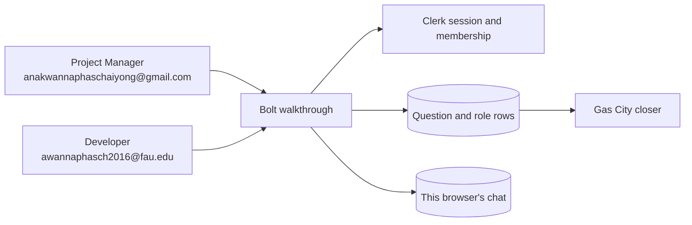
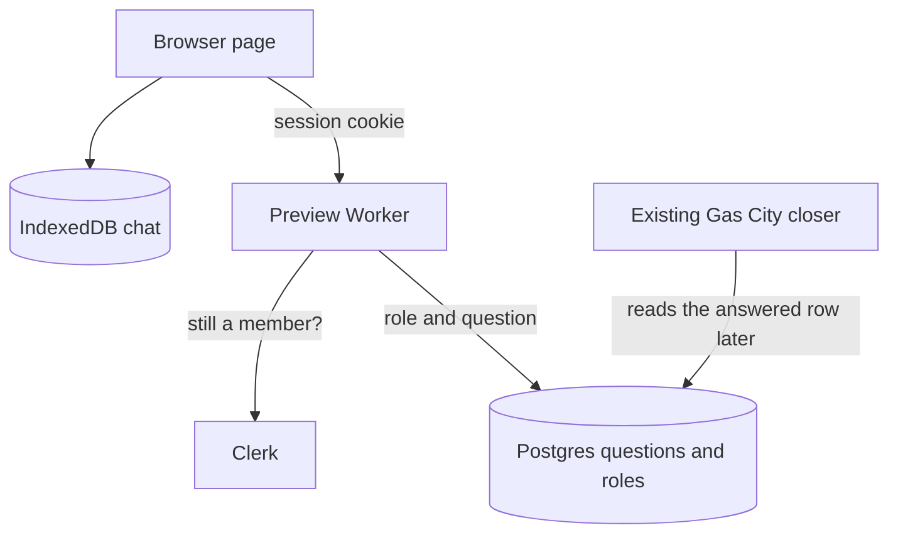
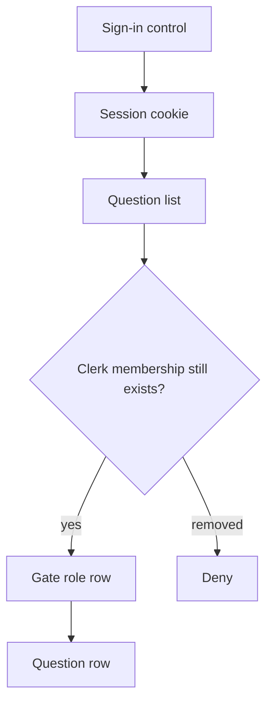
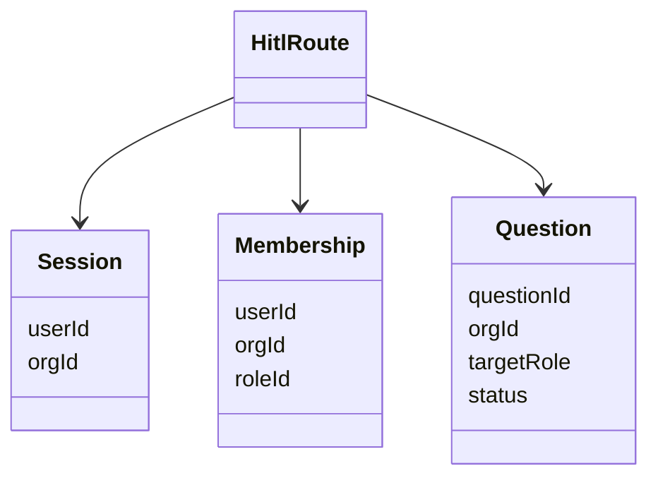
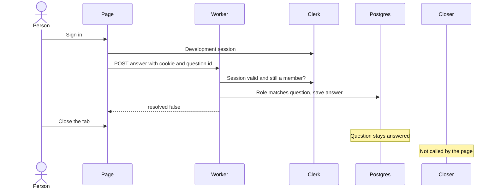

# Bolt on the shared sign-in

Bolt is the first builder on the shared sign-in. DYAD, Forma, and Vibe SDK stay as they are until Bolt’s adapter passes the two-person check. The same Clerk application and the same Wewebplus membership rows are what those builders will use later.

This plan does not change Clerk’s production instance, does not delete users, and does not fill `bolt` / `prd`.

## What the adapter owns

Five jobs stay separate. The Bolt adapter does the first two.

| Job | Question | Owner |
| --- | --- | --- |
| Identity | Who is signed in? | Clerk |
| Authorization | May this person act on this question? | Clerk membership, plus the gate role and the question row |
| State | What is true now? | The question row in Postgres. Chat text stays in this browser. |
| Execution | Who does the work? | Bolt’s chat, and Gas City as it does today |
| Durability | What remains after a closed tab? | The question row and the existing Gas City closer |

The Clerk cookie is a session reference. It does not store the question, the answer, or the paused run. Closing the tab leaves the wait in place.

Clerk is the authority for the session and for whether the Wewebplus membership still exists. `wewebplus.memberships` is the authority for the gate role. A removed Clerk membership denies access even when that role row remains. Bolt does not copy Clerk’s user table.

The signed-in context is user, organization, and role. The role sits on the membership, not on the user as a whole. Answering also names the question. The caller’s organization matches the question, and the caller’s role matches the question’s target role. Both people with that role would see it. This check does not make a question private to one person.

This plan does not add a Durable Object or a new workflow engine. One answer is one database update. A Durable Object per project can wait until two live tabs need a single coordinator. A Durable Object per user is the wrong boundary, because the question belongs to the role.

## Revised shape

These five diagrams are the adapter this plan will build. The sign-in cookie is only a session. The question row holds the wait. Gas City’s closer stays outside the page.

### Context

### Container

### Component

### Class

### Sequence

## What Bolt does today

Bolt has no sign-in page. The walkthrough at `https://bolt-walkthrough-55d6.karant-test-egress-canary.workers.dev` opens straight into chat. Chat history stays in that browser’s IndexedDB.

The preview Worker can already read a Clerk session and a `wewebplus.memberships` row for the question list. A signed-out request to `/api/hitl` returns `Sign in to continue.` and the question box stays hidden. The page never starts a Clerk session, so the two Wewebplus people cannot open the box.

Bolt’s Doppler preview config references the Clerk keys and `WEWEBPLUS_DATABASE_URL` from `dyad` / `preview`. Those names are Worker secrets. `bolt` / `prd` is empty.

The role rules the adapter must keep:

| Step | Phase | Who can answer |
| --- | --- | --- |
| `plan-approve` | Discovery | Project Manager |
| `review-approve-dev` | Implementation | Developer |
| `review-approve-pm` | Delivery | Project Manager |

The matching role sees the question text and can submit one answer. The other role in Wewebplus sees `Waiting on …` and no text. The answer returns `resolved: false`. The build stays paused.

## The adapter

The Bolt adapter is the only new sign-in work in this plan.

1. The walkthrough page gets a sign-in control that uses the Development publishable key.
2. `anakwannaphaschaiyong@gmail.com` signs in with Google as Project Manager. `awannaphasch2016@fau.edu` signs in with Microsoft as Developer. Both are members of Wewebplus.
3. A session with that one organization opens Wewebplus. There is no organization picker in this check.
4. The question list calls `/api/hitl` with the Clerk session cookie. The role comes from `wewebplus.memberships` for that Clerk user id.
5. Bolt does not grow a user table. Chat history stays in the browser. The question and the paused run do not.

The membership row keeps `org_id`. A later organization is another row and a selection step. This plan does not add organization creation.

Before the page uses the key, confirm the preview publishable key starts with `pk_test_`. A `pk_live_` key means the preview is pointed at production, and the work stops.

The two Development user ids go into `wewebplus.memberships` on the preview database. The same Google and FAU Microsoft accounts can sign into Production later and will receive different user ids. Those Production ids are not part of this check.

## Check

`scripts/doppler/list-auth-directory.mjs` lists Clerk users and `wewebplus` memberships. It does not change Clerk or the database.

Use Chrome on a computer. Open the walkthrough URL.

- Signed out: Discovery, Implementation, and Delivery still finish, and the phase bar has no question box.
- Normal window: `anakwannaphaschaiyong@gmail.com` with Google. The page shows Wewebplus and Project Manager.
- Private window: `awannaphasch2016@fau.edu` with Microsoft. The page shows Wewebplus and Developer.

With one stored question for each phase:

1. Discovery. The Project Manager sees the question text and submits `approve` once. The Developer sees `Waiting on Project Manager for plan-approve.`
2. Implementation. The Developer submits `approve` once. The Project Manager sees the waiting line.
3. Delivery. The Project Manager submits `approve` once. The Developer sees the waiting line.

After each submit the status is `answered`, the field is gone, and the build stays paused. Reload the page, or close the tab, and the answered question is still answered.

This check shows that the two roles inside Wewebplus see different questions. It does not show that a second organization is walled off. That check waits until a second organization exists.

## After Bolt passes

Forma, Vibe SDK, and any remaining DYAD preview wiring copy this adapter: the same Development Clerk application, the same two users, and the same Wewebplus membership rows. Each of those builders still keeps its own project database. Vibe SDK’s D1 database stays its app store. A Durable Object per project, if two live clients need one coordinator, is also later. That work is a later plan.
