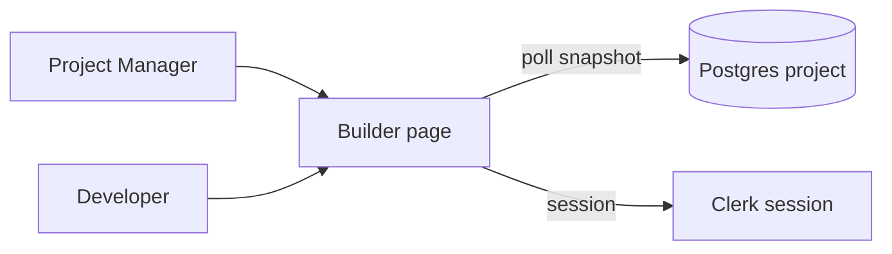
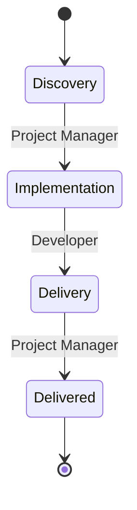
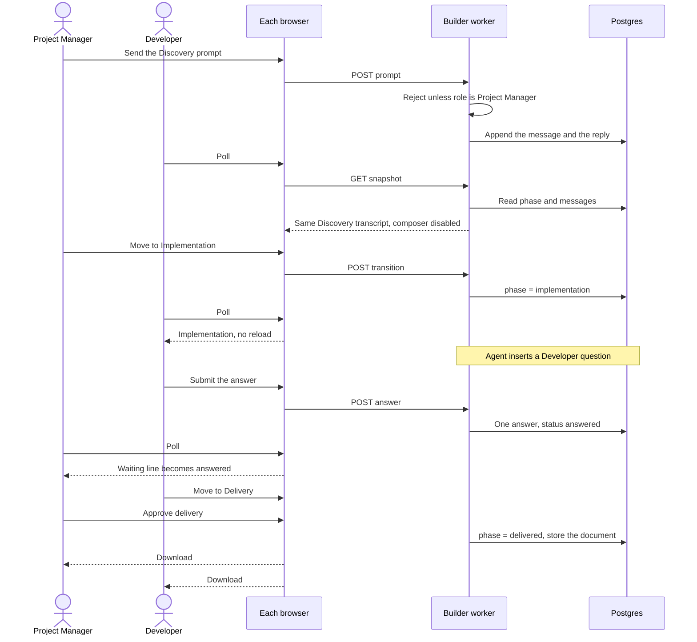

# Shared HITL workflow

One organization, two users, one project. The project state is shared. The actions are role-specific. Discovery, Implementation, and Delivery are one lifecycle.

This plan revises the earlier Bolt check. That check proved sign-in and one answered Discovery question. It left the chat, the phase, and the transition in each browser. That is why the other window did not move when the Project Manager answered, and why **Approve and continue to Implementation** did nothing.

Bolt is the first adapter because two browsers can already open it. DYAD, Forma, and Vibe SDK use the same contract later. `bolt` / `prd` stays empty. Clerk production is unchanged.

## What the two people do

Roles stay on the Wewebplus membership. They do not change per project.

| Phase | Project Manager | Developer |
| --- | --- | --- |
| Discovery | Starts the project, writes the prompts, and moves the project to Implementation | Opens the same project and reads the same conversation. Cannot start it, send a prompt, or move the phase |
| Implementation | Reads the same conversation. Sees “Waiting for Developer response” on a Developer question. Cannot answer it or move the phase | Sees the question and the answer box. Can answer every Developer question. Moves the project to Delivery when implementation is finished |
| Delivery | Approves the final delivery | Reads the same delivery. Cannot approve it |
| Delivered | Downloads the deliverable | Downloads the same deliverable |

There is no separate Discovery approval card. Completing Discovery and pressing the transition is the Project Manager’s approval.

The Developer’s move from Implementation to Delivery is the Developer’s approval. Delivery does not ask the Developer to approve again.

A question pauses the run. It does not change the phase. Only a transition command changes the phase.

## What is already true

The walkthrough at `https://bolt-walkthrough-55d6.karant-test-egress-canary.workers.dev` shows this today:

- Both browsers sign in to the same Development Clerk application and the same Wewebplus organization.
- The header shows **Wewebplus · Project Manager** or **Wewebplus · Developer**.
- A Discovery question stored in Postgres is visible to both. The Developer sees the waiting line and not the body. The Project Manager sees the body. After the answer, both see `Status: answered` without a second submit.
- Clerk membership is checked before the role row is trusted. A removed membership is denied.
- The answer returns `resolved: false`. The page does not call Gas City.

That is the question gate. It is not the shared project.

## Where state lives today

| State | Bolt | DYAD | Shared Postgres |
| --- | --- | --- | --- |
| Sign-in | Clerk session on the walkthrough | Clerk session in Electron | Clerk is the directory. `wewebplus.memberships` is the gate role |
| Chat transcript | IndexedDB `boltHistory` in that browser (`app/lib/persistence/db.ts`) | Local sqlite `chats` / `messages`, copied to `wewebplus.chats` / `wewebplus.messages` by `sync_local.ts` when a control-plane database is configured | Tables exist. Bolt never reads them |
| Current phase | `FactoryRunRecord` inside that same IndexedDB chat | Phase is the title of a local chat. Approvals are local sqlite rows, copied to `wewebplus.phase_approvals` | Bolt’s phase is not in the database |
| Transition button | Local. It enables only after that browser’s last reply contains a phase summary. No role check | Renderer `approvalGate` hides the button. Main `approvePhase` checks `approve-discovery`, `approve-implementation`, or `approve-delivery` | DYAD’s Developer role has none of those three permissions. The Project Manager has all three |
| HITL question | `GET /api/hitl` once after Clerk loads | `listQuestions` through IPC, no poll | `wewebplus.questions` and `wewebplus.answers`. One answer per question |
| Live updates | None. The other browser changes only on reload, and only for the question | Factory-host state polls every 1s when a host run is active. Questions do not | No push channel |
| Download | Local factory document after that browser marks Delivery finished | Same document helper, `canDownloadFactoryDocument` | The built preview is a per-browser WebContainer. It is not a shared file |
| Forma | One password cookie, one derived owner. No organization and no role | | |
| Vibe SDK | D1 user and `apps.user_id`. No organization and no role | | |

Bolt has no Durable Object. DYAD’s WebSockets are the local preview bridge, not a second signed-in person.

## Durable Objects

A Durable Object is not required for this check.

The missing behavior is that the second browser never reads the first browser’s chat or phase. Those values are not in the database. Putting a Durable Object in front of IndexedDB would copy the same split.

Postgres is already the authority for the membership, the question, and the answer. DYAD already has `wewebplus.chats`, `wewebplus.messages`, and `wewebplus.phase_approvals` for the same reason. The walkthrough should use those rows as the project.

Two browsers can poll one snapshot every two seconds. That is enough for an answer, a new message, and a phase change to show up without a manual reload. A unique phase row and a unique open-question key stop a double click from applying twice. An execution row with a compare-and-set stops two prompts from starting two runs.

A Durable Object per project is the later choice if both browsers must see tokens while the model is still writing, or if many tabs need one live coordinator. It would broadcast the database. It would not be a second copy of the phase. A Durable Object per user is still the wrong boundary.

Cloudflare Workers can hold a WebSocket only with a Durable Object. That is another reason to stay on polling until the two-person check passes.

## Target shape

The snapshot is one read model:

- project id, organization id, phase, delivered flag
- messages in order
- open and answered questions, with the body hidden from the other role
- which transitions this role may run
- whether the composer is enabled
- the download, present only after delivery is approved

The browser renders that snapshot. It does not decide the phase from local storage.

## Gap against the expected workflow

| Expected | Now | Change |
| --- | --- | --- |
| One project visible to both | Bolt has one question row and two private chats | Read and write one project id in Postgres |
| Same transcript | IndexedDB, or DYAD’s local sqlite plus a later sync | Append messages to `wewebplus.messages` during the turn |
| Same phase without reload | Phase is local. The button stays disabled until a local summary exists | `POST /api/project/transition` updates the phase row. Both pages poll |
| PM owns Discovery | The Discovery card is a question. The transition button ignores the role | Remove the Discovery question from this check. Enable the composer and the transition only for the Project Manager. Reject both on the server |
| Dev only watches Discovery | Dev can type in the Bolt composer | Disable the composer and reject `POST` |
| Dev answers Implementation questions | One seeded Developer question, fetched once | The run may insert more than one `target_role_id = developer` question. Poll shows the answer box or the waiting line |
| Only Dev opens Delivery | DYAD gives `approve-implementation` to the Project Manager only. Bolt checks no role | New permission `advance-to-delivery` on the Developer. The Project Manager receives 403 |
| Only PM approves Delivery | DYAD already limits `approve-delivery` to the Project Manager. Bolt does not | Same permission on the walkthrough route |
| No second Developer approval | `review-approve-dev` is a question, and the transition is a separate local button | The transition is the Developer approval. Delivery has no Developer question |
| Both download | The file is built in the browser that finished locally. WebContainer files are not shared | Store the factory document on the project when delivery is approved. Both download that object |
| Unauthorized calls fail on the server | Bolt’s transition is not a server call. DYAD’s `approvalGate` is renderer-only, while `approvePhase` does check | Every prompt, answer, and transition checks the membership and returns 403 or 404 |
| No duplicate answer or transition | Question answer is already unique. Phase transition is not | Unique phase approval and compare-and-set on the project phase |

## Contract every builder implements

These rules are the acceptance test. The page may look different. The results may not.

1. Both people are members of one organization. The role is on that membership.
2. There is one project row. Refreshing either browser shows the same phase and the same messages.
3. Discovery prompts and the move to Implementation succeed for the Project Manager and fail for the Developer.
4. A Developer question shows an answer box to the Developer and a waiting line to the Project Manager.
5. One answer is stored. The second submit does not create a second answer. The Project Manager sees the answered status without reloading by hand.
6. The move to Delivery succeeds for the Developer and fails for the Project Manager.
7. Delivery approval succeeds for the Project Manager and fails for the Developer.
8. After that approval, both sessions see Download and receive the same document.
9. A removed Clerk membership is denied even if the role row remains.

Shared pieces:

- Clerk Development application and `wewebplus.memberships`
- Postgres tables for the project, messages, questions, answers, and phase approvals
- Pure functions for the role decision, the snapshot filter, and the legal transition
- The acceptance steps above

Each builder supplies:

- A session adapter that turns its cookie or Bearer token into a Clerk user id
- A page that renders the snapshot and posts the command
- Its own model run, which must append messages to the shared project instead of only to local storage

Deployment differences that must not change the test: Electron IPC versus a Worker route, IndexedDB versus D1 as a cache, and where the preview iframe runs. Forma’s password and Vibe’s D1 login are replaced by the same Clerk session. They are not a second definition of Project Manager and Developer.

## Implementation

Bolt first. The other builders copy the contract after the two-browser check passes.

1. Add the project snapshot and the three commands to the walkthrough worker: read, append a prompt, transition. Keep the question answer command. Decisions live in tested functions, as `decideAnswer` does today.
2. Map permissions to the new matrix. Project Manager: Discovery prompt, Discovery transition, Delivery approval, download after delivery. Developer: Implementation answers, Implementation transition, download after delivery. Both: read.
3. Stop treating IndexedDB as the phase. The page polls the snapshot every two seconds and renders it. Local storage may cache the last snapshot.
4. Persist the model reply onto `wewebplus.messages` for the one walkthrough project. The other browser’s next poll shows it.
5. Delete the seeded Discovery question from the acceptance path. Seed nothing for Discovery. The Implementation run creates Developer questions. Delivery has no Developer question.
6. On Delivery approval, store the factory document and return it from the download route for either role.
7. Keep Gas City outside the page. `resolved` on a question remains false until a later closer. The phase the people see comes from the project row.

DYAD’s follow-on is to drive `FactoryPhaseBar` from the same snapshot and to change `approve-implementation` into the Developer’s `advance-to-delivery`. Its sqlite database becomes a cache of the control-plane project. Forma and Vibe SDK wait until this check passes.

## Verification

Use Chrome. Normal window is `anakwannaphaschaiyong@gmail.com` with Google. Private window is `awannaphasch2016@fau.edu` with Microsoft.

1. The Project Manager starts the project. The Developer sees the same Discovery transcript and cannot send.
2. The Project Manager moves to Implementation. The Developer’s page changes without a manual reload.
3. A Developer question shows an answer box in the Developer window and a waiting line in the Project Manager window.
4. The Developer answers once. The Project Manager sees the answer without a manual reload. A second submit does not create a second row.
5. A direct transition request from the Project Manager during Implementation is rejected.
6. The Developer moves to Delivery. Both pages show Delivery.
7. A direct delivery-approval request from the Developer is rejected.
8. The Project Manager approves delivery. Both pages show Download and can open the same document.
9. Reload either window. The phase, the transcript, and the download remain.
10. Sign out. The snapshot is denied.

## Decisions settled here

- Postgres is the authority. Polling propagates changes. A Durable Object is not part of this check.
- The phase changes only through a role-checked transition. A question answer does not change it.
- The download is the stored factory document, not the other browser’s WebContainer.
- Organization-level roles only. Project-level roles wait.
- Gas City stays outside this acceptance test.

## Checklist

- [ ] One Wewebplus project is open in both sessions.
- [ ] Discovery chat is sent by the Project Manager and visible to the Developer.
- [ ] The Developer cannot send a Discovery prompt, and the server rejects it.
- [ ] The Project Manager moves to Implementation, and the Developer sees it without reloading.
- [ ] The Developer sees the answer box. The Project Manager sees the waiting line.
- [ ] The Developer’s answer appears in the Project Manager’s session without reloading.
- [ ] A second answer does not create a second row.
- [ ] Only the Developer can move to Delivery, and the server rejects the Project Manager.
- [ ] Both sessions show Delivery without reloading.
- [ ] Only the Project Manager can approve delivery, and the server rejects the Developer.
- [ ] Both sessions show Download and receive the same document.
- [ ] Reload keeps the phase, the transcript, and the download.
- [ ] Bolt, DYAD, Forma, and Vibe SDK are checked against this list, not against a private chat.
