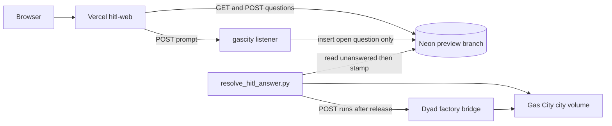
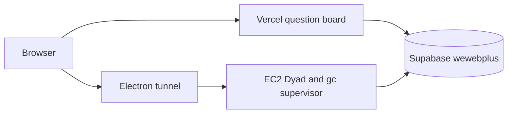

# One public UI, one runtime, one database branch

> Generated by swarm planning session on 2026-10-04.
>
> The planning team tools were not available in this session. Product, UX, and engineering perspectives below are the decisions from the architecture review of GitHub `main` `92524cf3`, preview tip `cursor/gas-city-fail-fast-9e7a` (`b2d4f020`), and the production line `cursor/browser-dyad-ui-bbea`. Assumptions that would have been asked of the user are listed in the decision log.

## Summary

People should open one URL per git branch and do both chat and human approval there. Vercel renders that page for production and for previews. Namespace runs the branch’s Dyad process and Gas City, and does not publish a second UI. Neon holds the control-plane database, and a preview is a child of a sanitized parent so it starts with schema and seed rows, then diverges. The separate HITL home page goes away only after the same question cards and role rules work inside that single page.

This plan does not move the agent’s SQLite chats, does not rebuild the production EC2 image, and does not merge the current listener or shell pull requests as they stand.

## Problem Statement

Two UIs show the same gate, and they do not share a store.

- Vercel serves `hitl-web`. `/` is `QuestionBoard`. It polls `GET /api/questions` every 4 seconds and writes `wewebplus.answers` in Postgres. It does not release a Gas City bead.
- The Electron renderer, reached through the browser bridge, already shows the same cards in `FactoryPhaseBar` and `HitlQuestionList`. Those cards read SQLite `hitl_questions`. An answer there is mirrored to Postgres and still does not release the bead.
- A browser cannot call the factory bridge. Any request with an `Origin` header is rejected with 403.
- On a labeled preview, `services/gascity-browser/continue.mjs` inserts a `plan-approve` question into Postgres and immediately POSTs `/v1/apps/1/phases/implementation/runs`. The human is not in the loop. The preview SQLite volume does not contain that question, so the Electron phase bar does not list it.
- `scripts/gascity/resolve_hitl_answer.py` is the only closer. It runs `hitl.py respond` and `hitl.py release`, then stamps `answers.gate_resolved_at`. `hitl.py` is not in this repository. The poller is not in `compose.preview.yml` and is not started by the production rollout.
- Preview databases branch from Neon Dev (`br-mute-shadow-b3jxqoho` in project `mute-credit-71067312`), not from production Supabase. Production HITL rows are not inherited.
- Production deploys by a push to `cursor/browser-dyad-ui-bbea`, which SSHs to the EC2 host and builds there. Previews run on one shared Namespace Devbox, `Wewebplus-ci`. There is no Gatsby container. The workflow image is Gas City (`gc`), and in the preview Compose file it initializes a city and then sleeps.

The user-facing failure: a person cannot trust one page to ask the question, take the answer, and continue the run, and a preview cannot start from production’s control-plane data without writing into production.

## Scope

### In Scope (MVP)

- One labeled preview where the only human URL is the Vercel preview.
- That page shows the existing gate cards (status, body only for the matching role, answer form only when `canAnswer`) and a prompt.
- The prompt writes one open question and does not start the agent.
- A poller inside that preview Compose project runs `respond` then `release`, stamps `gate_resolved_at`, and only then calls `startFactoryRun`.
- The preview uses its own Neon child. Production Supabase and the EC2 container are not written and not restarted.
- After that preview matches the Electron cards for the same rows, remove `QuestionBoard` as the home page and stop publishing the Electron UI hostname for that preview.

### Out of Scope (Follow-up)

- Porting the full Electron renderer (editor, local-agent transcript, settings) onto Vercel.
- Moving SQLite `chats`, `messages`, `apps`, or `factory_host_runs` into Neon.
- One Namespace machine per pull request. Compose project, volumes, and the Neon child stay the isolation boundary.
- Replacing the factory bridge, or allowing browsers to call it directly.
- The production image pull in `plans/offhost-image-pull.md`. That plan stays a separate change.
- The formula graph.
- Branching unsanitized production rows, including `account_connections` ciphertext, into every preview.
- Supabase branching. The preview controller already speaks the Neon API. Adding a second branching client does not simplify the cut.

## User Stories

- As a project manager on a phone, I open one preview URL, see the plan question, and submit an answer without a second hostname.
- As a developer, I see that a project-manager question is waiting and I cannot read its body or submit an answer.
- As someone outside the organization, I do not see the question.
- As the person who sent the prompt, I see that the run has not started until the gate is answered, and I see it start after the answer is saved.
- As the operator of production, I can prove a preview answer did not change the production database or the production container.

## UX Design

### User Flow

1. Open the Vercel URL for the branch. Sign in with Clerk.
2. The page shows the signed-in name and role. There is no second link to an Electron window.
3. Type a prompt and submit. The page shows the new card: waiting on Project Manager for `plan-approve`, status open, and the prompt as the body when the caller’s role matches.
4. The matching role types an answer and submits. The card becomes answered and names who answered. The form disappears.
5. The page shows a waiting state until the runtime reports that the run was accepted, then shows that run id and status.
6. A wrong role never sees the body or the form. A second submit does not create a second answer.

### Key States

- **Default**: signed-in header, prompt field, and the question list for this organization.
- **Loading**: the first fetch has not returned. The header says the questions are loading. The prompt stays disabled until the caller is known.
- **Empty**: “No questions yet.” The prompt is still available.
- **Waiting on the other role**: status line only. No body, no form.
- **Submitting**: the submit button for that card is disabled. The draft is kept if the request fails.
- **Answered**: status answered, answered-by name, no form.
- **Run pending**: the answer is saved and the runtime has not accepted the run. Say that explicitly. Do not show a success state for the agent.
- **Run accepted**: show the run id returned by the runtime.
- **Error**: store unavailable, role forbidden, empty answer, listener not configured, or the runtime refused the run. Each message says what the person can do next. A missing `NEXT_PUBLIC_GAS_CITY_URL` on a Vercel preview fails closed, as PR 26 already requires.

### Interaction Details

- Keep the 4 second poll already in `hitl-web/app/question-board.tsx` until the run-status line exists. Do not invent a websocket for the MVP.
- One answer field per open card, same as `HitlQuestionList`. Enter submits. Empty input does nothing.
- Touch targets stay at least the current button and input size. The page is already the phone surface.
- Do not show the Electron hostname, the noVNC port, or a “open the container UI” link in the MVP page.

### Accessibility

- The answer input keeps an accessible name (`Answer <step id>`).
- Status is text, not color alone.
- The form is a real form with a submit button, so Enter and screen readers work.
- Polling does not move focus. A failed submit leaves the draft in the field.

### Consistency

The cards already exist twice: `QuestionBoard` and `HitlQuestionList`. The MVP page keeps the `QuestionBoard` wording and test ids (`hitl-question-*`, `hitl-wait-*`, `hitl-body-*`, `hitl-answer-*`) so the role rules stay recognizable. The prompt is the only new control. The full Electron chat chrome is a later port, not this page.

## Technical Design

### Architecture

Production stays on its current path until the preview proof passes. The production diagram does not change in the MVP:

Removing the production tunnel is a later phase, after the Vercel page can complete the same gate.

### Components Affected

- `services/gascity-browser/continue.mjs` — insert the question and return. Do not call Dyad from this function.
- `services/gascity-browser/server.mjs` — `POST /v1/runs` stays 202 only when the question insert succeeds. It must not report a Dyad status. `electronInvoked` stays false. `/v1/hitl/` stays unused.
- `compose.preview.yml` — add the poller service. `gc` stays the city owner. The poller is what calls Dyad, not the sleeping `gc` process. Keep publishing the listener. Stop publishing the Electron UI hostname only in the phase that removes it.
- `scripts/gascity/resolve_hitl_answer.py` — after `respond` and `release` succeed and the row is stamped, POST the stored prompt to the factory bridge runs route. Stamp first, then POST, and record the POST failure without clearing `gate_resolved_at`, so a retry does not release twice.
- `hitl-web/app/question-board.tsx` — show the prompt and the run line. Home stays this board until the preview proof, then the board’s cards move into the single page and the standalone “questions only” home is removed.
- `hitl-web/lib/hitl.ts` and `src/control_plane/hitl.ts` — keep one copy of `presentQuestion` and `decideAnswer`. The web app imports that module. Do not fork the role map again.
- `deploy/preview/neon.mjs` — parent becomes the sanitized branch id, still via `parent_id`, still default `parent-data`. Do not point it at a branch that contains production ciphertext.
- `deploy/preview/controller.mjs` and `deploy/preview/vercel.mjs` — unchanged contract: preview env `WEWEBPLUS_DATABASE_URL` is the child URI, `NEXT_PUBLIC_GAS_CITY_URL` is `https://gc-pr-<pr>.anakwannaphaschaiyong.com`, never the production target.
- `src/main/factory_host_bridge_server.ts` — no change to `Origin` rejection, machine bearer, `createHitlQuestion`, or `startFactoryRun`.
- `src/components/chat/FactoryPhaseBar.tsx` — no change in the MVP. It remains the parity check against SQLite, not the public page.

### Data Model Changes

No new tables.

Postgres `wewebplus` (the store the page reads):

- `questions` and `answers` as in `control-plane/drizzle/0001_hitl.sql`
- `answers.gate_resolved_at` as in `0002_gate_resolved_at.sql`

The poller needs the prompt and the idempotency key on the question row it already selects. Both columns exist (`body`, `idempotency_key`). The runs POST uses those values. Do not add a preview-environment table. The branch name `preview-pr-<number>` is the mapping.

SQLite `hitl_questions` stays the Electron copy. The MVP public page does not read it. A preview prompt must not be inserted only into SQLite, and it must not be inserted into both by the listener. One writer: the listener inserts Postgres. The poller is the only caller of the factory bridge runs route.

Seed on the sanitized Neon parent: `roles` and `memberships` from `0001_hitl.sql`. Do not seed `account_connections`.

### API Changes

`POST /v1/runs` on the preview listener:

- Auth stays the bearer length check for the MVP. Clerk verification is a follow-up and is called out as a risk, not as a silent change.
- Body: `prompt`, `idempotencyKey`.
- Effect: one `INSERT ... ON CONFLICT (org_id, idempotency_key) DO NOTHING` into `wewebplus.questions` with step `plan-approve`, role `project-manager`, status `open`.
- Response 202 `{ runId, status: "accepted", orchestration: "gascity", electronInvoked: false }` means the question was stored, not that Dyad started.
- Response 503 when the database URL is missing or the insert throws.
- No call to `WEAVER_BASE_URL` from this route.

Factory bridge, unchanged and still not called by the browser:

- `POST /v1/apps/:id/phases/:phase/runs` with the machine bearer, no `Origin` header, handled by `startFactoryRun`.

Page, unchanged routes:

- `GET /api/questions`
- `POST /api/questions/:id/answers`

The page gains a client call to `NEXT_PUBLIC_GAS_CITY_URL/v1/runs` for the prompt, which PR 26 already sketched. That call remains the prompt, not the answer. The answer stays `POST /api/questions/:id/answers`.

### What Neon branching inherits

A Neon child created the way `ensurePreviewBranch` does (`parent_id`, no `init_source`) uses Neon’s default `parent-data`. The child gets the parent’s schema and rows at that moment, then copy-on-write divergence. Later writes on the parent do not appear in the child. Writes on the child do not appear on the parent. `schema-only` is a different API value and would drop the rows. Do not set it for this plan: the seed roles and memberships have to be present.

Supabase preview branches are data-less by default. GitHub-integrated ones build schema from migrations and seed files. A data copy needs Point-in-Time Recovery and an explicit include-data choice. This repo does not call that API. Switching the control plane to Neon is the smaller change because the preview controller already creates the child.

HITL rows on a new preview are whatever the sanitized parent had at branch time. An answer on the preview updates only the child. The production poller, pointed at the production URI, does not see it.

### Security

- The listener still accepts a bearer that is only checked for length. The MVP preview is SSO-protected at Vercel, but the listener hostname is a separate origin. Treat a public `gc-pr-<pr>` as able to insert a question if the caller can present a long bearer. The proof must use the preview token already issued for that Compose project, and the follow-up is to verify the Clerk session. Do not widen CORS beyond the existing Vercel preview allowlist.
- Do not log the Neon URI, Doppler token, or bridge token. `neon.mjs` already scrubs postgres URLs in errors. Keep that.
- Do not branch a parent that contains production `account_connections` ciphertext.
- The factory bridge keeps rejecting `Origin`. The poller calls it from inside the Compose network with the machine bearer and no `Origin` header.

## Implementation Plan

### Phase 1: Preview gate actually waits

- [ ] Change `continue.mjs` so it inserts the question and does not call Dyad. Update `continue.test.mjs`.
- [ ] Change `server.mjs` so a successful insert is 202 and a Dyad refusal is no longer part of this response. Update `server.test.mjs`.
- [ ] Extend `resolve_hitl_answer.py` to POST the run only after the stamp. Cover the “release succeeded, Dyad refused” case in `resolve_hitl_answer_test.py`: the stamp remains, the POST is not repeated on the next pass.
- [ ] Add the poller to `compose.preview.yml` for the preview project only. It uses that project’s `WEWEBPLUS_DATABASE_URL`, `HITL_PY`, and `GAS_CITY_HOST_BRIDGE_TOKEN`. It does not mount `/opt/gascity`.
- [ ] Point `HITL_PY` at the script that talks to the preview city volume. If that script cannot be vendored, document the path the Devbox must already have and fail the Compose healthcheck when it is missing. Do not copy production’s city.
- [ ] Provision one factory-managed app in the preview SQLite before the poller calls `startFactoryRun`. `startFactoryRun` rejects an app that is not `factoryHostManaged`. The hard-coded app id `1` in `continue.mjs` is not that provision. The poller must use the id that was linked.

### Phase 2: One page shows the gate and the run

- [ ] On the preview `hitl-web`, keep the question cards and add the prompt that POSTs to the listener. Fail closed when `NEXT_PUBLIC_GAS_CITY_URL` is empty on `VERCEL_ENV=preview`. Hide the prompt on the production Vercel target.
- [ ] Show “question stored”, “waiting for the runtime”, and “run accepted” as separate lines. Do not treat HTTP 202 as “the agent started”.
- [ ] Import `presentQuestion` and `decideAnswer` from one module. Delete the duplicated role map after the tests cover both callers.
- [ ] Compare, on the same Neon child, the Vercel card and a direct SQL read: role mismatch hides the body, the matching role can answer once, the unique `(org_id, idempotency_key)` and unique `question_id` hold.

### Phase 3: Drop the second UI on that preview

- [ ] Remove the Cloudflare hostname that targets port 8373 for this preview (`pr-<pr>.anakwannaphaschaiyong.com`). Keep `gc-pr-<pr>` until the page no longer needs it.
- [ ] Leave the Electron process running inside Compose so the poller can call the factory bridge. It is no longer a page people open.
- [ ] Delete the standalone home that is only `QuestionBoard` once the single page contains those cards. Keep the API routes.

### Phase 4: Sanitized Neon parent

- [ ] Create or designate a Neon branch that has the `wewebplus` migrations, the two roles, and the two memberships, and does not have production question bodies or `account_connections` ciphertext.
- [ ] Set `defaultNeonParentBranchId` to that branch. A new `preview-pr-<number>` must see the seed memberships and must not see a known production question id.
- [ ] Resetting a preview branch from the parent is the supported refresh. Do not sync from Supabase.

### Phase 5: Production cut, only after a preview cycle

- [ ] Load the production `wewebplus` schema and the rows that are meant to be production into Neon main. Leave ciphertext out of every non-production branch.
- [ ] Point production `WEWEBPLUS_DATABASE_URL` at Neon main. Keep the EC2 SQLite volume. The agent store does not move in this phase.
- [ ] Run the production poller against Neon main.
- [ ] Retire the Supabase URL only after a production answer still closes a gate.
- [ ] Remove the production Electron public tunnel only after the production Vercel page completes the same gate. Until then production keeps both doors.

## Testing Strategy

- [ ] Unit: `continue.mjs` inserts and does not fetch Dyad. A second call with the same idempotency key does not insert a second row.
- [ ] Unit: the poller stamps only after respond and release, and POSTs the run once. A failed POST does not clear the stamp and does not release again.
- [ ] Unit: `presentQuestion` still hides the body from the other role and returns null for another organization. Existing `hitl-web/lib/hitl.test.ts` and `src/control_plane/hitl.test.ts` stay green.
- [ ] Preview proof, one pull request labeled `preview`, before any production change:
  - [ ] Open only the Vercel preview URL.
  - [ ] Submit a prompt. Confirm a single open `plan-approve` row on the Neon child and no `factory_host_runs` row yet.
  - [ ] Submit the answer as the project-manager membership. Confirm one `answers` row.
  - [ ] Confirm `gate_resolved_at` is set, the preview city gate is released, and `startFactoryRun` then accepts the run.
  - [ ] Confirm the production Supabase question and answer counts are unchanged and the EC2 container was not recreated.
- [ ] Negative: a developer membership receives the status and `body: null`, and `POST` the answer returns 403.
- [ ] Negative: an empty preview URL for `NEXT_PUBLIC_GAS_CITY_URL` fails the Vercel preview build or boot, and the production Vercel target still renders without that variable.

## Risks & Mitigations

| Risk                                                                                      | Likelihood | Impact | Mitigation                                                                                                                             |
| ----------------------------------------------------------------------------------------- | ---------- | ------ | -------------------------------------------------------------------------------------------------------------------------------------- |
| 202 is read as “the agent started”                                                        | H          | H      | Response means the question was stored. The page has a separate run line that changes only after the poller’s POST succeeds.           |
| Preview SQLite has no factory-managed app, so the run 409s after a good answer            | H          | H      | Phase 1 provisions and records the app id. The poller uses that id.                                                                    |
| Listener bearer is only a length check                                                    | H          | M      | MVP stays on the existing preview token and CORS allowlist. Clerk verification is the follow-up, not a reason to block the gate proof. |
| Neon parent is Dev and does not match production                                          | H          | H      | Phase 4 switches the parent only after inspecting that the branch has seed rows and not production secrets.                            |
| Branching production copies ciphertext and question bodies into every preview             | M          | H      | The parent is sanitized. `parent-data` is still required so the seed rows exist.                                                       |
| `hitl.py` is outside the repo, so the preview poller cannot release                       | H          | H      | Phase 1 fails the healthcheck when `HITL_PY` is missing. Do not claim the gate closed without the stamp.                               |
| Shared Devbox `Wewebplus-ci` stalls under two previews                                    | M          | M      | Accepted for the MVP. Compose project and `down -v` stay per pull request. A machine per preview is out of scope.                      |
| Deleting the Electron hostname before the page can show the run                           | M          | H      | Phase 3 runs only after the preview proof. Production tunnel stays until the production page passes the same proof.                    |
| PR 15 merged as-is overwrites `continue.mjs` with a listener that does not touch Postgres | M          | H      | Do not merge PR 15. The preview listener is the one this plan edits.                                                                   |
| Production image rebuild on the EC2 disk                                                  | M          | H      | This plan does not SSH to production and does not run `compose up --build`. Image pull stays in `plans/offhost-image-pull.md`.         |

## Open Questions

- Where the preview copy of `hitl.py` lives if it cannot be vendored into this repo. Phase 1 blocks on a concrete path inside the preview city, not on a production host path.
- Whether Clerk session verification on `POST /v1/runs` lands in the same change as the wait-for-answer behavior or immediately after. The proof is valid either way only if the bearer is the per-preview machine token and CORS stays restricted.
- Which existing production questions are copied into Neon main at Phase 5. Default: schema, roles, memberships, and open unanswered questions. Not `account_connections`. Confirm before the cut.
- The factory-managed app id source. Default: the preview entrypoint links one app and writes the id into the poller’s environment. Do not keep the hard-coded `1`.

## Decision Log

- **Gas City, not Gatsby.** The Compose service is `gc`. The Node service `gascity` is the browser listener. The plan never adds a Gatsby container.
- **Vercel is the human URL.** Namespace keeps the runtime and the listener. It stops being a second page once Phase 3 has a passing preview.
- **The Electron renderer is not what Vercel builds.** `hitl-web` is the MVP page. Porting `src/` onto Vercel is a different project and is out of scope.
- **The HITL page is a view, and it is not the whole feature.** `presentQuestion`, `decideAnswer`, the unique keys, and the poller move with the feature. The React file can be deleted after the single page renders those cards.
- **One writer for a preview question.** The listener inserts Postgres. It does not also insert SQLite and it does not call `startFactoryRun`.
- **The agent starts after the stamp.** `continue.mjs` calling Dyad immediately is the bug this plan removes.
- **Neon `parent-data` from a sanitized parent.** That is the inheritance model: schema and seed rows, then isolation. Supabase stays the production URI until Phase 5 because the preview controller does not speak Supabase, and Supabase’s default branch is data-less.
- **SQLite stays the agent store.** `apps.neonProjectId` is a generated app’s database, not this control plane. This plan does not migrate chats.
- **Production is a later cut.** The acceptance test is one labeled preview that does not touch Supabase or the EC2 container.
- **Existing pull requests.** Do not merge PR 15 as written. Modify PR 16 only as the place the page lives, and replace its fake `/api/v1/runs` 202 with the listener contract above. Keep PR 19, PR 20, and the merged preview work (PR 17, 22, 23, 24, 25). Leave PR 21 closed. Keep PR 26’s fail-closed URL. Leave PR 27 on the Electron UI until that UI is ported.
- **Product principles.** One public page is the intuitive path. The runtime and the database stay swappable behind the listener and `WEWEBPLUS_DATABASE_URL`. The page shows the difference between “question stored” and “run accepted” instead of hiding it. The generated app’s own database and toolchain are untouched.

## Pull requests this plan does not replace

| PR                                   | Decision                                                                                                      |
| ------------------------------------ | ------------------------------------------------------------------------------------------------------------- |
| 15 `cursor/gascity-browser-api-bbea` | Do not merge. It returns a random run id and never reads Postgres.                                            |
| 16 `cursor/dyad-web-frontend-bbea`   | Use as the web-page branch only after `/v1/runs` stops returning a fake 202. It is not the Electron renderer. |
| 19 `cursor/offhost-image-pull-d237`  | Leave it. Production image pull is a different host and a different plan.                                     |
| 20 preview image publish             | Keep. Namespace still runs the `dyad` image.                                                                  |
| 21 wake tunnel                       | Stay closed.                                                                                                  |
| 26 `cursor/gas-city-fail-fast-9e7a`  | Keep the fail-closed URL. The prompt moves only when this page is the one being edited.                       |
| 27 formula graph                     | Out of scope. It stays on the Electron UI.                                                                    |

---

_Generated by dyad:swarm-to-plan_
